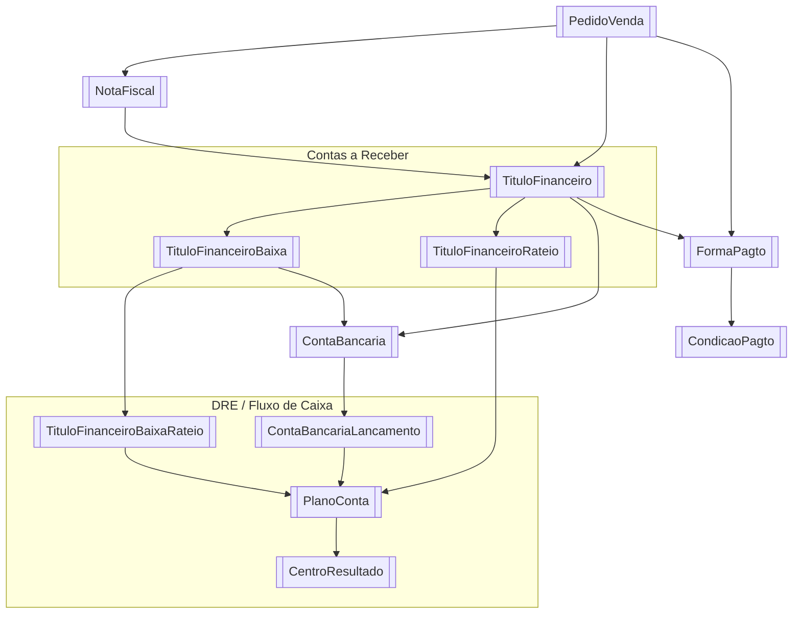

# Mapa de Dados — Financeiro HeziomOS

Visão cruzada entre módulos do financeiro e suas fontes de dados no Literarius e na Tray API.

---

## Módulos × Fontes de Dados

| Módulo | Literarius | Tray API | Outros |
|--------|------------|----------|--------|
| [[Pedidos e Vendas]] | [[PedidoVenda]], [[NotaFiscal]], [[FormaPagto]] | [[Tray - Pedidos]], [[Tray - Invoices]] | — |
| [[Contas a Receber]] | [[TituloFinanceiro]] (`TipoTitulo='R'`), [[TituloFinanceiroBaixa]], [[ContaBancaria]] | [[Tray - Pagamentos]] (`status=aprovado`) | — |
| [[Contas a Pagar]] | [[TituloFinanceiro]] (`TipoTitulo='P'`), [[TituloFinanceiroBaixa]], [[ContaBancaria]] | — | [[Qive — NF-e Automática]] (fila de NF-e) |
| [[DRE e Fluxo de Caixa]] | [[TituloFinanceiroBaixaRateio]], [[PlanoConta]], [[CentroResultado]], [[ContaBancariaLancamento]] | [[Tray - Pagamentos]] (`price_seller`) | — |
| [[Aprovação de Pagamentos]] | [[TituloFinanceiro]] (`TipoTitulo='P'`, `Pago=0`), `Parceiro` | — | HeziomOS DB (`payment_approvals`, `cnab_batches`) |
| [[Conciliação Bancária]] | [[TituloFinanceiroBaixa]], [[ContaBancaria]], [[ContaBancariaLancamento]] | — | Extrato OFX Santander, [[Bancos — CNAB e OFX]] |
| [[Gestão de Estoque e CMV]] | `vwProdutoEstoque`, `vwProdutoCusto`, `NotaFiscalItens` | — | [[Qive — NF-e Automática]] (custo via NF gráfica) |
| [[Comissões e Repasses]] | [[PedidoVenda]] (`SiteIdPedido`), [[ComissaoParametro]] | [[Tray - Pedidos]], [[Tray - Pagamentos]] (gateway: APPMAX) | HeziomOS DB (`repasse_tracking`); Stone POS (OFX); Mercado Pago/ML (API); Bookwire (relatório manual) |
| [[Dashboard CEO]] | Todas as tabelas acima | — | HeziomOS DB (alertas, aprovações) |

### Chave de conciliação Tray ↔ Literarius

| Campo Tray | Campo Literarius |
|------------|-----------------|
| `order.id` | `PedidoVenda.SiteIdPedido` |
| `order.id` | `NotaFiscal.SiteIdPedido` |
| `invoice.access_key` | `NotaFiscal.NFeChave` |
| `payment.order_id` | `TituloFinanceiro.OrigemIdRegistro` (quando Origem=Tray) |

---

## Diagrama de Relações (Mermaid)



---

## Fluxo de Dados: Venda Tray → Financeiro Literarius

```
Tray: order criado (status = aguardando_pagamento)
  └─► Webhook → order.update (status = aprovado)
        └─► GET /orders/:id/complete
              └─► PedidoVenda (SiteIdPedido = order.id)
                    └─► NotaFiscal (GeraFinanceiro = 1, EntSai = 'S')
                          └─► TituloFinanceiro (TipoTitulo='R')
                                ├─► TituloFinanceiroRateio (PlanoConta + CentroResultado)
                                └─► TituloFinanceiroBaixa (baixa automática se payment aprovado)
                                      └─► TituloFinanceiroBaixaRateio
                                            └─► ContaBancariaLancamento (conciliação)
```

## Fluxo de Dados: Venda Interna → Financeiro

```
PedidoVenda (canal direto)
  └─► NotaFiscal (GeraFinanceiro = 1)
        └─► TituloFinanceiro (TipoTitulo='R')
              ├─► TituloFinanceiroRateio
              └─► TituloFinanceiroBaixa (quando pago manualmente)
                    └─► TituloFinanceiroBaixaRateio
                          └─► ContaBancariaLancamento
```

---

## Status por Fonte

| Fonte | Status |
|-------|--------|
| Literarius DB | Mapeado — 14 tabelas + 6 views |
| Tray API | Mapeado — 5 notas de endpoint |
| Qive API | Mapeado — [[Qive — NF-e Automática]] |
| Bancos (CNAB/OFX) | Mapeado — [[Bancos — CNAB e OFX]] |
| HeziomOS DB | Especificado — tabelas próprias documentadas em cada módulo |

## Tray API — Notas mapeadas

- [[Tray - Autenticação]]
- [[Tray - Pedidos]] — `GET /orders`, campos financeiros, conciliação
- [[Tray - Pagamentos]] — `GET /payments`, status, taxas, price_seller
- [[Tray - Invoices]] — vinculação NF ↔ pedido Tray
- [[Tray - Webhooks]] — eventos em tempo real
- [[Tray — Conciliação de Repasses]] — rastreamento de repasses financeiros

---

## Integrações Externas — Mapa

```
SEFAZ
  │  monitoramento automático
  ▼
Qive API
  │ NF-e recebidas    │ Manifestação
  ▼                   ▼
nfe_queue         SEFAZ resposta
  │
  ▼
Fila HeziomOS → Revisão financeiro → [futuro] TituloFinanceiro

Tray (e-commerce)
  │ pedidos aprovados
  ▼
repasse_tracking → alerta se atrasado → Conciliação Bancária

Santander (banco)
  │ extrato OFX    │ remessa CNAB 240
  ▼                ▼
bank_statements  Aprovação → CNAB gerado → upload manual
  │
  ▼
Conciliação automática (match vs. TituloFinanceiroBaixa)

Literarius DB (SQL Server, read-only)
  │ leitura contínua
  ▼
Todos os módulos HeziomOS

Teams (canal de alertas)
  ▲
  │ webhooks
  └── Jobs HeziomOS (7h, 8h, 10h, 22h, sob demanda)
```
