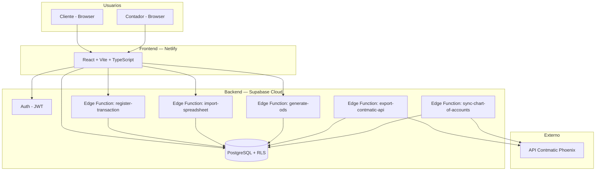
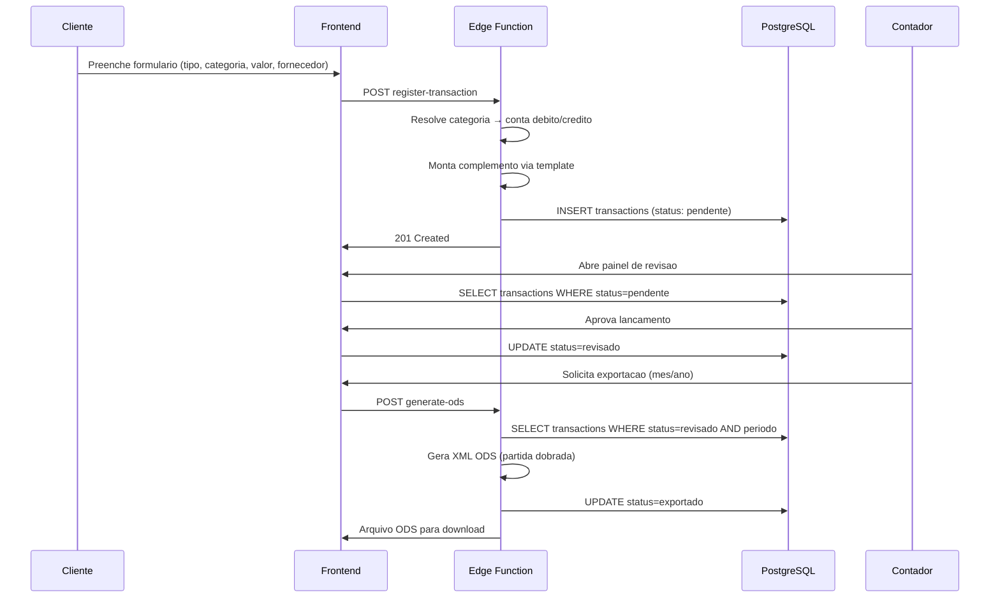

# Arquitetura — C. Brasil Financeiro

> Visao arquitetural e decisoes tecnicas. Atualizar a cada decisao relevante. Commitar junto com o codigo.

---

## Visao Geral

**C. Brasil Financeiro** e um sistema web construido do zero para os clientes da C. Brasil Contabilidade registrarem movimentacoes financeiras. O sistema converte dados financeiros simples em lancamentos contabeis (partida dobrada) e exporta no formato do Contmatic Phoenix.



---

## Stack

| Componente | Tecnologia | Versao |
|-----------|-----------|--------|
| Frontend | React + Vite + TypeScript + Tailwind | Vite 6+ |
| UI Components | shadcn/ui | latest |
| State / Cache | TanStack Query | v5 |
| Backend | Supabase Edge Functions (Deno) | latest |
| Banco de dados | Supabase PostgreSQL | 15+ |
| Auth | Supabase Auth | latest |
| Deploy | Netlify | - |
| Exportacao ODS | JSZip + XML builder (Edge Function) | - |
| Importacao Excel | SheetJS/xlsx (Edge Function) | - |
| Validacao | Zod | v3 |

---

## Estrutura de Repositorios

| Repositorio | Conteudo |
|-------------|----------|
| `Trivia-Obsidian/Clientes/Cbrasil/` | Documentacao, specs, stories, processos, research |
| `Clientes/Cbrasil/cbrasil-financeiro-app/` | Codigo: React, Supabase, Edge Functions |

---

## Estrutura de Codigo

```
src/
├── app/           → rotas, App.tsx, provider.tsx, router.tsx
├── features/
│   ├── auth/              → login, registro, protecao de rotas
│   │   ├── api/
│   │   ├── components/
│   │   └── hooks/
│   ├── transactions/      → registro e listagem de lancamentos
│   │   ├── api/
│   │   ├── components/
│   │   ├── hooks/
│   │   ├── types/
│   │   └── utils/
│   ├── import/            → upload e mapeamento de planilhas
│   │   ├── api/
│   │   ├── components/
│   │   └── hooks/
│   ├── review/            → painel do contador (revisao de lancamentos)
│   │   ├── api/
│   │   ├── components/
│   │   └── hooks/
│   ├── export/            → exportacao ODS e integracao API
│   │   ├── api/
│   │   ├── components/
│   │   └── hooks/
│   ├── categories/        → gestao de categorias por cliente
│   │   ├── api/
│   │   ├── components/
│   │   └── types/
│   └── dashboard/         → visao geral (admin e cliente)
│       ├── api/
│       └── components/
├── components/    → ui/ (shadcn) + layout/
├── hooks/         → hooks compartilhados (useDebounce, useFormatCurrency)
├── lib/           → supabase.ts, query-client.ts, utils.ts
├── types/         → tipos compartilhados (Transaction, Category, Client)
└── config/env.ts  → env vars tipadas
```

---

## Modelo de Dados (Resumo)

### Tabelas Existentes (schema 001)

- `clients` — organizacoes cadastradas
- `transactions` — lancamentos financeiros (sera expandida com novos campos)
- `chart_of_accounts` — plano de contas

### Novas Tabelas (Fase 1)

```sql
client_users (user_id, client_id, role)
client_categories (client_id, tipo, categoria, item, conta_debito, conta_credito, historico_template)
client_bank_accounts (client_id, banco, conta, conta_contabil)
import_mappings (client_id, nome, mapeamento JSONB)
export_logs (client_id, tipo, periodo, total_lancamentos, ultimo_numero_lancamento, arquivo_url, api_response)
```

### Novas Tabelas (Fase 2)

```sql
integration_credentials (client_id, provider, credential_data JSONB)
```

### Campos Adicionais em `transactions`

```sql
tipo (entrada/saida)
categoria_id → client_categories
bank_account_id → client_bank_accounts
fornecedor, cpf_cnpj, forma_pagamento
centro_custo, documento
observacao_rejeicao
numero_lancamento
import_batch_id, created_by
```

### Campos Adicionais em `clients`

```sql
contmatic_codigo INTEGER     -- codigo numerico do cliente no Contmatic (ex: 507)
contmatic_apelido TEXT       -- apelido usado na API (ex: "IPP")
api_integration_enabled BOOLEAN DEFAULT false
```

---

## Fluxo de Dados Principal



---

## Formato de Exportacao ODS (Contmatic)

| Coluna | Fonte | Regra |
|--------|-------|-------|
| Lancamento | Sequencial | Continua do ultimo exportado (por cliente/ano) |
| Data | transactions.data | DD/MM/AAAA |
| Debito | client_categories.conta_debito | Codigo numerico |
| Credito | client_categories.conta_credito | Codigo numerico |
| Valor | transactions.valor | Decimal com virgula (BR) |
| Historico Padrao | Configuravel | Geralmente vazio |
| Complemento | Template preenchido | Ex: "RECEB. OFERTA PROJ. EXPANSAO - FULANO" |
| CCDB | transactions.centro_custo | Vazio se nao usado |
| CCCR | transactions.centro_custo | Vazio se nao usado |
| CNPJ | transactions.cpf_cnpj | Vazio se nao preenchido |

**Nomenclatura arquivo:** `{codigo_contmatic}_{ano}_Lctos.ods`

---

## Decisoes Arquiteturais (ADRs)

### ADR-001 — Conversao no Backend

**Data:** 2026-05-07
**Status:** Aceito

**Contexto:** A conversao de categoria financeira para partida dobrada (debito/credito) poderia ser feita no frontend ou no backend.

**Decisao:** Toda conversao acontece na Edge Function `register-transaction`. O frontend envia apenas dados financeiros simples (tipo, categoria, valor, fornecedor).

**Consequencias:** Mais seguro (cliente nao manipula contas contabeis). Regras de mapeamento centralizadas. Frontend mais simples. Custo de latencia aceitavel (1 round-trip).

### ADR-002 — ODS Antes de API

**Data:** 2026-05-07
**Status:** Aceito

**Contexto:** A API Contmatic permite envio direto de lancamentos, mas requer token que ainda nao temos.

**Decisao:** MVP usa exportacao ODS (funciona sem credenciais Contmatic). API sera Fase 2.

**Consequencias:** Entrega valor imediato. Processo atual do sogro (importar arquivo) e mantido. Integracao API pode ser adicionada sem refatorar.

### ADR-003 — Multi-tenancy via RLS

**Data:** 2026-05-07
**Status:** Aceito

**Contexto:** Todos os clientes compartilham o mesmo banco Supabase. Isolamento e critico.

**Decisao:** RLS com FORCE em todas as tabelas. Policies filtram por `client_id` do usuario autenticado (via tabela `client_users`). Admin ve tudo.

**Consequencias:** Impossivel vazar dados entre clientes mesmo com bug no frontend. Overhead de performance aceitavel com indices.

---

## Papeis e Acesso

| Papel | JWT claim | Acesso |
|-------|-----------|--------|
| `admin` | `user_metadata.role: 'admin'` | Todas tabelas, todos clientes, configuracao global |
| `contador` | `user_metadata.role: 'contador'` | Lancamentos dos clientes designados, exportacao, categorias |
| `cliente` | `user_metadata.role: 'cliente'` | Somente seus lancamentos (client_id via client_users) |

---

## Seguranca

- RLS habilitado com `FORCE ROW LEVEL SECURITY` em todas as tabelas
- `service_role key` usada apenas em Edge Functions
- Variaveis sensiveis apenas em Edge Functions (Supabase secrets)
- CORS: `*` em desenvolvimento, dominio Netlify em producao
- JWT validado via `auth.getUser()` — nunca confiar no body
- Input de todas Edge Functions validado com Zod
- Valores financeiros calculados exclusivamente no backend
- Token Contmatic armazenado como Supabase secret (nunca exposto)

---

## Edge Functions

| Funcao | Metodo | Descricao | Fase |
|--------|--------|-----------|------|
| `register-transaction` | POST | Recebe dados do formulario, resolve categoria, insere lancamento | 1 |
| `import-spreadsheet` | POST | Recebe Excel, valida, parseia, insere em lote | 1 |
| `generate-ods` | POST | Gera arquivo ODS no formato Contmatic para download | 1 |
| `sync-contmatic` | POST | Envia lancamentos revisados para API Contmatic | 2 |
| `sync-chart-of-accounts` | GET/POST | Consulta plano de contas na API e sincroniza local | 2 |

---

## Roadmap de Fases

### Fase 1 — MVP (Sprints 1-3)
- Auth + multi-tenancy
- Categorias e mapeamento contabil
- Registro de lancamentos
- Importacao de planilhas
- Painel do contador (revisao)
- Exportacao ODS
- Dashboard do cliente

### Fase 2 — Integracao (Sprint 4)
- API Contmatic direta (POST lancamentos)
- Sync plano de contas automatico
- Fallback ODS quando API indisponivel

### Fase 3 — Inteligencia (Sprint 5+)
- Sugestao de categoria por IA (historico de fornecedor)
- Deteccao de anomalias e duplicatas
- Relatorios comparativos mensais
- Dashboard financeiro avancado

---

## Proximos Passos

- [ ] Obter plano de contas completo da IPP para popular client_categories
- [ ] Definir categorias e itens para o cliente-piloto com o sogro
- [ ] Token API Contmatic (credenciais do responsavel financeiro — ConnectCont)
- [ ] Decidir dominio do sistema para deploy producao
- [ ] Validar se fluxo funciona para empresas de servico e ONGs (alem de igrejas)
- [ ] Criar repo dedicado no GitHub (Trivia-Growth/cbrasil-financeiro-app)
