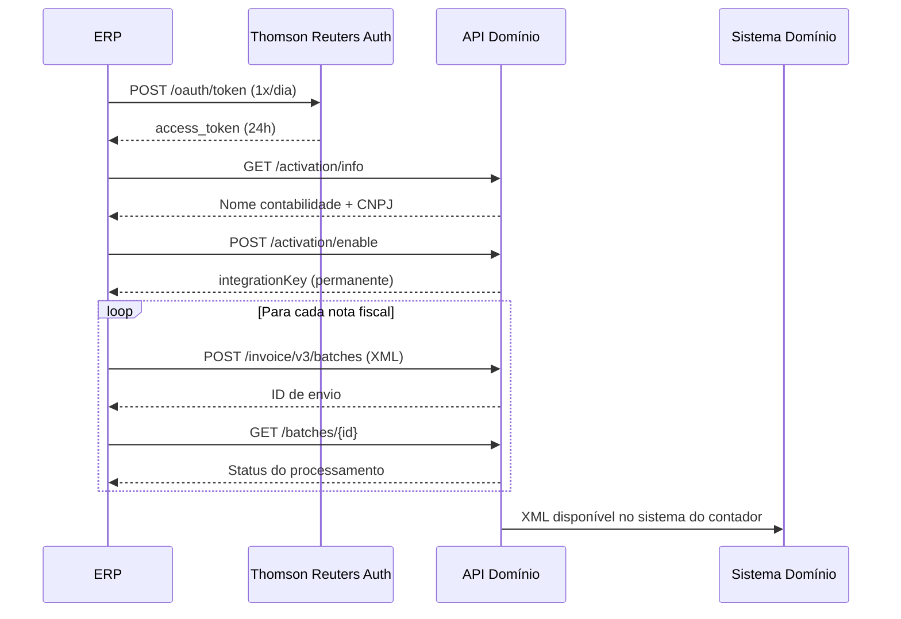

# Relatório Completo — Sistema Contábil Domínio (Thomson Reuters)

**Data:** 01/06/2026  
**Objetivo:** Documentar arquitetura, módulos, integrações e API do sistema contábil Domínio (Thomson Reuters).

---

## 1. Visão Geral

O **Domínio** é o sistema contábil líder no mercado brasileiro, desenvolvido pela Thomson Reuters. Atende escritórios de contabilidade de todos os portes com uma plataforma modular que cobre contabilidade, fiscal, folha de pagamento, gestão e compliance.

### Posicionamento
- **Fabricante:** Thomson Reuters Brasil
- **Público-alvo:** Escritórios de contabilidade (de micro a grandes)
- **Modelo:** Licenciamento por assinatura (SaaS + Desktop)
- **Suporte:** 0800 645 4004
- **Portal do desenvolvedor:** api.dominio@thomsonreuters.com / api.dominio@tr.com

---

## 2. Planos e Tiers

| Plano | Descrição | Público |
|-------|-----------|---------|
| **Domínio One** | Sistema essencial — contabilidade, folha, fiscal e portais | Escritórios iniciantes |
| **Domínio Pro** | Ferramentas integradas com automação e gestão de processos | Escritórios em crescimento |
| **Domínio Max** | Acesso ilimitado a todos os módulos (atuais e futuros) | Escritórios consolidados |
| **Domínio Empresarial** | Solução para grandes operações e BPOs | Grandes escritórios / BPO |

---

## 3. Módulos Principais

### 3.1 Contábil
- Escrituração contábil completa
- Plano de contas configurável
- Lançamentos automáticos via integração
- Balancete, DRE, Balanço Patrimonial
- SPED Contábil (ECD)
- Conciliação bancária
- Demonstrações financeiras

### 3.2 Fiscal
- Escrituração fiscal de entrada e saída
- Apuração de ICMS, IPI, PIS, COFINS, ISS
- SPED Fiscal (EFD ICMS/IPI)
- EFD Contribuições
- DCTF, DIRF, GIA
- Importação automática de XML (NF-e, NFS-e, CT-e, NFC-e, CF-e)
- Integração SEFAZ

### 3.3 Folha de Pagamento
- Cálculo completo de folha
- eSocial (todos os eventos periódicos e não-periódicos)
- FGTS Digital
- DIRF / RAIS / CAGED
- Rescisão, férias, 13º
- Rubricas configuráveis
- Integração com portais do empregado

### 3.4 Gestão do Escritório
- Controle de prazos e obrigações
- Workflow de processos internos
- Gestão de honorários e cobranças
- Dashboards e indicadores (OnBalance)
- Calendário contábil integrado

---

## 4. Módulos Adicionais

| Módulo | Função |
|--------|--------|
| **Domínio Web** | Acesso remoto ao sistema via nuvem |
| **Domínio Messenger** | Comunicação com clientes via IA — automação de solicitações |
| **Portal do Cliente** | Área do cliente para troca de documentos e informações |
| **Portal do Empregado** | Holerites, informe de rendimentos, documentos trabalhistas |
| **Box-e** | Armazenamento em nuvem de XMLs fiscais por 5 anos |
| **Busca NF-e** | Busca automática de notas fiscais na SEFAZ |
| **Busca Convenções** | Busca automática de convenções coletivas |
| **Kolossus Auditor** | Auditoria automatizada de dados contábeis/fiscais |
| **Domínio Processos** | Gestão de workflows e tarefas internas |
| **Domínio Custos** | Controle e apuração de custos |
| **OnBalance** | Dashboard financeiro e indicadores de gestão |
| **Conteúdo Contábil Tributário** | Base de conhecimento legislativa integrada |
| **Evolução em Nuvem** | Plataforma cloud moderna (next-gen) |

---

## 5. API e Integrações — Documentação Técnica

### 5.1 Visão Geral da API

A API do Domínio foi desenvolvida para **automatizar o fluxo de documentos fiscais entre ERPs e escritórios de contabilidade**. O foco principal é eliminar o envio manual de XMLs.

**Base URL:** `https://api.onvio.com.br/dominio/`  
**Autenticação:** OAuth 2.0 (Client Credentials)  
**Token endpoint:** `https://auth.thomsonreuters.com/oauth/token`

### 5.2 Autenticação OAuth 2.0

```
POST https://auth.thomsonreuters.com/oauth/token

Authorization: Basic {base64(client_id:client_secret)}
Content-Type: application/x-www-form-urlencoded

Body:
  grant_type=client_credentials
  &client_id={CLIENT_ID}
  &client_secret={CLIENT_SECRET}
  &audience=409f91f6-dc17-44c8-a5d8-e0a1bafd8b67
```

**Regras críticas:**
- Token válido por **24 horas**
- **Gerar apenas 1 token por dia** — usar o mesmo para todos os clientes
- Mais de **40 requisições de token/dia = bloqueio** da integração
- Credenciais obtidas via e-mail: `api.dominio@tr.com`

### 5.3 Endpoints Disponíveis

#### A. Verificar Chave do Cliente (Info)

```
GET https://api.onvio.com.br/dominio/integration/v1/activation/info

Headers:
  Authorization: Bearer {access_token}
  x-integration-key: {chave_fornecida_pelo_contador}

Response:
  - Nome da Contabilidade
  - Nome do Cliente
  - CNPJ
```

#### B. Ativar Integração (Enable)

```
POST https://api.onvio.com.br/dominio/integration/v1/activation/enable

Headers:
  Authorization: Bearer {access_token}
  x-integration-key: {chave_fornecida_pelo_contador}

Response:
  { "integrationKey": "chave_permanente_do_cliente" }
```

#### C. Envio de Documentos Fiscais (XML)

```
POST https://api.onvio.com.br/dominio/invoice/v3/batches

Headers:
  Authorization: Bearer {access_token}
  x-integration-key: {integrationKey}
Content-Type: multipart/form-data

Body (form-data):
  file[]: arquivo.xml (File)
  query: {"boxeFile": true}  (ou false se não usa Box-e)
  fileComplement[]: complemento.xml (opcional — códigos de produto do ERP)

Response:
  { "id": "ID_DE_ENVIO" }
```

#### D. Consultar Status do Envio

```
GET https://api.onvio.com.br/dominio/invoice/v3/batches/{ID_DE_ENVIO}

Headers:
  Authorization: Bearer {access_token}
  x-integration-key: {integrationKey}

Response:
  Status: "Arquivo armazenado na API" (sucesso)
```

### 5.4 Documentos Fiscais Suportados

| Tipo | Versão | Padrão |
|------|--------|--------|
| NF-e (Nota Fiscal Eletrônica) | 4.0 | SEFAZ |
| NFS-e (Nota Fiscal de Serviço) | 1.00 + Nacional | ABRASF |
| NFC-e (Nota Fiscal Consumidor) | 4.0 | SEFAZ |
| CT-e (Conhecimento Transporte) | 3.0 | SEFAZ |
| CF-e (Cupom Fiscal Eletrônico) | 0.07 / 0.08 | SEFAZ SP |
| Baixa de Parcelas | — | Próprio |

### 5.5 API de Baixa de Parcelas

Além de documentos fiscais, a API suporta **sincronização de baixas financeiras** — integração de liquidação de parcelas entre ERP/banco e o sistema contábil. Isso permite conciliação automática sem intervenção manual.

### 5.6 Fluxo Completo de Integração



### 5.7 Ambiente de Homologação

- Solicitar via e-mail ou WhatsApp (11) 5047-2396
- Informar CNPJ de teste para liberação de credenciais de homologação
- Testes realizados via **Postman** (collections disponibilizadas pela Thomson Reuters)

### 5.8 Exemplos de Código Disponíveis

A Thomson Reuters disponibiliza exemplos nas seguintes linguagens:
- **C#** (HttpClient multipart)
- **Delphi** (TIdHTTP / Indy)
- **Java**
- **Python**
- **PHP** (GuzzleHttp)
- **Node.js** (Axios)
- **Visual Basic .NET**

---

## 6. Integrações Nativas

### 6.1 Com ERPs
- Integração via API REST para envio automático de XMLs
- Suporte a qualquer ERP que gere documentos fiscais em XML
- Parceria com centenas de software houses brasileiras

### 6.2 Com Governo / SEFAZ
- SPED Contábil (ECD)
- SPED Fiscal (EFD ICMS/IPI)
- EFD Contribuições
- eSocial (eventos periódicos e não-periódicos)
- FGTS Digital
- DCTF / DIRF / RAIS / CAGED / GIA
- Busca automática de NF-e na SEFAZ

### 6.3 Com Serviços Financeiros
- Conta Digital integrada
- Cobrança de honorários
- Baixa automática de parcelas
- Conciliação bancária

### 6.4 Com Clientes do Escritório
- Portal do Cliente (documentos, solicitações)
- Portal do Empregado (holerites, IR)
- Domínio Messenger (comunicação com IA)

---

## 7. Compliance e Obrigações Acessórias

O sistema Domínio gera automaticamente as seguintes obrigações:

### Federal
- ECD (SPED Contábil)
- ECF (Escrituração Contábil Fiscal)
- EFD Contribuições (PIS/COFINS)
- DCTF / DCTFWeb
- DIRF
- eSocial
- FGTS Digital
- RAIS / CAGED

### Estadual
- EFD ICMS/IPI (SPED Fiscal)
- GIA
- DAPI
- DeSTDA (Simples Nacional)

### Municipal
- NFS-e (diversas prefeituras)
- ISS (Declarações municipais)

---

## 8. Pontos Fortes e Limitações

### Pontos Fortes
- **Líder de mercado** — maior base instalada de escritórios contábeis no Brasil
- **Ecossistema completo** — cobre 100% das necessidades de um escritório
- **Compliance atualizado** — atualizações legislativas automáticas
- **API para ERPs** — permite automação de recebimento de documentos
- **IA no Messenger** — automação de comunicação com clientes
- **Box-e** — armazenamento de XMLs por 5 anos (compliance SEFAZ)

### Limitações
- **API focada em inbound** — recebe XMLs, mas não expõe dados contábeis para consulta externa
- **Sem API de leitura de lançamentos** — não é possível extrair dados contábeis/financeiros programaticamente
- **Token rate-limiting agressivo** — máximo 40 tokens/dia antes de bloqueio
- **Acesso fechado** — credenciais de API fornecidas caso a caso via e-mail
- **Desktop-first** — módulos core ainda rodam em Windows (Domínio Web é acesso remoto, não SaaS nativo)
- **Sem API pública documentada** — documentação técnica disponível apenas no portal de suporte (não é open developer docs)
- **Integração unidirecional** — ERP → Domínio (não Domínio → sistemas externos)

---

## 9. Possibilidades de Integração via API

### O que é possível hoje
1. **Receber XMLs automaticamente** de clientes que usam ERPs integrados
2. **Automatizar baixas de parcelas** via API de sincronização financeira
3. **Box-e** para armazenamento legal de documentos fiscais
4. **Busca NF-e** automática na SEFAZ

### O que NÃO é possível via API
1. **Extrair dados contábeis** (balancetes, lançamentos, DRE) programaticamente
2. **Consultar situação fiscal** de clientes via API
3. **Exportar relatórios** automaticamente para sistemas externos
4. **Integrar com CRM/sistema financeiro** do escritório (dados fluem apenas para dentro do Domínio)

### Implicações para Escritórios que Usam Domínio
- Sistemas externos precisam operar em paralelo ao Domínio
- Dados contábeis no Domínio só saem via relatórios manuais ou exportação OFX/Excel
- A integração viável é **ERP → Domínio** (envio de documentos)
- Para dashboards e indicadores externos, os dados precisam vir de fontes paralelas (banco, OFX)

---

## 10. Contatos para Integração

| Canal | Informação |
|-------|-----------|
| E-mail API | api.dominio@tr.com / api.dominio@thomsonreuters.com |
| WhatsApp técnico | (11) 5047-2396 |
| Suporte geral | 0800 645 4004 |
| Portal suporte | suporte.dominioatendimento.com |
| Landing page dev | dominiosistemas.com.br/lp-centraldodesenvolvedor-api |

---

## 11. Conclusões

1. **O Domínio é um sistema fechado** — excelente para processar dados internamente, mas limitado para exposição de dados a sistemas externos.

2. **A API é unidirecional (ERP → Domínio)** — serve para enviar documentos ao contador, não para extrair informações contábeis.

3. **Estratégia de integração recomendada para escritórios:**
   - Usar o Domínio como sistema contábil principal (onde ele é forte)
   - Sistemas financeiros/gestão devem operar em paralelo com dados de OFX/bancos
   - Enviar documentos ao Domínio via API quando necessário

4. **Possível evolução futura**: Se o Domínio abrir APIs de leitura (tendência do mercado), integração bidirecional se tornará viável.

---

*Relatório gerado com base na documentação oficial da Thomson Reuters, portal de suporte, e landing page da Central do Desenvolvedor.*
