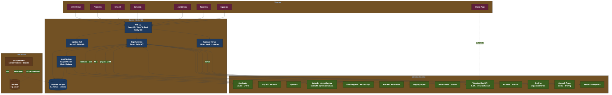
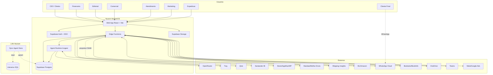
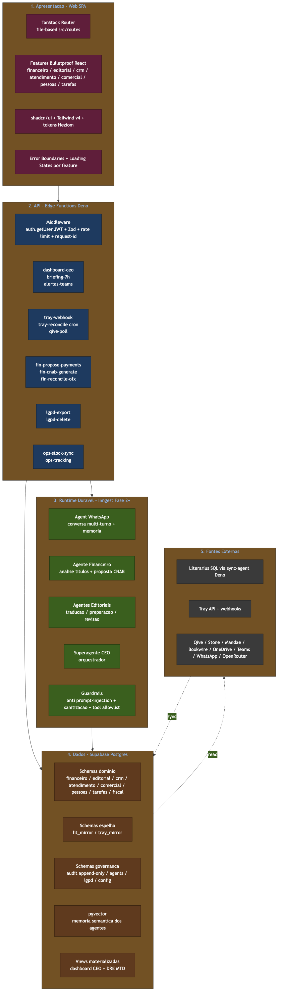
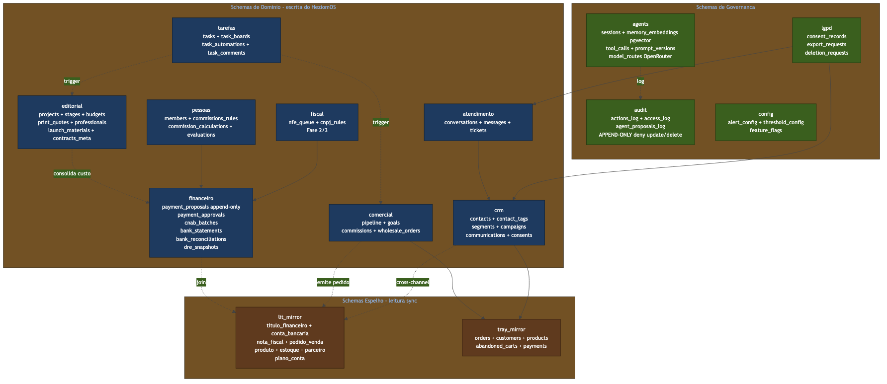
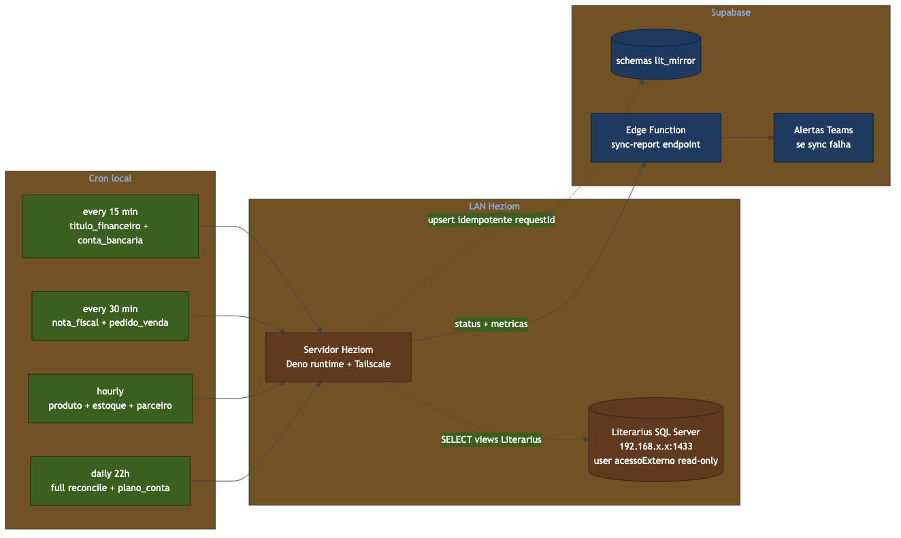
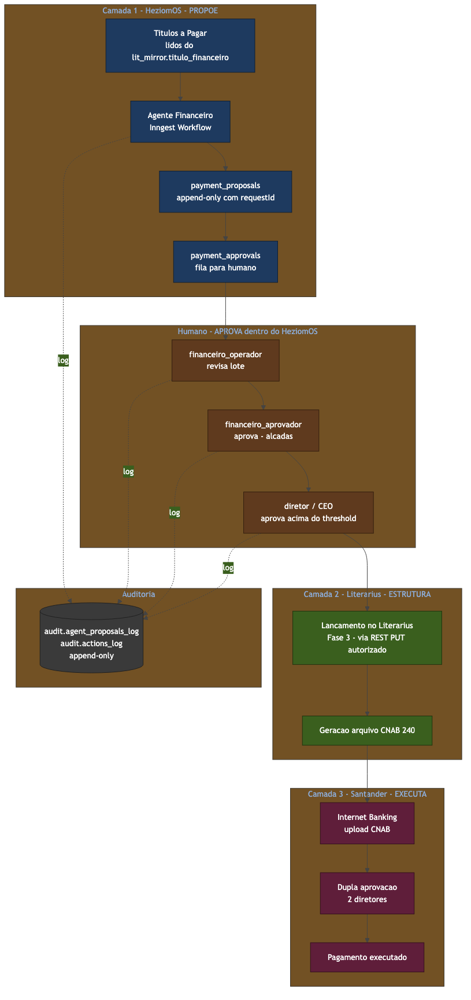
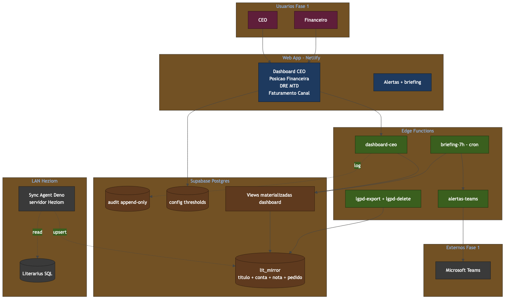

# HeziomOS — Arquitetura v3

> ✅ **DOC VIGENTE DE ARQUITETURA — consolidado em 2026-07-01.** Este é o **único** documento de arquitetura ativo do vault (as versões v1/v2 foram para `_Histórico/`). O **desenho** abaixo (single-tenant, monorepo, schemas por domínio, Edge Functions + Inngest, RLS FORCE, segurança/LGPD) continua **em vigor**. Onde o texto era um plano de mai/2026, ajustei para o que foi implementado. Para o **estado de cada módulo/entrega**, a fonte viva é **[[Estado Atual — Espelho dos Épicos]]** (e `docs/epics/README.md` no repo).
>
> **Ajustes-chave vs. o código real (2026-07-01):**
> 1. **Sync Literarius** roda em **servidor Windows da Heziom (Intelinove)** via repo **separado `literarius-sync`** — não é Raspberry Pi nem um `apps/sync-agent` dentro do monorepo (ADR-0005).
> 2. **CRM, Hub, Financeiro, Literarius, Auth são `features/` de um único `apps/web`** — não apps separados. Apps reais: `apps/web` + `apps/agent-runtime`.
> 3. **Schemas existentes hoje:** `crm`, `hub`, `financeiro`/`lit_mirror_financeiro`, `lit_mirror`, `tray_mirror`, `audit`, `agents`, `lgpd`, `config`. Os schemas `editorial`, `comercial`, `pessoas`, `tarefas`, `fiscal` da §6 são **planejados, não criados**.
> 4. **Nomes de Edge Function** na §5 são ilustrativos/antigos; os reais são prefixados `crm-*`/`hub-*` (ex.: `ceo-dashboard-summary`, `crm-tray-webhook`).
> 5. **ADRs:** o repo tem **0001–0016** (esta nota lista só até 0010).
> 6. **Roadmap (§9/§13/§16):** as Fases 1–4 viraram os **Épicos E1–E18** — ver Espelho. As "Fase 1 MVP" e "Próximos Passos" já foram **concluídas**.

Versão estrutural do HeziomOS. Substitui [[HeziomOS — Arquitetura e Fluxos]] (v2) e [[HeziomOS — Arquitetura]] (v1), ambas em `_Histórico/`.

---

## TL;DR

| Item | Decisão |
|---|---|
| **Produto** | Single-tenant. Código de propriedade da Heziom (§8 Escopo Técnico) |
| **Repositório** | Monorepo `pnpm workspaces + Turborepo`; `apps/web`, `apps/sync-agent`, `apps/agent-runtime`; `packages/*` compartilhados |
| **Frontend** | React 19 + Vite + TanStack Router + Tailwind v4 + shadcn/ui → Netlify |
| **Backend** | Supabase Edge Functions (Deno + Zod + JWT) para lógica curta + cron |
| **Agentes** | Edge Functions para 1-shot e cron. **Runtime durável Inngest** para conversas WhatsApp, multi-step e superagente (Fase 2+) |
| **Banco** | Supabase Postgres com **schemas por domínio** + **schemas espelho** (`lit_mirror`, `tray_mirror`) + **schemas de governança** (`audit`, `agents`, `lgpd`, `config`). RLS FORCE em tudo |
| **Sync Literarius** | Deno script + Tailscale em servidor da Heziom (admin Heziom, credenciais em cofre, log auditável) |
| **Auth** | Supabase Auth pronto para Microsoft SSO desde o dia 1; e-mail/senha em dev; SSO ativado na entrega; MFA obrigatório para `diretor`, `financeiro_aprovador`, `ceo` |
| **Storage** | Híbrido — Supabase Storage para o que o sistema processa (NF-e XML, e-book final, materiais lançamento); OneDrive para arquivos de trabalho da equipe |
| **WhatsApp** | Meta Cloud API como provider produção; abstração com Z-API e Evolution como fallback/dev |
| **Memória dos agentes** | pgvector no próprio Supabase |
| **Modelos IA** | OpenRouter (Claude primário, GPT-4o fallback) |

---

## 1. Visão Geral

**HeziomOS é a camada de inteligência operacional sobre o ERP Literarius e o e-commerce Tray.** Não substitui nenhum dos dois. Substitui ferramentas isoladas (ClickUp, Flowbiz, Unnichat, Qive, Power BI) e elimina o trabalho repetitivo entre departamentos.

| O que o Literarius faz | O que a Tray faz | O que o HeziomOS adiciona |
|---|---|---|
| ERP: pedidos, NFs, títulos financeiros, estoque, parceiros | Hub D2C: pedidos, marketplaces, gateway | Dashboard CEO em tempo real |
| Geração CNAB para Santander | Carrinho, abandono, regras de preço | Workflows de aprovação, propostas auditáveis |
| Relatórios estáticos | Webhooks | DRE automatizado, alertas proativos |
| — | — | CRM unificado cross-channel, agentes 24/7 |

**Princípio de segurança:** se o código fosse público amanhã, o sistema continuaria seguro. Cada camada se defende isoladamente.

---

## 2. Decisões Estruturantes

Cada decisão vira ADR (`docs/adr/0001-…md`) no repositório.

| # | Decisão | Razão |
|---|---|---|
| ADR-0001 | **Single-tenant** | Contrato §8: código pertence à Heziom. Sem complexidade multi-tenant prematura |
| ADR-0002 | **Monorepo pnpm + Turborepo** | Tipos compartilhados, atomic commits frontend↔edge↔sync. Biome para lint/format (rápido) |
| ADR-0003 | **Edge Functions + Inngest** | Edge para 1-shot/cron; Inngest para workflows duráveis (limite 400s do Supabase mata conversa multi-turno e análise multi-step) |
| ADR-0004 | **Schemas Postgres por domínio + espelho + governança** | Isolamento lógico, RLS por schema, auditoria centralizada |
| ADR-0005 | **Sync Deno em servidor Heziom + Tailscale** | Literarius está em LAN privada; servidor é da Heziom; admin, cofre de credenciais e log são da Heziom |
| ADR-0006 | **Microsoft SSO desde o dia 1, ativado na entrega** | Trocar provider depois = re-criar usuários e RLS. Configuramos uma vez |
| ADR-0007 | **Storage híbrido** | Supabase Storage onde o sistema lê/processa; OneDrive onde a equipe trabalha. Migração progressiva |
| ADR-0008 | **WhatsApp: abstração + Meta Cloud API produção** | Meta Cloud API é o único provider oficial. Z-API/Evolution só como fallback emergencial — wrappers não-oficiais têm risco de banimento |
| ADR-0009 | **pgvector para memória de agentes** | Suficiente até ~1M embeddings; mantém dependência única (Supabase) |
| ADR-0010 | **OpenRouter como gateway de modelos** | Sem vendor lock-in; fallback automático Claude ↔ GPT-4o |

---

## 3. Diagrama de Sistemas e Integrações (Alvo)





---

## 4. Arquitetura em Camadas



5 camadas com responsabilidades isoladas:

| # | Camada | Tecnologia | Responsabilidade |
|---|---|---|---|
| 1 | **Apresentação** | React 19 + TanStack Router + shadcn/ui | UI, navegação, validação client-side (Zod), Error Boundary por feature |
| 2 | **API** | Edge Functions Deno | Auth (JWT via `auth.getUser`), validação Zod, rate limit, request-id, lógica curta, cron |
| 3 | **Runtime durável** | Inngest Workers (Fly.io/Railway) | Conversas WhatsApp, agente financeiro multi-step, superagente. Retry, idempotência, observabilidade |
| 4 | **Dados** | Supabase Postgres | Schemas de domínio + espelho + governança. RLS FORCE em tudo. Views materializadas para dashboard |
| 5 | **Fontes externas** | Literarius / Tray / Qive / ... | Acesso isolado por adapter em `packages/integrations` |

**Regra crítica:** features não importam entre si. Compartilhamento via `packages/shared`, `packages/ui`, `packages/integrations`.

---

## 5. Estrutura do Monorepo

```
heziomos/                              # repo privado (propriedade Heziom)
├── apps/
│   ├── web/                           # React 19 + Vite + TanStack Router → Netlify
│   │   └── src/
│   │       ├── routes/                # file-based routing
│   │       ├── features/              # bulletproof-react: api/ components/ hooks/ types/
│   │       ├── components/            # ui/ + layout/
│   │       ├── integrations/supabase/ # client.ts, types.ts, auth-middleware.ts
│   │       └── lib/                   # utils, error-capture
│   ├── sync-agent/                    # Deno + npm:mssql → servidor Heziom + Tailscale
│   │   ├── jobs/                      # titulo, conta, nf, pedido, produto, estoque
│   │   ├── lib/                       # mssql client, supabase client, logger
│   │   └── deno.json
│   └── agent-runtime/                 # Inngest workers → Fly.io / Railway (Fase 2+)
│       ├── functions/                 # workflows duráveis
│       ├── agents/                    # whatsapp, financeiro, editorial, superagente
│       └── tools/                     # tool calling com allowlist
├── packages/
│   ├── database/                      # Supabase types gerados + migrations + seed
│   ├── shared/                        # tipos + Zod schemas reutilizáveis
│   ├── ui/                            # shadcn + tokens Heziom
│   ├── integrations/                  # adapters: literarius, tray, qive, mandae, meta-ads, bookwire
│   ├── whatsapp/                      # abstração + providers (meta-cloud, z-api, evolution)
│   ├── agents/                        # prompts versionados + tools + guardrails anti prompt-injection
│   └── config/                        # eslint/biome, tsconfig, turbo presets
├── supabase/
│   ├── migrations/                    # versionadas, geram CI diff check
│   ├── functions/                     # Edge Functions
│   │   ├── _shared/                   # auth-middleware, zod helpers, structured logger, request-id
│   │   ├── dashboard-ceo/
│   │   ├── briefing-7h/
│   │   ├── alertas-teams/
│   │   ├── tray-webhook/
│   │   ├── tray-reconcile/            # cron de reconciliação (R3)
│   │   ├── qive-poll/
│   │   ├── fin-propose-payments/
│   │   ├── fin-cnab-generate/
│   │   ├── fin-reconcile-ofx/
│   │   ├── lgpd-export/
│   │   └── lgpd-delete/
│   └── seed.sql
├── docs/
│   ├── adr/                           # Architecture Decision Records
│   └── runbooks/                      # incident response, deploy, sync recovery
├── .github/workflows/                 # CI: lint, typecheck, test, supabase db diff, npm audit
├── turbo.json
├── pnpm-workspace.yaml
├── CLAUDE.md                          # instruções aos agentes
└── README.md
```

**Stack do monorepo:**

- `pnpm` 9+ workspaces
- `Turborepo` para cache de build/test
- `Biome` para lint + format (substitui ESLint + Prettier — mais rápido)
- `TypeScript` strict, sem `any`
- `Vitest` para testes
- `Playwright` para E2E (dashboard CEO + fluxo crítico CNAB)

---

## 6. Banco de Dados



### 6.1. Schemas

| Schema | Conteúdo | Direção | RLS |
|---|---|---|---|
| `financeiro` | `payment_proposals` (append-only), `payment_approvals`, `cnab_batches`, `bank_statements`, `bank_reconciliations`, `dre_snapshots` | R/W HeziomOS | FORCE |
| `editorial` | `projects`, `stages`, `budgets`, `print_quotes`, `professionals`, `launch_materials`, `contracts_meta` | R/W HeziomOS | FORCE |
| `crm` | `contacts`, `contact_tags`, `segments`, `communications`, `campaigns`, `consents` | R/W HeziomOS | FORCE |
| `atendimento` | `conversations`, `messages`, `tickets` | R/W HeziomOS + agente | FORCE |
| `comercial` | `pipeline`, `goals`, `commissions`, `wholesale_orders` | R/W HeziomOS | FORCE |
| `pessoas` | `members`, `commissions_rules`, `commission_calculations`, `evaluations` | R/W HeziomOS | FORCE |
| `tarefas` | `tasks`, `task_boards`, `task_automations`, `task_comments` | R/W HeziomOS | FORCE |
| `fiscal` | `nfe_queue`, `cnpj_rules` (substitui Qive em Fase 3) | R/W HeziomOS | FORCE |
| `lit_mirror` | `titulo_financeiro`, `conta_bancaria`, `nota_fiscal`, `pedido_venda`, `produto`, `estoque`, `parceiro`, `plano_conta` | Espelho do Literarius (read-only para app, write apenas sync-agent) | FORCE |
| `tray_mirror` | `orders`, `customers`, `products`, `abandoned_carts`, `payments` | Espelho da Tray (read-only para app, write apenas pelos webhooks/reconcile) | FORCE |
| `audit` | `actions_log`, `access_log`, `agent_proposals_log` | **Append-only**: policy `DENY UPDATE, DELETE` para todos (inclusive `service_role`) | FORCE |
| `agents` | `sessions`, `memory_embeddings` (pgvector), `tool_calls`, `prompt_versions`, `model_routes` | R/W runtime de agentes | FORCE |
| `lgpd` | `consent_records`, `export_requests`, `deletion_requests` | R/W HeziomOS + LGPD endpoints | FORCE |
| `config` | `alert_config`, `threshold_config`, `feature_flags` | R diretor / W ceo | FORCE |

**Convenções:**

- Toda tabela: `id uuid pk default gen_random_uuid()`, `created_at timestamptz default now()`, `created_by uuid references auth.users`, `updated_at`, `updated_by`.
- Toda tabela de fato (proposals, logs, batches): `request_id text unique` para idempotência (R4).
- Soft delete (`deleted_at`) onde aplicável; nunca em `audit.*`.
- Views materializadas (`mv_dashboard_ceo`, `mv_dre_mtd`) com refresh agendado por Edge Function cron.

### 6.2. Estratégia de RLS

- **Por papel × schema.** Cada papel ganha policies específicas. Exemplos:
  - `financeiro_operador` → SELECT/INSERT em `financeiro.payment_proposals`; SELECT em `lit_mirror.titulo_financeiro`.
  - `editorial_coord` → ALL em `editorial.*`; SELECT em `tarefas.*` filtrado por `department='editorial'`.
  - `agente_financeiro` (papel técnico) → SELECT em `lit_mirror.titulo_financeiro`; INSERT em `financeiro.payment_proposals`. **NUNCA** UPDATE em payment_approvals.
- **`audit.*`** — INSERT permitido a roles operacionais e técnicos; UPDATE/DELETE deny total via policy `USING (false)`.
- **`SERVICE_ROLE_KEY`** vive exclusivamente em Edge Functions e no sync-agent; nunca no client.

### 6.3. Views consumidas pelo Dashboard

Views materializadas refrescadas via cron:

- `mv_dashboard_ceo` — saldos consolidados, A/R 7d, A/P 7d, faturamento MTD vs. mês anterior
- `mv_dre_mtd` — DRE acumulado por categoria
- `mv_canal_pace` — pace vs. meta CPC por canal
- `mv_estoque_critico` — produtos abaixo do ponto de reposição

---

## 7. Sync Literarius



### 7.1. Topologia

- **Servidor Heziom** (mesmo que hospeda o PowerBI legado): roda o Deno runtime + cron.
- **Tailscale** opcional como exit-node para Edge Functions alcançarem o SQL Server em emergência.
- **Usuário** `acessoExterno` (read-only) no Literarius; nunca escreve nesta fase.

### 7.2. Cadência (Fase 1)

| Cron | Tabelas | Frequência |
|---|---|---|
| `sync-financeiro` | `titulo_financeiro`, `conta_bancaria`, `banco`, `plano_conta` | 15 min |
| `sync-comercial` | `nota_fiscal`, `pedido_venda`, `pedido_venda_item` | 30 min |
| `sync-catalogo` | `produto`, `estoque`, `parceiro` | 60 min |
| `sync-full-reconcile` | tudo + checksum | diário 22h |

### 7.3. Garantias

- **Idempotente:** upsert via PK do Literarius (`Id_Literarius`).
- **Append-only de mudanças:** `audit.actions_log` registra cada sync run (linhas afetadas, duração, erros).
- **Alerta Teams** se `sync-full-reconcile` divergir > 0.1% do esperado.
- **Health check** exposto via Edge Function `/sync-health`.

### 7.4. Condições não-negociáveis do servidor (DoD do setup)

1. Acesso admin total da Heziom (SSH root, capacidade de patch/reboot).
2. Credenciais Supabase e Tailscale em cofre de variáveis de ambiente do sistema operacional — nunca em arquivo plain text.
3. Log de acesso ao servidor habilitado e auditável.
4. Snapshot/backup do estado do runtime semanal.

---

## 8. Cadeia Financeira (Aprovação de Pagamentos)



**3 camadas independentes entre automação e dinheiro** (§4 Escopo Técnico):

1. **HeziomOS PROPÕE** — agente financeiro lê `lit_mirror.titulo_financeiro`, identifica obrigações, insere em `financeiro.payment_proposals` (append-only com `request_id`).
2. **Humano APROVA dentro do HeziomOS** — `financeiro_operador` revisa, `financeiro_aprovador` aprova dentro da alçada, `diretor`/`ceo` aprova acima do threshold.
3. **Literarius ESTRUTURA** — em Fase 3, lançamento autorizado via REST PUT gera arquivo CNAB.
4. **Santander EXECUTA** — upload CNAB no Internet Banking; **dupla aprovação de 2 diretores fora do sistema**; pagamento executado.

**Toda ação irreversível registrada em `audit.actions_log` e `audit.agent_proposals_log` — sem UPDATE/DELETE permitido.**

### 8.1. Threshold de alçada (decisão pendente)

| Faixa | Aprovador suficiente |
|---|---|
| Até R$ X (a definir) | `financeiro_aprovador` |
| Acima de R$ X | `diretor` + `ceo` notificados; aprovação por qualquer dos dois |

> **Pendência D1:** definir valor X com a CEO. Default proposto: R$ 5.000.

---

## 9. Fase 1 — MVP Destacado (30 dias)



**Critério de saída da Fase 1:** o CEO consegue responder "como estou hoje?" sem abrir o Literarius.

### 9.1. Escopo da Fase 1

| Entrega | Story | Schema/Função |
|---|---|---|
| Infra (Supabase, repo, Netlify, Tailscale) | STORY-001 | — |
| Sync `lit_mirror.titulo_financeiro` + `conta_bancaria` | STORY-002 | `lit_mirror`, sync-agent |
| Sync `lit_mirror.nota_fiscal` + `pedido_venda` | STORY-003 | `lit_mirror`, sync-agent |
| Dashboard CEO — Posição Financeira | STORY-004 | `mv_dashboard_ceo`, `dashboard-ceo` edge |
| Dashboard CEO — DRE MTD | STORY-005 | `mv_dre_mtd` |
| Briefing 7h Teams | STORY-006 | `briefing-7h` edge cron |
| LGPD endpoints (mesmo sem dados ainda) | STORY-010 (criar) | `lgpd-export`, `lgpd-delete` |
| Setup Microsoft SSO (configurado, desligado em dev) | STORY-011 (criar) | Supabase Auth |

### 9.2. Fora do escopo da Fase 1

- Aprovação de pagamentos (Fase 2)
- WhatsApp / Atendimento (Fase 2)
- CRM unificado (Fase 2)
- Editorial pipeline (Fase 2)
- Agentes autônomos (Fase 3)

---

## 10. Requisitos Não-Funcionais

### 10.1. R1 — Defesa contra Prompt Injection

Os agentes vão consumir XML de NF-e, texto de mensagens WhatsApp, e-mail de fornecedor e descrições de pedido. Tudo isso é **entrada não-confiável**.

**Camadas de defesa:**

1. **Sanitização** — strip de tokens conhecidos (`<system>`, `[INST]`, etc.) e delimitação clara `<<USER_INPUT>>...<</USER_INPUT>>`.
2. **System prompt defensivo** — instruções imutáveis no início, recap no final.
3. **Tool allowlist por agente** — agente financeiro nunca tem acesso a tool de write em `audit.*` ou em outros domínios.
4. **Aprovação humana obrigatória** para qualquer ação irreversível, independente do que o agente decidiu.
5. **Output validation** — toda resposta passa por Zod schema; respostas fora do schema são descartadas e logadas.

### 10.2. R2 — LGPD: direitos do titular

Endpoints obrigatórios desde a Fase 1:

| Endpoint | Função | SLA |
|---|---|---|
| `POST /lgpd/export` | Recebe CPF + validação de identidade; gera ZIP com todos os dados do titular | 15 dias |
| `POST /lgpd/delete` | Recebe CPF + validação de identidade; agenda anonimização (não DELETE físico em `audit.*`); confirma após processado | 15 dias |
| `GET /lgpd/consents/:cpf` | Lista consentimentos ativos | tempo real |

- Consentimento opt-in registrado em `lgpd.consent_records`.
- **Anonimização** em vez de DELETE para preservar integridade financeira/fiscal e logs imutáveis.
- Encarregado de dados (DPO) a nomear formalmente.

### 10.3. R3 — Reconciliação de Webhooks

Webhooks da Tray e da Meta Cloud API são **eventualmente consistentes**: podem falhar, repetir, chegar fora de ordem.

**Padrão obrigatório para toda integração com webhook:**

1. Webhook handler grava evento bruto em `*_mirror.webhook_events` (append-only) com `request_id`.
2. Processador deduplica por `request_id` antes de aplicar.
3. **Job cron de reconciliação** (a cada 1h) compara estado local vs. estado remoto via API e corrige divergências.
4. Alerta Teams se `divergencias > 0` em 3 ciclos consecutivos.

### 10.4. R4 — Idempotência e Log Imutável

- **Toda operação financeira** carrega `request_id` único gerado no client (UUID v7).
- **Insert com `ON CONFLICT (request_id) DO NOTHING`** previne duplicação por retry de rede.
- **`audit.actions_log` e `audit.agent_proposals_log`** são **append-only via RLS policy `WITH CHECK (true) USING (false)` para UPDATE e DELETE**.
- Nenhuma role (nem `service_role`) pode alterar registros de audit. Trilha legalmente robusta.

### 10.5. Segurança em Profundidade (resumo do §2 Escopo Técnico)

| Camada | Controles |
|---|---|
| Frontend | Zod, DOMPurify, CSP, Security Headers, zero secrets no client |
| Edge | `auth.getUser` JWT, Zod no body, rate limit, CORS restritivo, logger estruturado com `request_id` |
| DB | RLS FORCE, policies por papel, views mascaradas para PII, SERVICE_ROLE só em Edge/sync |
| Infra | HTTPS + HSTS, env vars no cofre Supabase/Netlify, `npm audit` em CI, rotação de secrets documentada |
| Auth | Supabase Auth, MFA obrigatório para diretor/aprovador/CEO, sessões invalidáveis globalmente |

**Rate limiting:**

- Login: 5 tentativas / 15 min
- API geral: 20 req/min/usuário
- Operações financeiras: 3 tentativas / 5 min com bloqueio progressivo

### 10.6. Observabilidade

| Aspecto | Ferramenta |
|---|---|
| Errors frontend | Error Boundary + Sentry (free tier) |
| Logs Edge Functions | Estruturado JSON `{request_id, function, user_id, latency_ms, status}` |
| Web Vitals | LCP < 2.5s, INP < 200ms (alvo) |
| Inngest dashboard | Workflows duráveis, retry, latência |
| Alertas | Teams para: sync falhou, saldo crítico, conciliação < 80%, acesso admin |
| Audit dashboard | View consolidada de `audit.actions_log` filtrável por usuário/agente/período |

### 10.7. Resiliência

- **Error Boundaries** por feature.
- **TanStack Query** com 2 retries + backoff exponencial.
- **Graceful Degradation:** se Tray/Meta Ads/Bookwire estiver fora, demais módulos continuam; dashboard mostra "última sync: hh:mm".
- **Fallback IA via OpenRouter:** Claude indisponível → GPT-4o automático.
- **Idempotência** em toda operação financeira (R4).
- **Health checks** em Edge Functions críticas.
- **Ambientes isolados** prod / staging desde o dia 1.

---

## 11. Papéis e Permissões

| Papel | Escopo |
|---|---|
| `ceo` | Leitura total + aprovação acima do threshold |
| `diretor` | Leitura total + aprovação em alçada |
| `financeiro_operador` | A/P, A/R, conciliação (lançamento) — sem aprovar |
| `financeiro_aprovador` | Aprova propostas dentro de alçada — não executa |
| `editorial_coord` | Pipeline editorial completo + cadastros |
| `editorial_externo` | (Fase 2) Acesso apenas ao próprio card/etapa |
| `comercial` | Pipeline atacado + comissões próprias |
| `atendimento` | Conversas + tickets + consulta pedidos/estoque |
| `marketing` | CRM + campanhas + métricas |
| `expedicao` | Pedidos + estoque + integração logística |
| `agente_financeiro` | Técnico — leitura titulo_financeiro, escrita payment_proposals |
| `agente_atendimento` | Técnico — leitura pedidos/estoque, escrita atendimento_messages |
| `agente_editorial` | Técnico — leitura/escrita pipeline editorial (sem financeiro/CRM) |
| `agente_super` | Técnico — leitura ampla, sem escrita direta; só propostas |

**MFA obrigatório:** `ceo`, `diretor`, `financeiro_aprovador`. Aplicado via Azure AD após ativação do SSO.

---

## 12. Integrações Externas

| Sistema | Direção | Protocolo | Fase | Adapter package |
|---|---|---|---|---|
| Literarius SQL | IN | TCP/1433 mssql | 1 | `apps/sync-agent` |
| Literarius REST | IN/OUT | HTTPS | 3 | `packages/integrations/literarius` |
| Tray API | IN/OUT | HTTPS + webhooks | 2 | `packages/integrations/tray` |
| Qive | IN | HTTPS | 2 (substituído em 3) | `packages/integrations/qive` |
| Santander | OUT | CNAB 240 manual + OFX import | 2 | `apps/web` upload + `fin-cnab-generate` |
| Stone / AppMax / Mercado Pago | IN | HTTPS | 2 | `packages/integrations/gateways` |
| Mandaê / Melhor Envio | IN/OUT | HTTPS | 2 | `packages/integrations/logistics` |
| Shipping Insights | IN | HTTPS (interno Heziom) | 2 | `packages/integrations/shipping-insights` |
| Mercado Livre / Amazon Seller | IN | HTTPS | 4 | `packages/integrations/marketplaces` |
| Bookwire / BookInfo | IN/OUT | HTTPS / manual | 4 | `packages/integrations/bookwire` |
| OneDrive | IN/OUT | MS Graph API | 2 | `packages/integrations/onedrive` |
| Microsoft Teams | OUT | Incoming Webhook | 1 | `_shared/teams-notify` |
| WhatsApp Cloud API | IN/OUT | HTTPS + webhooks | 2 | `packages/whatsapp/meta-cloud` |
| Z-API / Evolution | IN/OUT | HTTPS | 2 (fallback) | `packages/whatsapp/{z-api,evolution}` |
| OpenRouter (Claude / GPT-4o) | OUT | HTTPS | 1+ | `apps/agent-runtime` |
| Meta Ads / Google Ads | IN | HTTPS | 2 | `packages/integrations/ads` |

---

## 13. Roadmap Consolidado

> ⚠️ **Superado (2026-07-01).** O modelo de Fases 1–4 abaixo foi substituído pelo **sistema de Épicos E1–E18** do repo. Estado vivo: **[[Estado Atual — Espelho dos Épicos]]** e `docs/epics/README.md`.
>
> Mapa rápido de-para (Fase → Épico real):
> - Fase 1 (Visibilidade: Dashboard CEO, sync, briefing) → **E1–E4** ✅ + parte do **E10** (dashboards financeiros, Story 10.1 ✅)
> - Fase 2.2 (CRM, migração Flowbiz) → **E5** ✅ ~90%
> - Fase 2.5 (Atendimento WhatsApp) → **E6/E9/E16/E17** ✅ em produção
> - Fase 2.6 (Financeiro: aprovação/conciliação) → **E10** 🔄 (só dashboards no ar; aprovação/CNAB/conciliação em branch não mergeada)
> - Fase 2.1/2.3/2.4/2.7 (Tarefas, Comercial, Editorial, Pessoas) → **não iniciados** (sem épico aberto)
> - Fase 3/4 (autonomia, marketplaces) → backlog futuro

---

## 14. Custos Estimados (mensal)

| Item | Custo |
|---|---|
| Supabase Pro | US$ 25 (~R$ 130) |
| Netlify Pro | US$ 19 (~R$ 100) |
| Fly.io / Railway (agent-runtime Fase 2+) | US$ 25–50 (~R$ 130–260) |
| Inngest (free tier até 50k events/mês) | R$ 0–200 |
| Tokens IA via OpenRouter (cap) | R$ 2.000 |
| Sentry free tier | R$ 0 |
| **Total Fase 1** | **~R$ 230 / mês** |
| **Total Fase 2+ com IA** | **~R$ 2.500 / mês** |

Economia esperada com substituição (ClickUp, Flowbiz, Unnichat, Qive, Power BI): **~R$ 5.050 / mês**. ROI positivo desde a Fase 2.

---

## 15. Pendências e Decisões em Aberto

| # | Decisão | Bloqueia | Responsável |
|---|---|---|---|
| D1 | Valor do threshold de alçada CEO | Aprovação pagamentos | CEO |
| D2 | Confirmar OFX disponível no Santander IB | Conciliação | Financeiro |
| D3 | PlanoConta.TipoCategoria = 'A' em todos os 115 registros | DRE real | Equipe Literarius |
| D4 | 6 views SQL Literarius (otimizadas para o sync) | Performance sync | Equipe Literarius |
| D5 | Nomeação formal do DPO (LGPD) | Conformidade | CEO |
| D6 | Cap de R$ 2k/mês em tokens IA é suficiente para 6 agentes? | Viabilidade Fase 3 | Tech Lead |
| D7 | Volume de tokens estimado para WhatsApp 24/7 | Fase 2 budget | Tech Lead |

---

## 16. Próximos Passos Imediatos

> ✅ **Concluídos (2026-07-01).** Itens 1–4 e 6 já foram feitos: monorepo inicializado (E1), ADRs escritos (0001–0016), SSO e LGPD implementados, servidor de sync no ar (`literarius-sync` no Windows Server). O que resta são decisões de negócio pendentes, listadas em §15 (threshold de alçada D1, DPO D5, PlanoConta D3). Para o backlog atual, ver [[Estado Atual — Espelho dos Épicos]].

---

## 17. Histórico

- **v1** (15/04/2026) — [[HeziomOS — Arquitetura]]: módulo financeiro apenas. Histórico.
- **v2** (19/05/2026) — [[HeziomOS — Arquitetura e Fluxos]]: ampliação para todos os módulos. Histórico.
- **v3** (23/05/2026) — este documento: revisão estrutural (monorepo, runtime durável de agentes, schemas por domínio, RNFs de segurança formalizados, decisão Microsoft SSO desde o dia 1, abstração WhatsApp com providers).

---

## Referências

- [[Estado Atual — Espelho dos Épicos]] — **estado vivo** dos módulos (E1–E18)
- [[HeziomOS — Complemento Técnico v2 (Conselho)]] — base contratual/segurança (Conselho); alias `Escopo Tecnico`
- [[Mapeamento Completo da Operação Heziom]] — entrevistas e processos de negócio
- [[Mapa Completo de APIs e Capacidades]] · [[Estudo de APIs — Capacidades e Gaps]] — inventário técnico de integrações
- _Stories/roadmap originais (STORY-00X, Roadmap) → arquivados em `_Histórico/`; backlog atual em `docs/stories/BACKLOG.md` no repo._

---

*Documento vigente — qualquer divergência entre código e este doc deve ser resolvida por PR atualizando ambos no mesmo commit (regra §1 do CLAUDE.md).*
