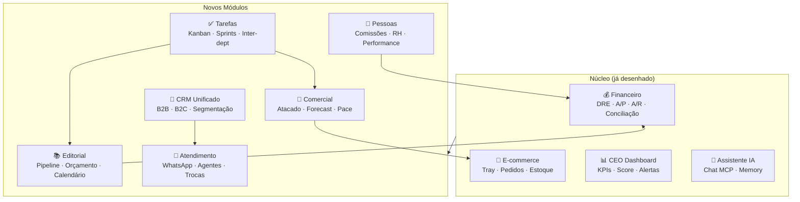
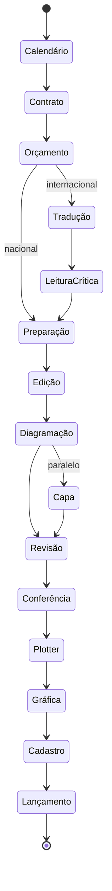

# HeziomOS — Módulos e Escopo Completo

> Documento que expande a [[HeziomOS — Arquitetura e Fluxos]] para cobrir **todos os departamentos e processos** mapeados no [[Mapeamento Completo da Operação Heziom]].
> A arquitetura anterior cobria apenas Financeiro + E-commerce + Estoque. Este documento define os **módulos adicionais** necessários para o HeziomOS ser de fato um OS completo.

---

## Visão Geral: De Dashboard Financeiro → OS Completo



---

## Módulos Detalhados

### 1. EDITORIAL (substitui: ClickUp + Google Sheets + OneDrive parcial)

**Entidade central:** `Projeto Editorial` (obra)



**Submodelos:**

| Submódulo | Função | Substitui |
|---|---|---|
| Calendário de Publicações | Visão anual, vínculo com todas as etapas, histórico de alterações | Google Sheets |
| Orçamento Editorial | Motor de cálculo custo/prazo por lauda, 3 níveis complexidade, tetos por tipo | Google Sheets (planilha-coração) |
| Pipeline de Produção | Kanban com 9 etapas, alocação de profissionais, prazos automáticos | ClickUp |
| Orçamento Gráfico | Cotações, markup ×7, comparativo entre gráficas | Processo manual |
| Hub de Lançamento | Materiais para marketing (mockup, FAQ, guia), checklist | ClickUp |
| Ficha Catalográfica | ISBN, metadados, distribuição multi-plataforma | BookInfo + Amazon Vendor (parcial) |
| Gestão de E-book | Status no fluxo, arquivo, distribuição Bookwire | Manual |

**Regras de negócio embarcadas:**

| Regra | Fórmula/Valor |
|---|---|
| Custo editorial | Laudas × preço/lauda (por tarefa × complexidade) |
| Teto nacional | R$ 40/lauda |
| Teto internacional | R$ 60/lauda |
| Prazo editorial | Laudas ÷ produtividade (laudas/dia por tarefa) |
| Markup gráfico | Preço capa = custo gráfico unitário × 7 (configurável) |
| Sequência obrigatória | Tradução → Leitura → Preparação → Edição → Diagramação → Revisão → Conferência → Plotter |
| Capa paralela | Pode correr junto com Diagramação |

**Tabelas Supabase propostas:**

```
editorial_projects (id, title, author_id, type, status, calendar_date, complexity_level, page_count, ...)
editorial_stages (id, project_id, stage_type, assignee_id, start_date, end_date, status, ...)
editorial_budgets (id, project_id, task_type, complexity, rate_per_page, total_pages, total_cost, ...)
editorial_print_quotes (id, project_id, printer, specs, quantity, unit_cost, total_cost, markup, ...)
editorial_professionals (id, name, specialty, rates_json, productivity, ...)
editorial_launch_materials (id, project_id, material_type, status, file_url, ...)
```

**Integrações:**
- `editorial_budgets.total_cost` → `lit_titulo_financeiro` (via PUT PedidoVenda ou sync)
- `editorial_projects.isbn` → `TProdutoController` (Literarius REST)
- `editorial_projects` → Tray `POST /products` (quando publicado)
- `editorial_launch_materials` → notificação automática ao Marketing

**Evolução IA (Fase futura):**
- Agentes de tradução, preparação, edição, revisão, conferência
- Humanos permanecem: diagramação, capa, plotter

---

### 2. CRM UNIFICADO (substitui: Flowbiz)

**Entidade central:** `Customer` (perfil unificado cross-channel)

| Capacidade | Fonte de dados |
|---|---|
| Perfil B2C (compradores D2C) | Tray `GET /customers` |
| Perfil B2B (igrejas, livrarias, distribuidores) | Literarius `TParceiroController` + `TipoCliente` |
| Cross-channel matching | CPF como chave (marketplace → Tray → Literarius) |
| Histórico de compras | `lit_pedido_venda` + `tray_orders` |
| Segmentação comportamental | Compras × categoria × recência × frequência × valor |
| Réguas de relacionamento | Email/WhatsApp baseado em triggers de comportamento |
| Tabelas de preço B2B | Tray API Listas de Preço |

**Migração:** 40.000+ contatos do Flowbiz → tabela `crm_contacts` via export CSV + enriquecimento

**Segmentações desejadas (exemplos reais do CEO):**
- "Clientes que compraram teologia reformada nos últimos 90 dias e não abriram últimos 3 e-mails"
- "Igrejas que fizeram pedido institucional há mais de 6 meses"
- "Compradores de marketplace que também compraram D2C (cross-channel)"

**Tabelas Supabase propostas:**

```
crm_contacts (id, name, email, phone, cpf_cnpj, type, source_channel, ...)
crm_contact_tags (contact_id, tag)
crm_segments (id, name, rules_json, auto_refresh, count, ...)
crm_communications (id, contact_id, channel, direction, content, timestamp, ...)
crm_campaigns (id, segment_id, channel, template, status, sent_count, opened, clicked, ...)
```

---

### 3. ATENDIMENTO (substitui: Unnichat)

**Entidade central:** `Conversation` (thread por cliente)

| Capacidade | Como |
|---|---|
| Canal principal | WhatsApp Business API |
| Agente autônomo (Fase 1) | Responder rastreio, prazo, disponibilidade |
| Agente autônomo (Fase 2) | Processamento de trocas, vendas assistidas |
| Escalação | Para vendedor humano quando oportunidade de venda |
| Horário | 24/7 via agente, humanos 08h–18h seg–sex |
| Histórico centralizado | Todas as mensagens em `atendimento_messages` |

**Integrações:**
- Rastreio: Mandaê API `/trackings` + Melhor Envio + Shipping Insights
- Estoque: `TEstoqueController` (disponibilidade em tempo real)
- Pedidos: `TPedidoVendaController` (status do pedido)
- Frete: Mandaê `/postalcodes/rates` (cotação ao vivo)
- CRM: vinculação com `crm_contacts` para contexto

**Tabelas Supabase propostas:**

```
atendimento_conversations (id, contact_id, channel, status, assigned_to, started_at, ...)
atendimento_messages (id, conversation_id, direction, content, agent_type, timestamp, ...)
atendimento_tickets (id, conversation_id, type, status, resolution, ...)
```

---

### 4. COMERCIAL ATACADO (complementa: módulo de pedidos existente)

**Entidade central:** `Wholesale Order` (pedido B2B)

| Capacidade | Situação atual | HeziomOS |
|---|---|---|
| Entrada de pedido | WhatsApp → lançamento manual no Literarius | Agente WhatsApp → auto-lançamento via `PUT /PedidoVenda` |
| Comunicação expedição | Aviso manual no ClickUp | Evento automático ao mudar status do pedido |
| Comunicação financeiro | Aviso manual para gerar boleto | Trigger automático: pedido aprovado → gerar título |
| Visão de vendas | Inexistente | Dashboard por vendedor, canal, pace vs. meta |
| Forecast | Inexistente | Projeção baseada em histórico + pipeline |

**Metas CPC:**
- Online: R$ 214.503/mês (ROI mínimo 4:1)
- Offline: R$ 371.851/mês

**Volume:** ~150 pedidos atacado/mês

**Tabelas Supabase propostas:**

```
comercial_pipeline (id, seller_id, contact_id, channel, status, expected_value, close_date, ...)
comercial_goals (id, seller_id, period, channel, target_value, actual_value, ...)
comercial_commissions (id, seller_id, order_id, rate, amount, status, ...)
```

---

### 5. PESSOAS E GESTÃO (substitui: planilhas + processos manuais)

**Entidade central:** `Team Member`

| Capacidade | Descrição |
|---|---|
| Comissões CPC | Faixas de 0,5% a 3,5% — cálculo automático |
| Avaliação de desempenho | KPIs por função, ciclos avaliativos |
| Onboarding | Checklist para novos colaboradores |
| Estrutura organizacional | Org chart com 7 áreas, ~20 pessoas |
| Documentos (futuro) | Contratos, férias, benefícios |

**Tabelas Supabase propostas:**

```
people_members (id, name, role, department, hire_date, status, ...)
people_commissions_rules (id, department, channel, tier_min, tier_max, rate, ...)
people_commission_calculations (id, member_id, period, orders_value, rate, amount, ...)
people_evaluations (id, member_id, period, metrics_json, score, ...)
```

---

### 6. TAREFAS E PROJETOS (substitui: ClickUp)

**Entidade central:** `Task`

| Capacidade | Descrição |
|---|---|
| Boards por departamento | Cada área tem seu kanban |
| Cross-department triggers | "Editorial terminou → avisa Marketing" |
| Sprints pessoais | Para coordenadores |
| Tarefas automáticas | Geradas por eventos do sistema (prazo de etapa editorial, pedido aprovado, etc.) |
| Visão consolidada | CEO vê todas as áreas |

**Tabelas Supabase propostas:**

```
tasks (id, title, description, department, board_id, status, assignee_id, due_date, priority, ...)
task_boards (id, name, department, columns_json, ...)
task_automations (id, trigger_event, action, target_board, template, ...)
task_comments (id, task_id, author_id, content, timestamp, ...)
```

---

## Mapa de Substituição de Ferramentas

| Ferramenta atual | Custo mensal | Módulo HeziomOS que substitui | Fase |
|---|---|---|---|
| ClickUp | ~R$ 500 | Tarefas + Editorial Pipeline | 2 |
| Flowbiz | ~R$ 300 | CRM Unificado | 2 |
| Unnichat | ~R$ 400 | Atendimento (WhatsApp Agent) | 2 |
| Qive | ~R$ 200 | Módulo Fiscal (NF-e via SEFAZ) | 3 |
| POS Controle | ~R$ 150 | Literarius novo app (deles) | Externo |
| Power BI | R$ 3.500 | CEO Dashboard | 1 (já) |
| Google Sheets (editorial) | R$ 0 | Editorial (motor orçamento) | 2 |
| **Total economia/mês** | **~R$ 5.050** | | |

---

## Faseamento Expandido

### Fase 1 — Visibilidade Financeira + CEO Dashboard (4–6 semanas)
*Mantém escopo atual da [[HeziomOS — Arquitetura e Fluxos]]*

- Sync Literarius → Supabase (financeiro, pedidos, NF, estoque)
- Sync Tray → Supabase (pedidos, pagamentos)
- CEO Dashboard (posição financeira, DRE MTD, faturamento por canal)
- Briefing 7h via Teams
- Assistente IA (Chat MCP)
- Stock sync Literarius → Tray

### Fase 2 — Operação Integrada (8–12 semanas)
*Novo: absorve departamentos operacionais*

| Sprint | Módulo | Entrega |
|---|---|---|
| 2.1 | **Tarefas** | Boards por departamento, cross-triggers, substituição ClickUp |
| 2.2 | **CRM** | Migração Flowbiz, perfil unificado, segmentação, campanhas |
| 2.3 | **Comercial** | Dashboard de vendas, pace vs. meta, pipeline atacado |
| 2.4 | **Editorial** | Calendário + Orçamento (motor custo/prazo) + Pipeline kanban |
| 2.5 | **Atendimento** | WhatsApp Agent v1 (rastreio, FAQ, disponibilidade) |
| 2.6 | **Pessoas** | Comissões CPC automáticas, estrutura org |

### Fase 3 — Autonomia e IA (3–6 meses)
*Agentes autônomos substituindo trabalho repetitivo*

| Sprint | Módulo | Entrega |
|---|---|---|
| 3.1 | **Financeiro** | Agente de pagamentos autônomo, CNAB, conciliação >95% |
| 3.2 | **Atendimento** | Agente vendas 24/7, trocas autônomas, escalação inteligente |
| 3.3 | **Editorial** | Agentes de texto (tradução, preparação, revisão IA) |
| 3.4 | **Comercial** | Agente de vendas atacado (WhatsApp → auto-lançamento Literarius) |
| 3.5 | **CEO** | Superagente que interage com todas as áreas (elimina reuniões) |

### Fase 4 — Expansão (6–12 meses)
*Marketplace, comunidade, novos canais*

- APIs Mercado Livre e Amazon Seller (gestão direta)
- Tema Tray com chat de vendas IA
- Comunidade Heziom (e-books, audiobooks, assinaturas)
- Portal do Autor (acompanhamento de royalties e produção)
- Módulo fiscal nativo (substituição Qive)
- App mobile (expedição, vendedor de campo)

---

## Integrações Novas Necessárias

| Sistema | API disponível? | Módulo que consome | Prioridade |
|---|---|---|---|
| WhatsApp Business API | ✅ Oficial (Meta) | Atendimento + Comercial | Alta (Fase 2) |
| Meta Ads API | ✅ Marketing API | CRM (ROI) + CEO Dashboard | Média (Fase 2) |
| Google Ads API | ✅ | CEO Dashboard (ROAS) | Média (Fase 2) |
| Mercado Livre API | ✅ (após homologação) | Comercial + CRM | Baixa (Fase 4) |
| Amazon Seller API | ✅ | Comercial + Estoque | Baixa (Fase 4) |
| Bookwire API | ❓ A verificar | Editorial (distribuição digital) | Baixa (Fase 4) |
| BookInfo API | ❓ A verificar | Editorial (metadados ISBN) | Baixa (Fase 4) |
| Shipping Insights | ✅ (proprietário Heziom) | Logística | Média (Fase 2) |
| DocuSign API | ✅ | Editorial (contratos) | Baixa (Fase 3) |
| Melhor Envio API | ✅ | Logística + Atendimento | Média (Fase 2) |

---

## Decisões Pendentes

| # | Decisão | Impacto | Responsável |
|---|---|---|---|
| D1 | Confirmar se WhatsApp usará Cloud API (Meta) ou solução BSP | Define custo e complexidade do módulo Atendimento | CEO + Tech Lead |
| D2 | Prioridade relativa: CRM vs. Editorial vs. Tarefas na Fase 2 | Define ordem de desenvolvimento | CEO |
| D3 | Manter OneDrive para arquivos editoriais ou migrar para Supabase Storage | Custo de armazenamento vs. centralização | CEO + Coordenadora Editorial |
| D4 | Manter DocuSign ou substituir por assinatura nativa (ex: Clicksign, Autentique) | Custo vs. juridicidade | CEO |
| D5 | Volume de tokens IA para agentes: cap de R$ 2k/mês é suficiente para 6 agentes autônomos? | Viabilidade econômica da Fase 3 | Tech Lead |
| D6 | Shipping Insights: integra via API interna ou banco compartilhado? | Arquitetura de logística | CEO + equipe Shipping Insights |
| D7 | Estrutura de comissões: validar faixas 0,5%–3,5% são as vigentes | Cálculo automático de comissões | CEO + Financeiro |

---

## Referências

- [[Mapeamento Completo da Operação Heziom]] — documento-fonte deste escopo
- [[HeziomOS — Arquitetura e Fluxos]] — arquitetura Fase 1 (financeiro + e-commerce)
- [[Mapa Completo de APIs e Capacidades]] — inventário técnico de APIs
- [[Estudo de APIs — Capacidades e Gaps]] — o que é possível e o que falta

---

*Proposta criada em 2026-05-19 — JG Novais (Trivia) a partir do mapeamento consolidado pelo diretor executivo.*
