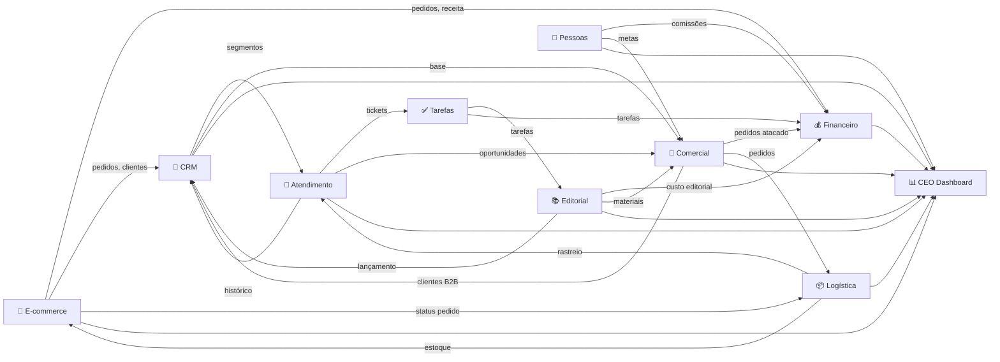
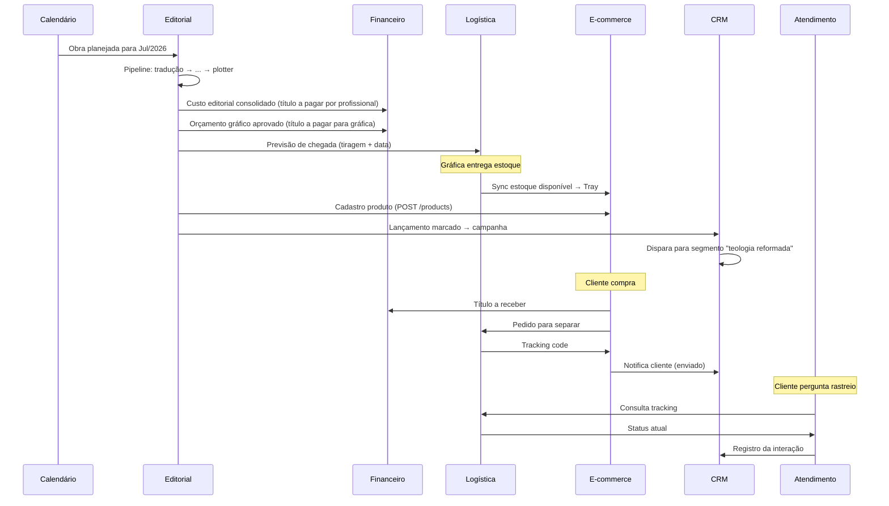
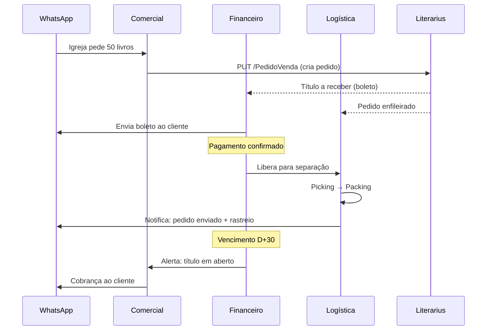
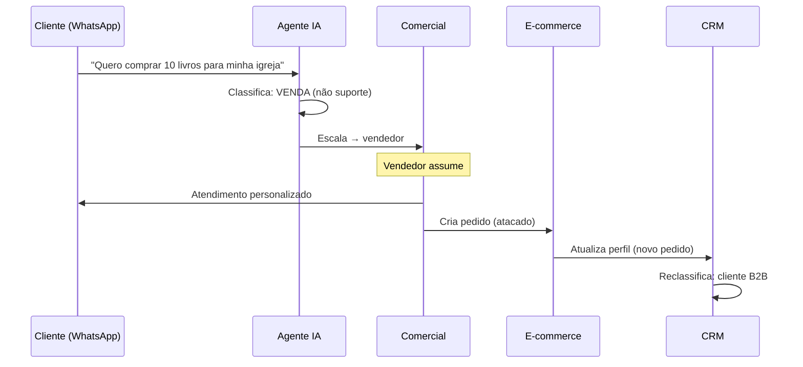
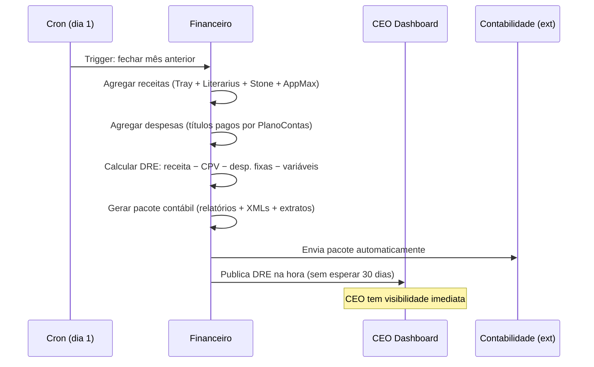
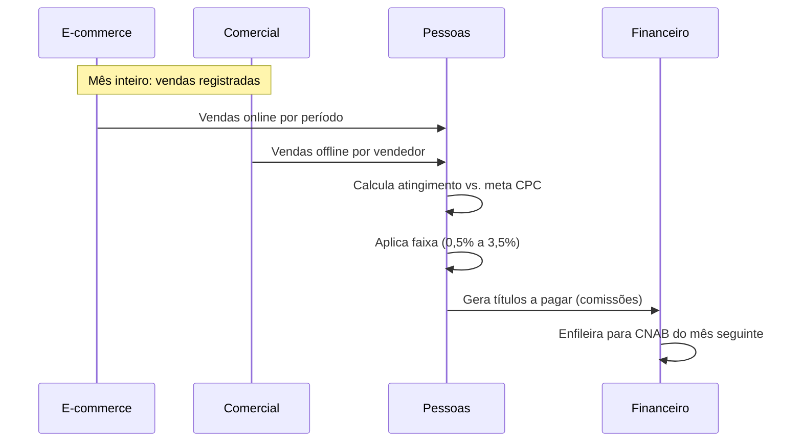
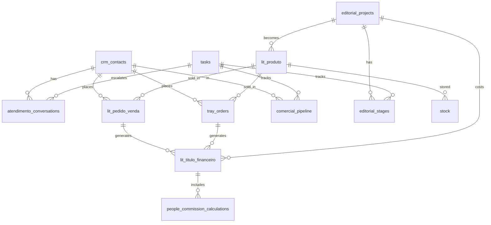

# HeziomOS — Interligação Completa entre Módulos

> Como os 10 módulos do HeziomOS se conectam, quais dados compartilham, quais eventos geram e como tudo alimenta um banco único.
> Este documento é o "sistema nervoso" do OS — mapeia cada sinapse entre departamentos.

---

## Visão Macro: Grafo de Dependências



---

## Barramento de Eventos Internos

O HeziomOS opera por **eventos**: quando algo muda num módulo, outros módulos reagem automaticamente. Isso substitui os "avisos manuais via ClickUp" que a Heziom faz hoje.

**Implementação técnica:** Supabase Realtime (pg_notify) + Edge Functions (listeners) + tabela `system_events`

```
system_events (
  id uuid,
  event_type text,        -- ex: 'order.approved', 'editorial.stage_completed'
  source_module text,     -- ex: 'comercial', 'editorial'
  payload jsonb,          -- dados do evento
  created_at timestamptz,
  processed boolean
)
```

---

## Mapa Completo de Eventos e Reações

### Eventos do E-COMMERCE → Reações

| Evento | Trigger | Reage: Módulo | Ação |
|---|---|---|---|
| `ecom.order.created` | Tray webhook `order.insert` | Financeiro | Cria título a receber |
| `ecom.order.created` | Tray webhook `order.insert` | Logística | Enfileira para separação |
| `ecom.order.created` | Tray webhook `order.insert` | CRM | Atualiza histórico do cliente |
| `ecom.order.paid` | Tray webhook `transaction.update` | Financeiro | Baixa no título |
| `ecom.order.paid` | Tray webhook `transaction.update` | Logística | Libera para picking |
| `ecom.order.shipped` | Mandaê/Melhor Envio webhook | CRM | Envia notificação ao cliente |
| `ecom.order.shipped` | Mandaê/Melhor Envio webhook | Atendimento | Disponibiliza rastreio para agente |
| `ecom.order.cancelled` | Tray webhook `order.delete` | Financeiro | Cancela título |
| `ecom.order.cancelled` | Tray webhook `order.delete` | Logística | Remove da fila |
| `ecom.cart.abandoned` | Cron (verifica Tray a cada 1h) | CRM | Dispara régua de recuperação |
| `ecom.stock.low` | Sync agent (saldo < mínimo) | Logística | Alerta de ruptura |
| `ecom.stock.low` | Sync agent | CEO Dashboard | Alerta visual |

---

### Eventos do COMERCIAL (Atacado) → Reações

| Evento | Trigger | Reage: Módulo | Ação |
|---|---|---|---|
| `comercial.order.created` | Vendedor lança no sistema (ou agente WhatsApp) | Financeiro | Gera título (boleto/PIX) |
| `comercial.order.created` | Idem | Logística | Enfileira separação |
| `comercial.order.created` | Idem | Tarefas | Cria tarefa "separar pedido #X" para expedição |
| `comercial.order.approved` | Status muda para aprovado | Financeiro | Confirma título e agenda cobrança |
| `comercial.order.approved` | Idem | Logística | Prioriza separação |
| `comercial.goal.achieved` | Cálculo diário pace vs. meta | Pessoas | Atualiza atingimento para comissão |
| `comercial.goal.achieved` | Idem | CEO Dashboard | Atualiza pace CPC |
| `comercial.lead.escalated` | Atendimento identifica oportunidade de venda | Comercial | Cria item no pipeline |
| `comercial.lead.escalated` | Idem | Tarefas | Tarefa "follow-up com #{cliente}" |

---

### Eventos do EDITORIAL → Reações

| Evento | Trigger | Reage: Módulo | Ação |
|---|---|---|---|
| `editorial.project.created` | Coordenadora registra nova obra | Tarefas | Gera timeline de tarefas automáticas |
| `editorial.stage.completed` | Etapa muda (ex: tradução → preparação) | Tarefas | Cria tarefa para próximo profissional |
| `editorial.stage.completed` | Idem | Editorial | Atualiza kanban + registra data |
| `editorial.stage.overdue` | Cron diário (prazo vencido) | Tarefas | Alerta para coordenadora |
| `editorial.stage.overdue` | Idem | CEO Dashboard | Flag de atenção |
| `editorial.plotter.approved` | Plotter finalizado | Tarefas | "Solicitar orçamento gráfico de #{título}" |
| `editorial.budget.approved` | Orçamento gráfico aprovado | Financeiro | Registra custo (título a pagar para gráfica) |
| `editorial.budget.approved` | Idem | Comercial | Informa custo unitário (precificação) |
| `editorial.budget.approved` | Idem | Logística | Previsão de chegada de estoque |
| `editorial.book.published` | Cadastro + estoque recebido | E-commerce | Sync produto → Tray (`POST /products`) |
| `editorial.book.published` | Idem | CRM | Dispara campanha de lançamento |
| `editorial.book.published` | Idem | Tarefas | Checklist de lançamento para Marketing |
| `editorial.launch.ready` | Todos materiais prontos (mockup, FAQ, guia) | CRM | Dispara pré-venda segmentada |
| `editorial.cost.registered` | Custo consolidado no Literarius | Financeiro | Atualiza CMV do produto |

---

### Eventos do FINANCEIRO → Reações

| Evento | Trigger | Reage: Módulo | Ação |
|---|---|---|---|
| `fin.payment.due_soon` | Cron (vencimento em 3 dias) | Tarefas | Tarefa "aprovar pagamento #{fornecedor}" |
| `fin.payment.approved` | Responsável aprova | Financeiro | Enfileira para CNAB |
| `fin.payment.executed` | Retorno CNAB processado | Financeiro | Baixa no título a pagar |
| `fin.receivable.overdue` | Cron (título em aberto > vencimento) | CRM | Régua de cobrança |
| `fin.receivable.overdue` | Idem | Comercial | Alerta ao vendedor responsável |
| `fin.receivable.overdue` | Idem | CEO Dashboard | Aging visual atualizado |
| `fin.reconciliation.mismatch` | Conciliação bancária detecta divergência | Tarefas | Tarefa "resolver divergência #{desc}" |
| `fin.dre.closed` | DRE mensal finalizado | CEO Dashboard | Atualiza KPIs |
| `fin.cashflow.alert` | Projeção indica caixa negativo em X dias | CEO Dashboard | Alerta crítico |
| `fin.cashflow.alert` | Idem | Tarefas | Tarefa urgente para financeiro |
| `fin.nfe.received` | Módulo fiscal captura NF-e via SEFAZ | Financeiro | Cria título a pagar (associa ao pedido de compra) |
| `fin.nfe.received` | Idem | Tarefas | "Aprovar NF-e #{número} de #{fornecedor}" |

---

### Eventos do CRM → Reações

| Evento | Trigger | Reage: Módulo | Ação |
|---|---|---|---|
| `crm.segment.triggered` | Contato entra em segmento (regra dinâmica) | CRM | Enfileira para campanha/régua |
| `crm.campaign.sent` | Campanha disparada | CRM | Registra métricas (opens, clicks) |
| `crm.contact.inactive` | Sem compra há X dias (configurável) | CRM | Dispara régua de reativação |
| `crm.contact.high_value` | LTV calculado > threshold | Comercial | Flag VIP para atendimento diferenciado |
| `crm.contact.cross_channel` | CPF identificado em novo canal | CRM | Unifica perfis |
| `crm.b2b.no_order_6m` | Igreja/livraria sem pedido há 6 meses | Comercial | Tarefa "reativar #{parceiro}" |

---

### Eventos do ATENDIMENTO → Reações

| Evento | Trigger | Reage: Módulo | Ação |
|---|---|---|---|
| `atend.conversation.started` | Nova mensagem WhatsApp | Atendimento | Agente IA classifica e responde |
| `atend.conversation.escalated` | Agente não resolve / detecta venda | Comercial | Transfere para vendedor |
| `atend.ticket.created` | Problema identificado (troca, reclamação) | Tarefas | Tarefa para equipe responsável |
| `atend.ticket.resolved` | Ticket fechado | CRM | Atualiza satisfação do contato |
| `atend.sale.assisted` | Venda fechada via WhatsApp | E-commerce | Registra pedido (Tray ou Literarius) |
| `atend.sale.assisted` | Idem | Comercial | Conta para meta do vendedor |

---

### Eventos da LOGÍSTICA → Reações

| Evento | Trigger | Reage: Módulo | Ação |
|---|---|---|---|
| `log.order.picked` | Separação concluída | Logística | Avança para embalagem |
| `log.order.shipped` | Etiqueta gerada + coletado | E-commerce | Atualiza Tray (`PUT /orders/:id` com tracking) |
| `log.order.shipped` | Idem | CRM | Notifica cliente (email/WhatsApp) |
| `log.order.delivered` | Confirmação de entrega | CRM | Dispara NPS / pesquisa satisfação |
| `log.order.delivered` | Idem | Financeiro | Marca receita como "realizada" |
| `log.stock.received` | Nova remessa da gráfica chegou | E-commerce | Sync estoque → Tray |
| `log.stock.received` | Idem | Editorial | Atualiza status do projeto ("estoque recebido") |
| `log.stock.received` | Idem | CRM | Avisa waitlist (se houver) |
| `log.consignment.overdue` | Contrato de consignação vencido | Comercial | Tarefa "cobrar acerto #{parceiro}" |
| `log.consignment.overdue` | Idem | Financeiro | Provisão de inadimplência |

---

### Eventos de PESSOAS → Reações

| Evento | Trigger | Reage: Módulo | Ação |
|---|---|---|---|
| `people.commission.calculated` | Fechamento mensal de comissões | Financeiro | Gera títulos a pagar (comissões) |
| `people.goal.updated` | Meta CPC atualizada | Comercial | Atualiza target no dashboard |
| `people.evaluation.due` | Ciclo de avaliação | Tarefas | Tarefas de avaliação para gestores |

---

### Eventos de TAREFAS → Reações

| Evento | Trigger | Reage: Módulo | Ação |
|---|---|---|---|
| `task.overdue` | Prazo vencido sem conclusão | CEO Dashboard | Flag de atenção por departamento |
| `task.completed` | Tarefa concluída | Tarefas | Verifica se gera próxima tarefa (cadeia) |
| `task.completed` | Se é tarefa editorial | Editorial | Avança etapa no pipeline |

---

## Matriz de Dados Compartilhados

### Entidades que cruzam múltiplos módulos

| Entidade | Módulos que consomem | Chave primária | Tabela Supabase |
|---|---|---|---|
| **Cliente/Contato** | CRM, Comercial, Atendimento, Financeiro, E-commerce | `crm_contacts.id` (CPF como chave de dedup) | `crm_contacts` |
| **Pedido** | E-commerce, Comercial, Financeiro, Logística | `orders.id` | `lit_pedido_venda` + `tray_orders` |
| **Produto** | E-commerce, Editorial, Logística, Comercial | `products.id` | `lit_produto` |
| **Título Financeiro** | Financeiro, Comercial, Editorial, Pessoas | `fin_titulos.id` | `lit_titulo_financeiro` |
| **Tarefa** | Todos os departamentos | `tasks.id` | `tasks` |
| **Projeto Editorial** | Editorial, Financeiro, Comercial, Marketing, Logística | `editorial_projects.id` | `editorial_projects` |
| **Conversa** | Atendimento, CRM, Comercial | `conversations.id` | `atendimento_conversations` |

---

## Fluxos End-to-End (Cross-Module)

### Fluxo 1: Vida completa de um livro (Editorial → Venda → Pós-venda)



---

### Fluxo 2: Pedido atacado completo (Comercial → Financeiro → Logística)



---

### Fluxo 3: Atendimento com escalação para venda



---

### Fluxo 4: Fechamento mensal automatizado (substitui processo manual de 30 dias)



---

### Fluxo 5: Comissão CPC end-to-end



---

## Banco Único: Schema Consolidado



---

## Pontos de Integração com Sistemas Externos

| Sistema externo | Direção | Módulo HeziomOS | Protocolo | Frequência |
|---|---|---|---|---|
| **Literarius SQL** | ← leitura | Todos (via sync) | TCP/MSSQL | A cada 15min |
| **Literarius REST** | ↔ leitura + escrita | Comercial, Financeiro | HTTP REST | On-demand |
| **Tray API** | ↔ leitura + escrita | E-commerce, CRM | HTTP REST | Polling 15min + webhooks |
| **Tray Webhooks** | → push | E-commerce | HTTPS POST | Real-time |
| **Mandaê API** | ← leitura | Logística, Atendimento | HTTP REST | On-demand |
| **Melhor Envio API** | ← leitura | Logística, Atendimento | HTTP REST | On-demand |
| **Shipping Insights** | ← leitura | Logística | API interna (TBD) | On-demand |
| **WhatsApp Business API** | ↔ | Atendimento, Comercial, CRM | HTTP REST + webhooks | Real-time |
| **Meta Ads API** | ← leitura | CRM, CEO Dashboard | HTTP REST | Diário |
| **Google Ads API** | ← leitura | CEO Dashboard | HTTP REST | Diário |
| **Santander OFX** | ← upload | Financeiro | Arquivo OFX | Diário (manual MVP) |
| **SEFAZ** | ← consulta | Financeiro (fiscal) | Certificado A1 | Cron 6h (Fase 3) |
| **OneDrive** | ← leitura | Editorial | MS Graph API | On-demand |
| **DocuSign** | ↔ | Editorial | REST API | On-demand |
| **Bookwire** | → escrita | Editorial | TBD | Por lançamento |
| **BookInfo** | → escrita | Editorial | TBD | Por lançamento |
| **Amazon Vendor** | ↔ | Comercial | REST API (Fase 4) | Diário |
| **Supabase Realtime** | ↔ interno | Todos os módulos | WebSocket | Real-time |

---

## Permissões e Visibilidade (RLS por módulo)

| Perfil | Módulos com acesso | Nível |
|---|---|---|
| **CEO / Diretoria** | Todos | Leitura total + aprovações |
| **Financeiro** | Financeiro, parte de Comercial (inadimplência) | CRUD financeiro |
| **Comercial** | Comercial, CRM (contatos B2B), Tarefas próprias | CRUD vendas |
| **Editorial** | Editorial, Tarefas próprias | CRUD editorial |
| **Marketing** | CRM, Campanhas, Tarefas próprias | Leitura produtos + CRUD campanhas |
| **Atendimento** | Atendimento, CRM (leitura), Logística (rastreio) | Leitura + chat |
| **Logística** | Logística, Pedidos (leitura) | CRUD expedição |
| **Agente IA** | Todos (leitura) + ações específicas via tools | Controlado por system prompt |

---

## O que deixa de ser manual

| Hoje (aviso manual) | HeziomOS (evento automático) |
|---|---|
| Vendedor avisa expedição via ClickUp | `comercial.order.created` → tarefa automática para logística |
| Expedição avisa financeiro para gerar boleto | `comercial.order.approved` → título criado automaticamente |
| Editorial avisa Comercial que livro está pronto | `editorial.book.published` → notificação + produto na Tray |
| Marketing pede relatório toda segunda | CEO Dashboard atualiza em tempo real |
| Atendimento escala manualmente para vendedor | `atend.conversation.escalated` → pipeline do comercial |
| Financeiro separa documentos para contabilidade | `fin.month.closed` → pacote gerado e enviado automaticamente |
| Coordenadora editorial cobra prazos de terceiros | `editorial.stage.overdue` → alerta automático |
| CEO busca dados consolidados em múltiplas fontes | Tudo no Dashboard, atualizado em tempo real |

---

## Resumo Quantitativo

| Métrica | Valor |
|---|---|
| Módulos interligados | 10 |
| Eventos mapeados | 52 |
| Fluxos end-to-end documentados | 5 |
| Sistemas externos integrados | 17 |
| Avisos manuais eliminados | 8 processos recorrentes |
| Entidades compartilhadas | 7 |
| Perfis de acesso | 8 |

---

## Referências

- [[HeziomOS — Módulos e Escopo Completo]] — escopo de cada módulo
- [[HeziomOS — Arquitetura e Fluxos]] — arquitetura técnica Fase 1
- [[Mapeamento Completo da Operação Heziom]] — processos por departamento
- [[ClickUp — Funcionalidades Mapeadas]] — cross-triggers que substituem avisos manuais
- [[Flowbiz — Funcionalidades Mapeadas]] — réguas e automações a replicar
- [[Unnichat — Funcionalidades Mapeadas]] — fluxo de atendimento e escalação
- [[Qive — Funcionalidades Mapeadas]] — workflow fiscal

---

*Análise de interligação criada em 2026-05-19 — JG Novais (Trivia)*
