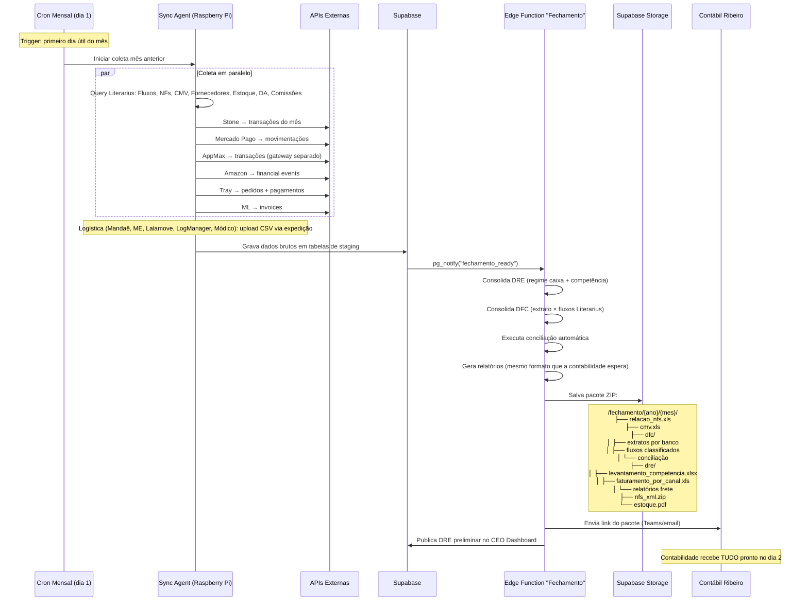

# Fechamento Mensal — Automação Completa

> Mapeamento detalhado do processo de fechamento mensal atual (manual, ~30 dias) e especificação de como o HeziomOS automatiza cada etapa.
> Fonte real: `OneDrive > Heziom > Financeiro Editora Heziom > 2026 > Contabilidade > Fechamento Compartilhado`

---

## Estrutura Atual da Pasta de Fechamento

Cada mês tem uma pasta (`1-JANEIRO` a `12-DEZEMBRO`) com estrutura padrão:

```
{MÊS}/
├── Relação de notas fiscais por número.xls    ← Literarius
├── CMV.xls                                     ← Literarius (calculado manualmente)
├── NFs Emitidas_PDF.zip                        ← Literarius
├── NFs Emitidas_XML.zip                        ← Literarius
├── NFes emitidas_ENTRADA_XML.zip               ← Literarius (NFs recebidas)
├── NFs Amazon.zip / FULL.zip                   ← Portal Amazon Seller Central
├── NFs TARIFAS mercado livre.zip               ← Portal Mercado Livre
├── Recolher_*.pdf                              ← Guias de recolhimento (impostos)
├── Estoque / Saldo estoque.pdf                 ← Literarius
├── DFC/                                        ← Demonstrativo de Fluxo de Caixa
│   ├── Extrato Santander.xlsx                  ← Internet Banking (download manual)
│   ├── Extrato Stone.xlsx                      ← Portal Stone
│   ├── Extrato Mercado Pago.xlsx               ← Portal MP
│   ├── Amazon.csv                              ← Portal Amazon
│   ├── Extrato AppMax.csv                      ← Portal AppMax (Tray gateway)
│   ├── PagarMe.xlsx                            ← Portal Pagar.me
│   ├── CC 6277.pdf / CC 7369.pdf / CC 9094.pdf ← Faturas cartões corporativos
│   ├── Extrato Investimento Santander.pdf      ← Solicitado por e-mail ao banco
│   ├── Fluxo Santander.xls                     ← EXPORTADO DO LITERARIUS (classificado)
│   ├── Fluxo Stone.xls                         ← EXPORTADO DO LITERARIUS (classificado)
│   ├── Fluxo CC *.xlsx                         ← EXPORTADO DO LITERARIUS (classificado)
│   ├── Fornecedores pagos {mês} (*.xls)        ← Literarius (filtro mês corrente)
│   ├── Fornecedores a pagar {mês+1}-dez (*.xls) ← Literarius (projeção)
│   ├── Conciliação_Stone_*.xlsx                ← Feita manualmente (Fluxo Lit × Extrato)
│   └── posição de estoque.pdf                  ← Literarius
└── DRE/                                        ← Dados para DRE por competência
    ├── Levantamento por competencia.xlsx        ← PLANILHA MESTRE (dados consolidados)
    ├── Faturamento por canal.xls               ← Literarius (NFs por canal)
    ├── CC *.pdf                                ← Faturas CC para rateio
    ├── APPMAX.xlsx / relatorio-recebimentos.xlsx ← Dados do gateway
    ├── Apuração moda {mês}.xls                 ← Literarius (moda = canal específico?)
    ├── Logmanager / Mandae / Melhor Envio / Transpo / Lalamove ← Relatórios de frete
    └── Vendas ML.zip / ml full.xls             ← Relatórios Mercado Livre
```

---

## Análise Documento por Documento

### 📁 RAIZ DO MÊS

| Documento | Fonte atual | Tratamento manual | Automação HeziomOS |
|---|---|---|---|
| **Relação de NFs por número.xls** | Literarius → Utilitários > Exportar > Faturamento (sem filtro — pega todas, inclusive canceladas) | Export manual, filtro por mês | `SELECT NotaFiscal WHERE Emissao BETWEEN ...` → gera XLS via Edge Function |
| **CMV.xls** | Literarius → Faturamento > Análise de vendas (filtro: período 1-31 do mês, SEM filtro de PlanoConta). Separar itens "Brinde" em aba própria | Export manual, separar brindes | Query `vwProdutoVenda` por período → split "Brinde" em sheet separada → auto-gera |
| **NFs Emitidas PDF/XML** | Literarius → módulo fiscal → download em lote | Download manual lote, compactar ZIP | Literarius SQL + API gera ZIP (ou HeziomOS armazena em Supabase Storage) |
| **NFs ENTRADA XML** | Literarius/Qive → NFs recebidas (ENTRADA) | Download manual | Qive API (hoje) → módulo Fiscal próprio (Fase 3) |
| **NFs Amazon / ML** | Portal Amazon Seller Central / Portal ML | Login manual, download por período, ZIP | API Amazon SP-API `GET /reports` + ML API `GET /invoices` |
| **Recolher_*.pdf** | Sistemas de emissão de guias (RJ Sistemas, Serasa) | Download manual | Manter manual (guias governamentais — baixa frequência) |
| **Estoque/Saldo.pdf** | Literarius → Relatório posição de estoque | Export manual | View SQL `vw_heziom_estoque` já existe → snapshot mensal automático |
| **[Download ZIP] - N arquivos** | Literarius → download batch de documentos | Seleção manual + download | Automatizar via Literarius File API (se existir) ou manter manual |

---

### 📁 DFC (Demonstrativo de Fluxo de Caixa)

| Documento | Fonte | Formato | Schema detectado | Automação HeziomOS |
|---|---|---|---|---|
| **Extrato Santander.xlsx** | Internet Banking Santander | XLSX: Data, Histórico, Documento, Valor, Saldo | 5 colunas, ~290 linhas/mês | **Fase 1:** Upload OFX → parser automático. **Fase 2:** Open Banking API |
| **Extrato Stone.xlsx** | Portal Stone | XLSX: Movimentação, Tipo, Valor, Saldo antes/depois, Tarifa, Data, Nosso Número, Situação, Destino, Documento... | 19 colunas, ~1.800 linhas/mês | **Stone API** `GET /transactions` (paginado) → auto-import diário |
| **Extrato Mercado Pago.xlsx** | Portal MP | XLSX (padrão MP) | Variável | **API Mercado Pago** `GET /account/movements` → auto-import |
| **Amazon.csv** | Portal Amazon | CSV padrão settlements | Variável | **Amazon SP-API** `GET /finances/v0/financialEvents` → auto-import |
| **Extrato AppMax.csv** | Portal AppMax (via Tray) | CSV: company_name, data, tipo, balance, order_id, categoria, valor, taxas... | 30 colunas, ~2.000 linhas/mês | **AppMax API** ou **Tray Payments API** → auto-import |
| **PagarMe.xlsx** | Portal Pagar.me | XLSX padrão Pagar.me | Variável | **Pagar.me API v5** `GET /transactions` → auto-import |
| **CC 6277/7369/9094.pdf** | Internet Banking → faturas CC | PDF (fatura do cartão corporativo) | 3 cartões, valores e vencimentos | **Fase 1:** Upload manual (PDF). **Fase 2:** Open Banking API |
| **Extrato Investimento.pdf** | Santander (solicitado por e-mail) | PDF | Baixa frequência | Manter manual (mensal, 1 arquivo) |
| **Fluxo Santander.xls** | **LITERARIUS** → Utilitários > Exportar > Movimentos Bancários (filtro: conta Santander). Classificação automática no lançamento. "BAIXA" = baixa em Financeiro > Baixa de Títulos. "BANCÁRIO" = gerado/baixado via OFX na conciliação | 10 colunas, ~360 linhas/mês, JÁ CLASSIFICADO | Query `ContaBancariaLancamento` com JOINs → **100% automatizável** |
| **Fluxo Stone.xls** | **LITERARIUS** (idem, filtro por conta Stone) | Mesmo schema | Idem | Query com filtro `ContaBancaria = Stone` → automático |
| **Fluxo CC *.xlsx** | **LITERARIUS** (filtro por conta cartão) | Mesmo schema | Idem | Query com filtro por cada CC → automático |
| **Fornecedores pagos {mês}.xls** | Literarius → Utilitários > Exportar > Títulos Financeiros > "Pagar baixas" + período do mês + filtro PlanoConta 20 (depois 21 separado) | Export manual × 2 (um para cada PlanoConta) | Query: `TituloFinanceiro WHERE Pago=1 AND PlanoConta=20 AND DataBaixa BETWEEN ...` (depois PlanoConta=21) |
| **Fornecedores a pagar {mês+1}-dez.xls** | Literarius → Utilitários > Exportar > Títulos Financeiros > "Pagar abertos" + período do mês seguinte até dez + filtro PlanoConta 20 (depois 21) | Export manual × 2 | Query: `TituloFinanceiro WHERE Pago=0 AND PlanoConta=20 AND Vencimento BETWEEN '{mes+1}' AND '31/12'` (depois PlanoConta=21) |
| **Conciliação Stone** | Cruzamento manual: Fluxo Literarius × Extrato Stone. **CONFIRMADO: item por item** (não saldo diário). Causas de divergência: (1) diferença de centavos no boleto vs título, (2) duplicação de títulos recebidos quando OFX tenta criar novo recebimento | Planilha com 3 colunas: Data, Fluxo Lit, Stone, Conciliação | Diferença geralmente = R$0,00 (exato) | **Módulo Conciliação Bancária** faz match item-por-item com tolerância ≤R$0,01 + dedup automático |
| **Posição de estoque.pdf** | Literarius → relatório estoque | PDF snapshot | — | View SQL + snapshot automático |

---

### 📁 DRE (Demonstração de Resultado)

| Documento | Fonte | Schema | Tratamento | Automação |
|---|---|---|---|---|
| **Levantamento por competencia.xlsx** | **PLANILHA MESTRE** — consolidação de múltiplas fontes | Sheets: DADOS PARA DRE (81 rows × 15 cols), STONE, SANTANDER, FAT, LALAMOVE, LOG MANAGER, MANDAE, MELHOR ENVIO, MODICO, TRANSPO, APPMAX | **Este é o trabalho mais pesado**: consolida direitos autorais, comissões, bônus, dias trabalhados livraria + todos os dados de frete + faturamento | **100% automatizável** — cada sheet vem de uma fonte específica (ver abaixo) |
| **Faturamento por canal.xls** | Literarius → NotaFiscal por `CanalVenda` | Número, Série, Tipo, Parceiro, Nome, Emissão, Total, FormaPagto, OpFiscal, Frete, ModeloFiscal, CanalVenda | Export filtrado por canal (Livraria, Showroom, D2C, Atacado) | Query `NotaFiscal` com GROUP BY CanalVenda → automático |
| **CC faturas.pdf** | Internet Banking | PDF para rateio no DRE | Manual (classificar gastos do cartão por centro de resultado) | Manter manual até integração de faturas digitais |
| **APPMAX.xlsx** | Portal AppMax (**SEPARADO da Tray** — gateway independente) | Igual ao extrato DFC mas separado para DRE | Receita líquida por período | AppMax API (credenciais separadas — pedir ao João) |
| **Apuração moda.xls** | **CONFIRMADO:** Relatório de vendas do Literarius filtrado por produto "Mães Orando, Deus Agindo". Calcula custos → lucro líquido → divide com coprodutora Casa Editora Presbiteriana. **DESCONTINUADO** — estoques zerados, não haverá nova apuração até próxima versão | Cálculo manual de custo + split | ~~Automatizável~~ — **não mais necessário** (produto descontinuado) |
| **Relatórios de Frete:** | | | | |
| — LogManager (To On Log) | Transportadora. Relatório via expedição | Data + Valor (6 linhas = semanal) | Soma mensal | Import CSV (expedição envia) → soma |
| — Mandaê | Relatório via expedição ao gerente | 28 colunas: id, NF, chave_nfe, cidade, UF, serviço, peso, valor frete, prazo | ~77 envios/mês, soma `preco_frete` | Import CSV → soma (avaliar API futura) |
| — Melhor Envio | Relatório via expedição ao gerente | 7 colunas: Protocolo, Data, Descrição, Status, Tipo, Valor, Pagamento | ~547 transações/mês (pós-pago) | Import CSV → soma (avaliar API futura) |
| — Módico | Relatório via expedição ao gerente (Correios) | 3 colunas: descrição, qtde, total | ~80 envios/mês | Import CSV → soma |
| — Transpo | Transportadora. CT-e via e-mail e portal | 23 colunas: CTe, emissão, remetente, destinatário, NF, peso, valor frete | ~12 envios/mês | Import CSV/XML CT-e |
| — Lalamove | Relatório via expedição ao gerente | 26 colunas: Order ID, status, valor, endereços, distância | ~15 entregas/mês | Import CSV (avaliar API futura) |
| **Vendas ML** | Portal Mercado Livre | Relatório de faturamento + tarifas | Volume significativo | **ML API** `GET /invoices` → import |

---

## Planilha Mestre: "Levantamento por competência" — Detalhamento

Esta é a peça central do fechamento. Contém múltiplas sheets que alimentam o DRE:

### Sheet: DADOS PARA DRE

| Seção | Dados | Fonte real | Automação |
|---|---|---|---|
| **DIREITOS AUTORAIS** | ~13 autores × valor mensal (ex: Arival R$52k jan, R$36k abr) | **CONFIRMADO:** Literarius → Direito Autoral > Fechamento de Direito Autoral > autor + data (último dia do mês) > Buscar > Exportar. Coluna "Valor Autoral". % fixa por livro em Direito Autoral > Parâmetro Autoral > Percentuais | **100% automatizável** — query módulo DA do Literarius por autor × período |
| **COMISSÕES** | **CONFIRMADO:** Lucas 1,5%, Bruno 5% sobre vendas LÍQUIDAS do canal ATACADO de cada vendedor | Literarius → vendas líquidas por vendedor filtradas por canal atacado | Módulo Pessoas → `SUM(vendas_liquidas_atacado) * 0.015` (Lucas) / `* 0.05` (Bruno) |
| **BÔNUS POR RESULTADO** | Lucas, Bruno, Ivanise, Hevelyn × valor | **CONFIRMADO:** Meta estabelecida + aprovação diretoria. Campanhas eventuais também contemplam | Semi-automático (meta calculada, aprovação humana, título gerado) |
| **DIAS TRABALHADOS LIVRARIA** | Provavelmente para rateio de folha | Controle de ponto? | Import de ponto eletrônico → cálculo proporcional |

### Demais Sheets (por gateway/transportadora)

| Sheet | Volume/mês | Dados-chave | Fonte API |
|---|---|---|---|
| STONE | ~1.800 transações | PIX, cartão, transferências inter-contas | Stone API |
| SANTANDER | ~290 lançamentos | Extrato completo | OFX → Open Banking |
| FAT (Faturamento) | ~3.176 NFs (abril) | Todas NFs emitidas com canal de venda | Literarius SQL |
| LALAMOVE | ~15 entregas | Valor total ~R$560/mês | Lalamove API |
| LOG MANAGER | ~4 lançamentos | ~R$680/mês | Import CSV |
| MANDAÊ | ~77 envios | Detalhado com rastreio e NF | Mandaê API |
| MELHOR ENVIO | ~547 transações | Envios pós-pago | Melhor Envio API |
| MÓDICO | ~80 envios | Correios/registrado | Import CSV |
| TRANSPO | ~12 fretes | CT-e de transportadora | Import XML CT-e |
| APPMAX | ~2.000 transações | Gateway D2C (via Tray) | AppMax/Tray API |

---

## Integrações Necessárias para Automação Total

### Prioridade 1 — Já resolvidas (dados no Literarius)

| Integração | Método | O que resolve |
|---|---|---|
| Fluxos bancários classificados | SQL `ContaBancariaLancamento` + JOINs PlanoConta + CentroResultado | 100% dos "Fluxo *.xls" |
| NFs emitidas | SQL `NotaFiscal` + `PedidoVenda` | Relação de NFs, faturamento por canal |
| CMV | SQL via Faturamento > Análise de vendas (sem filtro PlanoConta — pega todas vendas do período). Separar "Brinde" em aba | CMV.xls automático |
| Fornecedores pagos/a pagar | SQL `TituloFinanceiro` filtrado | Ambos os relatórios |
| Estoque | SQL (view existente) | Posição de estoque |
| Comissões | Vendas líquidas canal atacado × 1,5% (Lucas) / 5% (Bruno) | Sheet COMISSÕES |
| Direitos autorais | Módulo Direito Autoral > Fechamento DA > por autor × período. % fixa por livro (Parâmetro Autoral) | Sheet DIREITOS AUTORAIS |

### Prioridade 2 — APIs externas (automação diária)

| Integração | API | Endpoint | Autenticação | Volume | Status |
|---|---|---|---|---|---|
| **Stone** | Stone API | `GET /transactions` | OAuth2 | ~1.260/mês | ⚠️ Sem API ativa — pedir ao João |
| **Mercado Pago** | MP API | `GET /v1/account/movements` | Access Token | Variável | ⚠️ Só portal web — pedir token ao João |
| **AppMax** | AppMax API (SEPARADO da Tray) | Endpoints próprios | Credenciais separadas | ~2.000/mês | ⚠️ Pedir credenciais ao João |
| **Amazon** | SP-API | `GET /finances/v0/financialEvents` | IAM + OAuth | Variável | ⚠️ João tem admin — pedir acesso |
| **Mercado Livre** | ML API | `GET /invoices` + relatórios | OAuth2 | Variável | ⚠️ João tem acesso — pedir credenciais |
| **Tray** | Tray API | `GET /orders`, `GET /payments` | OAuth2 | Variável | ✅ Autenticado e validado |
| ~~**Pagar.me**~~ | ~~Pagar.me v5~~ | — | — | — | ❌ **DESCONTINUADO** — remover |

### Prioridade 3 — Relatórios via expedição (sem API direta)

> **CONFIRMADO (21/05/2026):** Todos os relatórios de logística são obtidos por solicitação da expedição ao gerente de cada plataforma. Não há acesso API direto pela equipe financeira.

| Item | Plataforma | Como obtêm | Frequência |
|---|---|---|---|
| Mandaê | Mandaê | Expedição solicita ao gerente | ~77 envios/mês |
| Melhor Envio | Melhor Envio | Expedição solicita ao gerente | ~547 transações/mês |
| Lalamove | Lalamove | Expedição solicita ao gerente | ~15 entregas/mês |
| LogManager (To On Log) | To On Log | Expedição solicita ao gerente | ~4 lançamentos/mês |
| Módico/Correios | Correios | Expedição solicita ao gerente | ~80 envios/mês |
| Transpo | Transpo | CT-e via e-mail e portal | ~12 fretes/mês |

> **Decisão futura:** Avaliar se vale ativar APIs dessas plataformas diretamente (requer credenciais dos gerentes/admin). Por ora, manter como upload manual ou import CSV periódico.

### Prioridade 4 — Upload manual (sem API viável)

| Item | Razão | Frequência |
|---|---|---|
| Extrato investimento Santander | Só via e-mail ao banco | 1×/mês |
| Faturas CC (PDF) | Sem API de fatura corporativa | 3×/mês |
| Guias de recolhimento | Geradas pela contabilidade (Contábil Ribeiro + Porte Contábil), não pela Heziom | 2-3×/mês |

---

## Fluxo Automatizado — HeziomOS



---

## Resultado Esperado

| Métrica | Hoje | HeziomOS |
|---|---|---|
| Tempo para pacote completo | 3-5 dias (Ana manual) | **Dia 1-2** (automático) |
| Tempo para DRE preliminar | 30+ dias (espera contabilidade) | **Dia 1** (auto-calculado) |
| Downloads manuais de portais | 8+ portais × login × filtro × download | **0** (APIs puxam tudo) |
| Planilhas de conciliação | Manual (3h+) | **Automático** (score ≥80) |
| Classificação contábil | Depende do Literarius (já ok) | **Já classificado** (PlanoConta + CentroResultado via Literarius) |
| Erros de consolidação | Frequentes (copy-paste entre planilhas) | **Zero** (fonte única) |
| Itens que permanecem manuais | — | 5-6 uploads/mês (investimento, CC PDF, guias) |

---

## Dependências para Implementação

1. **APIs já mapeadas** (prontas): Literarius SQL, Tray (autenticada e validada)
2. **APIs a ativar** (pedir credenciais ao João): Stone, Mercado Pago, AppMax (SEPARADO da Tray), Amazon SP-API, Mercado Livre
3. **~~Pagar.me~~**: ❌ DESCONTINUADO — não incluir
4. **Logística**: Relatórios obtidos via expedição (Mandaê, ME, Lalamove, LogManager/To On Log, Módico). Avaliar APIs no futuro
5. **Formato de saída**: Contabilidade pede **XML + PDF** (NÃO XLS). Adaptar output do HeziomOS
6. **Documento físico obrigatório**: "Movimentação Mensal" (relação de todas NFs das contas pagas) — precisa ser impresso
7. **Entrega**: Pasta compartilhada OneDrive (manter mesmo mecanismo, só mudar quem gera)
8. **Guias de recolhimento**: Geradas pela contabilidade (Contábil Ribeiro + Porte Contábil), NÃO pela Heziom
9. **Validação**: Paralelo 2-3 meses (gerar automático + conferir com processo manual)

---

## Schemas Reais Confirmados (via análise dos arquivos)

### CMV.xls — Literarius export
| Coluna | Exemplo |
|---|---|
| POS (ranking) | 1º, 2º... |
| ISBN | 9786552650726 |
| Descrição | DEVOCIONAL MAES DA ALIANCA 2026 |
| Produto (código) | 4648 |
| Total Bruto | 200.352,96 |
| Total Líquido | 180.520,12 |
| Qtde vendida | 1548 |
| Custo unitário | 22,45 |
| Custo Total | 34.752,60 |
| Margem | 80,74% |
| Desc. Médio (%) | 9,89% |
| Vlr. Líquido Médio | 119,98 |
| Editora Nome | HEZIOM / HAGNOS / etc. |
| Capa Atual (preço) | 149,90 |

**Obs abril:** nome muda para "CMV - BRINDES -EBOOKS.xls" com sheets separadas: `CMV - EBOOKS` (639 rows) + `BRINDE` (5 rows). Inconsistência de nomenclatura entre meses.

### Relação de NFs por número.xls — Literarius export
| Coluna | Tipo |
|---|---|
| Número | NF |
| Série | Série fiscal |
| Tipo | "Venda do PDV", "Venda", etc. |
| Parceiro | Código |
| Nome | Nome do parceiro |
| Emissão | Data/hora |
| Total Nota | Valor |
| Desc. Forma Pagto | Texto |
| Desc. Op. Fiscal | "VENDA DE MERCADORIA" |
| Valor Frete | R$ |
| Modelo Fiscal | 55=NFe, 65=NFCe |
| NFe Motivo Ocorrência | Autorizado / Cancelado |
| Canal Venda | LIVRARIA, SHOWROOM, D2C, etc. |
| Pedido Cliente | UUID do Literarius |

**Volume:** ~4.253 NFs/mês (janeiro).

### Controle de contas a pagar.xls — Literarius export
| Coluna | Tipo |
|---|---|
| Tipo | PAGAR |
| Título | Número interno |
| Vencimento | Data |
| Emissão | Data |
| Parcela | "1/1", "2/12" |
| Nome | Fornecedor |
| Valor Título | R$ |
| Data Baixa | Data pagamento |
| Data Banco | Data efetiva banco |
| Forma Pagto | Código |
| Descrição Forma | BOLETO, PIX, CARTÃO |
| Conta | Código |
| Conta Bancaria | "Santander" |
| Boleto | Número |
| Nota Fiscal | Número NF vinculada |

**Volume:** ~863 títulos/mês.

### Fornecedores pagos — Literarius export (completo, 31 colunas)
Inclui: Título, Tipo, Número, Parceiro, Nome, CNPJ, Emissão, Vencimento, FormaPagto, ContaBancaria, Valor, Valor Pago, Juros/Multa, Desconto, Acrescimo, Abatimento, Taxas, Valor Restante, Pago, Data Pagamento, Data Banco, Boleto, Referência, Tipo Parcelamento, Parcela, Total Parcela, Modelo Documento, NF, Série, Observação.

**Filtro aplicado manualmente:** Separar PlanoConta 20 (Mercadorias para Revenda) vs. PlanoConta 21 (Produção Material Próprio).

### Fluxo Santander.xls — Literarius export (CLASSIFICADO)
| Coluna | Exemplo |
|---|---|
| Tipo | C (crédito) / D (débito) |
| Número | 4275 |
| Data | 01/04/2026 |
| Documento | 4275 |
| Descrição | "TED RECEBIDA", "CONTABIL RIBEIRO" |
| Valor | 943.44 / -4826.00 |
| Forma Pagto | (vazio ou código) |
| Origem | BANCÁRIO / BAIXA |
| **Plano de Contas** | "2 - VENDA DE LIVROS", "107 - Despesas Bancárias" |
| **Centro Resultados** | "13 - Receita de vendas", "2 - Financeiro", "5 - Expedição" |

**Obs:** "Origem = BANCÁRIO" são lançamentos diretos no banco (tarifas, PIX). "Origem = BAIXA" são pagamentos de títulos do Literarius. **Já vem classificado com PlanoConta e CentroResultado!**

### Conciliação (sheet no Fluxo Santander)
| Coluna | Descrição |
|---|---|
| Data | Serial Excel |
| Fluxo Lit | Saldo diário Literarius |
| Santander | Saldo diário extrato |
| Conciliação | Diferença (geralmente R$0,00) |

**Insight:** A conciliação atual já bate perfeitamente na maioria dos dias. O HeziomOS só precisa formalizar e alertar quando ≠ 0.

### Levantamento por competência — Planilha mestre (DADOS PARA DRE)
| Seção | Colunas | Dados |
|---|---|---|
| DIREITOS AUTORAIS | 13 autores × 12 meses + email | Valores mensais por autor |
| COMISSÕES | 2 vendedores × 12 meses | Lucas + Bruno |
| BÔNUS POR RESULTADO | 4 pessoas × 12 meses | Variável por decisão diretoria |
| DIAS TRABALHADOS LIVRARIA | ? | Para rateio de folha |

**Demais sheets = extratos brutos de cada fonte** (Stone, Santander, FAT, Lalamove, LogManager, Mandaê, Melhor Envio, Módico, Transpo, AppMax).

---

## ✅ Gaps Resolvidos (Questionário respondido 21/05/2026)

> Respostas completas em [[Questionário Fechamento — Para Equipe Financeira]]

### Informações confirmadas

| # | Pergunta | Resposta-chave |
|---|---|---|
| 1 | CMV — caminho | Faturamento > Análise de vendas > período > Buscar > Exportar |
| 2 | CMV — formato | Separar "Brinde" em aba própria (padrão daqui para frente) |
| 3 | CMV — filtro PlanoConta | NÃO usa PlanoConta para CMV. PlanoConta 20/21 é para Fornecedores |
| 4 | NFs — caminho | Utilitários > Exportar > Faturamento (sem filtro, pega todas inclusive canceladas) |
| 5 | NFs canceladas | Sim, contabilidade exige todas |
| 6 | Fluxos — caminho | Utilitários > Exportar > Movimentos Bancários (filtro por conta) |
| 7 | Classificação | Automática no lançamento (PlanoConta + CentroResultado) |
| 8 | Origem BAIXA/BANCÁRIO | BAIXA = módulo financeiro. BANCÁRIO = via OFX na conciliação |
| 9 | Fornecedores pagos | Utilitários > Exportar > Títulos Financeiros > "pagar baixas" + período + PlanoConta 20 (depois 21) |
| 10 | Fornecedores a pagar | Idem com "pagar abertos" + período mês seguinte até dez + PlanoConta 20/21 |
| 12 | Conciliação | **Item por item** (não saldo diário) |
| 13 | Causas divergência | Centavos de boleto + duplicação de títulos OFX |
| 15 | Stone | Sem API ativa. ~1.260 lançamentos/mês (não 1.800) |
| 17 | AppMax | **SEPARADO da Tray** — credenciais com João |
| 18 | Pagar.me | **DESCONTINUADO** |
| 19 | Amazon | Acesso restrito. João = admin |
| 20-25 | Logística | Todos via expedição → gerente plataforma (sem API direta) |
| 24 | LogManager | = To On Log (transportadora) |
| 27 | Direitos Autorais | % fixa por livro. Módulo DA > Fechamento > autor + data. Parâmetros em DA > Parâmetro Autoral |
| 28 | Comissões | Lucas 1,5%, Bruno 5% — líquidas canal ATACADO |
| 29 | Bônus | Meta + aprovação diretoria |
| 30 | "Moda" | Coprodução "Mães Orando, Deus Agindo" × CEP. **DESCONTINUADO** (estoque zerado) |
| 31 | Formato contabilidade | XML + PDF (não XLS) |
| 32 | Papel obrigatório | Sim — "Movimentação Mensal" (relação NFs contas pagas) |
| 33 | Guias | Geradas pela contabilidade (Contábil Ribeiro + Porte Contábil) |
| 34 | Entrega | Pasta compartilhada OneDrive |

---

## ⚠️ Pendências Remanescentes — Para o João

| # | Item | Quem resolve | Impacto |
|---|---|---|---|
| 1 | **Credenciais AppMax** (gateway separado da Tray) | João | Automatizar ~2.000 transações/mês |
| 2 | **Credenciais Stone** (ativar API) | João | Automatizar ~1.260 lançamentos/mês |
| 3 | **Access Token Mercado Pago** (criar via portal) | João | Automatizar movimentações |
| 4 | **Amazon SP-API** (acesso Developer no Seller Central) | João (admin) | Automatizar financial events + NFs |
| 5 | **Mercado Livre API** (acesso OAuth) | João (admin) | Automatizar relatórios e NFs |
| 6 | **SiteIdPedido** confirmação com pedido real de produção | João/Financeiro | Validar chave Tray ↔ Literarius |
| 7 | **Inauguração loja Tray teste** (ticket aberto) | Tray suporte | Desbloquear webhooks |
| 8 | **Dias trabalhados livraria** — de onde vem? | Não respondido | Rateio de folha no DRE |
| 9 | **Download ZIP (Jan) + Autorizadas (Fev)** — o que são? | Não respondido | Padronizar processo |
| 10 | **fat.xls vs Relação de NFs** — mesmo relatório? | Não respondido | Evitar duplicidade |

---

## Módulos Relacionados

- [[DRE e Fluxo de Caixa]] — cálculo automático
- [[Conciliação Bancária]] — match automático extrato × Literarius
- [[Comissões e Repasses]] — cálculo CPC + DA
- [[Gestão de Estoque e CMV]] — snapshot mensal
- [[Alertas e Notificações]] — aviso à contabilidade quando pacote está pronto
- [[HeziomOS — Interligação Completa entre Módulos]] — Fluxo 4 (fechamento)

---

*Documentado em 2026-05-19 — base para automação do fechamento mensal na Fase 1*
*Atualizado em 2026-05-21 com respostas do questionário (Ana Zechmann / Rafael Barbosa)*
*Correções: Pagar.me descontinuado, AppMax separado da Tray, logística via expedição, conciliação item-por-item, formato contabilidade = XML+PDF*
