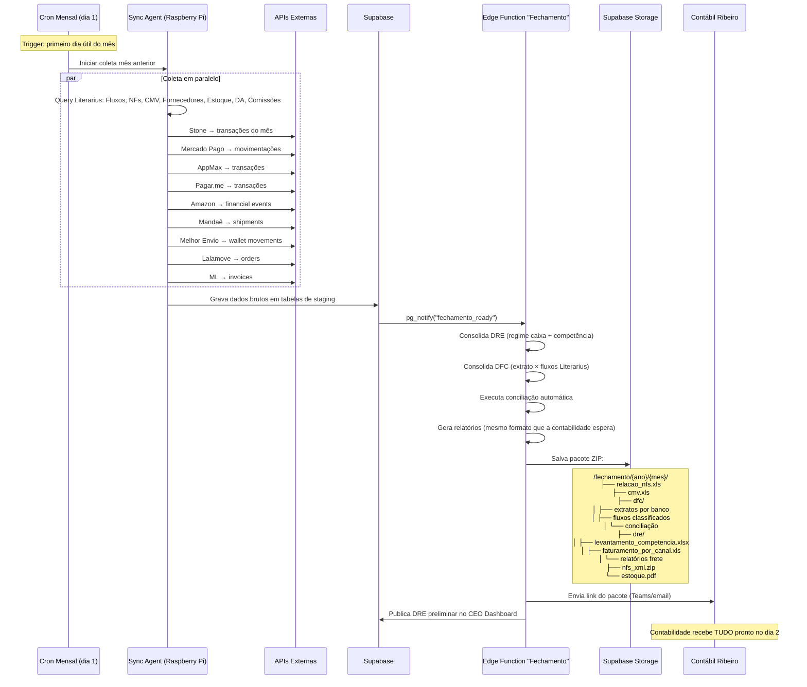

# Fechamento Mensal — Automação Completa

> Mapeamento detalhado do processo de fechamento mensal atual (manual, ~30 dias) e especificação de como o HeziomOS automatiza cada etapa.
> Fonte real: `OneDrive > Heziom > Financeiro Editora Heziom > 2026 > Contabilidade > Fechamento Compartilhado`

---

## Estrutura Atual da Pasta de Fechamento

Cada mês tem uma pasta (`1-JANEIRO` a `12-DEZEMBRO`) com estrutura padrão:

```
{MÊS}/
├── Relação de notas fiscais por número.xls    ← Literarius
├── CMV.xls                                     ← Literarius (calculado manualmente)
├── NFs Emitidas_PDF.zip                        ← Literarius
├── NFs Emitidas_XML.zip                        ← Literarius
├── NFes emitidas_ENTRADA_XML.zip               ← Literarius (NFs recebidas)
├── NFs Amazon.zip / FULL.zip                   ← Portal Amazon Seller Central
├── NFs TARIFAS mercado livre.zip               ← Portal Mercado Livre
├── Recolher_*.pdf                              ← Guias de recolhimento (impostos)
├── Estoque / Saldo estoque.pdf                 ← Literarius
├── DFC/                                        ← Demonstrativo de Fluxo de Caixa
│   ├── Extrato Santander.xlsx                  ← Internet Banking (download manual)
│   ├── Extrato Stone.xlsx                      ← Portal Stone
│   ├── Extrato Mercado Pago.xlsx               ← Portal MP
│   ├── Amazon.csv                              ← Portal Amazon
│   ├── Extrato AppMax.csv                      ← Portal AppMax (Tray gateway)
│   ├── PagarMe.xlsx                            ← Portal Pagar.me
│   ├── CC 6277.pdf / CC 7369.pdf / CC 9094.pdf ← Faturas cartões corporativos
│   ├── Extrato Investimento Santander.pdf      ← Solicitado por e-mail ao banco
│   ├── Fluxo Santander.xls                     ← EXPORTADO DO LITERARIUS (classificado)
│   ├── Fluxo Stone.xls                         ← EXPORTADO DO LITERARIUS (classificado)
│   ├── Fluxo CC *.xlsx                         ← EXPORTADO DO LITERARIUS (classificado)
│   ├── Fornecedores pagos {mês} (*.xls)        ← Literarius (filtro mês corrente)
│   ├── Fornecedores a pagar {mês+1}-dez (*.xls) ← Literarius (projeção)
│   ├── Conciliação_Stone_*.xlsx                ← Feita manualmente (Fluxo Lit × Extrato)
│   └── posição de estoque.pdf                  ← Literarius
└── DRE/                                        ← Dados para DRE por competência
    ├── Levantamento por competencia.xlsx        ← PLANILHA MESTRE (dados consolidados)
    ├── Faturamento por canal.xls               ← Literarius (NFs por canal)
    ├── CC *.pdf                                ← Faturas CC para rateio
    ├── APPMAX.xlsx / relatorio-recebimentos.xlsx ← Dados do gateway
    ├── Apuração moda {mês}.xls                 ← Literarius (moda = canal específico?)
    ├── Logmanager / Mandae / Melhor Envio / Transpo / Lalamove ← Relatórios de frete
    └── Vendas ML.zip / ml full.xls             ← Relatórios Mercado Livre
```

---

## Análise Documento por Documento

### 📁 RAIZ DO MÊS

| Documento | Fonte atual | Tratamento manual | Automação HeziomOS |
|---|---|---|---|
| **Relação de NFs por número.xls** | Literarius → Relatórios → NFs emitidas/período | Export manual, filtro por mês | `SELECT NotaFiscal WHERE Emissao BETWEEN ...` → gera XLS via Edge Function |
| **CMV.xls** | Literarius (TituloFinanceiroBaixaRateio com PlanoConta 20,21) | Filtrar pagamentos de produção e revenda do mês | Query automática: `PlanoConta IN (20,21)` por período → auto-gera |
| **NFs Emitidas PDF/XML** | Literarius → módulo fiscal → download em lote | Download manual lote, compactar ZIP | Literarius SQL + API gera ZIP (ou HeziomOS armazena em Supabase Storage) |
| **NFs ENTRADA XML** | Literarius/Qive → NFs recebidas (ENTRADA) | Download manual | Qive API (hoje) → módulo Fiscal próprio (Fase 3) |
| **NFs Amazon / ML** | Portal Amazon Seller Central / Portal ML | Login manual, download por período, ZIP | API Amazon SP-API `GET /reports` + ML API `GET /invoices` |
| **Recolher_*.pdf** | Sistemas de emissão de guias (RJ Sistemas, Serasa) | Download manual | Manter manual (guias governamentais — baixa frequência) |
| **Estoque/Saldo.pdf** | Literarius → Relatório posição de estoque | Export manual | View SQL `vw_heziom_estoque` já existe → snapshot mensal automático |
| **[Download ZIP] - N arquivos** | Literarius → download batch de documentos | Seleção manual + download | Automatizar via Literarius File API (se existir) ou manter manual |

---

### 📁 DFC (Demonstrativo de Fluxo de Caixa)

| Documento | Fonte | Formato | Schema detectado | Automação HeziomOS |
|---|---|---|---|---|
| **Extrato Santander.xlsx** | Internet Banking Santander | XLSX: Data, Histórico, Documento, Valor, Saldo | 5 colunas, ~290 linhas/mês | **Fase 1:** Upload OFX → parser automático. **Fase 2:** Open Banking API |
| **Extrato Stone.xlsx** | Portal Stone | XLSX: Movimentação, Tipo, Valor, Saldo antes/depois, Tarifa, Data, Nosso Número, Situação, Destino, Documento... | 19 colunas, ~1.800 linhas/mês | **Stone API** `GET /transactions` (paginado) → auto-import diário |
| **Extrato Mercado Pago.xlsx** | Portal MP | XLSX (padrão MP) | Variável | **API Mercado Pago** `GET /account/movements` → auto-import |
| **Amazon.csv** | Portal Amazon | CSV padrão settlements | Variável | **Amazon SP-API** `GET /finances/v0/financialEvents` → auto-import |
| **Extrato AppMax.csv** | Portal AppMax (via Tray) | CSV: company_name, data, tipo, balance, order_id, categoria, valor, taxas... | 30 colunas, ~2.000 linhas/mês | **AppMax API** ou **Tray Payments API** → auto-import |
| **PagarMe.xlsx** | Portal Pagar.me | XLSX padrão Pagar.me | Variável | **Pagar.me API v5** `GET /transactions` → auto-import |
| **CC 6277/7369/9094.pdf** | Internet Banking → faturas CC | PDF (fatura do cartão corporativo) | 3 cartões, valores e vencimentos | **Fase 1:** Upload manual (PDF). **Fase 2:** Open Banking API |
| **Extrato Investimento.pdf** | Santander (solicitado por e-mail) | PDF | Baixa frequência | Manter manual (mensal, 1 arquivo) |
| **Fluxo Santander.xls** | **LITERARIUS** (export de ContaBancariaLancamento) | XLS: Tipo, Número, Data, Documento, Descrição, Valor, Forma Pagto, Origem, **Plano de Contas**, **Centro Resultados** | 10 colunas, ~360 linhas/mês, JÁ CLASSIFICADO | Query `ContaBancariaLancamento` com JOINs → **100% automatizável** |
| **Fluxo Stone.xls** | **LITERARIUS** (idem, filtro por conta Stone) | Mesmo schema | Idem | Query com filtro `ContaBancaria = Stone` → automático |
| **Fluxo CC *.xlsx** | **LITERARIUS** (filtro por conta cartão) | Mesmo schema | Idem | Query com filtro por cada CC → automático |
| **Fornecedores pagos {mês}.xls** | Literarius → TituloFinanceiro (Pago=1, TipoTitulo='P', mês) | Export manual, filtro por categoria (CMV Produção vs. Revenda) | Query: `TituloFinanceiro WHERE Pago=1 AND PlanoConta IN (20,21) AND DataBaixa BETWEEN ...` |
| **Fornecedores a pagar {mês+1}-dez.xls** | Literarius → TituloFinanceiro (Pago=0, TipoTitulo='P', vencimento futuro) | Export manual | Query: `TituloFinanceiro WHERE Pago=0 AND TipoTitulo='P' AND Vencimento > ...` |
| **Conciliação Stone** | Cruzamento manual: Fluxo Literarius × Extrato Stone | Planilha com 3 colunas: Data, Fluxo Lit, Stone, Conciliação | Diferença geralmente = R$0,00 (exato) | **Módulo Conciliação Bancária** faz isso automaticamente com score ≥80 |
| **Posição de estoque.pdf** | Literarius → relatório estoque | PDF snapshot | — | View SQL + snapshot automático |

---

### 📁 DRE (Demonstração de Resultado)

| Documento | Fonte | Schema | Tratamento | Automação |
|---|---|---|---|---|
| **Levantamento por competencia.xlsx** | **PLANILHA MESTRE** — consolidação de múltiplas fontes | Sheets: DADOS PARA DRE (81 rows × 15 cols), STONE, SANTANDER, FAT, LALAMOVE, LOG MANAGER, MANDAE, MELHOR ENVIO, MODICO, TRANSPO, APPMAX | **Este é o trabalho mais pesado**: consolida direitos autorais, comissões, bônus, dias trabalhados livraria + todos os dados de frete + faturamento | **100% automatizável** — cada sheet vem de uma fonte específica (ver abaixo) |
| **Faturamento por canal.xls** | Literarius → NotaFiscal por `CanalVenda` | Número, Série, Tipo, Parceiro, Nome, Emissão, Total, FormaPagto, OpFiscal, Frete, ModeloFiscal, CanalVenda | Export filtrado por canal (Livraria, Showroom, D2C, Atacado) | Query `NotaFiscal` com GROUP BY CanalVenda → automático |
| **CC faturas.pdf** | Internet Banking | PDF para rateio no DRE | Manual (classificar gastos do cartão por centro de resultado) | Manter manual até integração de faturas digitais |
| **APPMAX.xlsx** | Portal AppMax | Igual ao extrato DFC mas separado para DRE | Receita líquida por período | Mesmo import do DFC, view diferente para DRE |
| **Apuração moda.xls** | Literarius (canal específico "moda"?) | Não confirmado | A investigar | Provavelmente filtro de CanalVenda ou parceiro específico |
| **Relatórios de Frete:** | | | | |
| — Logmanager | Portal LogManager | Data + Valor (6 linhas = semanal) | Soma mensal | API ou import CSV → automático |
| — Mandaê | Portal/API Mandaê | 28 colunas: id, NF, chave_nfe, cidade, UF, serviço, peso, valor frete, prazo | ~77 envios/mês, soma `preco_frete` | **Mandaê API** `GET /shipments` → import + soma automática |
| — Melhor Envio | Portal Melhor Envio | 7 colunas: Protocolo, Data, Descrição, Status, Tipo, Valor, Pagamento | ~547 transações/mês (pós-pago) | **Melhor Envio API** `GET /wallet/movements` → import + soma |
| — Módico | Correios/Módico | 3 colunas: descrição, qtde, total | ~80 envios/mês | Import CSV → soma |
| — Transpo | Transportadora Transpo | 23 colunas: CTe, emissão, remetente, destinatário, NF, peso, valor frete | ~12 envios/mês | Import CSV ou integração com CT-e recebido |
| — Lalamove | Portal Lalamove | 26 colunas: Order ID, status, valor, endereços, distância | ~15 entregas/mês | **Lalamove API** `GET /v3/orders` → import |
| **Vendas ML** | Portal Mercado Livre | Relatório de faturamento + tarifas | Volume significativo | **ML API** `GET /invoices` → import |

---

## Planilha Mestre: "Levantamento por competência" — Detalhamento

Esta é a peça central do fechamento. Contém múltiplas sheets que alimentam o DRE:

### Sheet: DADOS PARA DRE

| Seção | Dados | Fonte real | Automação |
|---|---|---|---|
| **DIREITOS AUTORAIS** | ~13 autores × valor mensal (ex: Arival R$52k jan, R$36k abr) | Literarius → ComissaoParametro? ou planilha editorial manual | Módulo Editorial → cálculo automático de DA por vendas |
| **COMISSÕES** | Lucas, Bruno × valor mensal | Literarius → TituloFinanceiro rateio PlanoConta 206 | Módulo Pessoas → cálculo automático por meta CPC |
| **BÔNUS POR RESULTADO** | Lucas, Bruno, Ivanise, Hevelyn × valor | Decisão da diretoria | Semi-automático (aprovação humana, título gerado pelo sistema) |
| **DIAS TRABALHADOS LIVRARIA** | Provavelmente para rateio de folha | Controle de ponto? | Import de ponto eletrônico → cálculo proporcional |

### Demais Sheets (por gateway/transportadora)

| Sheet | Volume/mês | Dados-chave | Fonte API |
|---|---|---|---|
| STONE | ~1.800 transações | PIX, cartão, transferências inter-contas | Stone API |
| SANTANDER | ~290 lançamentos | Extrato completo | OFX → Open Banking |
| FAT (Faturamento) | ~3.176 NFs (abril) | Todas NFs emitidas com canal de venda | Literarius SQL |
| LALAMOVE | ~15 entregas | Valor total ~R$560/mês | Lalamove API |
| LOG MANAGER | ~4 lançamentos | ~R$680/mês | Import CSV |
| MANDAÊ | ~77 envios | Detalhado com rastreio e NF | Mandaê API |
| MELHOR ENVIO | ~547 transações | Envios pós-pago | Melhor Envio API |
| MÓDICO | ~80 envios | Correios/registrado | Import CSV |
| TRANSPO | ~12 fretes | CT-e de transportadora | Import XML CT-e |
| APPMAX | ~2.000 transações | Gateway D2C (via Tray) | AppMax/Tray API |

---

## Integrações Necessárias para Automação Total

### Prioridade 1 — Já resolvidas (dados no Literarius)

| Integração | Método | O que resolve |
|---|---|---|
| Fluxos bancários classificados | SQL `ContaBancariaLancamento` + JOINs PlanoConta + CentroResultado | 100% dos "Fluxo *.xls" |
| NFs emitidas | SQL `NotaFiscal` + `PedidoVenda` | Relação de NFs, faturamento por canal |
| CMV | SQL `TituloFinanceiroBaixaRateio` com PlanoConta 20,21 | CMV.xls automático |
| Fornecedores pagos/a pagar | SQL `TituloFinanceiro` filtrado | Ambos os relatórios |
| Estoque | SQL (view existente) | Posição de estoque |
| Comissões | SQL `TituloFinanceiroBaixaRateio` PlanoConta 206 | Sheet COMISSÕES |
| Direitos autorais | SQL `TituloFinanceiroBaixaRateio` PlanoConta 32 + filtro parceiro | Sheet DIREITOS AUTORAIS |

### Prioridade 2 — APIs externas (automação diária)

| Integração | API | Endpoint | Autenticação | Volume |
|---|---|---|---|---|
| **Stone** | Stone API | `GET /transactions` | OAuth2 | ~1.800/mês |
| **Mercado Pago** | MP API | `GET /v1/account/movements` | Access Token | Variável |
| **AppMax** | AppMax/Tray | Via Tray Payments ou AppMax direto | OAuth (já mapeado Tray) | ~2.000/mês |
| **Pagar.me** | Pagar.me v5 | `GET /transactions` + `GET /balance` | API Key | Variável |
| **Amazon** | SP-API | `GET /finances/v0/financialEvents` | IAM + OAuth | Variável |
| **Mandaê** | Mandaê API | `GET /shipments` | API Key | ~77/mês |
| **Melhor Envio** | ME API | `GET /api/v2/me/shipment/tracking` + wallet | OAuth2 | ~547/mês |
| **Lalamove** | Lalamove API v3 | `GET /v3/orders` | API Key + Secret | ~15/mês |
| **Mercado Livre** | ML API | `GET /invoices` + relatórios | OAuth2 | Variável |

### Prioridade 3 — Upload manual (sem API viável)

| Item | Razão | Frequência |
|---|---|---|
| Extrato investimento Santander | Só via e-mail ao banco | 1×/mês |
| Faturas CC (PDF) | Sem API de fatura corporativa | 3×/mês |
| Guias de recolhimento | Governo (sem API) | 2-3×/mês |
| LogManager | Sem API conhecida | 1×/mês (4 lançamentos) |
| Módico/Correios | Sem API bulk | 1×/mês |
| Transpo (CT-e) | Pode ser resolvido via CT-e XML recebido | Investigar |

---

## Fluxo Automatizado — HeziomOS



---

## Resultado Esperado

| Métrica | Hoje | HeziomOS |
|---|---|---|
| Tempo para pacote completo | 3-5 dias (Ana manual) | **Dia 1-2** (automático) |
| Tempo para DRE preliminar | 30+ dias (espera contabilidade) | **Dia 1** (auto-calculado) |
| Downloads manuais de portais | 8+ portais × login × filtro × download | **0** (APIs puxam tudo) |
| Planilhas de conciliação | Manual (3h+) | **Automático** (score ≥80) |
| Classificação contábil | Depende do Literarius (já ok) | **Já classificado** (PlanoConta + CentroResultado via Literarius) |
| Erros de consolidação | Frequentes (copy-paste entre planilhas) | **Zero** (fonte única) |
| Itens que permanecem manuais | — | 5-6 uploads/mês (investimento, CC PDF, guias) |

---

## Dependências para Implementação

1. **APIs já mapeadas** (prontas): Literarius SQL, Tray/AppMax
2. **APIs a contratar/ativar**: Stone, Mercado Pago, Amazon SP-API, Pagar.me, Mandaê, Melhor Envio, Lalamove, ML
3. **Credenciais necessárias**: OAuth/API Key para cada serviço acima
4. **Formato de saída**: Manter XLSX/XLS (mesma estrutura que a Contábil Ribeiro espera) — facilita transição
5. **Validação**: Paralelo 2-3 meses (gerar automático + conferir com processo manual)

---

## Schemas Reais Confirmados (via análise dos arquivos)

### CMV.xls — Literarius export
| Coluna | Exemplo |
|---|---|
| POS (ranking) | 1º, 2º... |
| ISBN | 9786552650726 |
| Descrição | DEVOCIONAL MAES DA ALIANCA 2026 |
| Produto (código) | 4648 |
| Total Bruto | 200.352,96 |
| Total Líquido | 180.520,12 |
| Qtde vendida | 1548 |
| Custo unitário | 22,45 |
| Custo Total | 34.752,60 |
| Margem | 80,74% |
| Desc. Médio (%) | 9,89% |
| Vlr. Líquido Médio | 119,98 |
| Editora Nome | HEZIOM / HAGNOS / etc. |
| Capa Atual (preço) | 149,90 |

**Obs abril:** nome muda para "CMV - BRINDES -EBOOKS.xls" com sheets separadas: `CMV - EBOOKS` (639 rows) + `BRINDE` (5 rows). Inconsistência de nomenclatura entre meses.

### Relação de NFs por número.xls — Literarius export
| Coluna | Tipo |
|---|---|
| Número | NF |
| Série | Série fiscal |
| Tipo | "Venda do PDV", "Venda", etc. |
| Parceiro | Código |
| Nome | Nome do parceiro |
| Emissão | Data/hora |
| Total Nota | Valor |
| Desc. Forma Pagto | Texto |
| Desc. Op. Fiscal | "VENDA DE MERCADORIA" |
| Valor Frete | R$ |
| Modelo Fiscal | 55=NFe, 65=NFCe |
| NFe Motivo Ocorrência | Autorizado / Cancelado |
| Canal Venda | LIVRARIA, SHOWROOM, D2C, etc. |
| Pedido Cliente | UUID do Literarius |

**Volume:** ~4.253 NFs/mês (janeiro).

### Controle de contas a pagar.xls — Literarius export
| Coluna | Tipo |
|---|---|
| Tipo | PAGAR |
| Título | Número interno |
| Vencimento | Data |
| Emissão | Data |
| Parcela | "1/1", "2/12" |
| Nome | Fornecedor |
| Valor Título | R$ |
| Data Baixa | Data pagamento |
| Data Banco | Data efetiva banco |
| Forma Pagto | Código |
| Descrição Forma | BOLETO, PIX, CARTÃO |
| Conta | Código |
| Conta Bancaria | "Santander" |
| Boleto | Número |
| Nota Fiscal | Número NF vinculada |

**Volume:** ~863 títulos/mês.

### Fornecedores pagos — Literarius export (completo, 31 colunas)
Inclui: Título, Tipo, Número, Parceiro, Nome, CNPJ, Emissão, Vencimento, FormaPagto, ContaBancaria, Valor, Valor Pago, Juros/Multa, Desconto, Acrescimo, Abatimento, Taxas, Valor Restante, Pago, Data Pagamento, Data Banco, Boleto, Referência, Tipo Parcelamento, Parcela, Total Parcela, Modelo Documento, NF, Série, Observação.

**Filtro aplicado manualmente:** Separar PlanoConta 20 (Mercadorias para Revenda) vs. PlanoConta 21 (Produção Material Próprio).

### Fluxo Santander.xls — Literarius export (CLASSIFICADO)
| Coluna | Exemplo |
|---|---|
| Tipo | C (crédito) / D (débito) |
| Número | 4275 |
| Data | 01/04/2026 |
| Documento | 4275 |
| Descrição | "TED RECEBIDA", "CONTABIL RIBEIRO" |
| Valor | 943.44 / -4826.00 |
| Forma Pagto | (vazio ou código) |
| Origem | BANCÁRIO / BAIXA |
| **Plano de Contas** | "2 - VENDA DE LIVROS", "107 - Despesas Bancárias" |
| **Centro Resultados** | "13 - Receita de vendas", "2 - Financeiro", "5 - Expedição" |

**Obs:** "Origem = BANCÁRIO" são lançamentos diretos no banco (tarifas, PIX). "Origem = BAIXA" são pagamentos de títulos do Literarius. **Já vem classificado com PlanoConta e CentroResultado!**

### Conciliação (sheet no Fluxo Santander)
| Coluna | Descrição |
|---|---|
| Data | Serial Excel |
| Fluxo Lit | Saldo diário Literarius |
| Santander | Saldo diário extrato |
| Conciliação | Diferença (geralmente R$0,00) |

**Insight:** A conciliação atual já bate perfeitamente na maioria dos dias. O HeziomOS só precisa formalizar e alertar quando ≠ 0.

### Levantamento por competência — Planilha mestre (DADOS PARA DRE)
| Seção | Colunas | Dados |
|---|---|---|
| DIREITOS AUTORAIS | 13 autores × 12 meses + email | Valores mensais por autor |
| COMISSÕES | 2 vendedores × 12 meses | Lucas + Bruno |
| BÔNUS POR RESULTADO | 4 pessoas × 12 meses | Variável por decisão diretoria |
| DIAS TRABALHADOS LIVRARIA | ? | Para rateio de folha |

**Demais sheets = extratos brutos de cada fonte** (Stone, Santander, FAT, Lalamove, LogManager, Mandaê, Melhor Envio, Módico, Transpo, AppMax).

---

## ⚠️ Gaps e Informações Pendentes — Questionário para o Financeiro

### Perguntas sobre o PROCESSO

| # | Pergunta | Por quê precisamos saber |
|---|---|---|
| 1 | **Qual o passo a passo exato que a Ana faz para gerar o CMV.xls?** Ela roda um relatório no Literarius com quais filtros? Qual menu/tela? | Para replicar a query SQL exata |
| 2 | **O CMV muda de formato entre meses** (ex: Jan = "CMV.xls", Abr = "CMV - BRINDES - EBOOKS.xls"). Qual é o padrão correto? Brindes e ebooks devem ser separados sempre? | Para definir se geramos 1 ou 2 relatórios |
| 3 | **Como são calculados os Direitos Autorais na planilha "Levantamento por competência"?** É um % sobre vendas líquidas do mês? Se sim, qual % por autor? Onde está a tabela de contratos? | Para automatizar cálculo de DA |
| 4 | **As comissões (Lucas, Bruno) são calculadas sobre que base?** Vendas totais? Vendas por canal? Qual fórmula exata? | Para módulo Pessoas calcular automaticamente |
| 5 | **O "Bônus por resultado" — qual critério define quem recebe e quanto?** É aprovado manualmente pela diretoria todo mês? | Para saber se é automatizável ou fica como aprovação manual |
| 6 | **"Dias trabalhados livraria" — de onde vem esse dado?** Planilha de ponto? Controle manual? Quem preenche? | Para definir fonte de importação |
| 7 | **Os "Download ZIP - N arquivos" em Janeiro — o que são exatamente?** São backups? Duplicatas? Ou tipos diferentes de NF? | Para saber se precisa replicar |
| 8 | **A pasta "Autorizadas" (Fev) contém XMLs de NF-e — o que são?** NF-e autorizadas manualmente? Complementares? | Para categorizar corretamente |
| 9 | **"Apuração moda" (DRE março/abril) — o que é "moda"?** É um canal de venda? Uma categoria de produto? Um parceiro? | Para mapear a fonte correta |
| 10 | **O faturamento (fat.xls / FATURAMENTO.xls) — é o mesmo que "Relação de NFs" ou tem filtro diferente?** | Para evitar duplicidade |

### Perguntas sobre FONTES e CREDENCIAIS

| # | Pergunta | Impacto |
|---|---|---|
| 11 | **Stone — já têm API ativa? Qual integrador/conta?** | Automatizar ~1.800 transações/mês |
| 12 | **Mercado Pago — credenciais de API (access token) disponíveis?** | Automatizar import de movimentações |
| 13 | **Amazon — têm acesso ao SP-API (Seller Central > Developer)?** | Automatizar financial events + NFs |
| 14 | **Pagar.me — API key disponível? Versão da API (v4 ou v5)?** | Automatizar import |
| 15 | **Mandaê — credenciais de API ou só portal web?** | ~77 envios/mês |
| 16 | **Melhor Envio — têm app OAuth cadastrado? Usam sandbox?** | ~547 transações/mês |
| 17 | **Lalamove — credenciais de API (key + secret)?** | ~15 entregas/mês |
| 18 | **ML (Mercado Livre) — usam a API ML ou só baixam do portal?** | Import automático de relatórios |
| 19 | **AppMax — é gateway via Tray ou conta separada? Qual endpoint?** | Definir se puxa via Tray API ou AppMax direto |
| 20 | **LogManager — tem API? Ou é só planilha que alguém manda?** | Se não tem API, fica como upload manual |

### Perguntas sobre REGRAS DE NEGÓCIO

| # | Pergunta | Impacto |
|---|---|---|
| 21 | **A conciliação Literarius × Santander — sempre bate?** Quando NÃO bate, qual o procedimento? | Para definir regras de alerta |
| 22 | **Fornecedores "a pagar" — o filtro é por PlanoConta (20=Revenda, 21=Produção)?** Ou tem outro critério? | Para query correta |
| 23 | **O "Fluxo" de cada conta (Santander, Stone, CC) é exportado de qual tela do Literarius?** Menu > ? > Filtros? | Para replicar exatamente |
| 24 | **CentroResultado — quem classifica?** É automático no lançamento ou reclassificado depois? | Para saber se o dado já vem correto |
| 25 | **A contabilidade (Contábil Ribeiro) exige EXATAMENTE esses formatos XLS ou aceita qualquer formato?** | Para saber se podemos mudar para formatos melhores |
| 26 | **Há documentos físicos que a contabilidade AINDA exige em papel?** Quais? | Para saber o que não pode ser 100% digital |
| 27 | **O "Recolher" (guias) — quem gera? É o escritório de contabilidade ou a Heziom?** | Se é a Heziom, precisa de lembrete/automação |
| 28 | **Taxa AppMax — o relatório de março está separado. É sempre necessário separar taxas?** | Para definir se é dados diferentes ou mesma fonte |
| 29 | **CT-e (Conhecimento de Transporte) — precisam dos XMLs recebidos para a contabilidade?** São da Transpo + quais transportadoras? | Para decidir se integra Qive/módulo fiscal |
| 30 | **O que muda entre meses que faz a estrutura da pasta não ser uniforme?** (Ex: Jan tem "[Download ZIP]", Fev tem "Autorizadas", Mar tem "Documentos Fiscais ML", Abr tem "NFS MERCADO LIVRE") | Para padronizar o processo |

---

## Módulos Relacionados

- [[DRE e Fluxo de Caixa]] — cálculo automático
- [[Conciliação Bancária]] — match automático extrato × Literarius
- [[Comissões e Repasses]] — cálculo CPC + DA
- [[Gestão de Estoque e CMV]] — snapshot mensal
- [[Alertas e Notificações]] — aviso à contabilidade quando pacote está pronto
- [[HeziomOS — Interligação Completa entre Módulos]] — Fluxo 4 (fechamento)

---

*Documentado em 2026-05-19 — base para automação do fechamento mensal na Fase 1*
*Atualizado com schemas reais + questionário para financeiro*
