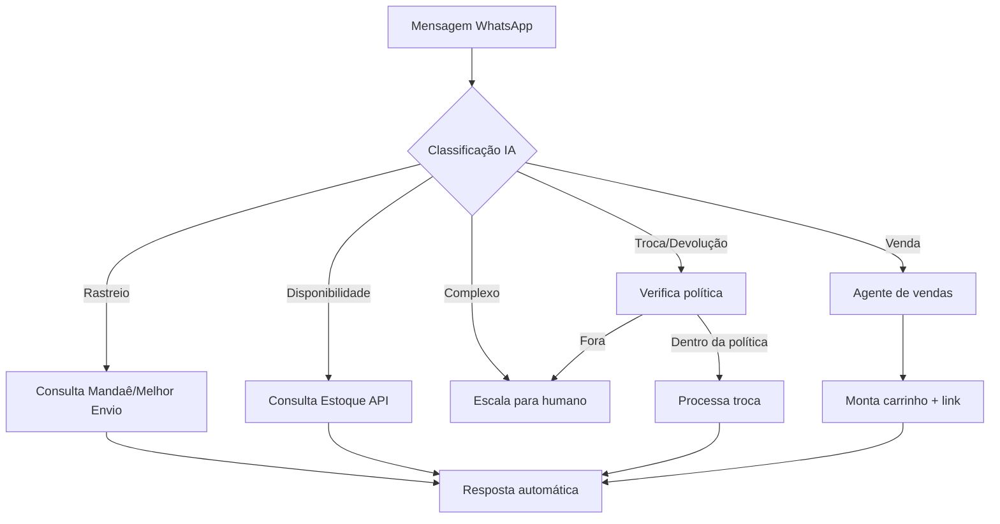

# Atendimento — Índice do Módulo

> ✅ **ATUALIZADO 2026-07-01:** este módulo NÃO é mais "planejado" — está **em produção**. Painel de conversas (Épico 16), agente de IA com RAG + tool-use e agente de vendas Tray (Épico 17), escalação IA→humano e atendimento como módulo próprio no header (Épico 9) estão todos no ar. A Unnichat está em processo de desligamento (cutover do número principal — Story 6.34). Fonte de verdade: `docs/stories/BACKLOG.md` e [[Estado Atual — Espelho dos Épicos]].

> _(Texto original, mantido como registro da visão inicial:)_ Módulo que substitui a Unnichat e viabiliza atendimento 24/7 via agentes autônomos no WhatsApp, com escalação inteligente para humanos.
> Referência: [[Mapeamento Completo da Operação Heziom]] §9

---

## Equipe

- 2 internos focados no atendimento online
- Horário atual: segunda a sexta, 08h–18h
- Meta: 24/7 via agentes IA

---

## Principais Chamados

1. Compra via WhatsApp (→ redireciona para Comercial ou resolve direto)
2. Problema no pedido (rastreio, atraso, divergência)
3. Consulta sobre envio (prazo, frete)
4. Trocas e devoluções

---

## Submódulos

| Submódulo | Status | Nota |
|---|---|---|
| Agente de Atendimento (IA) | ✅ Em produção | Épico 17 — orquestrador com RAG (`crm-ai-orchestrator`), especialistas (`crm-specialist-runner`), catálogo Tray |
| Agente de vendas | ✅ Em produção | Épico 17 — RAG do catálogo Tray + conduz a compra |
| Painel de Conversas | ✅ Em produção | Épico 16 — fila, 1ª resposta, métricas (`crm-conversation-load`, `crm-atendimento-metrics`) |
| Escalação Inteligente | ✅ Em produção | `crm-ai-escalate` — IA→humano com regras/handoff |

---

## Fluxo de Resolução

---

## Integrações

- WhatsApp Business API (Meta Cloud API ou BSP — decisão pendente)
- Mandaê API: `GET /trackings/{code}` (rastreio)
- Melhor Envio API: rastreio alternativo
- Shipping Insights: hub consolidado
- Literarius REST: `GET /Estoque` (disponibilidade), `GET /PedidoVenda` (status)
- Tray: `GET /orders/:id/complete` (detalhes do pedido)
- CRM: `crm_contacts` (contexto do cliente)

---

## Métricas de Sucesso

| Métrica | Meta Fase 2 | Meta Fase 3 |
|---|---|---|
| % resolvido sem humano | 40% | 70% |
| Tempo médio de resposta | < 2 min | < 30 seg |
| Disponibilidade | 08–18h | 24/7 |
| NPS pós-atendimento | Baseline | > 4.5/5 |

---

*Módulo em produção (Épicos 6/9/16/17). Unnichat em desligamento (Story 6.34). Detalhe vivo no `docs/stories/BACKLOG.md`.*
