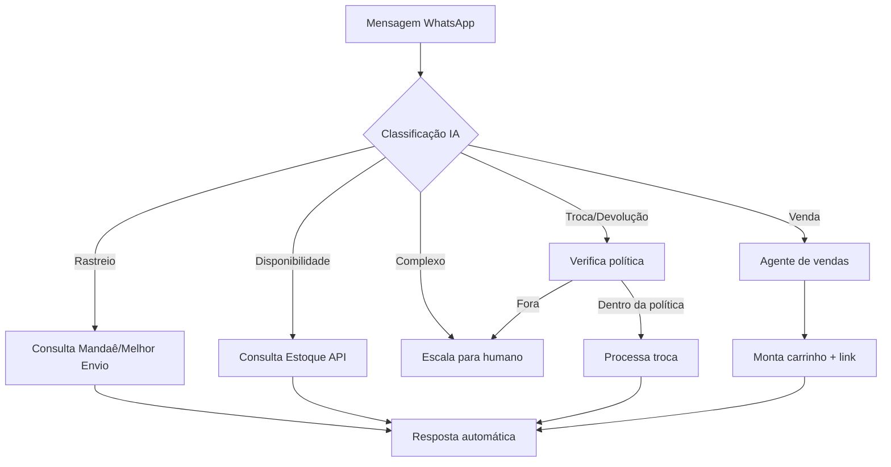

# Atendimento — Índice do Módulo

> Módulo que substitui a Unnichat e viabiliza atendimento 24/7 via agentes autônomos no WhatsApp, com escalação inteligente para humanos.
> Referência: [[Mapeamento Completo da Operação Heziom]] §9 e [[HeziomOS — Módulos e Escopo Completo]]

---

## Equipe

- 2 internos focados no atendimento online
- Horário atual: segunda a sexta, 08h–18h
- Meta: 24/7 via agentes IA

---

## Principais Chamados

1. Compra via WhatsApp (→ redireciona para Comercial ou resolve direto)
2. Problema no pedido (rastreio, atraso, divergência)
3. Consulta sobre envio (prazo, frete)
4. Trocas e devoluções

---

## Submódulos

| Submódulo | Status | Nota |
|---|---|---|
| [[Agente de Atendimento v1]] | ⬜ A criar | Rastreio, FAQ, disponibilidade — Fase 2 |
| [[Agente de Atendimento v2]] | ⬜ A criar | Trocas, vendas assistidas — Fase 3 |
| [[Painel de Conversas]] | ⬜ A criar | Histórico unificado, métricas |
| [[Escalação Inteligente]] | ⬜ A criar | Regras de quando escalar para humano/vendedor |

---

## Fluxo de Resolução

---

## Integrações

- WhatsApp Business API (Meta Cloud API ou BSP — decisão pendente)
- Mandaê API: `GET /trackings/{code}` (rastreio)
- Melhor Envio API: rastreio alternativo
- Shipping Insights: hub consolidado
- Literarius REST: `GET /Estoque` (disponibilidade), `GET /PedidoVenda` (status)
- Tray: `GET /orders/:id/complete` (detalhes do pedido)
- CRM: `crm_contacts` (contexto do cliente)

---

## Métricas de Sucesso

| Métrica | Meta Fase 2 | Meta Fase 3 |
|---|---|---|
| % resolvido sem humano | 40% | 70% |
| Tempo médio de resposta | < 2 min | < 30 seg |
| Disponibilidade | 08–18h | 24/7 |
| NPS pós-atendimento | Baseline | > 4.5/5 |

---

*Fase: 2.5 · Prioridade: Média (Unnichat funciona mas limita — sem IA, sem autonomia)*
