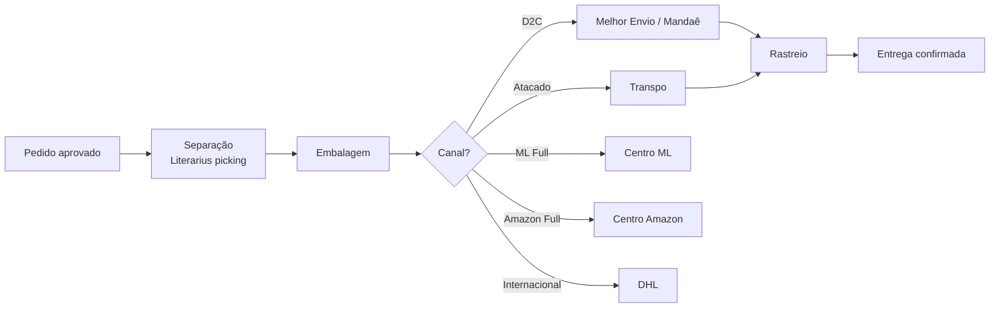

# Logística e Expedição — Índice do Módulo

> Parcialmente coberto pela Fase 1 (sync estoque). Módulo completo inclui painel logístico, integração com Shipping Insights, e gestão multi-ponto.
> Referência: [[Mapeamento Completo da Operação Heziom]] §7 e [[HeziomOS — Módulos e Escopo Completo]]

---

## Equipe

- 1 coordenador interno + 2 operadores
- Freelancers em picos de demanda

---

## Pontos de Estoque (Literarius)

| Setor | Função |
|---|---|
| Sede | Estoque principal |
| Livraria IPP | Varejo físico São Paulo |
| Livraria Embu | Varejo físico Embu |
| Showroom | Exposição e vendas esporádicas |
| Provisório fim de ano | Sazonal (novembro–janeiro) |

---

## Transportadoras

| Transportadora/Hub | Uso |
|---|---|
| Melhor Envio | Hub D2C |
| Mandaê | Hub D2C |
| Correios | Módico (institucional) |
| Transpo | Atacado |
| DHL | Internacional |

---

## Submódulos

| Submódulo | Status | Nota |
|---|---|---|
| [[Sync Estoque Literarius → Tray]] | ⬜ Fase 1 | Saldo disponível (−reservado) a cada 30min |
| [[Painel Logístico]] | ⬜ Fase 2 | Rastreio consolidado, SLA, alertas |
| [[Integração Shipping Insights]] | ⬜ Fase 2 | Hub proprietário que consolida transportadoras |
| [[Gestão Multi-Ponto]] | ⬜ Fase 2 | Visão por setor, transferências |
| [[Consignação]] | ⬜ Fase 2 | Contratos, aging, acertos |

---

## Fluxo de Expedição

---

## Integrações

- Literarius SQL: `Estoque`, `MovimentoEstoque`, `TransferenciaEstoque`
- Literarius REST: `TEstoqueController` (saldo em tempo real)
- Tray: `PUT /products/:id/stock` (atualização)
- Mandaê API: cotação + registro + rastreio
- Melhor Envio API: cotação + rastreio
- Shipping Insights: consolidação de todas as transportadoras

---

## Consignação

- Concedida e recebida
- ~R$ 2M em estoque fora da empresa (estimado)
- **Pendência:** volume exato e processo de baixa/acerto a confirmar

---

*Fase: 1 (estoque) + 2 (painel completo) · Prioridade: Alta (estoque é Fase 1)*
