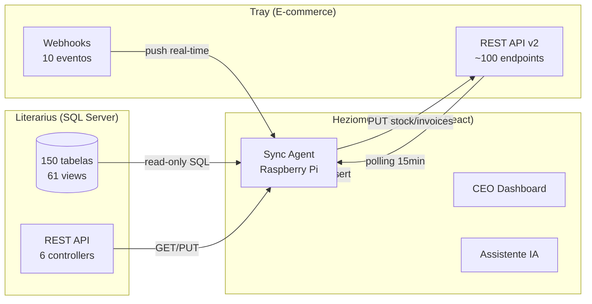

# HeziomOS — Mapa Completo de APIs e Capacidades

> Inventário consolidado de **tudo** que é possível fazer com os sistemas integrados ao HeziomOS.
> Duplo-check realizado em 19/05/2026.

---

## Visão Geral do Ecossistema



---

## LITERARIUS — Inventário Completo

### Acesso

| Parâmetro | Valor |
|---|---|
| Host | `192.168.18.10:1433` |
| Database | `Literarius` |
| Usuário | `acessoExterno` (read-only) |
| REST API | `http://200.187.66.71:1983/LiterariusAPI.dll/datasnap/rest` |
| Auth REST | HTTP Basic + Header `USER_LITERARIUS` |

### Números

| Métrica | Valor |
|---|---|
| Tabelas documentadas | **150** |
| Tabelas alta-prioridade | 45 |
| Views nativas | **61** |
| Views críticas para HeziomOS | 14 |
| Registros operacionais | ~880k+ |

---

### Domínios de Dados — Literarius

#### 1. FINANCEIRO (A/P, A/R, DRE, Fluxo de Caixa)

| Tabela/View | Registros | Propósito |
|---|---|---|
| **TituloFinanceiro** | 50.263 | Títulos a pagar e receber (master) |
| **TituloFinanceiroBaixa** | 30.616 | Baixas realizadas (pagamentos/recebimentos) |
| **TituloFinanceiroRateio** | 50.723 | Rateio por plano de conta e centro de resultado |
| **TituloFinanceiroBaixaRateio** | 30.849 | Rateio detalhado por baixa |
| **PlanoConta** | 115 | Plano de contas (⚠️ bug TipoCategoria='A' em todos) |
| **CentroResultado** | 13 | Centros de resultado para DRE segmentada |
| **ContaBancaria** | 11 | Contas: Santander, Stone, Vindi, PagMax, AppMax |
| **ContaBancariaLancamento** | 5.188 | Movimentos bancários internos |
| **ControleCaixa** | 502 | Caixa físico (PDV) — abertura/fechamento |

**O que permite:**
- DRE completo por centro de resultado
- Aging de A/R e A/P
- Fluxo de caixa realizado e projetado
- Conciliação bancária (flag `Conciliado`)
- Rateio de custos por departamento

---

#### 2. VENDAS E PEDIDOS

| Tabela/View | Registros | Propósito |
|---|---|---|
| **PedidoVenda** | 22.857 | Pedidos (47 colunas, inclui `SiteIdPedido` = chave Tray) |
| **PedidoVendaItens** | 43.041 | Itens dos pedidos |
| **PedidoVendaVencimento** | 37.842 | Parcelas por pedido |
| **PedidoVendaHistorico** | 193.097 | Audit log de status |
| **CanalVenda** | 13 | Canais: E-commerce, Amazon FBA, ML, Livraria, Consignação |
| **FormaPagto** | 13 | Formas: Boleto, Cartão, PIX, Mercado Pago |

**O que permite:**
- Faturamento por canal (13 canais distintos)
- Pipeline de pedidos (12 status: Digitando → Faturado → Cancelado)
- Conciliação Tray via `SiteIdPedido`
- Ticket médio por canal e forma de pagamento

---

#### 3. NOTAS FISCAIS

| Tabela/View | Registros | Propósito |
|---|---|---|
| **NotaFiscal** | 33.418 | NFs emitidas (**112 colunas** — dados fiscais completos) |
| **NotaFiscalItens** | 71.986 | Itens da NF (**126 colunas** — ICMS, IPI, PIS, COFINS por item) |
| **NotaFiscalVencimento** | 48.152 | Parcelas/vencimentos da NF |
| **NotaFiscalEventos** | 32.860 | Eventos SEFAZ (cancelamentos, cartas correção) |
| **Entrada** | 217 | NFs de compra (fornecedores) |
| **EntradaItens** | 5.527 | Itens de compra (base CMV) |

**O que permite:**
- Ciclo fiscal completo (emissão → autorização → cancelamento)
- Detalhamento tributário por item (CFOP, CST, alíquotas)
- Conciliação NF ↔ Pedido ↔ Título Financeiro
- Vinculação NF → Tray via `POST /invoices`

---

#### 4. ESTOQUE

| Tabela/View | Registros | Propósito |
|---|---|---|
| **Estoque** | 6.521 | Posição atual por setor/produto |
| **MovimentoEstoque** | 163.604 | Toda entrada/saída com timestamp |
| **Inventario** | 1.200 | Contagens físicas |
| **InventarioItens** | 9.176 | Diferenças contadas vs. sistema |
| **MontagemKit** | 104 | Kits compostos |
| **MontagemKitItens** | 320 | Composição dos kits (BOM) |
| **TransferenciaEstoque** | 84 | Transferências entre setores |

**O que permite:**
- Saldo em tempo real por setor
- Giro de estoque (163k movimentações)
- Cobertura em dias (saldo ÷ média de vendas)
- Ruptura histórica (quando zerou)
- Variação inventário × sistema
- Sync disponível → Tray (Fase 1.1)

---

#### 5. CATÁLOGO (Produtos e Autores)

| Tabela/View | Registros | Propósito |
|---|---|---|
| **Produto** | 5.073 | Catálogo completo (**69 colunas**: ISBN, EAN, dimensões, sinopse, imagens) |
| **ProdutoAutor** | 2.583 | Relação produto × autor × tipo participação |
| **ProdutoPreco** | 6.090 | Tabelas de preço por vigência |
| **TabelaBisac** | 4.588 | Classificação editorial BISAC |

**O que permite:**
- Catálogo editorial completo com metadados de livro
- Preço histórico por produto
- Classificação BISAC (gênero editorial)
- Sync catálogo → Tray (Fase 2.2)

---

#### 6. CONSIGNAÇÃO

| Tabela/View | Registros | Propósito |
|---|---|---|
| **Consignacao** | 50 | Contratos abertos (R$ 2,06M fora da empresa) |
| **ConsignacaoItens** | 3.360 | Itens consignados (qtde enviada/vendida/devolvida) |
| **ConsignacaoNotasDevolucao** | 5.860 | Histórico de devoluções |

**O que permite:**
- Acompanhamento de estoque em terceiros
- Taxa de devolução por cliente/canal
- Aging de consignação (vencimento do contrato)
- Margem real considerando devoluções

---

#### 7. DIREITOS AUTORAIS (Royalties)

| Tabela/View | Registros | Propósito |
|---|---|---|
| **DireitoAutoralFechamento** | 503 | Fechamentos por período |
| **DireitoAutoralFechamentoItens** | 14.039 | Detalhamento por título vendido |
| **DireitoAutoralParametro** | 90 | Regras de % por autor/canal |

**O que permite:**
- Custo autoral por livro vendido (componente CMV)
- Apuração de royalties por período
- Simulação de margem líquida (preço − custo gráfico − royalty − impostos)

---

#### 8. PARCEIROS (CRM)

| Tabela/View | Registros | Propósito |
|---|---|---|
| **Parceiro** | 47.000 | Clientes e fornecedores (**112 colunas**) |
| **TipoCliente** | 7 | Igrejas, Livrarias, Distribuidores, ONGs, PF, Funcionários, Empresas |

**O que permite:**
- Segmentação de clientes por tipo
- Análise geográfica (estado/cidade)
- Perfil tributário (contribuinte/isento)
- Limite de crédito e inadimplência

---

#### 9. REST API do Literarius (Write parcial + Financeiro)

| Endpoint | Método | O que faz |
|---|---|---|
| `/PedidoVenda/{id}` | GET | Consulta pedido |
| `/PedidoVendaStatus/{emp}/{num}/{status}` | GET | **Altera status** (write!) |
| `/PedidoVenda` | PUT | **Cria/atualiza pedido** (write!) |
| `/Parceiro/{id}` | GET | Consulta cliente/fornecedor |
| `/Produto/{codigo}` | GET | Produto com 88+ campos |
| `/ProdutoEAN/{ean}` | GET | Busca por código de barras |
| `/Estoque/{emp}/{setor}/{prod}/{box}` | GET | Saldo atual |
| `/NotaFiscal/{id}` | GET | NF com 112+ colunas |
| `/TTituloFinanceiroController/Receber/{id}` | GET | 🆕 **Títulos a receber** (A/R) |
| `/TTituloFinanceiroController/Pagar/{id}` | GET | 🆕 **Títulos a pagar** (A/P) |

> A REST API permite **criar pedidos, alterar status, e agora consultar títulos financeiros** — não é 100% read-only.
> 🆕 Controller financeiro liberado em 15/05/2026 pelo Elias (Literarius Sistemas). Ainda não testado em produção.

---

### 14 Views Críticas para o HeziomOS

| View | Colunas | O que resolve |
|---|---|---|
| `vwProdutoEstoque` | 85 | Produto + estoque + autores + preço (substitui 3 JOINs) |
| `vwTituloFinanceiro` | 51 | A/P e A/R com nomes |
| `vwTituloFinanceiroBaixasComRateio` | 62 | Baixas com rateio — base do DRE |
| `vwTituloFinanceiroComRateio` | 54 | Títulos com alocação por centro |
| `vwPedidoVenda` | 86 | Pedidos com cliente/canal/pagamento |
| `vwPedidoVendaItens` | 100 | Itens com produto detalhado |
| `vwNotaFiscal` | 99 | NF com dados fiscais e do parceiro |
| `vwNotaFiscalComItens` | 165 | NF + itens denormalizados |
| `vwMovimentoContaBancaria` | 15 | Movimentos bancários contextualizados |
| `vwLancamentoContaBancaria` | 24 | Lançamentos bancários internos |
| `vwConsignacaoComItens` | 64 | Consignações com tudo junto |
| `vwDireitoAutoralFechamento` | 68 | Royalties por autor/produto |
| `vwEntradaComItens` | 110 | Compras com fornecedor/produto |
| `vwProduto` | 88 | Catálogo enriquecido |

---

## TRAY — Inventário Completo

### Acesso

| Parâmetro | Valor |
|---|---|
| Base URL | `https://{api_host}/web_api/v2/` |
| Auth | OAuth 2.0 (consumer_key + consumer_secret + access_token) |
| Rate Limit | **180 req/min** · 10.000 req/dia (standard) · 50.000 req/dia (corporate) |
| Paginação | `limit` max 50 · `page` sequencial |
| Consumer Key | `<CONSUMER_KEY no .secret.md local do HeziomOS>` |
| Loja de teste | `1225878` (⚠️ usuário bloqueado — aguardando desbloqueio) |
| Homologação | Até **13/08/2026** |

### Números

| Métrica | Valor |
|---|---|
| Categorias de endpoint | **18** |
| Endpoints estimados | **~100** |
| Webhooks disponíveis | **10 eventos** |

---

### Endpoints por Categoria — Tray API v2

#### 1. AUTENTICAÇÃO (2 endpoints)

```
POST /auth                  → Troca code por access_token + refresh_token
GET  /auth?refresh_token=   → Renova token
```

#### 2. PEDIDOS (8 endpoints)

```
GET    /orders              → Listar (filtro: date, status, customer_id)
GET    /orders/:id          → Básico
GET    /orders/:id/complete → Completo (+ produtos + pagamentos + frete)
POST   /orders              → Criar pedido
PUT    /orders/:id          → Atualizar (status, notas)
PUT    /orders/:id/cancel   → Cancelar
POST   /orders/:id/products → Adicionar produto ao pedido
DELETE /orders/:id/products/:prod_id → Remover produto
```

#### 3. PAGAMENTOS (7 endpoints)

```
GET    /payments            → Listar
GET    /payments/:id        → Detalhe
POST   /payments            → Registrar manualmente
PUT    /payments/:id        → Atualizar
DELETE /payments/:id        → Remover
GET    /payment-options     → Métodos disponíveis na loja
GET    /payment-settings    → Configuração de pagamento
```

**Campo exclusivo:** `price_seller` = valor líquido após taxa do gateway (não existe no Literarius)

#### 4. NOTAS FISCAIS (5 endpoints)

```
GET  /invoices              → Listar
GET  /invoices/:id          → Detalhe
GET  /invoices?order_id=    → Por pedido
POST /invoices              → Vincular NF ao pedido (NFeChave)
PUT  /invoices/:id          → Atualizar
```

#### 5. PRODUTOS (8 endpoints)

```
GET    /products            → Listar
GET    /products/:id        → Detalhe
POST   /products            → Criar (sync catálogo Literarius → Tray)
PUT    /products/:id        → Atualizar
DELETE /products/:id        → Remover
GET    /products/:id/images → Imagens
POST   /products/:id/images → Adicionar imagem
DELETE /products/:id/images/:img_id → Remover imagem
```

#### 6. VARIAÇÕES (4 endpoints)

```
GET    /products/:id/variations        → Listar
POST   /products/:id/variations        → Criar
PUT    /products/:id/variations/:var_id → Atualizar
DELETE /products/:id/variations/:var_id → Remover
```

#### 7. ESTOQUE (4 endpoints)

```
GET /products/:id/stock     → Saldo do produto
PUT /products/:id/stock     → Atualizar saldo (Literarius → Tray)
GET /stock/multicd          → Estoque multi-depósito
PUT /stock/multicd          → Atualizar multi-depósito
```

#### 8. CLIENTES (8 endpoints)

```
GET    /customers                        → Listar
GET    /customers/:id                    → Detalhe
POST   /customers                        → Criar
PUT    /customers/:id                    → Atualizar
GET    /customers/:id/addresses          → Endereços
POST   /customers/:id/addresses          → Adicionar endereço
PUT    /customers/:id/addresses/:addr_id → Atualizar
DELETE /customers/:id/addresses/:addr_id → Remover
```

#### 9. FRETE E LOGÍSTICA (7 endpoints)

```
GET    /shipping            → Listar métodos
POST   /shipping            → Configurar método
PUT    /shipping/:id        → Atualizar
DELETE /shipping/:id        → Remover
GET    /shipping/calculate  → Calcular frete
GET    /shipping/carriers   → Transportadoras disponíveis
GET    /shipments           → Rastreamento de envios
```

#### 10. CUPONS E PROMOÇÕES (5 endpoints)

```
GET    /coupons             → Listar
GET    /coupons/:id         → Detalhe
POST   /coupons             → Criar cupom
PUT    /coupons/:id         → Atualizar
DELETE /coupons/:id         → Remover
```

#### 11. CATEGORIAS (5 endpoints)

```
GET    /categories          → Listar (hierárquico via parent_id)
GET    /categories/:id      → Detalhe
POST   /categories          → Criar
PUT    /categories/:id      → Atualizar
DELETE /categories/:id      → Remover
```

#### 12. MARCAS (5 endpoints)

```
GET    /brands              → Listar
GET    /brands/:id          → Detalhe
POST   /brands              → Criar
PUT    /brands/:id          → Atualizar
DELETE /brands/:id          → Remover
```

#### 13. WEBHOOKS (4 endpoints + 10 eventos)

```
POST   /webhooks            → Registrar
GET    /webhooks            → Listar
GET    /webhooks/:id        → Detalhe
DELETE /webhooks/:id        → Remover
```

**Eventos disponíveis:**

| Evento | Trigger |
|---|---|
| `order.insert` | Novo pedido criado |
| `order.update` | Status alterado (pagamento, envio, etc.) |
| `order.delete` | Pedido cancelado/removido |
| `transaction.update` | Pagamento aprovado/recusado/estornado |
| `invoice.insert` | NF-e vinculada |
| `customer.insert` | Novo cliente |
| `customer.update` | Dados alterados |
| `product.insert` | Produto criado |
| `product.update` | Produto modificado |
| `product.delete` | Produto removido |

#### 14. CONFIGURAÇÕES DA LOJA (5 endpoints)

```
GET /store                  → Dados gerais da loja
GET /store/settings         → Configurações
GET /domains                → Domínios configurados
GET /currencies             → Moedas ativas
GET /status                 → Health check
```

#### 15. SCRIPTS (4 endpoints — provável)

```
GET    /scripts             → Listar scripts injetados
POST   /scripts             → Registrar (similar a GTM)
PUT    /scripts/:id         → Atualizar
DELETE /scripts/:id         → Remover
```

#### 16. CARRINHO ABANDONADO (2 endpoints — provável)

```
GET /abandoned-carts        → Listar transações incompletas
GET /abandoned-carts/:id    → Detalhe do carrinho
```

#### 17. WISHLISTS (3 endpoints — provável)

```
GET  /wishlists             → Listar
GET  /wishlists/:id         → Detalhe
POST /wishlists             → Criar
```

#### 18. RELATÓRIOS (4 endpoints — provável)

```
GET /reports                → Métricas agregadas
GET /reports/sales          → Resumo de vendas
GET /reports/products       → Performance de produtos
GET /dashboard              → KPIs do admin
```

> Endpoints marcados como "provável" são inferidos do padrão da plataforma. Confirmar com a documentação oficial após desbloqueio da loja.

---

### O que a Tray NÃO permite via API

| Limitação | Alternativa |
|---|---|
| Criar/editar temas | OpenCode CLI (programa parceiro separado) |
| Templates de e-mail transacional | Painel admin da loja |
| Publicar no marketplace | Ticket de homologação |
| Scripts no front-end | Painel admin → Scripts personalizados |

---

## CRUZAMENTO — Literarius × Tray

### Chaves de Conciliação

| Dado | Campo Literarius | Campo Tray | Tipo de Join |
|---|---|---|---|
| **Pedido** | `PedidoVenda.SiteIdPedido` | `order.id` | 🔴 Principal |
| **Produto** | `Produto.SiteID` | `product.id` | 🔴 Catálogo |
| **NF-e** | `NotaFiscal.NFeChave` | `invoice.access_key` | 🔴 Fiscal |
| **EAN** | `Produto.CodigoBarras` | `product.ean` | 🟡 Backup |
| **ISBN** | `Produto.CodigoIsbn` | `product.reference` | 🟡 Backup |

### Dados Exclusivos de Cada Sistema

| Dado | Só no Literarius | Só na Tray |
|---|---|---|
| Taxa exata do gateway | ❌ | ✅ `payment.price_seller` |
| Rateio por centro de resultado | ✅ `TituloFinanceiroRateio` | ❌ |
| Royalties autorais | ✅ `DireitoAutoralFechamento` | ❌ |
| Código de rastreio | ❌ | ✅ `order.sending_code` |
| Cupom utilizado | ❌ | ✅ `order.discount_coupon` |
| Consignação | ✅ `Consignacao` | ❌ |
| Detalhamento tributário (126 cols) | ✅ `NotaFiscalItens` | ❌ |
| CRM e-commerce (carrinho, wishlist) | ❌ | ✅ |
| Estoque físico real-time | ✅ `Estoque` | ❌ (recebe do sync) |
| Histórico de movimentação (163k) | ✅ `MovimentoEstoque` | ❌ |

---

## O QUE É POSSÍVEL CONSTRUIR — Mapa de Funcionalidades

### Já Documentado (Roadmap existente)

| # | Funcionalidade | Fonte | Status |
|---|---|---|---|
| 1.1 | Sync estoque Literarius → Tray | SQL + `PUT /products/:id/stock` | ⬜ Bloqueado (aguardando acesso) |
| 1.2 | Captura de pedidos Tray → conciliação | `GET /orders` + SQL | ⬜ Bloqueado |
| 1.3 | Receita líquida real (price_seller) | `GET /payments` | ⬜ Bloqueado |
| 1.4 | Vinculação NF-e ao pedido Tray | SQL + `POST /invoices` | ⬜ Bloqueado |
| 2.1 | Webhooks tempo real | `POST /webhooks` | ⬜ Fase 2 |
| 2.2 | Sync catálogo → Tray | SQL + `POST /products` | ⬜ Fase 2 |
| 2.3 | ROI de cupons/marketing | `GET /coupons` + SQL | ⬜ Fase 2 |
| 2.4 | Painel logística | `GET /orders` (rastreio) | ⬜ Fase 2 |

### Novas Oportunidades Identificadas no Duplo-Check

| # | Funcionalidade | Fonte | Impacto |
|---|---|---|---|
| A | **Carrinho abandonado → remarketing** | `GET /abandoned-carts` (Tray) | Recuperar vendas perdidas |
| B | **CRM unificado** (Literarius 47k + Tray) | `GET /customers` + `vwParceiro` | Segmentação completa multi-canal |
| C | **Criar pedidos no Literarius via API** | `PUT /PedidoVenda` (REST Literarius) | Automação de entrada de pedidos |
| D | **Alertar status do pedido** | `GET /PedidoVendaStatus` (REST) | Workflow de fulfillment |
| E | **Marcas/Selos** como filtro editorial | `POST /brands` (Tray) | Navegação "por editora/selo" na loja |
| F | **Categorias por gênero literário** | `POST /categories` (Tray) + `TabelaBisac` (SQL) | Filtros editoriais: romance, teologia, infantil |
| G | **Kits automáticos** | `MontagemKit` (SQL) + `POST /products` (Tray variações) | Combos "trilogia" ou "coleção completa" |
| H | **Precificação dinâmica** | `ProdutoPreco` (SQL) + `PUT /products/:id` (Tray) | Ajuste automático de preço por vigência |
| I | **Auditoria de estoque** | `InventarioItens` (SQL) | Dashboard de variância (contado vs. sistema) |
| J | **Projeção de royalties** | `DireitoAutoralParametro` + vendas | Provisão mensal automática para DRE |
| K | **Scripts de conversão** | `POST /scripts` (Tray) | Pixel de conversão, chat, analytics |
| L | **Multi-CD futuro** | `PUT /stock/multicd` (Tray) + `TransferenciaEstoque` (SQL) | Se Heziom abrir CD regional |

---

## Bugs e Limitações Conhecidos

| Issue | Sistema | Impacto | Workaround |
|---|---|---|---|
| `PlanoConta.TipoCategoria = 'A'` em todos os 115 registros | Literarius | Bloqueia DRE automático por tipo (R/D/A/P) | Usar CentroResultado para segmentação |
| Usuário bloqueado na loja de teste | Tray | Bloqueia toda a integração | Aguardando desbloqueio |
| `vwRankingVendas*` retorna 1 linha zerada | Literarius | Rankings não funcionam via view | Calcular de `MovimentoEstoque` e `PedidoVendaItens` |
| REST API sem paginação | Literarius | GET sem ID retorna tudo (performance) | Usar SQL com TOP/OFFSET |
| Datas null = `1899-12-30` ou `1969-12-31` | Literarius | Conversão errada | Tratar como NULL no sync |
| 93,7% dos clientes sem tipo | Literarius | Impede segmentação | Enriquecer cadastro (projeto futuro) |

---

## Resumo Quantitativo

| Sistema | Tabelas/Endpoints | Registros | Escrita |
|---|---|---|---|
| **Literarius SQL** | 150 tabelas + 61 views | ~880k+ | ❌ (read-only) |
| **Literarius REST** | 6 controllers, ~14 endpoints | — | ✅ (pedidos) + 🆕 financeiro (leitura) |
| **Tray API v2** | 18 categorias, ~100 endpoints | — | ✅ (full CRUD) |
| **Tray Webhooks** | 10 eventos | — | Push (receptor) |

---

## Referências

- [[Tray - Capacidades do Integrador]]
- [[Tray - Autenticação]]
- [[Tray - Sync Agent — Endpoints e Estratégia]]
- [[Tray — Correlação com Literarius]]
- [[Views — Camada de Acesso HeziomOS]]
- [[Roadmap de Integração Tray × Literarius]]
- [[Mapa de Dados]]
- [[Análise Conexão Direta DB]]

---

*Duplo-check completo realizado em 2026-05-19 — JG Novais (Trivia)*
