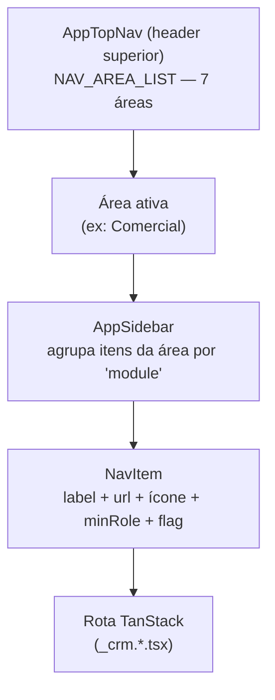
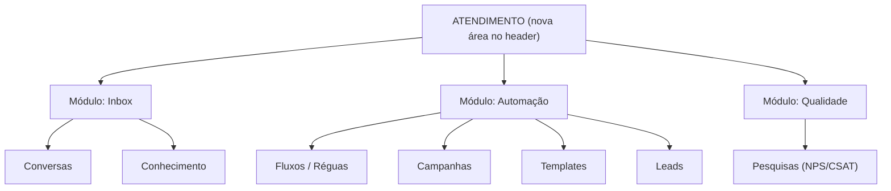

# Atendimento — Mapeamento de Arquitetura e Modularização

> **Objetivo:** mapear tudo que envolve o Atendimento (visual + técnico) para avaliar a criação de um **módulo/área próprio no header superior**, separando-o de "Comercial".
> **Data:** 25/06/2026 · **Autor:** G4 OS (a pedido do JG)

---

## 1. Como a navegação é arquitetada (modelo visual)

O sistema usa **uma fonte única de navegação**: `apps/web/src/lib/nav.ts`. Sidebar, top-nav e o RouteGuard leem desse arquivo.

A hierarquia é de **3 níveis**:



- **Área** (`Area`): botão no header (Marketing, Comercial, Logística, Financeiro, Liderança, Relatórios, Administração). Definida em `NAV_AREA_LIST`.
- **Módulo** (`module`): agrupador **dentro** do sidebar de uma área (ex: dentro de "Comercial" há CRM, Atendimento, Vendas, Produtividade, Geral).
- **Item** (`NavItem`): link individual → rota.

> **Situação atual:** "Atendimento" é apenas um **`module`** dentro da **área `comercial`**. Por isso fica "escondido" no meio de CRM/Vendas/Produtividade.

### Itens hoje no módulo "Atendimento" (área comercial)

| Item | Rota | minRole | Feature flag |
|------|------|---------|--------------|
| Conversas | `/conversations` | agent | — |
| Conhecimento | `/knowledge` | agent | `knowledge_base` |
| Pesquisas | `/surveys` | manager | `nps_csat` |

---

## 2. Inventário completo de features de Atendimento

### 2.1 Frontend — Páginas (`apps/web/src/features/crm/pages/`)

| Página | Rota | Função |
|--------|------|--------|
| `Conversations.tsx` | `/conversations` | **Inbox omnichannel** — coração do atendimento |
| `Knowledge.tsx` | `/knowledge` | Base de conhecimento p/ IA + agentes |
| `Surveys.tsx` | `/surveys` | NPS/CSAT pós-atendimento |
| `Flows.tsx` | `/flows` | Lista de fluxos de automação |
| `FlowEditor.tsx` | `/flows/:id` | Editor visual de fluxo (canvas) |
| `FlowLogs.tsx` | `/flows/:id/logs` | Logs de execução de fluxo |
| `Campaigns.tsx` | `/campaigns` | Broadcast WhatsApp + campanhas |
| `CampaignDetail.tsx` | `/campaigns/:id` | Dashboard A/B da campanha |
| `EmailTemplates.tsx` | `/email-templates` | Templates de e-mail |
| `Leads.tsx` | `/leads` | Captura de leads (landing/CTWA) |

> Hoje **Flows, Campanhas, Templates e Leads vivem na área "Marketing"**, mas são fortemente ligados ao atendimento (réguas, broadcast WhatsApp, triagem). Decisão de design: trazer ou não para o módulo Atendimento.

### 2.2 Frontend — Componentes do Inbox (`components/conversations/`)

| Componente | Função | Story |
|------------|--------|-------|
| `ConversationList.tsx` | Lista de conversas + filtros (canal, número, atribuição, status) | 6.13/6.15/6.21 |
| `ChatPanel.tsx` | Painel de chat (mensagens, mídia, input, seletor de número, modo IA, atribuição, janela 24h) | 6.9/6.10/6.14/6.16/6.24 |
| `ContactProfilePanel.tsx` | Painel lateral do contato (timeline, ICP, opt-in) | 6.27/6.28 |
| `TemplateComposer.tsx` | Compositor de template Meta | 6.9/6.11 |
| `InteractiveComposer.tsx` | Compositor de botões/listas interativas | 6.19 |
| `ChannelBadge.tsx` | Selo do canal/provedor | 6.13 |

### 2.3 Frontend — Abas de Configuração (`components/settings/`)

Hoje em `/settings` (área Administração), mas **100% sobre atendimento**:

| Aba (componente) | Função | Story |
|------------------|--------|-------|
| `AISettingsTab.tsx` | Provedores LLM, agentes IA, copiloto | 6.17 |
| `PersonasSettingsTab.tsx` | Personas de IA por número | 6.17 |
| `MetaWATab.tsx` | Contas WhatsApp Cloud API (Meta) | 6.8 |
| `WhatsappTemplatesTab.tsx` | Catálogo de templates Meta | 6.8/6.9 |
| `EvolutionTab.tsx` | Instâncias Evolution (self-host) | 6.5/6.7 |
| `InstagramTab.tsx` | Contas Instagram Direct | 6.29 |
| `FlowOptoutsTab.tsx` | Opt-outs LGPD | 6.12 |
| `LeadScoringBehaviorTab.tsx` | Config de lead scoring/ICP | 6.27 |
| `ClusterRulesTab.tsx` | Regras de clusterização | 6.27 |
| `EmailTemplatesTab.tsx` | Templates de e-mail | — |

### 2.4 Backend — Edge Functions (27 funções)

```mermaid
flowchart LR
    subgraph Inbound["Webhooks inbound (públicos)"]
        W1[crm-meta-wa-webhook]
        W2[crm-zapi-webhook]
        W3[crm-evolution-webhook]
        W4[crm-instagram-webhook]
    end
    subgraph Router["Roteamento + IA"]
        R1[crm-whatsapp-router]
        R2[crm-ai-orchestrator]
        R3[crm-ai-escalate]
    end
    subgraph Outbound["Envio (provider-aware)"]
        O1[crm-meta-wa-send]
        O2[crm-zapi-send]
        O3[crm-evolution-send]
        O4[crm-instagram-send]
        O5[crm-list-send-channels]
    end
    subgraph Flows["Motor de fluxos"]
        F1[crm-flow-engine]
        F2[crm-flow-action-executor]
        F3[crm-flow-inbound-trigger]
        F4[crm-flow-recipe-instantiate]
        F5[crm-flow-resume-collect]
        F6[crm-flow-daily-triggers]
    end
    subgraph Campaign["Campanhas/broadcast"]
        C1[crm-campaign-send]
        C2[crm-campaign-conversion-attribution]
    end
    subgraph Support["Suporte"]
        S1[crm-meta-wa-templates-sync]
        S2[crm-meta-wa-quality-poll]
        S3[crm-meta-wa-test]
        S4[crm-wa-media-fetch]
        S5[crm-wa-optin-set]
        S6[crm-conversation-distribute]
        S7[crm-conversation-load]
    end
    Inbound --> Router
    Router --> Outbound
    Inbound --> Flows
    Flows --> Outbound
    Campaign --> Outbound
```



**Por categoria:**
- **Webhooks inbound (4):** `crm-meta-wa-webhook`, `crm-zapi-webhook`, `crm-evolution-webhook`, `crm-instagram-webhook`
- **Roteamento + IA (3):** `crm-whatsapp-router`, `crm-ai-orchestrator`, `crm-ai-escalate`
- **Envio outbound (5):** `crm-meta-wa-send`, `crm-zapi-send`, `crm-evolution-send`, `crm-instagram-send`, `crm-list-send-channels`
- **Motor de fluxos (6):** `crm-flow-engine`, `crm-flow-action-executor`, `crm-flow-inbound-trigger`, `crm-flow-recipe-instantiate`, `crm-flow-resume-collect`, `crm-flow-daily-triggers`
- **Campanhas (2):** `crm-campaign-send`, `crm-campaign-conversion-attribution`
- **Suporte (7):** `crm-meta-wa-templates-sync`, `crm-meta-wa-quality-poll`, `crm-meta-wa-test`, `crm-wa-media-fetch`, `crm-wa-optin-set`, `crm-conversation-distribute`, `crm-conversation-load`

### 2.5 Backend — Tabelas/Migrations (Epic 6, ~28 migrations)

Principais grupos de tabelas (schema `crm`):
- **Conversas/mensagens:** `conversations`, `messages` (+ `provider_instance_id`, `last_inbound_at`, `unread_count`, `ai_mode`, `assigned_to`, `escalated_at`, `interactions_24h`, `ctwa_window_started_at`)
- **Canais/credenciais:** `whatsapp_accounts` (Meta), `zapi_instances`, `evolution_instances`, `instagram_accounts`
- **Templates:** `wa_templates`
- **Fluxos:** `flows`, `flow_enrollments`, `flow_recipes`, `wa_interactive_routes`
- **Campanhas:** `crm_campaigns`, `campaign_metrics`, `wa_send_budgets`
- **LGPD/scoring:** opt-out columns, `lead_score_breakdown`, `cluster_rules`
- **Carrinho abandonado:** tabelas da régua (Story 6.23)

---

## 3. Proposta — Área "Atendimento" no header

### 3.1 O que move para a nova área

| Cenário | Itens propostos para a área "Atendimento" |
|---------|--------------------------------------------|
| **Mínimo** (só o núcleo) | Conversas, Conhecimento, Pesquisas |
| **Recomendado** (atendimento + automação) | Conversas, Conhecimento, Pesquisas, Réguas/Fluxos, Campanhas, Templates, Leads |

**Recomendação:** opção recomendada. O que liga tudo é o WhatsApp/omnichannel — fluxos, broadcast e templates são operados pela mesma equipe de atendimento, não pelo marketing tradicional.

### 3.2 Estrutura proposta (área Atendimento → módulos)



### 3.3 Mudanças técnicas necessárias

Tudo concentra em **`apps/web/src/lib/nav.ts`** (fonte única) — baixo risco:

1. **Adicionar a área** em `NAV_AREA_LIST`:
   ```ts
   { area: 'atendimento', label: 'Atendimento', icon: MessageSquare },
   ```
2. **Adicionar ao type `Area`:** `| 'atendimento'`
3. **Reapontar os `NavItem`s** afetados: trocar `area: 'comercial'`/`'marketing'` → `area: 'atendimento'` e ajustar `module` (Inbox/Automação/Qualidade).
4. **RouteGuard e sidebar** já leem de `nav.ts` → funcionam automaticamente.
5. **Settings de atendimento (opcional, fase 2):** as 10 abas de config hoje em `/settings` poderiam virar uma sub-rota `/atendimento/config` ou um item "Configurações de Atendimento" na nova área. Hoje estão sob Administração.

### 3.4 Ordem sugerida das áreas no header

`Marketing · Comercial · **Atendimento** · Logística · Financeiro · Liderança · Relatórios · Administração`

(Atendimento logo após Comercial, refletindo o funil: marketing → vendas → atendimento → operação.)

### 3.5 Pontos de atenção

- **Ícone:** `MessageSquare` já é usado por "Conversas". Pode reusar ou escolher outro (ex: `Headset`, `Inbox`) para a área, evitando ambiguidade visual.
- **Permissões:** manter `minRole` por item (agent vê Conversas; manager vê Campanhas/Pesquisas).
- **Feature flags:** preservar `knowledge_base`, `nps_csat`, `flow_builder`, `forecasting`.
- **Deep-links existentes:** as rotas (`/conversations`, `/flows`, etc.) **não mudam** — só a área que as agrupa. Zero quebra de links salvos.
- **Marketing fica vazio?** Se mover Campanhas/Réguas/Templates/Leads, a área Marketing fica só com o que sobrar. Avaliar se Marketing deixa de existir ou recebe outros itens (ex: Analytics de marketing).

---

## 4. Resumo executivo

- **Hoje:** Atendimento é um *módulo* dentro da área *Comercial* — 3 itens visíveis, mas há **27 edge functions + ~28 migrations + 6 componentes de inbox + 10 abas de config** por trás.
- **Volume justifica** área própria no header.
- **Implementação é de baixo risco**: concentrada em `nav.ts`; rotas e backend não mudam.
- **Decisão pendente do JG:** escopo (mínimo vs. recomendado) e se Marketing some/realoca.
