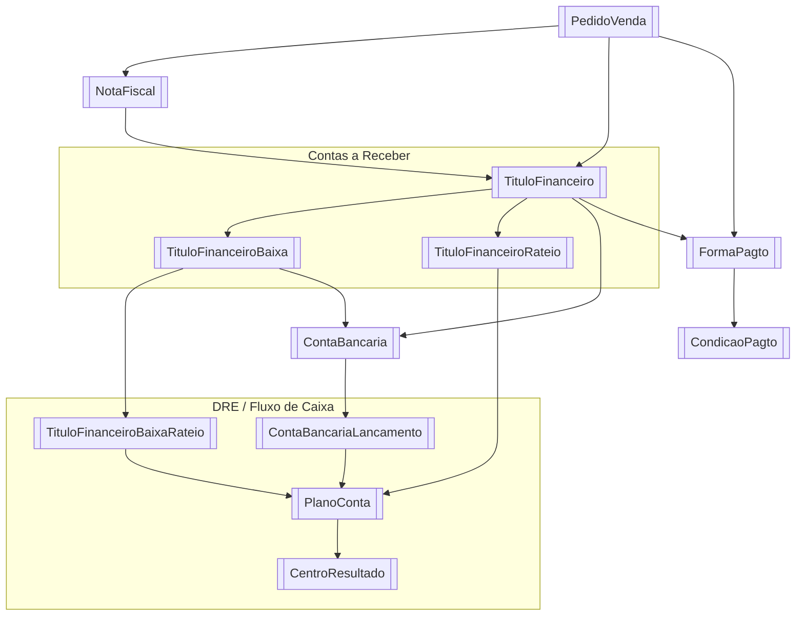

# Mapa de Dados — Financeiro HeziomOS

Visão cruzada entre módulos do financeiro e suas fontes de dados no Literarius e na Tray API.

---

## Módulos × Fontes de Dados

| Módulo | Literarius | Tray API | Outros |
|--------|------------|----------|--------|
| [[Pedidos e Vendas]] | [[Clientes/Heziom/HeziomOS/Fontes de Dados/Literarius/Banco de Dados/PedidoVenda]], [[Clientes/Heziom/HeziomOS/Fontes de Dados/Literarius/Banco de Dados/NotaFiscal]], [[Clientes/Heziom/HeziomOS/Fontes de Dados/Literarius/Banco de Dados/FormaPagto]] | [[Clientes/Heziom/HeziomOS/Fontes de Dados/Tray/Tray - Pedidos]], [[Clientes/Heziom/HeziomOS/Fontes de Dados/Tray/Tray - Invoices]] | — |
| [[Contas a Receber]] | [[Clientes/Heziom/HeziomOS/Fontes de Dados/Literarius/Banco de Dados/TituloFinanceiro]] (`TipoTitulo='R'`), [[Clientes/Heziom/HeziomOS/Fontes de Dados/Literarius/Banco de Dados/TituloFinanceiroBaixa]], [[Clientes/Heziom/HeziomOS/Fontes de Dados/Literarius/Banco de Dados/ContaBancaria]] | [[Clientes/Heziom/HeziomOS/Fontes de Dados/Tray/Tray - Pagamentos]] (`status=aprovado`) | — |
| [[Contas a Pagar]] | [[Clientes/Heziom/HeziomOS/Fontes de Dados/Literarius/Banco de Dados/TituloFinanceiro]] (`TipoTitulo='P'`), [[Clientes/Heziom/HeziomOS/Fontes de Dados/Literarius/Banco de Dados/TituloFinanceiroBaixa]], [[Clientes/Heziom/HeziomOS/Fontes de Dados/Literarius/Banco de Dados/ContaBancaria]] | — | [[Qive — NF-e Automática]] (fila de NF-e) |
| [[DRE e Fluxo de Caixa]] | [[Clientes/Heziom/HeziomOS/Fontes de Dados/Literarius/Banco de Dados/TituloFinanceiroBaixaRateio]], [[Clientes/Heziom/HeziomOS/Fontes de Dados/Literarius/Banco de Dados/PlanoConta]], [[Clientes/Heziom/HeziomOS/Fontes de Dados/Literarius/Banco de Dados/CentroResultado]], [[Clientes/Heziom/HeziomOS/Fontes de Dados/Literarius/Banco de Dados/ContaBancariaLancamento]] | [[Clientes/Heziom/HeziomOS/Fontes de Dados/Tray/Tray - Pagamentos]] (`price_seller`) | — |
| [[Aprovação de Pagamentos]] | [[Clientes/Heziom/HeziomOS/Fontes de Dados/Literarius/Banco de Dados/TituloFinanceiro]] (`TipoTitulo='P'`, `Pago=0`), `Parceiro` | — | HeziomOS DB (`payment_approvals`, `cnab_batches`) |
| [[Conciliação Bancária]] | [[Clientes/Heziom/HeziomOS/Fontes de Dados/Literarius/Banco de Dados/TituloFinanceiroBaixa]], [[Clientes/Heziom/HeziomOS/Fontes de Dados/Literarius/Banco de Dados/ContaBancaria]], [[Clientes/Heziom/HeziomOS/Fontes de Dados/Literarius/Banco de Dados/ContaBancariaLancamento]] | — | Extrato OFX Santander, [[Bancos — CNAB e OFX]] |
| [[Gestão de Estoque e CMV]] | `vwProdutoEstoque`, `vwProdutoCusto`, `NotaFiscalItens` | — | [[Qive — NF-e Automática]] (custo via NF gráfica) |
| [[Comissões e Repasses]] | [[Clientes/Heziom/HeziomOS/Fontes de Dados/Literarius/Banco de Dados/PedidoVenda]] (`SiteIdPedido`), [[Clientes/Heziom/HeziomOS/Fontes de Dados/Literarius/Banco de Dados/ComissaoParametro]] | [[Clientes/Heziom/HeziomOS/Fontes de Dados/Tray/Tray - Pedidos]], [[Clientes/Heziom/HeziomOS/Fontes de Dados/Tray/Tray - Pagamentos]] (gateway: APPMAX) | HeziomOS DB (`repasse_tracking`); Stone POS (OFX); Mercado Pago/ML (API); Bookwire (relatório manual) |
| [[Dashboard CEO]] | Todas as tabelas acima | — | HeziomOS DB (alertas, aprovações) |

### Chave de conciliação Tray ↔ Literarius

| Campo Tray | Campo Literarius |
|------------|-----------------|
| `order.id` | `PedidoVenda.SiteIdPedido` |
| `order.id` | `NotaFiscal.SiteIdPedido` |
| `invoice.access_key` | `NotaFiscal.NFeChave` |
| `payment.order_id` | `TituloFinanceiro.OrigemIdRegistro` (quando Origem=Tray) |

---

## Diagrama de Relações (Mermaid)



---

## Fluxo de Dados: Venda Tray → Financeiro Literarius

```
Tray: order criado (status = aguardando_pagamento)
  └─► Webhook → order.update (status = aprovado)
        └─► GET /orders/:id/complete
              └─► PedidoVenda (SiteIdPedido = order.id)
                    └─► NotaFiscal (GeraFinanceiro = 1, EntSai = 'S')
                          └─► TituloFinanceiro (TipoTitulo='R')
                                ├─► TituloFinanceiroRateio (PlanoConta + CentroResultado)
                                └─► TituloFinanceiroBaixa (baixa automática se payment aprovado)
                                      └─► TituloFinanceiroBaixaRateio
                                            └─► ContaBancariaLancamento (conciliação)
```

## Fluxo de Dados: Venda Interna → Financeiro

```
PedidoVenda (canal direto)
  └─► NotaFiscal (GeraFinanceiro = 1)
        └─► TituloFinanceiro (TipoTitulo='R')
              ├─► TituloFinanceiroRateio
              └─► TituloFinanceiroBaixa (quando pago manualmente)
                    └─► TituloFinanceiroBaixaRateio
                          └─► ContaBancariaLancamento
```

---

## Status por Fonte (atualizado 19/05/2026)

| Fonte | Status | Documentação |
|-------|--------|---|
| Literarius DB | ✅ Completo — 150 tabelas + 61 views | [[Fontes de Dados/Mapa Completo de APIs e Capacidades]] |
| Literarius REST API | ✅ Mapeado — 5 controllers (inclui write para pedidos) | [[Fontes de Dados/Literarius/APIs/Literarius-API-Documentacao]] |
| Tray API | ✅ Completo — 18 categorias, ~100 endpoints | [[Fontes de Dados/Mapa Completo de APIs e Capacidades]] |
| Qive API | ✅ Mapeado | [[Qive — NF-e Automática]] |
| Bancos (CNAB/OFX) | ✅ Mapeado | [[Bancos — CNAB e OFX]] |
| HeziomOS DB | Especificado — tabelas Supabase próprias | Cada módulo documenta |

## Tray API — Notas mapeadas (14 arquivos)

**Infraestrutura:**
- [[Clientes/Heziom/HeziomOS/Fontes de Dados/Tray/Tray - Autenticação]] — OAuth + credenciais
- [[Clientes/Heziom/HeziomOS/Fontes de Dados/Tray/Tray - Rate Limit e Paginação]] — 180 req/min + retry
- [[Clientes/Heziom/HeziomOS/Fontes de Dados/Tray/Tray - Webhooks]] — 10 eventos em tempo real
- [[Clientes/Heziom/HeziomOS/Fontes de Dados/Tray/Tray - Capacidades do Integrador]] — matriz 14 categorias

**Dados transacionais:**
- [[Clientes/Heziom/HeziomOS/Fontes de Dados/Tray/Tray - Pedidos]] — orders + conciliação
- [[Clientes/Heziom/HeziomOS/Fontes de Dados/Tray/Tray - Pagamentos]] — price_seller, taxas
- [[Clientes/Heziom/HeziomOS/Fontes de Dados/Tray/Tray - Invoices]] — vinculação NF-e
- [[Clientes/Heziom/HeziomOS/Fontes de Dados/Tray/Tray - Clientes]] — CRM + endereços 🆕
- [[Clientes/Heziom/HeziomOS/Fontes de Dados/Tray/Tray - Frete e Logística]] — rastreio + cálculo 🆕

**Catálogo e marketing:**
- [[Clientes/Heziom/HeziomOS/Fontes de Dados/Tray/Tray - Categorias e Marcas]] — BISAC → categorias 🆕
- [[Clientes/Heziom/HeziomOS/Fontes de Dados/Tray/Tray - Cupons e Promoções]] — ROI campanhas 🆕
- [[Clientes/Heziom/HeziomOS/Fontes de Dados/Tray/Tray - Carrinho Abandonado e Scripts]] — remarketing 🆕

**Integração e roadmap:**
- [[Clientes/Heziom/HeziomOS/Fontes de Dados/Tray/Tray - Sync Agent — Endpoints e Estratégia]] — Supabase schema
- [[Clientes/Heziom/HeziomOS/Fontes de Dados/Tray — Correlação com Literarius]] — mapa campo a campo
- [[Tray — Conciliação de Repasses]] — rastreamento de repasses financeiros

---

## Integrações Externas — Mapa

```
SEFAZ
  │  monitoramento automático
  ▼
Qive API
  │ NF-e recebidas    │ Manifestação
  ▼                   ▼
nfe_queue         SEFAZ resposta
  │
  ▼
Fila HeziomOS → Revisão financeiro → [futuro] TituloFinanceiro

Tray (e-commerce)
  │ pedidos aprovados
  ▼
repasse_tracking → alerta se atrasado → Conciliação Bancária

Santander (banco)
  │ extrato OFX    │ remessa CNAB 240
  ▼                ▼
bank_statements  Aprovação → CNAB gerado → upload manual
  │
  ▼
Conciliação automática (match vs. TituloFinanceiroBaixa)

Literarius DB (SQL Server, read-only + REST write para pedidos)
  │ leitura contínua (SQL) + PUT pedidos (REST)
  ▼
Todos os módulos HeziomOS

Teams (canal de alertas)
  ▲
  │ webhooks
  └── Jobs HeziomOS (7h, 8h, 10h, 22h, sob demanda)
```
