# HeziomOS — Arquitetura Completa e Fluxos entre Aplicações

> Proposta consolidada da lógica de sistema, fluxos de dados e interconexões entre todas as aplicações que compõem o HeziomOS.

---

## O que é o HeziomOS

```
HeziomOS = Camada de Inteligência Operacional
           sobre o ERP Literarius + E-commerce Tray

Não substitui nenhum dos dois — CONECTA e POTENCIALIZA.
```

**Para o CEO:** Um painel único com tudo que importa — sem precisar abrir 5 sistemas.
**Para o Financeiro:** Automação de aprovações, conciliação e alertas proativos.
**Para a Operação:** Estoque sincronizado, pedidos rastreados, consignações controladas.

---

## Diagrama de Arquitetura Completa

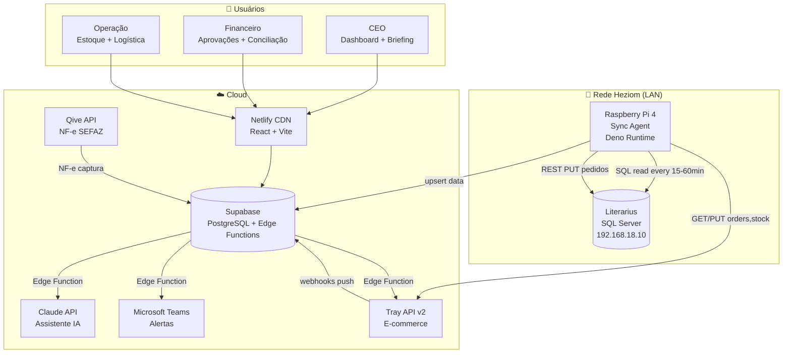

---

## Camadas do Sistema

### Camada 1 — Fontes de Dados (Read)

| Fonte | Protocolo | Dados | Frequência |
|---|---|---|---|
| **Literarius SQL** | TCP/1433 (mssql) | 150 tabelas, 61 views, tudo financeiro + operacional | 15min – 1×/sem |
| **Literarius REST** | HTTP/1983 | Pedidos (write!), Produtos, Estoque, Parceiros, NFs | On-demand |
| **Tray API** | HTTPS REST | Pedidos, Pagamentos, Estoque, Clientes, Catálogo | 15min polling + webhooks |
| **Tray Webhooks** | HTTPS POST (push) | 10 eventos em tempo real | Instantâneo |
| **Qive** | HTTPS REST | NF-e recebidas da SEFAZ | 1×/dia |
| **Santander OFX** | Upload manual (futuro: API) | Extratos bancários | 1×/dia |

### Camada 2 — Processamento (Sync Agent + Edge Functions)

| Componente | Onde roda | Responsabilidade |
|---|---|---|
| **Sync Agent** | Raspberry Pi (LAN) | Ler Literarius → upsert Supabase; Ler/Escrever Tray |
| **Webhook Receiver** | Supabase Edge Function | Receber webhooks Tray + processar em tempo real |
| **Cron Jobs** | Supabase (cron) | Briefing 7h, alertas periódicos, relatórios |
| **Matching Engine** | Supabase Edge Function | Conciliação OFX × Títulos (fuzzy match) |
| **AI Router** | Supabase Edge Function | Chat MCP → query SQL → resposta Claude |

### Camada 3 — Armazenamento (Supabase PostgreSQL)

| Schema | Tabelas | Propósito |
|---|---|---|
| `lit_*` | 15 tabelas espelho | Réplica read-only do Literarius (para queries rápidas) |
| `tray_*` | 5 tabelas espelho | Réplica dos dados Tray (enriquecida com JOINs) |
| `ops_*` | Workflow tables | Estado operacional (aprovações, batches, filas) |
| `analytics_*` | Views materializadas | KPIs pré-calculados para o dashboard |

### Camada 4 — Apresentação (React + Vite)

| Módulo | Telas | Audiência |
|---|---|---|
| **Dashboard CEO** | Posição financeira, DRE, Canais, Alertas, Cash Flow | CEO |
| **Financeiro** | A/P, A/R, Aprovações, CNAB, Conciliação | Financeiro |
| **Estoque** | Posição, Giro, Cobertura, Alertas de reposição | Operação |
| **Assistente** | Chat em linguagem natural | Todos |
| **Admin** | Configuração de alertas, regras, usuários | TI / CEO |

---

## Fluxos Completos — Ciclo de Vida dos Dados

### FLUXO 1: Venda no E-commerce (end-to-end)

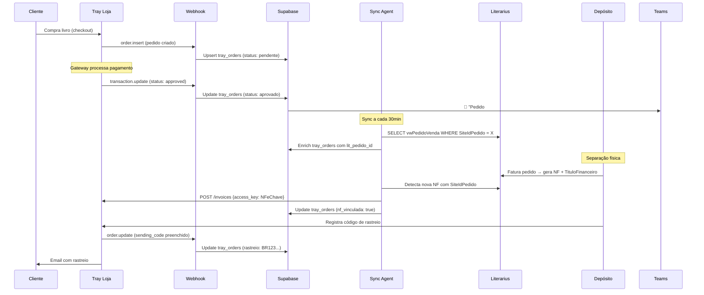

**Resultado:** O CEO vê no dashboard:
- Pedido apareceu, foi aprovado, teve NF emitida, foi enviado
- Receita líquida = `price_seller` (após taxa do gateway)
- Título financeiro gerado automaticamente no Literarius

---

### FLUXO 2: Sync de Estoque (Literarius → Tray)

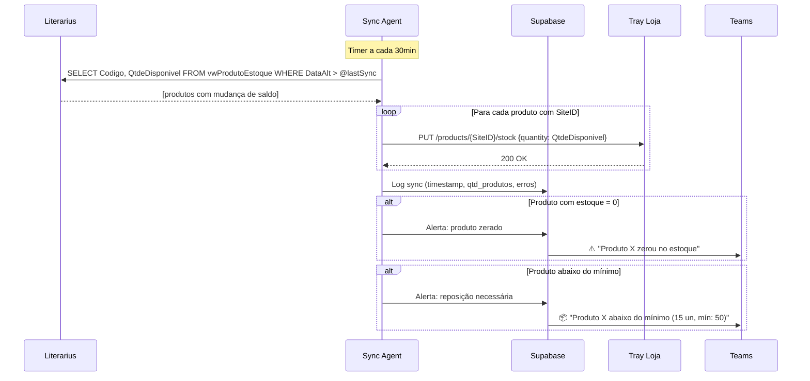

**Regras de negócio:**
- Usar `QtdeDisponivel` (não saldo bruto) — exclui reservados
- Só sincronizar produtos com `SiteID` preenchido (já cadastrados na Tray)
- Se estoque = 0 → produto fica "esgotado" na loja (não remove)
- Rate limit: 180 req/min → batch de ~150 produtos/ciclo com margem

---

### FLUXO 3: DRE Automático (Mensal)

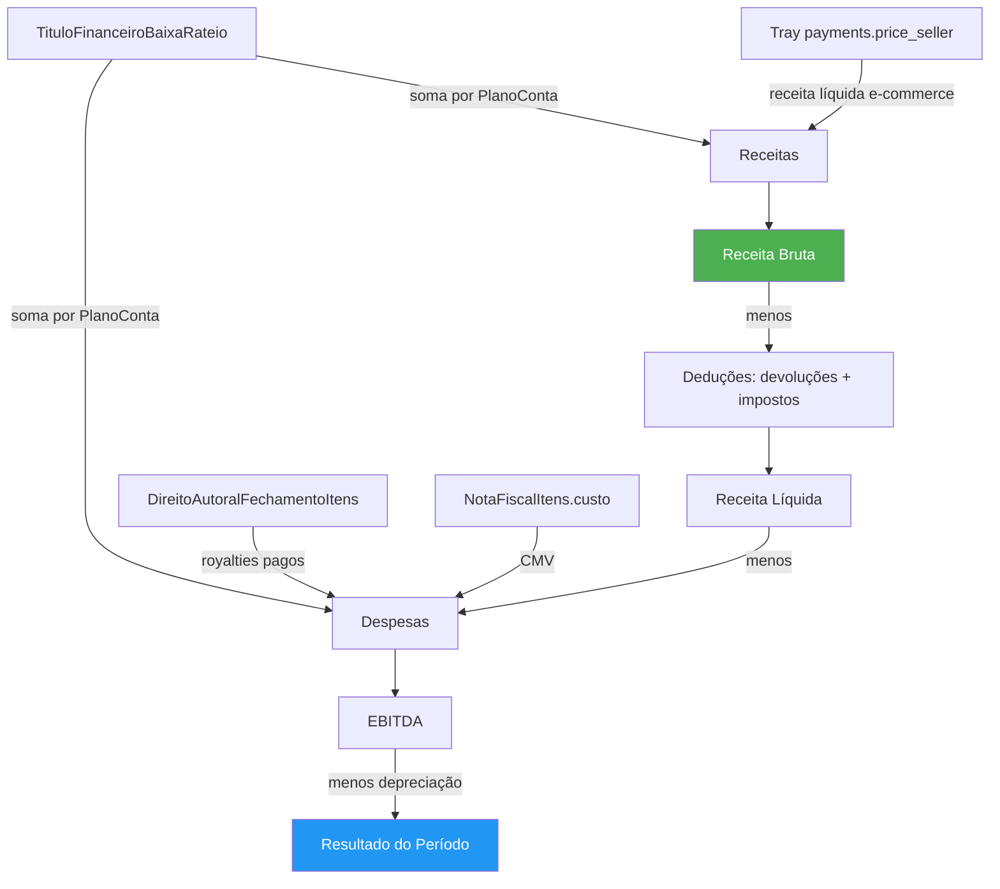

**Fontes por linha do DRE:**

| Linha DRE | Fonte Literarius | Fonte Tray | Cálculo |
|---|---|---|---|
| **Receita Bruta** | `SUM(NotaFiscal.TotalNota)` WHERE EntSai='S' | — | Todas as NFs de saída do período |
| **(−) Devoluções** | `SUM(NotaFiscal.TotalNota)` WHERE EntSai='E' + motivo devolução | — | NFs de entrada por devolução |
| **(−) Impostos** | `SUM(NotaFiscalItens.IcmsValor + PisValor + CofinsValor)` | — | ⚠️ Livros = 0% (imune) — verificar outros produtos |
| **= Receita Líquida** | Calculado | — | |
| **(−) CMV** | `SUM(EntradaItens.CustoUnitario × qtde vendida)` + Royalties | — | Custo gráfico + autoral |
| **(−) Taxa gateway** | — | `SUM(price_payment - price_seller)` | Exclusivo Tray |
| **= Lucro Bruto** | Calculado | | |
| **(−) Despesas Operacionais** | `SUM(TituloFinanceiroBaixaRateio)` por centro de resultado | — | Rateio por PlanoConta |
| **= EBITDA** | Calculado | | |

> ⚠️ **Bloqueio atual:** `PlanoConta.TipoCategoria = 'A'` em todos os registros. Sem corrigir isso, o DRE não consegue separar receitas de despesas automaticamente. **Workaround:** usar `CentroResultado` para segmentar por departamento.

---

### FLUXO 4: Aprovação de Pagamentos

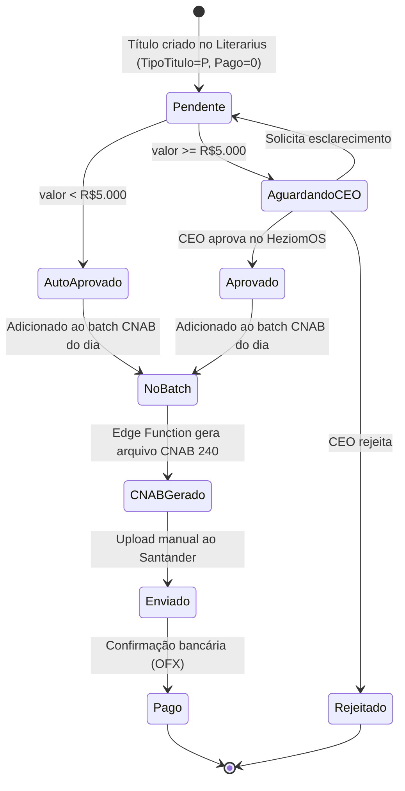

**Regras de alçada:**

| Valor | Aprovação | SLA |
|---|---|---|
| < R$ 1.000 | Automática | Imediato |
| R$ 1.000 – R$ 5.000 | Financeiro | 24h |
| R$ 5.000 – R$ 20.000 | CEO | 48h |
| > R$ 20.000 | CEO + confirmação adicional | 72h |

---

### FLUXO 5: Conciliação Bancária

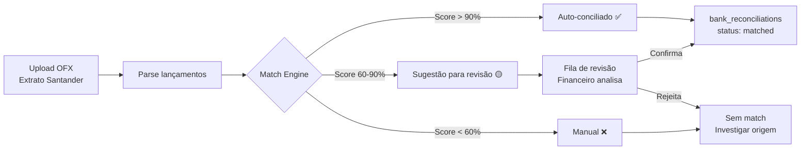

**Algoritmo de matching:**
1. Buscar `TituloFinanceiroBaixa` com `ValorBaixa ≈ lançamento.valor` (±R$0,50)
2. Data da baixa ≈ data do lançamento (±3 dias úteis)
3. Se ambos batem → score = 95%
4. Se valor bate mas data difere > 5 dias → score = 70%
5. Se nenhum título bate → verificar se é transferência entre contas (ContaBancaria → ContaBancaria)

**Meta:** >95% de conciliação automática em estado estável.

---

### FLUXO 6: Briefing Diário (7h)

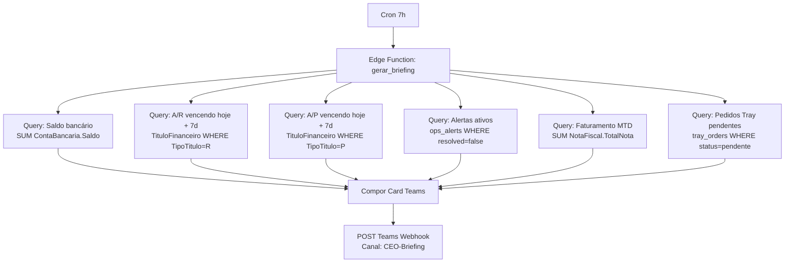

**Formato do card:**
```
📊 Briefing HeziomOS — 19/Mai/2026

💰 Saldo bancário: R$ XXX.XXX
📈 Faturamento MTD: R$ 339.881 (+42% vs Abr)
📥 A receber (7d): R$ XX.XXX (Y títulos)
📤 A pagar (7d): R$ XX.XXX (Z títulos)
🛒 Pedidos Tray pendentes: N
⚠️ Alertas: 3 (1 crítico, 2 atenção)

[Ver Dashboard →]
```

---

### FLUXO 7: Assistente IA (Chat MCP)

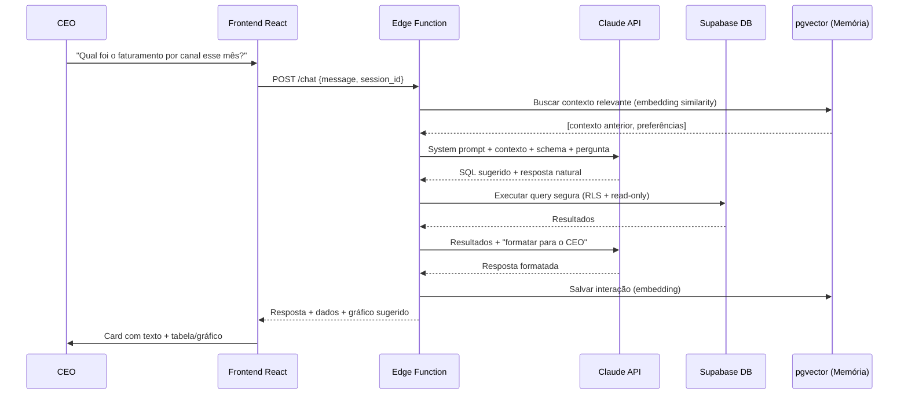

**Guardrails:**
- Queries sempre com `LIMIT 1000` e `timeout 5s`
- Não executar UPDATE/DELETE (apenas SELECT)
- Prefixo de contexto: "Você é o assistente financeiro da Heziom, editora cristã..."
- Memória via pgvector: últimas 50 interações + preferências do CEO

---

### FLUXO 8: Catálogo Automático (Literarius → Tray)

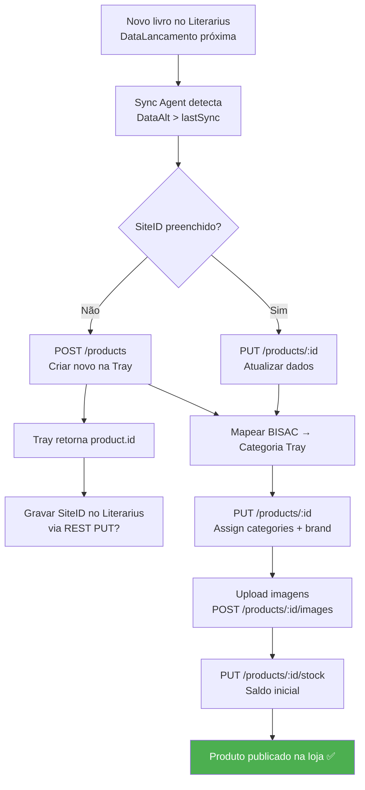

**Dados do livro enviados à Tray:**

| Campo Tray | Origem Literarius | Observação |
|---|---|---|
| `name` | `Produto.Titulo` | |
| `description` | `Produto.Sinopse` | HTML permitido |
| `price` | `ProdutoPreco.Preco` (vigente) | |
| `reference` | `Produto.CodigoIsbn` | ISBN como referência |
| `ean` | `Produto.CodigoBarras` | Para leitores de código |
| `weight` | `Produto.Peso` | Em kg (para frete) |
| `height/width/depth` | `Produto.Altura/Largura/Profundidade` | Em cm |
| `stock` | `Estoque.QtdeDisponivel` | Disponível (não bruto) |
| `categories` | Mapeamento BISAC → category_id | |
| `brand` | `Produto.EditoraFantasia` → brand_id | |
| `images` | `Produto.Imagem1..7` URLs | |

---

### FLUXO 9: Consignação e Aging

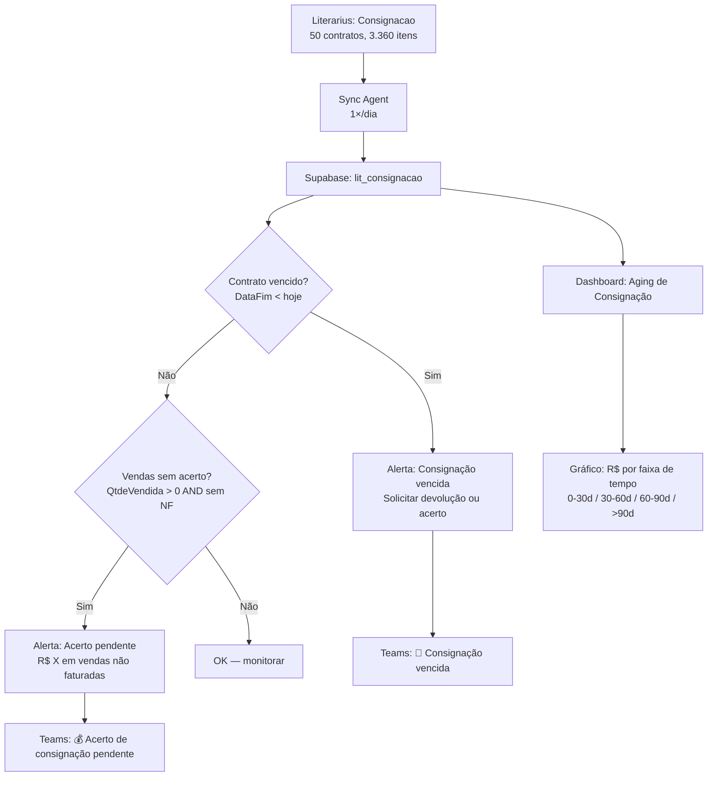

---

### FLUXO 10: Score de Saúde Financeira

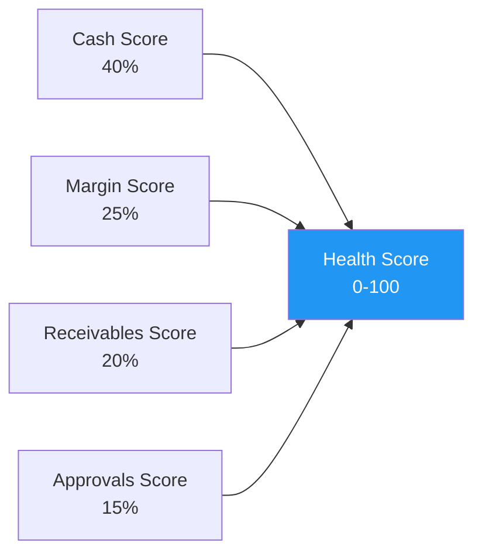

**Cálculo:**

| Componente | Peso | 100 pontos | 0 pontos |
|---|---|---|---|
| **Cash** | 40% | Saldo > 3 meses de despesa | Saldo < 1 semana de despesa |
| **Margem** | 25% | Margem bruta > 80% | Margem < 50% |
| **Recebíveis** | 20% | <10% vencido | >50% vencido |
| **Aprovações** | 15% | 0 pendências > 48h | >10 pendências atrasadas |

**Alerta por faixa:**
- 80-100: 🟢 Saudável
- 60-79: 🟡 Atenção — monitorar semanalmente
- 40-59: 🟠 Risco — ação corretiva em 7 dias
- 0-39: 🔴 Crítico — ação imediata

---

## Modelo de Dados Unificado (Supabase)

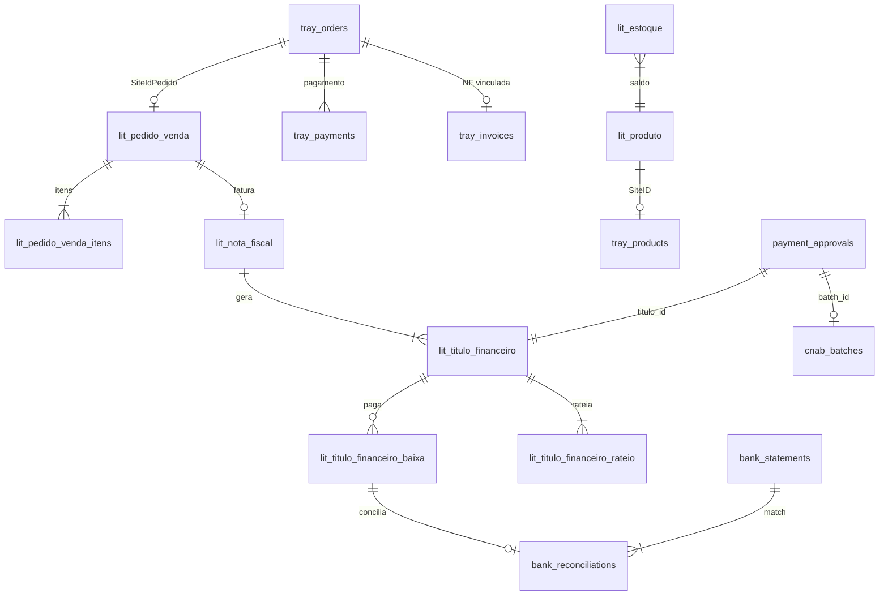

---

## Stack Tecnológica Confirmada

| Camada | Tecnologia | Justificativa |
|---|---|---|
| **Frontend** | React 18 + Vite + shadcn/ui (Tailwind) | Lovable-compatible; fast; customizable |
| **Deploy frontend** | Netlify | Auto-deploy GitHub; preview branches |
| **Backend** | Supabase Edge Functions (Deno) | Serverless; cold start <100ms |
| **Database** | PostgreSQL 14+ (Supabase managed) | RLS; pgvector; JSON nativo |
| **Auth** | Supabase Auth | 3 roles: CEO, Financeiro, Analista |
| **Sync runtime** | Deno (Raspberry Pi) | Leve; npm:mssql nativo; single binary |
| **Sync scheduling** | systemd timers | Robusto; auto-restart; logs via journald |
| **Alerting** | MS Teams Incoming Webhooks | Já usado pela Heziom |
| **AI** | Claude API (Sonnet/Haiku) | Chat MCP + análise de dados |
| **Embeddings** | pgvector (Supabase) | Memória do assistente |
| **CNAB** | Geração local (Deno) | Formato Santander CNAB 240 |
| **Monitoring** | Supabase logs + sync-watchdog | Alert se Pi silencioso >2h |

---

## Cronograma de Implementação

### Fase 1 — Fundação (4–6 semanas)

| Semana | Entrega | Dependência |
|---|---|---|
| S1 | Provisionar Supabase + schema inicial + GitHub repo | — |
| S1 | Adquirir Pi + setup Deno + conectar Literarius | — |
| S2 | Sync Agent v1: TituloFinanceiro + ContaBancaria | Pi rodando |
| S2 | Sync Agent v1: PedidoVenda + NotaFiscal + Estoque | Pi rodando |
| S3 | Frontend: Dashboard CEO (posição financeira + DRE) | Sync rodando |
| S3 | Edge Function: Briefing 7h Teams | Sync rodando |
| S4 | Tray: obter access_token + testar GET /orders | Loja desbloqueada |
| S4 | Sync Tray: orders + payments → Supabase | Token obtido |
| S5 | PUT /stock: Literarius → Tray (Fase 1.1 do Roadmap) | Tray ativo |
| S5 | POST /invoices: NF → Tray (Fase 1.4) | Tray ativo |
| S6 | Dashboard: Faturamento por canal + Health Score | Dados completos |

### Fase 2 — Inteligência (6–10 semanas após Fase 1)

| Entrega | Complexidade |
|---|---|
| Workflow de aprovação de pagamentos | Média |
| Conciliação bancária (OFX import + match) | Alta |
| Webhooks Tray em tempo real | Média |
| Sync catálogo Literarius → Tray | Média |
| Chat MCP (Claude API + pgvector) | Alta |
| Painel de logística (rastreio) | Baixa |
| Cupons e ROI de marketing | Baixa |

### Fase 3 — Autonomia (3–6 meses após Fase 2)

| Entrega | Complexidade |
|---|---|
| Geração CNAB 240 automática | Média |
| Conciliação >95% sem intervenção | Alta |
| Publicação no Marketplace Tray (HeziomOS como produto) | Média |
| Multi-CD estoque | Baixa |
| Tema editorial para marketplace (projeto paralelo Trivia) | Alta |
| Royalty provisioning automático | Média |

---

## Decisões Pendentes (para alinhar com Heziom)

| # | Decisão | Opções | Impacto |
|---|---|---|---|
| 1 | **Quem compra o Raspberry Pi?** | Trivia inclui no projeto / Heziom compra | Setup da Fase 1 |
| 2 | **Supabase: plano Free ou Pro?** | Free (500MB, 2 Edge Functions) vs Pro ($25/mês, 8GB, unlimited) | Escala do banco |
| 3 | **Alçada de aprovação:** valores exatos | R$1k/5k/20k sugeridos — CEO confirma? | Workflow de pagamentos |
| 4 | **Corrigir PlanoConta.TipoCategoria** | Equipe Literarius corrige / HeziomOS faz workaround | DRE automático |
| 5 | **6 views otimizadas** | Literarius cria / HeziomOS faz JOINs direto | Performance do sync |
| 6 | **Tema da Tray: fazer ou não agora?** | Agora (paralelo) / Depois da homologação do app | Oportunidade de mercado |
| 7 | **Chat MCP: Claude Sonnet ou Haiku?** | Sonnet (melhor) / Haiku (mais barato, R$0,25/call) | Custo vs qualidade |

---

## Referências

- [[00 - Índice]] — mapa central do vault
- [[Fontes de Dados/Mapa Completo de APIs e Capacidades]] — inventário técnico
- [[Projeto/Roadmap de Integração Tray × Literarius]] — roadmap de integração
- [[Decisões/ADR-001 — Sync Agent no Raspberry Pi]] — decisão de infra
- [[Decisões/ADR-002 — Segurança do Sync Agent]] — modelo de segurança
- [[Projeto/Dashboard CEO — Análise Maio 2026]] — KPIs reais validados
- [[Financeiro/Mapa de Dados]] — cruzamento módulos × fontes

---

*Proposta consolidada em 2026-05-19 — JG Novais (Trivia)*
*Baseada em análise completa do vault (150+ arquivos, 2 sessões de trabalho)*
