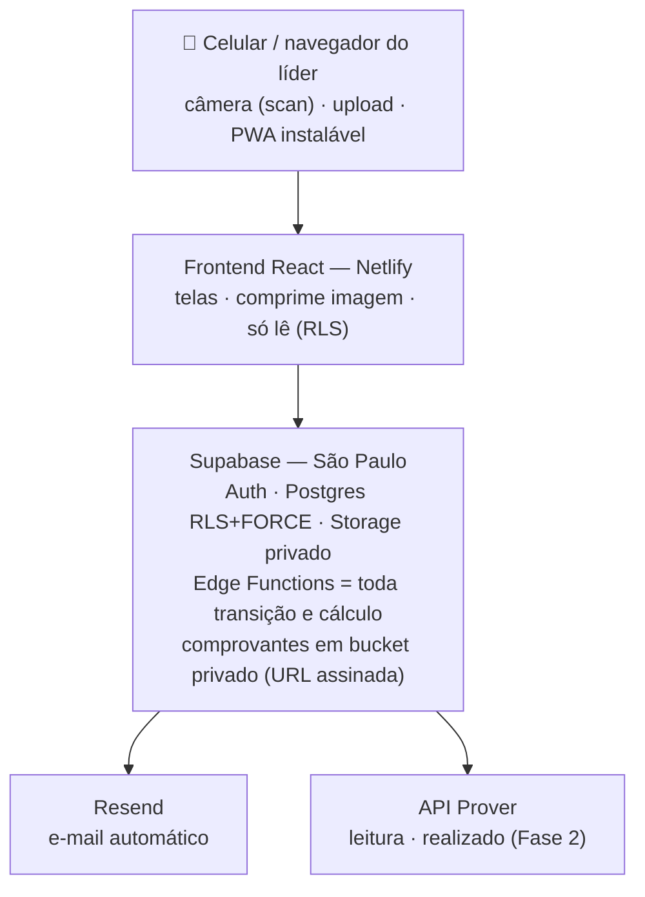
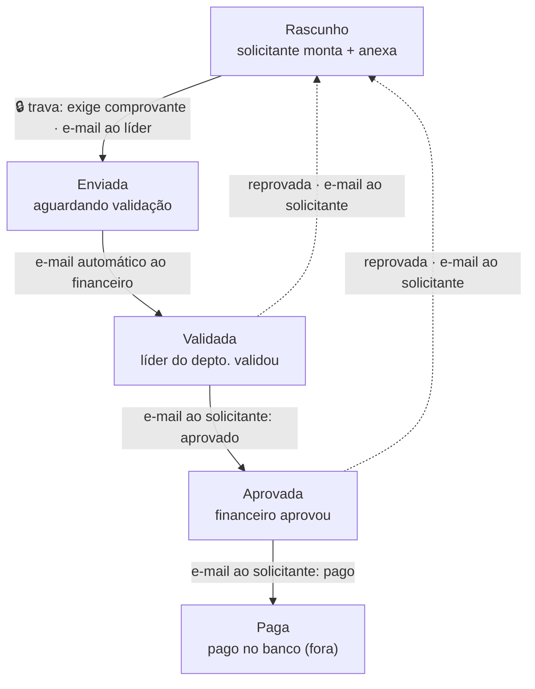

# IPP Reembolsos — Arquitetura e Fluxos

> Desenho técnico no **padrão Trivia** (segurança, LGPD, Edge Functions, RLS). Schema detalhado em `architecture.md` (repo de código, ADR-002). Esta nota é a visão de arquitetura + fluxos para validação. **Nada foi aplicado no Supabase ainda.**

---

## 1. Arquitetura

**Regra de ouro de segurança:** o frontend **nunca** muda status nem grava valor direto na tabela. Toda transição (enviar, validar, aprovar, pagar) passa por uma **Edge Function** que valida JWT (`auth.getUser()`), checa papel, valida input com Zod e calcula valores **no backend**. O cliente só lê (com RLS filtrando) e chama as funções.

**Camadas:**
- **Celular/navegador** — captura por câmera (`capture="environment"`) + upload + PWA (instalável, bom no celular do líder).
- **Frontend React (Netlify)** — telas, compressão da imagem antes de subir, usa só `anon key` (protegida por RLS).
- **Supabase (São Paulo)** — Auth · Postgres RLS+FORCE · Storage privado p/ comprovantes · Edge Functions com a lógica sensível.
- **Serviços** — Resend (e-mail) · API Prover (leitura, Fase 2).

---

## 2. Fluxo da solicitação de reembolso

Aprovação em **2 níveis**: líder do departamento valida (1º) → financeiro aprova e paga (2º). Pagamento é feito **fora** (banco); o financeiro marca como `paga` com data/forma. Cada transição grava trilha de auditoria (quem, quando, de→para, comentário).

---

## 3. Comprovante obrigatório — como fica garantido

- **No app:** o botão "enviar" só habilita com **≥1 item com anexo**. Captura aceita **foto da câmera** (traseira, modo documento) **ou** upload (foto/PDF). Imagem é comprimida antes de subir.
- **No servidor (à prova de burla):** a Edge Function `submit-solicitacao` recusa `rascunho → enviada` se algum item estiver sem comprovante válido no Storage. Como o frontend não muda status direto (só via função), não há como enviar sem nota.
- **Comprovantes** em **bucket privado**; visualização via **URL assinada** gerada no backend, checando papel/vínculo. OCR (ler valor/data da nota) fica para Fase 2/3.

---

## 4. Segurança aplicada (padrão Trivia)

- **RLS + FORCE** em toda tabela; líder só enxerga os **seus** departamentos (via vínculo); financeiro/admin veem tudo. Sem policy = acesso negado.
- **Edge Functions** com JWT (`auth.getUser()`), papel verificado, **Zod** no input, valores calculados no backend, `service_role` só dentro delas, erros sem vazar detalhe (RFC 7807).
- **Storage privado** + URL assinada para comprovantes (PII).
- **CORS** travado no domínio Netlify em produção; **security headers** no `netlify.toml`; segredos (token Prover, chave Resend) só em secrets do Supabase.
- `SECURITY_DEBT.md` com SEC-001..004 cadastrados.

Referências do padrão: [[Documentos Trivia/Padrão Projetos/03 - Segurança/Checklist de Segurança|Checklist de Segurança]] · [[Documentos Trivia/Padrão Projetos/03 - Segurança/Edge Functions Seguras|Edge Functions Seguras]] · [[Documentos Trivia/Padrão Projetos/08 - Operações/LGPD e Compliance|LGPD e Compliance]].

---

## 5. E-mail automático (Resend)

| Evento | Quem recebe |
|--------|-------------|
| Solicitação enviada | Líder validador do departamento |
| Validada pelo líder | Financeiro |
| Aprovada | Solicitante |
| Reprovada (qualquer etapa) | Solicitante (com o motivo) |
| Paga | Solicitante |

---

## 6. LGPD

Dados pessoais tratados: nome, e-mail, **dados de recebimento (PIX/conta)** e comprovantes (podem conter CPF/valores). Medidas: banco em **São Paulo**, acesso por papel, **retenção 5 anos** (obrigação fiscal) para o financeiro, bucket privado para anexos.

---

## 7. Orçado vs. Realizado

- **Orçado:** importado de planilha da tesouraria (CSV/Excel) — template em `templates/orcamento_2026_template.csv` no repo, já com os 23 departamentos.
- **Realizado:** combinado — reembolsos `pagos` no sistema **+** lançamentos sincronizados do Prover não conciliados (cada gasto conta uma vez). Calculado no backend.
- Painel por departamento: orçado · realizado · saldo · % consumido.

---

## 8. Questões abertas

| # | Questão |
|---|---------|
| 1 | O e-mail de notificação é o do login (Supabase Auth) de cada usuário? |
| 2 | O líder pode abrir reembolso para **outra pessoa** do departamento receber, ou é sempre pra quem está logado? |
| 3 | Quem é o **DPO/responsável** pelos dados (LGPD)? |
| 4 | Formato/colunas da planilha de orçamento da tesouraria |
| 5 | Quem é "líder" de cada departamento (usuários reais) |
| 6 | Regra de conciliação reembolso ↔ lançamento do Prover |

---

## Próximo passo

Aprovada a arquitetura e o fluxo → **mockups das 3 telas** (painel do líder · nova solicitação com câmera · fila do financeiro) para validação visual → depois código (STORY-001).

> Relacionados: [[00 - Índice]] · [[Departamentos (Sociedades e Ministérios)]] · [[API Prover - Mapeamento Completo]]
