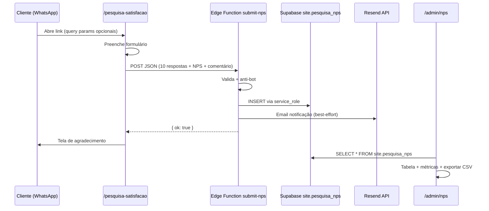

# STORY-034 — Pesquisa NPS / Satisfação do Cliente

## Contexto

A Previx precisa de um formulário de Pesquisa de Satisfação (NPS) para enviar aos clientes. Hoje existe um .docx manual (Revisão 02, abril/2026). O pedido do Marcos (SGQ — Sistema de Gestão de Qualidade) é:

1. Formulário digital com a logomarca da Previx
2. Campos editáveis: Nome do cliente, Período
3. 10 perguntas com escala Ótimo/Bom/Ruim (emoji)
4. Satisfação geral: Muito Satisfeito / Satisfeito / Pouco Satisfeito / Insatisfeito
5. NPS: escala 0-10
6. Campo de comentários livre
7. Preview rica ao compartilhar via WhatsApp/email (Open Graph)
8. Notificação por email a cada envio
9. Exportação de respostas (tabela / CSV)
10. Admin: visualizar todas as respostas

**Decisão:** Implementar dentro do site Previx (mesmo banco Supabase, mesmo admin), NÃO no Google Forms. Motivos:
- Dados ficam no Supabase (controle, LGPD, sem limite)
- Admin panel já existe — rota nova `/admin/nps`
- Notificação por email já implementada (Resend)
- Visual profissional com branding Previx
- OG Preview rico ao compartilhar link

---

## Spec do Formulário

### URL pública

```
https://grupoprevix.com.br/pesquisa-satisfacao
```

Opcionalmente aceita query params para pré-preencher:
```
/pesquisa-satisfacao?cliente=Sky+Vila+Matilde&periodo=Maio+2026
```

### Perguntas (10 — escala 3 pontos)

| # | Pergunta | Área |
|---|----------|------|
| 1 | Os requisitos em contrato estão sendo cumpridos? | Contrato |
| 2 | Como você avalia a cordialidade e o profissionalismo da equipe comercial? | Comercial |
| 3 | Qual é a sua opinião sobre o atendimento do departamento jurídico? | Jurídico |
| 4 | Como foi sua experiência com o departamento financeiro? | Financeiro |
| 5 | O RH atendeu às expectativas na captação de colaboradores? | RH |
| 6 | Como avalia o Manual de Normas e Procedimentos do seu contrato? | Operações |
| 7 | Como avalia a eficiência, empatia e proatividade do gerente de operações? | Operações |
| 8 | Está satisfeito com a supervisão operacional e agilidade no retorno? | Supervisão |
| 9 | O controlador de acesso demonstrou postura profissional e comprometimento? | Portaria |
| 10 | Como avalia a limpeza, organização e conservação pelo auxiliar de serviços gerais? | Facilities |

**Escala:** Ótimo (8-10) 😀 / Bom (4-7) 😐 / Ruim (0-3) 😡

### Satisfação geral

4 opções: Muito Satisfeito / Satisfeito / Pouco Satisfeito / Insatisfeito

### NPS

Escala 0-10 com quadrados clicáveis (cores: 0-6 vermelho→amarelo, 7-8 amarelo, 9-10 verde)

### Comentários

Campo de texto livre (max 2000 chars)

### Metadados

- `cliente` — nome do posto/cliente (preenchido pelo respondente ou via query param)
- `periodo` — mês/ano de referência (idem)
- `criado_em` — timestamp automático
- `ip` — para anti-spam (não exposto)

---

## Plano de Implementação

### Camada 1 — Banco de dados (Migration)

**Tabela: `site.pesquisa_nps`**

```sql
CREATE TABLE site.pesquisa_nps (
  id uuid PRIMARY KEY DEFAULT gen_random_uuid(),
  cliente text NOT NULL CHECK (char_length(cliente) BETWEEN 2 AND 200),
  periodo text NOT NULL CHECK (char_length(periodo) BETWEEN 2 AND 50),
  
  -- 10 perguntas, escala: 'otimo' | 'bom' | 'ruim'
  q1 text NOT NULL CHECK (q1 IN ('otimo', 'bom', 'ruim')),
  q2 text NOT NULL CHECK (q2 IN ('otimo', 'bom', 'ruim')),
  q3 text NOT NULL CHECK (q3 IN ('otimo', 'bom', 'ruim')),
  q4 text NOT NULL CHECK (q4 IN ('otimo', 'bom', 'ruim')),
  q5 text NOT NULL CHECK (q5 IN ('otimo', 'bom', 'ruim')),
  q6 text NOT NULL CHECK (q6 IN ('otimo', 'bom', 'ruim')),
  q7 text NOT NULL CHECK (q7 IN ('otimo', 'bom', 'ruim')),
  q8 text NOT NULL CHECK (q8 IN ('otimo', 'bom', 'ruim')),
  q9 text NOT NULL CHECK (q9 IN ('otimo', 'bom', 'ruim')),
  q10 text NOT NULL CHECK (q10 IN ('otimo', 'bom', 'ruim')),
  
  -- Satisfação geral
  satisfacao text NOT NULL CHECK (satisfacao IN ('muito_satisfeito', 'satisfeito', 'pouco_satisfeito', 'insatisfeito')),
  
  -- NPS (0-10)
  nps int NOT NULL CHECK (nps BETWEEN 0 AND 10),
  
  -- Comentários
  comentarios text CHECK (char_length(comentarios) <= 2000),
  
  -- Metadados
  ip inet,
  criado_em timestamptz NOT NULL DEFAULT now()
);

-- RLS: só service_role insere, admin lê
ALTER TABLE site.pesquisa_nps ENABLE ROW LEVEL SECURITY;
ALTER TABLE site.pesquisa_nps FORCE ROW LEVEL SECURITY;

-- Anon: sem acesso
-- Authenticated (admin): SELECT
CREATE POLICY "admin_select_nps" ON site.pesquisa_nps
  FOR SELECT TO authenticated
  USING (site.has_permission('nps', 'read'));

-- INSERT apenas via service_role (Edge Function)
-- DELETE bloqueado (compliance)

CREATE INDEX idx_nps_criado ON site.pesquisa_nps (criado_em DESC);
CREATE INDEX idx_nps_cliente ON site.pesquisa_nps (cliente);
```

### Camada 2 — Edge Function `submit-nps`

Segue o mesmo padrão do `submit-lead`:

- Validação de todos os campos (enum check, length check)
- Rate limit: 3 submissões por IP por hora (mais restritivo que leads)
- Honeypot field (anti-bot)
- INSERT via service_role
- Notificação por email (Resend) com resumo:
  - Cliente, período, NPS score
  - Resumo das 10 respostas (contagem ótimo/bom/ruim)
  - Link direto para `/admin/nps`
- Resposta: `{ ok: true, id }` ou `{ error, reason }`

### Camada 3 — Página pública `/pesquisa-satisfacao`

Nova página Astro: `src/pages/pesquisa-satisfacao.astro`

**Design:**
- Header com logo Previx (horizontal colorida)
- Card centralizado com padding generoso
- Campos: cliente (text) + período (text)
- 10 perguntas com 3 botões emoji cada (radio visual)
- Satisfação geral: 4 cards selecionáveis
- NPS: barra horizontal 0-10 com quadrados coloridos
- Textarea para comentários
- Botão "Enviar pesquisa"
- Tela de sucesso com agradecimento

**OG Preview (para WhatsApp/email):**
```html
<meta property="og:title" content="Pesquisa de Satisfação — Grupo Previx" />
<meta property="og:description" content="Avalie nossos serviços de segurança e facilities. Sua opinião nos ajuda a melhorar." />
<meta property="og:image" content="/assets/og/pesquisa-satisfacao.jpg" />
```

**Anti-bot:** Honeypot + timestamp check (mesma estratégia do `/contato`)

### Camada 4 — Admin `/admin/nps`

Nova rota no admin SPA React:

**Listagem:**
- Tabela com: Cliente | Período | NPS | Satisfação | Data
- Filtros: por cliente, por período, por faixa NPS (promotor/neutro/detrator)
- Badge colorido no NPS (0-6 vermelho, 7-8 amarelo, 9-10 verde)
- Botão "Exportar CSV"

**Detalhe (click na linha):**
- Modal com todas as 10 respostas + comentário completo

**Métricas (topo da página):**
- NPS Score médio (promotores - detratores)
- Total de respostas
- % Ótimo nas 10 perguntas (gráfico de barras simples)

**Exportar CSV:**
- Gera arquivo com todas as colunas (cliente, periodo, q1-q10, satisfacao, nps, comentarios, data)
- Download direto no browser (sem Edge Function — query no client com service key do admin)

### Camada 5 — Permissões RBAC

Adicionar resource `nps` ao `site.role_definitions`:
- `admin-previx`: `['read', 'export']`
- `admin-site`: `['read', 'export']`
- `comercial`: `['read']`
- Demais: sem acesso

---

## Critérios de Aceite

- [ ] CA1 — Migration aplicada: tabela `site.pesquisa_nps` com RLS + policies
- [ ] CA2 — Edge Function `submit-nps` deployada e respondendo 200 para payload válido
- [ ] CA3 — Página `/pesquisa-satisfacao` com design profissional, logo Previx, 10 perguntas, escala NPS e campo de comentários
- [ ] CA4 — Query params `?cliente=X&periodo=Y` pré-preenchem os campos
- [ ] CA5 — OG tags geram preview rica ao compartilhar via WhatsApp
- [ ] CA6 — Anti-bot: honeypot + timestamp check
- [ ] CA7 — Notificação por email a cada envio (Resend) com resumo da pesquisa
- [ ] CA8 — Rota `/admin/nps` com listagem, filtros e métricas NPS
- [ ] CA9 — Exportar CSV com todos os dados
- [ ] CA10 — Permissões RBAC: apenas admin-previx, admin-site e comercial podem ver
- [ ] CA11 — Mobile-first: formulário funciona bem em celular (clientes vão receber via WhatsApp)

---

## Arquivos esperados

| Arquivo | Tipo | Descrição |
|---------|------|-----------|
| `supabase/migrations/20260520_create_pesquisa_nps.sql` | Migration | Tabela + RLS + policies + indexes |
| `supabase/functions/submit-nps/index.ts` | Edge Function | Validação + INSERT + notificação |
| `src/pages/pesquisa-satisfacao.astro` | Página pública | Formulário com design Previx |
| `src/admin/pages/NpsPage.tsx` | Admin SPA | Listagem + filtros + métricas + CSV |
| `src/admin/components/NpsDetailModal.tsx` | Admin SPA | Modal de detalhe da resposta |
| `public/assets/og/pesquisa-satisfacao.jpg` | Imagem OG | Preview WhatsApp/social |

---

## Fluxo completo



---

## Estimativa

| Etapa | Tempo |
|-------|-------|
| Migration + RLS | 30 min |
| Edge Function | 1h |
| Página pública (design + form + JS) | 2h |
| Admin (listagem + métricas + CSV) | 2h |
| OG image + testes | 30 min |
| Deploy + validação end-to-end | 30 min |
| **Total** | **~6-7h** |

---

## Decisões em aberto

1. **Perguntas fixas ou editáveis?** — Recomendo fixas no código por agora (as 10 perguntas raramente mudam). Se no futuro quiserem editar, migra para JSONB.
2. **Anonimato** — O formulário NÃO pede nome de quem responde, apenas o nome do posto/cliente. Ok?
3. **Múltiplas respostas por cliente/período** — Permitir ou bloquear duplicatas? Recomendo permitir (diferentes pessoas do mesmo cliente podem responder).
4. **Idioma do NPS** — Manter "Qual a probabilidade de recomendar?" como texto fixo?

---

*Baseado no documento "Formulário de Pesquisa de Satisfação dos Clientes - Modelo - Revisão.02 - 06.04.26.docx" + conversa com Marcos (SGQ).*
