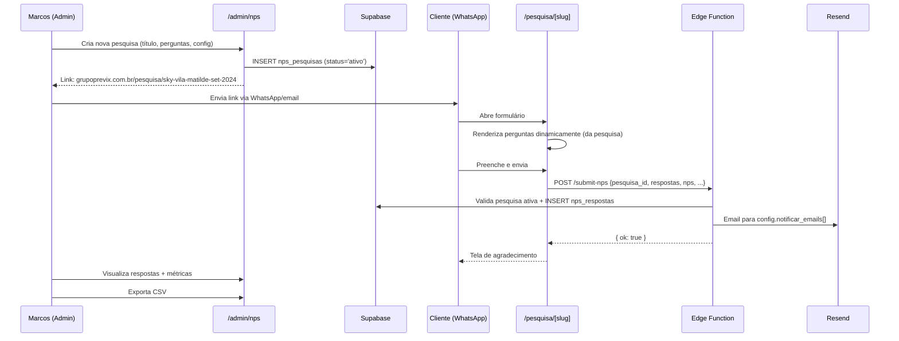

# STORY-034 — Sistema de Pesquisas NPS / Satisfação do Cliente

## Contexto

A Previx precisa de um sistema completo de Pesquisas de Satisfação (NPS) integrado ao site. O SGQ (Marcos) cria pesquisas diferentes para diferentes clientes/períodos, com perguntas customizáveis.

**Requisitos confirmados:**
1. Perguntas **editáveis** — admin cria pesquisas com as perguntas que quiser
2. **Múltiplas pesquisas** — cada uma com URL própria para enviar ao cliente
3. **Configurável no admin** — permitir/bloquear duplicatas, destinatários de notificação
4. **Dados no admin** — visualizar respostas, exportar CSV, métricas NPS
5. **Preview rica no WhatsApp** — ao compartilhar o link, deve aparecer imagem de capa + título + descrição (igual Google Forms faz)

---

## Modelo de dados

### Entidade: Pesquisa (`site.nps_pesquisas`)

Cada pesquisa criada no admin é uma "campanha" com suas próprias perguntas.

```
┌─────────────────────────────────┐
│ nps_pesquisas                   │
├─────────────────────────────────┤
│ id (uuid PK)                    │
│ titulo (text)                   │  "Pesquisa Set/2024 - Sky Vila Matilde"
│ slug (text UNIQUE)              │  "sky-vila-matilde-set-2024"
│ descricao (text?)               │  Texto introdutório no topo do form + og:description
│ imagem_og (text?)               │  URL da imagem de capa (OG image para WhatsApp preview)
│ cliente_padrao (text?)          │  Pré-preenche campo "cliente"
│ periodo_padrao (text?)          │  Pré-preenche campo "período"
│ perguntas (jsonb)               │  Array de {id, texto, area, tipo}
│ config (jsonb)                  │  {permitir_duplicatas, notificar_emails[], ativo}
│ status (text)                   │  'rascunho' | 'ativo' | 'encerrado'
│ criado_em (timestamptz)         │
│ atualizado_em (timestamptz)     │
│ criado_por (uuid FK auth.users) │
└─────────────────────────────────┘
```

**`perguntas` JSONB structure:**
```json
[
  { "id": "q1", "texto": "Os requisitos em contrato estão sendo cumpridos?", "area": "Contrato", "tipo": "escala_3" },
  { "id": "q2", "texto": "Como avalia a equipe comercial?", "area": "Comercial", "tipo": "escala_3" },
  ...
]
```

**`tipo` de pergunta suportados:**
- `escala_3` — Ótimo 😀 / Bom 😐 / Ruim 😡
- `satisfacao_4` — Muito Satisfeito / Satisfeito / Pouco Satisfeito / Insatisfeito
- `nps_0_10` — Escala 0-10
- `texto_livre` — Campo aberto (max 2000 chars)

**`config` JSONB:**
```json
{
  "permitir_duplicatas": true,
  "notificar_emails": ["marcos@grupoprevix.com.br", "previx@grupoprevix.com.br"],
  "mostrar_nps": true,
  "mostrar_satisfacao_geral": true,
  "mostrar_comentarios": true
}
```

### Entidade: Resposta (`site.nps_respostas`)

```
┌─────────────────────────────────┐
│ nps_respostas                   │
├─────────────────────────────────┤
│ id (uuid PK)                    │
│ pesquisa_id (uuid FK)           │  → nps_pesquisas.id
│ cliente (text)                  │  Nome do posto/cliente
│ periodo (text)                  │  Período de referência
│ respostas (jsonb)               │  {"q1": "otimo", "q2": "bom", ...}
│ satisfacao (text?)              │  Se pesquisa tem satisfação geral
│ nps (int?)                      │  Se pesquisa tem NPS (0-10)
│ comentarios (text?)             │  Se pesquisa tem campo livre
│ ip (inet)                       │  Anti-spam
│ criado_em (timestamptz)         │
└─────────────────────────────────┘
```

---

## Fluxo completo



---

## Admin — Telas

### 1. `/admin/nps` — Lista de pesquisas

| Coluna | Descrição |
|--------|-----------|
| Título | Nome da pesquisa |
| Status | Badge: rascunho / ativo / encerrado |
| Respostas | Contagem de respostas recebidas |
| NPS Médio | Score calculado (se aplicável) |
| Criada em | Data de criação |
| Ações | Editar · Ver respostas · Copiar link · Encerrar |

**Botão "Nova Pesquisa"** abre o editor.

### 2. `/admin/nps/nova` e `/admin/nps/:id/editar` — Editor de pesquisa

**Seção 1 — Dados básicos:**
- Título da pesquisa (obrigatório) → vira `og:title` no WhatsApp
- Slug (auto-gerado do título, editável)
- Descrição introdutória (opcional) → aparece no topo do form + vira `og:description` no WhatsApp
- Imagem de capa (ImagePicker, opcional) → vira `og:image` no WhatsApp. Se vazio, usa imagem padrão com logo Previx
- Cliente padrão (pré-preenche)
- Período padrão (pré-preenche)

**Seção 2 — Perguntas (drag & drop / reorder):**
- Botão "+ Adicionar pergunta"
- Cada pergunta: texto + área/categoria + tipo (dropdown: escala_3, satisfacao_4, nps_0_10, texto_livre)
- Reorder (↑↓) e remover (×)
- Template: botão "Carregar template padrão" insere as 10 perguntas do SGQ

**Seção 3 — Configuração:**
- [x] Incluir pergunta NPS (0-10)
- [x] Incluir satisfação geral (4 opções)
- [x] Incluir campo de comentários
- [ ] Bloquear duplicatas (mesmo IP/cliente/período)
- Emails para notificação (chips input, adicionar/remover)

**Seção 4 — Ações:**
- Salvar como rascunho
- Ativar (muda status para 'ativo', gera link público)
- Copiar link para clipboard

### 3. `/admin/nps/:id/respostas` — Respostas de uma pesquisa

**Topo — Métricas:**
- NPS Score: (% promotores - % detratores) com gauge visual
- Total de respostas
- Distribuição das 10 perguntas (mini gráfico barras: % ótimo/bom/ruim)

**Tabela de respostas:**
| Cliente | Período | NPS | Satisfação | Data | Ações |
|---------|---------|-----|-----------|------|-------|
| Sky Vila Matilde | Set/2024 | 9 🟢 | Muito Satisfeito | 20/05/2026 | Ver |

**Click "Ver"** → Modal com todas as respostas detalhadas + comentário

**Botão "Exportar CSV"** → Download com todas as colunas

---

## Página pública — `/pesquisa/[slug]`

**Rota:** `src/pages/pesquisa/[slug].astro` (SSR, prerender=false)

**Comportamento:**
1. Fetch da pesquisa pelo slug (SELECT com status='ativo')
2. Se não encontrar ou encerrada → 404 com mensagem amigável
3. Renderiza dinamicamente baseado no `perguntas` JSONB
4. Query params `?cliente=X&periodo=Y` pré-preenchem campos

**Design:**
- Mobile-first (clientes recebem via WhatsApp)
- Logo Previx topo
- Card branco com perguntas
- Emojis grandes e clicáveis na escala_3
- Barra NPS colorida (vermelho→amarelo→verde)
- Satisfação geral com 4 cards selecionáveis
- Botão "Enviar" azul Previx
- Tela sucesso: "Obrigado! Sua resposta foi registrada."

**OG Preview (preview rica no WhatsApp / email):**

Quando alguém cola o link no WhatsApp, deve aparecer como card rico (igual print do Marcos):

```
┌────────────────────────────────────────┐
│  [Imagem: logo Previx + arte genérica  │
│   ou imagem_og custom da pesquisa]     │
├────────────────────────────────────────┤
│  PESQUISA DE SATISFAÇÃO — GRUPO PREVIX │
│  Avalie nossos serviços de segurança   │
│  e facilities. Sua opinião é valiosa.  │
│  ─────────────────────────────────     │
│  🔗 grupoprevix.com.br                 │
└────────────────────────────────────────┘
```

**Implementação (SSR — tags dinâmicas por pesquisa):**
```html
<meta property="og:title" content="{pesquisa.titulo}" />
<meta property="og:description" content="{pesquisa.descricao || 'Avalie nossos serviços...'}" />
<meta property="og:image" content="{pesquisa.imagem_og || '/assets/og/pesquisa-satisfacao-default.jpg'}" />
<meta property="og:type" content="website" />
<meta property="og:url" content="https://grupoprevix.com.br/pesquisa/{slug}" />
<meta property="og:site_name" content="Grupo Previx" />
```

**Imagem OG padrão:** Criamos 1 imagem estática de alta qualidade (1200×630px) com:
- Logo Previx centralizado
- Fundo navy (#0A1F3C) ou gradiente institucional
- Texto "Pesquisa de Satisfação" abaixo do logo
- Dimensões exatas para WhatsApp (1200×630) e Telegram (800×418)

**Imagem OG custom (opcional):** No admin, o campo "Imagem de capa" permite upload via ImagePicker (reusa o mesmo componente de assets do blog). Se preenchido, usa essa imagem em vez da padrão.

**Por que funciona:** A página `/pesquisa/[slug]` é SSR (server-side rendered), então o WhatsApp crawler recebe HTML com as meta tags já preenchidas — não depende de JavaScript client-side.

---

## Edge Function — `submit-nps`

```typescript
// Validação:
// 1. pesquisa_id existe e status === 'ativo'
// 2. respostas contém todas as perguntas da pesquisa
// 3. Cada resposta tem valor válido para o tipo da pergunta
// 4. NPS entre 0-10 (se pesquisa tem NPS)
// 5. Rate limit: 5 submissões por IP por hora
// 6. Honeypot check
// 7. Se !config.permitir_duplicatas: verificar se já existe resposta com mesmo cliente+periodo

// Notificação (Resend):
// Para: config.notificar_emails[]
// Assunto: "Nova resposta: [título pesquisa] — [cliente] (NPS: X)"
// Corpo: resumo visual das respostas + link para /admin/nps/:id/respostas
```

---

## Permissões RBAC

| Role | Permissões |
|------|-----------|
| admin-previx | nps.create, nps.read, nps.update, nps.delete, nps.export |
| admin-site | nps.create, nps.read, nps.update, nps.delete, nps.export |
| comercial | nps.read, nps.export |
| editor-blog | — |
| viewer | — |

---

## Critérios de Aceite

- [x] CA1 — Tabelas `site.nps_pesquisas` e `site.nps_respostas` com RLS + policies
- [x] CA2 — Admin: criar pesquisa com perguntas customizáveis (qualquer quantidade, qualquer texto)
- [x] CA3 — Admin: template "Pesquisa Padrão SGQ" carrega as 10 perguntas do modelo atual
- [x] CA4 — Admin: configurar emails de notificação, permitir/bloquear duplicatas
- [x] CA5 — Página pública `/pesquisa/[slug]` renderiza dinamicamente as perguntas da pesquisa
- [x] CA6 — Query params pré-preenchem cliente e período
- [x] CA7 — OG tags geram preview rica ao compartilhar via WhatsApp
- [x] CA8 — Edge Function valida, insere e notifica por email (Resend)
- [x] CA9 — Admin: listagem de pesquisas com contagem de respostas e NPS médio
- [x] CA10 — Admin: visualizar respostas individuais + métricas agregadas
- [x] CA11 — Admin: exportar CSV de uma pesquisa
- [x] CA12 — Admin: copiar link público da pesquisa com 1 clique
- [x] CA13 — Mobile-first: formulário funciona perfeitamente no celular
- [x] CA14 — Anti-bot: honeypot + rate limit
- [x] CA15 — Pesquisa encerrada mostra mensagem amigável (não 404 genérico) — fix 25/05 commit 329a19a

---

## Notas de Implementação (atualizadas 25/05/2026)

**Fix-up bugs encontrados em diagnóstico:**

1. **Distribuição por pergunta no admin (`NpsRespostasPage.tsx`)** — o agregado filtrava
   valores `'otimo' | 'bom' | 'ruim'` que nunca existem (o front salva escala de
   estrelas `'1'..'5'`). Resultado: barras sempre vazias. Corrigido para agrupar
   em 4-5★ / 3★ / 1-2★ e mostrar média numérica por pergunta. Commit `329a19a`.

2. **CA15 (mensagem amigável)** — `[slug].astro` fazia `Astro.redirect('/404')`.
   Agora renderiza inline com texto distinto para "não encontrada" (HTTP 404)
   vs "encerrada" (HTTP 410). Migration `20260525120000_nps_anon_read_encerrada.sql`
   ampliou a policy anon de `status='ativo'` para `status IN ('ativo','encerrado')`.
   Commit `329a19a`. Validado em produção 25/05.

**Diagnóstico do dia 25/05 (Marcos reportou que testes do time não chegavam):**
edge function, DB e Resend confirmados funcionais via submit manual. Marcos
listou: Ricardo ✅ (22/05), Adriano ❌, Cláudio ❌, Alessandro ❌.

Logs reais via Supabase Management API (`function_edge_logs` na janela 25/05):
- 9 POSTs ao endpoint
- 7 com HTTP 200, mas só 2 inserções reais no DB
- **5 status=200 foram early-returns silenciosos** (sem inserir nem notificar)

Confirmadas 3 causas raiz e corrigidas no commit `4b89cb3`:

1. **Timing check 2s removido** — `Date.now() - formRenderedAt < 2000` disparava
   ok:true sem inserir quando relógio do client estava dessincronizado (delta
   negativo) ou em recargas rápidas. Honeypot sozinho continua filtrando bots.
2. **`<input type="hidden" required>` substituído** por validação JS visível
   com destaque em vermelho na pergunta faltante + scroll automático até ela
   + contador "Faltam X pergunta(s)". Idem para radios `_satisfacao` e `_nps`.
3. **Rate limit subido de 5 → 30/hora por IP** — Previx tem funcionários atrás
   de NAT corporativo, compartilham IP público.

**Observabilidade adicionada:** `logEvent()` estruturado em JSON em todos os
caminhos (rate_limited, honeypot_triggered, validation_fail, duplicate_blocked,
insert_error, insert_ok, notify_ok, notify_resend_fail, notify_exception).
Acessível via Supabase Logs Explorer ou Management API
(`/v1/projects/{ref}/analytics/endpoints/logs.all` no source `function_logs`).

---

## Arquivos esperados

| Arquivo | Tipo |
|---------|------|
| `supabase/migrations/20260520_create_nps_system.sql` | Migration |
| `supabase/functions/submit-nps/index.ts` | Edge Function |
| `src/pages/pesquisa/[slug].astro` | Página pública (SSR) |
| `src/admin/pages/NpsListPage.tsx` | Admin — lista de pesquisas |
| `src/admin/pages/NpsEditorPage.tsx` | Admin — criar/editar pesquisa |
| `src/admin/pages/NpsRespostasPage.tsx` | Admin — ver respostas + métricas |
| `src/admin/components/NpsDetailModal.tsx` | Admin — modal resposta individual |
| `src/admin/components/NpsPerguntaEditor.tsx` | Admin — editor de pergunta (reusável) |
| `public/assets/og/pesquisa-satisfacao.jpg` | Imagem OG |

---

## Estimativa revisada

| Etapa | Tempo |
|-------|-------|
| Migration (2 tabelas + RLS + policies + RBAC seed) | 45 min |
| Edge Function `submit-nps` | 1.5h |
| Página pública `/pesquisa/[slug]` (SSR + design mobile) | 3h |
| Admin — NpsListPage (CRUD pesquisas) | 2h |
| Admin — NpsEditorPage (perguntas dinâmicas + config) | 3h |
| Admin — NpsRespostasPage (tabela + métricas + CSV) | 2.5h |
| OG image + deploy + testes E2E | 1h |
| **Total** | **~14h** |

---

*Baseado no doc "Formulário de Pesquisa de Satisfação dos Clientes - Revisão.02" + pedido do Marcos (SGQ) + conversa com JG.*
