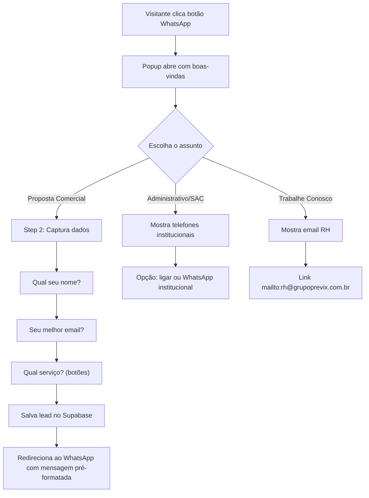

# STORY-035 — WhatsApp Chatbot Conversacional + Reestruturação de Contatos

## Contexto

A Previx solicitou 3 alterações no site:
1. **Botão WhatsApp com chatbot** — ativar botão flutuante com pop-up conversacional que captura lead e direciona ao WhatsApp comercial
2. **Separar contatos no rodapé** — dividir institucional (SAC, 0800) de comercial (WhatsApp vendas)
3. **Simplificar formulário de contato** — substituir formulário extenso (6 campos) por fluxo conversacional leve que captura nome + email + interesse e redireciona ao WhatsApp

**Referência analisada:** Grupo GR (grupogr.com.br) usa Leadster com avatar + dropdown de 3 opções. Faremos similar mas nativo (sem terceiros), com steps conversacionais estilo chat.

**WhatsApp Comercial:** +55 11 94764-4577

## Dados de Contato (Fonte: Previx)

### Comercial
- WhatsApp: +55 11 94764-4577
- Email: (a confirmar)

### Institucional (mantém)
- Telefone: +55 11 3875-1148
- SAC 24h: 0800 515 0000
- Email: previx@grupoprevix.com.br

### Trabalhe Conosco
- Email: rh@grupoprevix.com.br

---

## Fluxo do Chatbot



### Mensagem pré-formatada no WhatsApp
```
Olá! Sou [Nome], tenho interesse em [Serviço]. Meu email: [email]
```

---

## Rodapé — Novo Layout

```
┌──────────────────────────────────────────────────────────────────────────┐
│ LOGO       │ Como chegar?         │ Institucional        │ Comercial     │
│ PREVIX     │ Av. Queiroz Filho,   │ +55 11 3875-1148    │ +55 11 94764  │
│            │ 917                  │ 0800 515 0000       │   -4577 (WA)  │
│            │ Vila Hamburguesa     │ SAC 24 Horas        │ email (TBD)   │
│            │ São Paulo – SP       │ previx@grupo...     │               │
│            │                      │                     │ Trabalhe      │
│            │                      │                     │ Conosco       │
│            │                      │                     │ rh@grupo...   │
└──────────────────────────────────────────────────────────────────────────┘
```

Ordem: Logo → Como chegar? → Institucional → Comercial

---

## Página /contato — Fluxo Conversacional (Tela Cheia)

Substituir formulário extenso por chat conversacional full-page:
- Mesmo fluxo do widget mas em tela cheia com mais espaço visual
- Background alinhado com marca Previx + área de chat centralizada
- Mensagens aparecem uma a uma com typing animation
- 3 caminhos: Proposta Comercial / Administrativo / Trabalhe Conosco
- `origem: "chatbot_contato"` para diferenciar nos relatórios

---

## Tracking / Integração com Leads

| Origem | Dados capturados | Campo `origem` |
|--------|-----------------|----------------|
| Widget flutuante | Nome + Email + Serviço + UTMs | `chatbot_widget` |
| Página /contato | Nome + Email + Serviço + UTMs | `chatbot_contato` |

- Lead salvo via Edge Function `submit-lead` (já existe)
- GTM dataLayer event em cada step
- Futuro: vincular lead com número que chamou no WhatsApp (CRM)

---

## Arquivos Esperados

| Arquivo | Ação |
|---------|------|
| `src/config/empresa.ts` | Editar — adicionar bloco `comercial` e `rh` |
| `src/components/layout/WhatsAppChatWidget.astro` | Criar — widget chatbot completo |
| `src/components/layout/WhatsAppFloat.astro` | Remover ou deprecar |
| `src/layouts/BaseLayout.astro` | Editar — trocar import pelo novo widget |
| `src/components/layout/SiteFooter.astro` | Editar — reorganizar em blocos |
| `src/pages/contato.astro` | Reescrever — fluxo conversacional tela cheia |

---

## Critérios de Aceite

- [ ] CA1: Botão WhatsApp flutuante visível em todas as páginas (desktop e mobile)
- [ ] CA2: Ao clicar, abre popup com boas-vindas e 3 opções (Proposta / Administrativo / Trabalhe Conosco)
- [ ] CA3: Fluxo "Proposta Comercial" captura nome + email + serviço em steps conversacionais
- [ ] CA4: Ao completar, lead é salvo no Supabase com `origem: chatbot_widget` e UTMs
- [ ] CA5: Redirecionamento para WhatsApp +55 11 94764-4577 com mensagem pré-formatada
- [ ] CA6: Rodapé reorganizado: Como chegar → Institucional → Comercial + Trabalhe Conosco
- [ ] CA7: Página /contato com fluxo conversacional em tela cheia (mesma lógica do widget)
- [ ] CA8: Lead da página contato salvo com `origem: chatbot_contato`
- [ ] CA9: Responsivo — widget vira tela cheia no mobile
- [ ] CA10: Nenhuma dependência de terceiros (100% nativo)

---

## Estimativa

| Componente | Tempo |
|-----------|-------|
| empresa.ts (config) | 10min |
| WhatsApp Chat Widget | 2h |
| Rodapé reestruturado | 30min |
| Página /contato conversacional | 1.5h |
| Testes + ajustes responsivos | 30min |
| **Total** | **~4.5h** |

---

*Solicitado pelo time Previx em 22/05/2026. Referência: Grupo GR (grupogr.com.br).*
