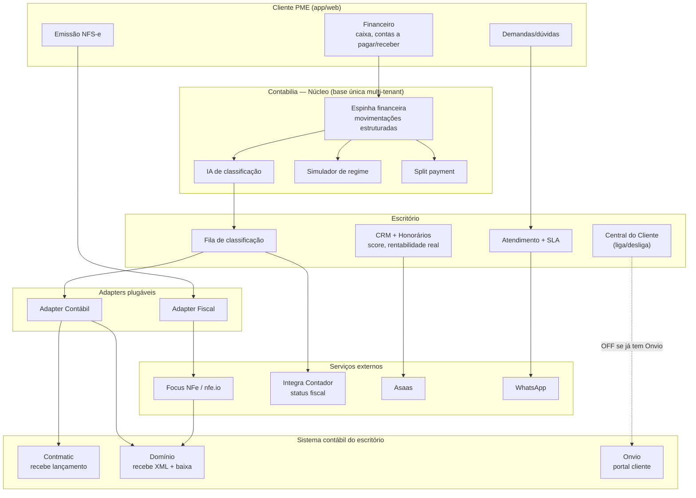

# MVP Contabilia — Especificação Interna

*Documento interno de produto. Para apresentação comercial, ver [[Proposta-TLima]]. Para reposicionamento estratégico e tese, ver [[Alinhamento-Reposicionamento]].*

---

## Objetivo do MVP

"MVP entregue" quando todos os critérios abaixo forem verdade:

- **2 escritórios-piloto, cada um validando um adapter contábil:**
  - **C Brasil** (Contmatic) — ≥5 clientes finais ativos
  - **T Lima** (Domínio + Onvio) — parceiro/piloto; valida o adapter Domínio (reutilizável em qualquer escritório Domínio, líder de mercado)
- **Loop central funcionando end-to-end:** cliente lança → IA classifica → escritório revisa exceção → alimenta o sistema contábil + emite nota
- **Os dois adapters plugáveis funcionando** (saída contábil: Contmatic + Domínio; emissão fiscal: Focus + nfe.io)
- **Redução de tempo operacional mensurável** em ≥1 frente (classificação fiscal, cobrança de documentos OU atendimento)
- **Marco regulatório atendido:** notas emitidas com campos IBS/CBS

> **Nota sobre a Central do Cliente:** é módulo **liga/desliga**. Ligado pra C Brasil (não tem portal próprio). **Desligado pra T Lima** (já tem Onvio — não vendemos o que eles têm de graça).

**Não é objetivo do MVP:** Open Finance, DRE gerencial/centro de custo, apuração dual/SPED, camada de inteligência, app mobile nativo, white-label visual avançado.

---

## O loop central (a coisa única que precisa funcionar)

```
[Cliente PME no app/web]
  ↓ Lança movimento ("Recebi R$ 3.000 do João pela consultoria")
  ↓ Anexa documento (foto/PDF) — opcional
  ↓
[Sistema Contabilia]
  ↓ Cria conta a receber automática
  ↓ Sugere emitir NFS-e (via adapter de emissão fiscal: Focus NFe / nfe.io)
  ↓ IA classifica (conta contábil + CFOP + CST) com score de confiança 0-100%
  ↓
[Fila do escritório]
  ↓ ≥95%  → lançamento automático, revisão pós-fato
  ↓ 70-94% → sugestão + aprovação 1 clique
  ↓ <70%  → fila manual, contador classifica, IA aprende
  ↓
[Saída — adapter contábil plugável por escritório]
  → Contmatic: empurra o lançamento contábil pronto (POST /v1/lancamentos)
  → Domínio: empurra XML da nota + baixa de parcela (o próprio Domínio
             gera o lançamento — a API NÃO aceita lançamento direto)
  → Genérico: export CSV/Excel padrão (Fortes, Alterdata, etc.)
  → Status fiscal cruzado via Integra Contador (Serpro)
```

**Regra de ouro:** se este loop não funciona end-to-end pra 5 clientes reais, o MVP não está pronto. Tudo o mais é acessório.

---

## Escopo funcional — Lado Cliente (PME)

### Espinha financeira
- **Fluxo de caixa** — saldo atual, projeção 30/60/90 dias
- **Contas a pagar / contas a receber** — cadastro, vencimento, status (pago/em aberto/atrasado)
- **Lançamento de movimento** (entrada/saída) com:
  - Tipo, valor, data, descrição
  - Categoria (IA sugere)
  - Cliente/fornecedor (autocomplete por CNPJ via BrasilAPI)
  - Anexo (PDF, foto)
- **Conciliação manual** via upload OFX/CSV (Open Finance fica pra V2)

### Emissão de NFS-e (via adapter de emissão fiscal)
- Emissão individual a partir de uma entrada de caixa
- Emissão em lote (importação planilha ou grid online)
- Templates por tipo de serviço (pré-configurados por cliente)
- Status: emitida, processando, erro (com motivo claro)
- Download PDF/XML
- Cancelamento (janela permitida pelo município)

### Dashboard do cliente
- Entrou/saiu este mês
- O que vence nos próximos 7/15/30 dias
- Meus impostos (do contador, via Central do Cliente)
- Última nota emitida

### Recebimento de obrigações (lado consumidor da Central)
- Guias de pagamento (DAS, DARF, DAM) com QR Pix
- Certidões negativas (CND)
- Relatórios fiscais mensais
- Notificação push + email + WhatsApp ao receber

---

## Escopo funcional — Lado Escritório

> **⭐ CRM + Atendimento são DIFERENCIAIS, não só suporte operacional.** O que os torna fortes é estarem **integrados ao dado financeiro/fiscal** que a Contabilia captura: o CRM sabe a **rentabilidade real** de cada cliente, e o Atendimento prioriza pelo **contexto completo** do cliente. Standalone — ou no Gestão/Messenger do Domínio — não têm esse dado. (Pra escritório que já tem Messenger/Gestão, lideramos pelo ângulo do dado integrado, não pela função básica de comunicação.)

### CRM Contábil ⭐
Base única do cliente — hoje espalhada entre sistema, WhatsApp e a cabeça do contador.
- **Cadastro completo:** dados cadastrais + fiscais (regime, CNAEs, inscrições, certificado A1), contrato (honorário, vencimento, forma de cobrança), responsáveis (quem manda doc, financeiro, sócios), tags/segmentação (setor, porte, complexidade)
- **Gestão documental:** certificado A1 com alerta de vencimento (30/60/90 dias), procuração eletrônica (validade), documentos por competência
- **Histórico / timeline unificada:** toda interação, documento, nota, obrigação, demanda e anotação do contador, por cliente

### Honorários e inadimplência ⭐
- Faturamento mensal automático (boleto/Pix via Asaas) + régua de cobrança (D-3, D, D+3, D+7, D+15)
- Dashboard de inadimplência: quem deve, quanto, há quanto tempo
- **Score de saúde do cliente:** pontualidade de documentos + inadimplência + complexidade
- **Rentabilidade real por cliente** ⭐: como a Contabilia captura o trabalho real (notas, demandas, documentos), calcula *custo real × honorário pago* → identifica **cliente deficitário** → base concreta pra renegociar contrato com dado, não achismo. **Um CRM avulso (ou o Gestão do Domínio) não faz isso** — depende do dado operacional que só a Contabilia tem.

### Fila de classificação IA
- Lista de lançamentos pendentes, ordenada por confiança
- Aprovação em 1 clique (≥70%)
- Reclassificação (IA aprende)
- Batch action: aprovar todos ≥95%

### Saída para sistema contábil (adapter plugável)
Selecionado por configuração do escritório. Ver seção **Camada de Adaptadores**.
- **Contmatic** (`POST /v1/lancamentos`) — empurra o lançamento contábil pronto. Usado pela C Brasil.
- **Domínio** (`POST /invoice/v3/batches` + baixa de parcelas, OAuth2) — empurra o **XML da nota e a baixa**; o Domínio gera o lançamento. Usado pela T Lima. ⚠️ A API do Domínio é **só de entrada** — não aceita lançamento contábil nem expõe leitura de dados.
- **Genérico** (CSV/Excel padrão) — Fortes, Alterdata, outros.

### Status fiscal — Integra Contador (Serpro)
- Situação fiscal por cliente
- DCTFWeb consultada
- Caixa Postal do e-CAC monitorada (alertas pra escritório)
- PGDAS-D (Simples Nacional)

### Atendimento / Demandas ⭐
Acaba com "demanda perdida no WhatsApp" — rastreabilidade + SLA + contexto financeiro do cliente.

**Pro cliente (portal ou WhatsApp):**
- Abre chamado por categoria; acompanha status (Aberto → Em andamento → Aguardando → Concluído); vê histórico de demandas passadas
- Pelo WhatsApp, a IA classifica e cria o ticket sozinha ("preciso de uma CND" → categoria Certidão, SLA 48h)

**Pro escritório:**
- Fila com prioridade (SLA + score do cliente + urgência) e atribuição por responsável
- Templates de resposta + IA sugere resposta pra dúvida fiscal (RAG sobre legislação)
- Categorização automática das demandas que chegam por WhatsApp
- Dashboard: abertos / em andamento / atrasados / resolvidos / tempo médio

**SLA por tipo:**

| Categoria | SLA |
|---|---|
| Urgência fiscal | 2h |
| Emissão de nota | 4h |
| Dúvida fiscal | 24h |
| Certidão/documento | 48h |
| Alteração cadastral | 5 dias |
| Planejamento tributário | 10 dias |

**Automações:**
- Demanda aberta → responsável notificado
- SLA prestes a estourar → escalonamento automático ao admin
- Concluída → pesquisa de satisfação (1-5 estrelas)
- Relatório mensal: volume de demandas, SLA cumprido, satisfação média

### Central do Cliente — publicação
- Subir guia/CND/relatório
- Selecionar cliente(s) destino (individual ou lote)
- Mensagem opcional
- Ver confirmação de leitura (quem abriu, quando)

### Relatório fiscal mensal por cliente
- Gerado automaticamente após fechamento
- Enviado por email + disponível no portal
- White-label (logo do escritório)

### Comunicação WhatsApp (Evolution API)
- Cobrança automática de documentos pendentes
- Notificação de nota emitida
- Notificação de guia disponível
- Bot recebe demandas e cria ticket categorizado

---

## Camada de Adaptadores (Pluggable) — o coração da base configurável

**Princípio inegociável:** a personalização por escritório é **configuração sobre UMA base de código**, nunca um fork por cliente. Senão a Trívia vira consultoria mantendo N sistemas — não escala.

> **SaaS por dentro, implementação por fora.** O produto é multi-tenant (código único). Constrói/atualiza uma integração ou feature **uma vez → vale pra todos os escritórios**. A contrapartida: a config de um escritório **nunca pode quebrar a de outro** — diferenças vivem em flags/config por tenant, não em branches de código.

Toda diferença entre escritórios é resolvida por:
1. **Qual adapter está ligado** (sistema contábil + provider fiscal)
2. **Quais módulos estão ligados** (ex.: Central do Cliente)
3. **Configuração** (templates, regras, marca, plano de contas importado)

### Adapter A — Saída Contábil (pra onde vai o dado classificado)

| Sistema | Capacidade | Como integra | Piloto |
|---|---|---|---|
| **Contmatic Phoenix** | Empurra **lançamento contábil** pronto | `POST /v1/lancamentos` (REST, token) | C Brasil |
| **Domínio (Thomson Reuters)** | Recebe **XML de nota + baixa de parcela**; o Domínio gera o lançamento. **Não** aceita lançamento direto, **não** expõe leitura | `POST /invoice/v3/batches` + baixa, OAuth2 (1 token/dia, máx 40/dia) | T Lima |
| **Genérico** | Export CSV/Excel padrão | Download manual/agendado | Outros |

> **Implicação de produto:** o loop é mais leve pra escritório Domínio (alimenta XML, não lançamento) e mais completo pra Contmatic (empurra lançamento). O contrato interno do adapter abstrai essa diferença — o resto do sistema não sabe qual está ligado.

### Adapter B — Emissão Fiscal (quem emite a nota)

| Provider | Quando usar | Piloto |
|---|---|---|
| **Focus NFe** | Volume alto, conta-mãe agregada, cobertura municipal ampla | — |
| **nfe.io** | Volume baixo (micro escritório), SDK Node, preço de entrada | T Lima (~70 notas/mês) |

> **Decisão de provider pode depender do porte.** Pra T Lima (70 notas/mês no total), o Focus Growth (R$548/4.000 notas) é overkill — nfe.io de entrada faz mais sentido. A Trívia pode, no futuro, segurar uma **conta-mãe agregada** (todos os escritórios sob um plano de volume) — decisão comercial em aberto.

### Módulos liga/desliga por escritório

| Módulo | Liga quando | Desliga quando |
|---|---|---|
| **Central do Cliente** (portal escritório→cliente) | Escritório não tem portal próprio (C Brasil) | Escritório já tem Onvio/portal (**T Lima**) |
| **Cobrança de honorários (Asaas)** | Escritório quer automatizar cobrança | Escritório já tem rotina própria |
| **WhatsApp (Evolution API)** | Escritório quer canal automatizado | — |
| **Integra Contador (status fiscal)** | Escritório credenciado na Serpro | Sem credenciamento |

---

## Diagrama de Módulos e Integração

Como os módulos da Contabilia conversam entre si e com o sistema contábil do escritório. **O mesmo código serve qualquer escritório** — muda só qual adapter e quais módulos estão ligados.



**Como ler:**
- Cliente lança no **financeiro** → vira dado estruturado na **espinha** (que alimenta IA, simulador e split)
- **IA classifica** → escritório revisa exceção na **fila** → **adapter contábil** entrega ao sistema atual (lançamento pronto no Contmatic; XML+baixa no Domínio)
- **Emissão** passa pelo **adapter fiscal** (Focus/nfe.io); o XML também alimenta o sistema contábil
- **Status fiscal** vem do **Integra Contador** (Serpro) — nunca do Domínio, que não lê dados
- **Central do Cliente** liga/desliga: OFF quando o escritório já tem Onvio (ex.: T Lima)

---

## Schema mínimo da espinha (alto nível)

**Princípio:** estruturado desde dia 1, mesmo que features sejam reveladas aos poucos. Não cair em "vamos só guardar documento" — senão a fase de inteligência (V2) trava.

Entidades principais:

| Entidade | Função |
|---|---|
| `Escritorio` | Tenant raiz |
| `Cliente` | PME atendida pelo escritório (tenant filho) |
| `UsuarioEscritorio`, `UsuarioCliente` | RBAC |
| `ContaFinanceira` | Caixa, banco, cartão |
| `MovimentacaoFinanceira` | Entrada/saída com classificação fiscal opcional; campos `valor_bruto` e `valor_liquido` (diferença = split payment) |
| `Lancamento` | Partida dobrada, gerado quando classificado |
| `ContaContabil` | Plano de contas (importado do sistema do escritório) |
| `Nota` | NFS-e/NF-e emitida ou recebida (referência ao provider fiscal, agnóstica) |
| `IntegracaoConfig` | Por escritório: qual adapter contábil, qual provider fiscal, quais módulos ligados, credenciais (criptografadas) |
| `Documento` | Anexo (PDF/XML/foto), vinculado a movimentação, nota ou demanda |
| `Demanda` | Atendimento (categoria, SLA, status, atribuição) |
| `Obrigacao` | DAS, DCTFWeb, PGDAS (agenda, status, comprovante) |
| `Honorario` | Cobrança recorrente do cliente |
| `Comunicacao` | Mensagem WhatsApp/email enviada/recebida |
| `EventoTimeline` | Tudo que aconteceu, por cliente |

**Multi-tenant:** via Row Level Security (RLS) no Supabase, com `escritorio_id` em quase todas as tabelas.

---

## Fases dentro do MVP (sequência de construção)

| Fase | Duração | Escopo |
|---|---|---|
| 0 — Setup | 1 sem | Repo, Supabase, deploy CI/CD, auth, multi-tenant, schema base |
| 1 — Espinha financeira | 2 sem | Lançamento de movimento + contas + dashboard cliente básico |
| 2 — Conversão + adapters | 2.5 sem | IA classifica + fila de revisão + **camada de adapter contábil** (Contmatic E Domínio) |
| 3 — Emissão NFS-e | 2 sem | **Adapter de emissão fiscal** (Focus + nfe.io) + emissão individual e em lote |
| 4 — Central do Cliente *(liga/desliga)* | 1.5 sem | Publicação de guias/relatórios + confirmação de leitura. **Off pra T Lima (tem Onvio)** |
| 5 — CRM + Inadimplência | 1.5 sem | Cadastro cliente, honorários, régua, score |
| 6 — Atendimento | 1 sem | Fila de demandas, SLA, WhatsApp bot |
| 7 — Integra Contador | 1.5 sem | Situação fiscal, DCTFWeb, Caixa Postal |
| 8 — Polimento + Onboarding | 1.5 sem | UI/UX polish, treinamento C Brasil + T Lima, migração dos clientes-piloto |

**Total: ~15 semanas** (com folga = 16-17 semanas — o adapter duplo adiciona ~1 sem vs versão single-Contmatic)

**Ordem de validação:** loop central (Fases 1-3) validado com C Brasil **antes** de expandir pras Fases 4-7. Esta é a regra que separa "MVP que sai" de "MVP que afoga".

---

## Critérios de sucesso (mensurável)

- ≥5 clientes finais da C Brasil ativos (login semanal)
- ≥80% dos lançamentos passam pela IA com confiança ≥70%
- ≥50% das notas emitidas vêm pelo sistema (vs. fora dele)
- 0 perda de prazo fiscal por falha do sistema
- ≥1 case de redução de tempo do contador medido (entrevista com Roberto da C Brasil)
- NPS dos clientes finais ≥7 (CSAT 1-5 ≥4)

---

## Fora do MVP

| Item | Por quê | Roadmap |
|---|---|---|
| **Simulador de regime tributário** (Simples puro × Híbrido × Regular) | Crucial pra advisory, mas não trava o loop central; precisa de histórico de notas pra simular | **V1 — prioridade alta** (ver nota timing abaixo) |
| **Controle de split payment no caixa** (valor bruto × líquido) | Schema já nasce preparado (campos na `MovimentacaoFinanceira`); UI vem na V1 | **V1 — diferencial** |
| Open Finance (bank feed) | Complexidade de consentimento + manutenção; depende de Pluggy/Belvo | V2.0 — unlock da fase de inteligência |
| DRE gerencial, centro de custo | Não engaja o cliente PME no MVP | V1.5 |
| Apuração dual / SPED | Risco regulatório alto; fica no sistema contábil do escritório | Sem prazo |
| Camada de inteligência (alertas, projeções) | Depende de dado completo (Open Finance) | V2.x |
| App mobile nativo | Web responsivo cobre o MVP | V1.5 |
| Onvio Portal do Empregado equivalente | Não é dor primária do escritório | V1.x |

> **Timing do simulador (tensão real):** o cliente PME decide o regime de 2027 **até set/2026**. Se o MVP só fica pronto em out/2026, o simulador chega tarde pra essa 1ª janela. Mitigação: (a) a opção de regime é **anual** — haverá set/2027; (b) pra escritório de base micro-Simples (como T Lima, 90% serviço), a maioria fica no Simples puro e o simulador é menos urgente; (c) se algum escritório tiver base B2B pesada, puxar o simulador pra dentro do MVP. Decidir caso a caso por escritório.

---

## Dependências externas

| Dependência | Risco | Mitigação |
|---|---|---|
| Certificado digital A1 dos clientes finais | Legal + segurança | Vault criptografado AES-256, logs de uso, política de rotação |
| Credenciais Integra Contador (Serpro) | Custo + elegibilidade | Contratar cedo, validar processo na Loja Serpro |
| API Contmatic do escritório (C Brasil) | Acesso requer login responsável financeiro | Validar com C Brasil semana 1 |
| API Domínio do escritório (T Lima) | Credenciais caso a caso via `api.dominio@tr.com`; só inbound; rate-limit 40 tokens/dia | Solicitar homologação cedo (WhatsApp 11 5047-2396); cachear token (1/dia) |
| Conta do provider fiscal + onboarding | Cobertura municipal precisa cobrir clientes-piloto | Call comercial pré-fechamento; lista de municípios dos pilotos em CSV |
| Evolution API WhatsApp | Self-hosted; número + risco de bloqueio | Número dedicado, política de opt-in, fallback email |
| Asaas (cobrança honorários) | API estável | Sem mitigação adicional necessária |

---

## Riscos & mitigações

| Risco | Mitigação |
|---|---|
| Cliente PME não adere (acha complicado, volta pro WhatsApp) | Onboarding presencial nos primeiros 5 clientes; fluxo de caixa como isca de uso diário |
| Contador rejeita classificação IA por desconfiança | Confiança graduada (3 níveis); revisão pós-fato; IA aprende com correções |
| Marco RT 01/04/2026: Focus NFe atrasa implementação dos campos | Validar em homologação intensiva em março/2026; ter nfe.io como Plano B operacional |
| API contábil (Contmatic/Domínio) muda contrato sem aviso | Camada de adapter isolada por trás de um contrato interno; export CSV/Excel como fallback universal |
| Domínio só aceita inbound (não dá pra ler dados de volta) | Não depender de leitura do Domínio; status fiscal vem do Integra Contador, não do Domínio |
| Custos de IA (Claude Haiku) explodem com volume | Cache + dedup de classificações; regras determinísticas pra casos triviais |
| Schema do MVP curto pra fase de inteligência | Princípio "espinha estruturada desde dia 1" reduz mas não elimina; planejar refactor V1.5 |
| Onboarding do escritório-piloto demora além do esperado | Hot-deploy com a C Brasil em ambiente real desde a Fase 3 |

---

## Stack confirmado

| Camada | Tecnologia |
|---|---|
| Frontend | Next.js + Tailwind + shadcn/ui |
| Backend | Supabase (Postgres + Auth + Storage + Edge Functions) |
| Filas/jobs | Supabase Edge Functions (ou BullMQ se necessário) |
| Emissão fiscal | Focus NFe (principal); nfe.io (Plano B operacional) |
| WhatsApp | Evolution API (self-hosted) |
| OCR documentos | Google Document AI |
| IA classificação | Claude Haiku |
| IA análise/RAG (futuro) | Claude Sonnet |
| Cobrança honorários | Asaas |
| Email transacional | Resend |
| Consulta CNPJ | BrasilAPI |
| Adapter contábil (plugável) | Contmatic (`POST /v1/lancamentos`) · Domínio (`POST /invoice/v3/batches`, OAuth2) · CSV genérico |
| APIs Serpro | Integra Contador |

---

## Próximos passos imediatos

1. **Confirmar provider fiscal** — call comercial Focus NFe + nfe.io (perguntas em [[Comparativo-Provedores-Fiscais]])
2. **2ª rodada Tecnospeed** — se o Lucas tem canal direto, vale validar antes de fechar
3. **Validar acesso API Contmatic da C Brasil** — login responsável financeiro
4. **Solicitar credenciais/homologação da API Domínio (T Lima)** — `api.dominio@tr.com` / WhatsApp 11 5047-2396, com CNPJ de teste
5. **Estimar custo Serpro Integra Contador** — credenciamento + tarifa
6. **Wireframes do loop central** antes de codar (per [[feedback-design-validation-first]])
7. **Setup do repo + Supabase + multi-tenant base + camada de adapters** (Fase 0)

---

*Documento vivo. Atualizar conforme decisões. Última revisão: 01/06/2026.*
