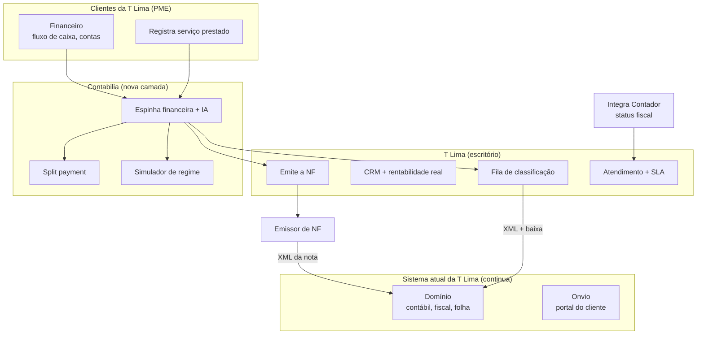

# Contabilia — Proposta de Parceria Piloto: T Lima Contabilidade

*Proposta de parceria para co-construção do Contabilia, tendo a T Lima como escritório-piloto. Documento de discussão.*

---

## Entendimento da sua operação

O que mapeamos da T Lima e que orienta esta proposta:
- **41 clientes ativos**, cerca de 90% de serviço, predominantemente **Simples Nacional**
- Sistema contábil **Domínio (Thomson Reuters)** + portal **Onvio** já incluso
- Equipe enxuta — o Contabilia foi pensado pra dar alavancagem **sem aumentar a folha**
- ~70 notas emitidas por mês no total

---

## A natureza da parceria

A T Lima entra como **parceiro de co-construção** do Contabilia. Não é uma venda de software pronto — é construir junto, com o escritório de vocês como primeiro caso real rodando em produção.

**O que a T Lima ganha:**
- Plataforma rodando com os clientes de vocês, a preço simbólico de parceria
- Influência direta no produto (o que construímos é moldado pela operação de vocês)
- Vantagem de largada na reforma tributária

**O que a Trívia ganha:**
- Um parceiro de referência pra evoluir o produto com operação real
- Uma relação de longo prazo

---

## O cenário em 2026 — o que está apertando

A reforma tributária entrou em vigor. A partir de **01/04/2026**, a Receita valida ativamente os campos de IBS e CBS em cada nota. A transição até 2033 obriga apuração paralela (regime antigo + novo). E em **setembro/2026** cada cliente PJ precisa decidir se em 2027 fica no Simples puro, vai pro Simples Híbrido ou migra pro regime regular.

Resultado prático pro escritório: **mais trabalho operacional, sem mais receita** — e clientes pedindo orientação que o dia a dia operacional não deixa tempo pra entregar.

---

## O que é o Contabilia

Uma plataforma que se pluga **por cima** do sistema contábil Domínio que vocês já usam — **sem substituí-lo**. Não competimos com o sistema contábil Domínio nem com o Onvio. Preenchemos o que **nenhum dos dois faz**:

> Um **sistema financeiro simples** pro cliente PME usar no dia a dia. Como subproduto, o dado já sai organizado e alimenta o sistema contábil Domínio automaticamente.

### O que vocês já têm (e a gente NÃO refaz)

| Já têm no sistema Domínio + Onvio | Não vamos vender de novo |
|---|---|
| Portal de documentos (Onvio) | ✓ |
| Entrega de guias/obrigações (Onvio) | ✓ |
| Escrituração, SPED, folha (sistema contábil Domínio) | ✓ |

### O que SÓ o Contabilia traz

| Novo, que nem o sistema Domínio nem o Onvio fazem | Valor |
|---|---|
| **Sistema financeiro do cliente** (fluxo de caixa, contas a pagar/receber) | Cliente usa todo dia; vocês passam a ter o dado correto de cada cliente e podem **cobrar mais na mensalidade** ou **fidelizar** agregando valor |
| **Simulador de regime** (Simples puro × Híbrido × Regular) | Munição pra vocês orientarem a decisão de set/2026 |
| **Controle de split payment** no caixa | Cliente já vê quanto entra líquido depois do imposto |
| **Emissão de NFS-e integrada** (a T Lima emite, o XML cai automático no Domínio) | Menos digitação, dado entra sozinho no sistema |
| **CRM com rentabilidade REAL por cliente** | Vocês veem quem dá lucro e quem dá prejuízo, base pra renegociar honorário com dado |
| **Atendimento com SLA + agente SDR** | Demanda não se perde no WhatsApp; e o SDR qualifica leads pra crescer a carteira |

---

## Como funciona — o fluxo no dia a dia

### Lado cliente (PME)
- Registra o serviço prestado e as movimentações ("recebi do João", "paguei o fornecedor")
- Acompanha o fluxo de caixa: *"tenho dinheiro pra pagar a folha sexta?"*
- Vê quanto entra líquido depois do imposto (split payment)
- Anexa documentos (foto, PDF)

### Lado T Lima
- **Emite a nota fiscal** com os dados já preparados pelo sistema
- Recebe os **XMLs das notas e as baixas direto no Domínio** (via API), sem reenvio manual
- Recebe os lançamentos já com sugestão de classificação por IA
- Régua automática de honorários e inadimplência
- Fila de atendimento com SLA (demanda do WhatsApp do cliente já categorizada)
- **Tempo livre** pra orientar cliente em vez de só apagar incêndio operacional

> **Nota técnica:** a API do Domínio recebe XML de nota e baixa de parcela; quem gera o lançamento contábil é o próprio Domínio. O Contabilia alimenta esses dados automaticamente — vocês param de receber nota solta no WhatsApp.

---

## Como o Contabilia se encaixa no que vocês já têm

**Como ler o diagrama:**
- O cliente registra o serviço e as movimentações, e a Contabilia organiza o dado
- A **T Lima emite a nota**, e recebe o XML e a baixa direto no Domínio, com a classificação sugerida por IA
- O **status fiscal** vem do Integra Contador (Receita); o Domínio não fornece isso
- O **Onvio continua sendo o portal do cliente**; não mexemos nele

---

## O que entregamos no piloto

Ao final da implementação, a T Lima recebe a plataforma rodando com um grupo inicial de clientes migrados.

**Pra cada cliente de vocês:**
- Portal financeiro simples (fluxo de caixa, contas a pagar/receber)
- Registro do serviço prestado, pronto pra virar nota
- Visão do valor líquido com split payment

**Pra T Lima:**
- Emissão da NF com os dados já prontos pelo sistema
- Alimentação automática de XMLs e baixas no Domínio (sem reenvio manual)
- Classificação assistida por IA (vocês revisam só a exceção)
- **CRM com score de saúde e rentabilidade real por cliente** (quem dá lucro, quem dá prejuízo)
- Régua automática de honorários e inadimplência
- **Atendimento com SLA** + WhatsApp integrado (demanda categorizada, fila priorizada, pesquisa de satisfação)
- Simulador de regime pros clientes que precisam decidir

**Marco regulatório atendido:** as notas emitidas já incluem os campos IBS/CBS exigidos desde 01/04/2026.

---

## Como será a implementação

| Fase | Duração | O que acontece |
|---|---|---|
| **Diagnóstico** | 1 semana | Mapeamos a operação, a carteira e as dores. Escopo final acordado. |
| **Implementação** | 8-12 semanas | Construímos e configuramos a plataforma + a integração com o Domínio. Marcos quinzenais com vocês. |
| **Onboarding** | 2-4 semanas | Treinamento da equipe + migração dos primeiros clientes em produção. |
| **Operação** | contínuo | Infra, APIs, IA, evolução, suporte. |

---

## O que precisamos da T Lima

- **~4h/semana** de uma pessoa de referência durante a implementação (sugestão: o Wilber)
- **Lista de clientes-piloto** pra começar (sugestão: 5 clientes de serviço no Simples)
- **Acesso à API do Domínio** — solicitamos juntos via Thomson Reuters (`api.dominio@tr.com`)
- **Certificado digital A1** dos clientes-piloto — armazenamos com criptografia e log de uso

---

## Investimento (parceria piloto)

**Implementação — pagamento único:** ~~De R$ 12.900,00~~ **Por R$ 7.900,00 à vista, ou 10x de R$ 850,00.**
Condição especial válida somente para fechar na ligação. É **valor único, não é mensalidade nem anuidade.**

**Custos de operação (mensais, por conta do cliente, repassados sem margem da Trívia):**

| Item | Estimativa |
|---|---|
| Emissor de NF · serviço + venda* | 2 × R$ 190 |
| IA de classificação | ~ R$ 100 |
| Infraestrutura + WhatsApp | ~ R$ 150 |
| **Total estimado** | **~ R$ 630/mês** |

\* Cada assinatura do emissor cobre até **250 notas/mês com CNPJ ilimitado** (folga pro volume de vocês). **A confirmar** se emitir serviço (NFS-e) e venda (NF-e) exige duas assinaturas separadas — se uma só atender, o custo cai pra R$ 190.

> Os custos de IA e do emissor de nota fiscal são por conta do cliente. Não há mensalidade da Trívia durante o piloto. É uma parceria de co-construção: vocês ajudam a validar o produto, e em troca recebem a plataforma a preço simbólico.

---

## Próximos passos

1. **Reunião de aprofundamento** — entender a operação atual em detalhe
2. **Diagnóstico** (1 semana) — mapeamento + escopo final
3. **Acordo de parceria** com escopo e investimento fechados
4. **Kickoff**

---

*Proposta elaborada em 01/06/2026. Trívia Studio — JG Novais e Lucas.*
