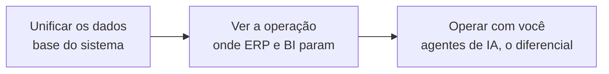
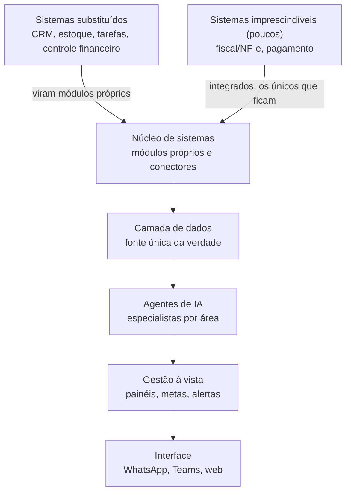

# Produto: OS Empresarial sob medida

Documento base para desenvolver o produto de implementação de OS personalizado em empresas. Consolida tese, posicionamento, diferencial, gatilhos de venda, arquitetura, framework de decisão e modelo comercial. Ponto de partida para detalhar material comercial, playbook de diagnóstico e especificação técnica.

## Tese central

Toda empresa de pequeno e médio porte sofre do mesmo problema: a operação roda em dezenas de sistemas que não conversam entre si. Dado espalhado em planilhas e ferramentas isoladas, retrabalho manual fazendo a ponte entre elas, e o dono decidindo no escuro. O nome disso é fragmentação, e é o inimigo do produto.

ERP de prateleira não resolve, porque é rígido e caro e força a empresa a se adaptar a ele. Ferramenta de ponto fragmenta ainda mais. O produto resolve consolidando toda a operação e todos os dados em um sistema só, construído sob medida, e colocando agentes de IA especialistas operando em cima disso.

## O que é o produto

Definição para o cliente:

> Desenvolvemos o sistema operacional da sua empresa. Tudo unificado num lugar só, e agentes de IA especialistas operando a rotina junto com o seu time.

Definição interna:

O produto é um método repetível somado a um backbone técnico reaplicável. Para cada empresa monta-se o OS dela: substitui os sistemas que dá para substituir, integra os que não dá, unifica operação e dados, e instala agentes de IA especialistas por área. A arquitetura é sempre a mesma. O que muda é o conteúdo de cada camada. Isso é o que torna o produto repetível e escalável, sem deixar de ser sob medida.

## Posicionamento e mensagem

Frase de posicionamento:

> Desenvolvemos o sistema operacional da sua empresa. Tudo unificado num lugar só, e agentes de IA especialistas operando a rotina junto com o seu time.

Pitch de uma frase:

> Não é um sistema que você opera. É um sistema que opera com você. A gente unifica toda a sua operação e os dados, e coloca um agente de IA especialista em cada área executando a rotina e puxando resultado.

Antes e depois (a imagem que vende em três segundos):

Antes, a empresa roda em sistemas soltos (ERP, planilhas, CRM, financeiro, estoque, ads) que não conversam. Depois, roda em um OS único onde todas as áreas (vendas, financeiro, operação, marketing) e a base de dados e inteligência ficam no mesmo lugar.

## O diferencial: IA

A distinção que o cliente precisa entender: unificar dado, um ERP faz. Mostrar a operação num painel, um BI faz. Os dois param aí, e a empresa continua operando tudo na mão. O OS não para em mostrar, ele opera. Agentes de IA executam a rotina junto com o time, dentro do próprio sistema.

O ponto que torna isso defensável, e não só bonito: a IA só funciona de verdade porque está tudo unificado. Copiloto jogado em cima de dado fragmentado é inútil, alucina e erra. Os agentes só ficam poderosos quando enxergam a operação inteira no mesmo lugar. A unificação não é o produto final, é o que destrava a IA. Essa é a barreira de entrada: qualquer um pluga um chatbot, ninguém pluga agentes que operam a empresa toda sem ter feito a unificação antes.

Concreto, para não virar discurso vago de IA. Os agentes fazem coisa específica em cada área: conciliam o financeiro e fecham o caixa, respondem o cliente no WhatsApp dentro do contexto da operação, antecipam ruptura de estoque, montam a campanha e leem o resultado, cruzam canais e cobram SLA.

## Os cinco gatilhos de venda

1. **Escala sem inchar o time.** A empresa cresce sem contratar na mesma proporção. Os agentes de IA absorvem o volume operacional, então mais clientes e mais pedidos não viram mais headcount.

2. **Custo menor com o fim dos sistemas soltos.** Hoje a empresa paga várias assinaturas que não conversam e ainda banca gente fazendo a ponte manual entre elas. O OS consolida tudo: menos ferramentas, menos retrabalho, menos erro passando de um sistema para o outro.

3. **Um sistema que se molda à operação, não o contrário.** Com software de prateleira, ou a empresa se adapta ao sistema, ou compra um pacote gigante e usa 20%. Aqui é o inverso: o OS é construído em cima da realidade da operação. A empresa não muda como trabalha e não paga por função que nunca vai usar.

4. **Inteligência de verdade a partir dos dados.** Com tudo unificado, o dado para de morrer em planilha e vira decisão. O sistema não mostra só o número, ele aponta o que fazer com ele.

5. **Um agente de IA especialista em cada área.** Não é um assistente genérico. É um agente dedicado por área (financeiro, vendas, operação, marketing e atendimento) que conhece aquela área a fundo e atua para puxar o resultado dela.

## Arquitetura em camadas

Independente da empresa, a implementação segue o mesmo modelo em camadas. Muda o conteúdo, nunca a estrutura. A postura padrão é substituir o máximo de sistemas possível, que viram módulos próprios dentro do OS, e integrar apenas os poucos imprescindíveis. É assim que o produto reduz custo de ferramentas.

- **Camada de dados.** A base e o coração do sistema. Fonte única da verdade. Tudo despeja aqui. É o que cria o lock-in e o que destrava a IA.
- **Núcleo de sistemas.** Os módulos próprios que substituem a maioria dos sistemas atuais (e é daqui que vem a redução de custo), mais os conectores que integram os poucos imprescindíveis que ficam.
- **Agentes de IA.** Os agentes especialistas que operam a rotina de cada área em cima do dado unificado.
- **Gestão à vista.** Painéis, metas e alertas. O cockpit do dono, decisão por dado em vez de planilha.
- **Interface.** Onde as pessoas interagem: WhatsApp, Teams, web.
- **Sistemas que entram.** Sistemas substituídos viram módulos próprios e deixam de ser pagos. Apenas os imprescindíveis (fiscal/NF-e, pagamento) permanecem e são integrados via API, webhook ou Z-API.

## Substituir, integrar ou matar

O método central de cada implementação. A postura padrão é substituir, porque é o que reduz custo e unifica o dado. Integrar é a exceção, reservada ao que é imprescindível. Para cada sistema da empresa, uma das três decisões, avaliada por custo de troca, centralidade do dado, peso regulatório, qualidade de API e valor estratégico.

1. **Substituir** quando o custo de troca é baixo, a ferramenta é commodity e um módulo próprio entrega dado unificado de graça. Exemplos: planilha de CRM, gestor de tarefa básico, controle financeiro manual.
2. **Integrar** quando o sistema é entranhado, regulado ou best-in-class e não vale reconstruir. Exemplos: ERP fiscal, gateway de pagamento, emissão de NF-e, marketplace.
3. **Matar** quando o sistema só existe por causa da fragmentação e não tem valor real. Não substitui, elimina.

Esse mapeamento é o que diferencia o produto de um integrador genérico e de um ERP de prateleira.

## Modelo de entrega e comercial

A armadilha é tentar vender implementação de OS completo no frio. Ticket alto, ciclo longo, risco alto. A entrada é um diagnóstico operacional pago, de escopo fechado, que mapeia todos os sistemas, fluxos de dado e dores, e já entrega a planta do OS alvo com as decisões de substituir, integrar ou matar. Ele se paga, qualifica o cliente e abre a implementação.

Estrutura comercial em três blocos:

1. **Diagnóstico.** Valor fixo, abatível na implementação. Produto de aquisição, baixa fricção.
2. **Implementação.** Projeto por fases: fundação de dados, módulos, integrações, agentes, gestão à vista.
3. **Recorrência.** Retainer mensal de operação, runtime dos agentes, evolução e suporte. É aqui que o negócio vira anuidade. O backbone na base cria o custo de troca que sustenta a recorrência. É o que separa agência de plataforma.

## Posicionamento no portfólio (interno)

Decisão de entidade ainda em aberto. Três caminhos:

- Nasce como linha de produto da Trívia Studio, sobre um backbone produtizado. O stack de agentes e o Supabase já são da casa, e o trabalho é high-touch, motion de agência.
- Nasce como marca própria separada.
- Nasce como expansão do Jimmy Studio.

Leitura atual: o Jimmy Studio é a camada de marketing desse OS, ou seja, um módulo do sistema operacional completo. Família coerente: Jimmy como produto de entrada self-serve, e o OS operacional como expansão custom e high-touch. Jimmy faz o land, o OS faz o expand. A recomendação de partida é provar o produto com 3 a 5 implementações, padronizar o que é repetível (schema da camada de dados, biblioteca de conectores, framework de agentes) e só então decidir se vira marca própria.

## Decisões em aberto

- Nome do produto e definição da marca/entidade.
- Formato do material comercial (proposta comercial ou roteiro de reunião).
- Precificação dos três blocos (diagnóstico, implementação, recorrência).
- Schema padrão da camada de dados.
- Biblioteca inicial de conectores prioritários.
- Caso/prova inicial (a construir com as primeiras implementações).

## Próximos passos

1. Definir o nome e a entidade do produto.
2. Montar a narrativa de uma página para venda (problema, OS, diferencial de IA, cinco gatilhos).
3. Estruturar o playbook do diagnóstico pago, o wedge de aquisição.
4. Especificar o backbone técnico reaplicável (camada de dados, conectores, framework de agentes).
