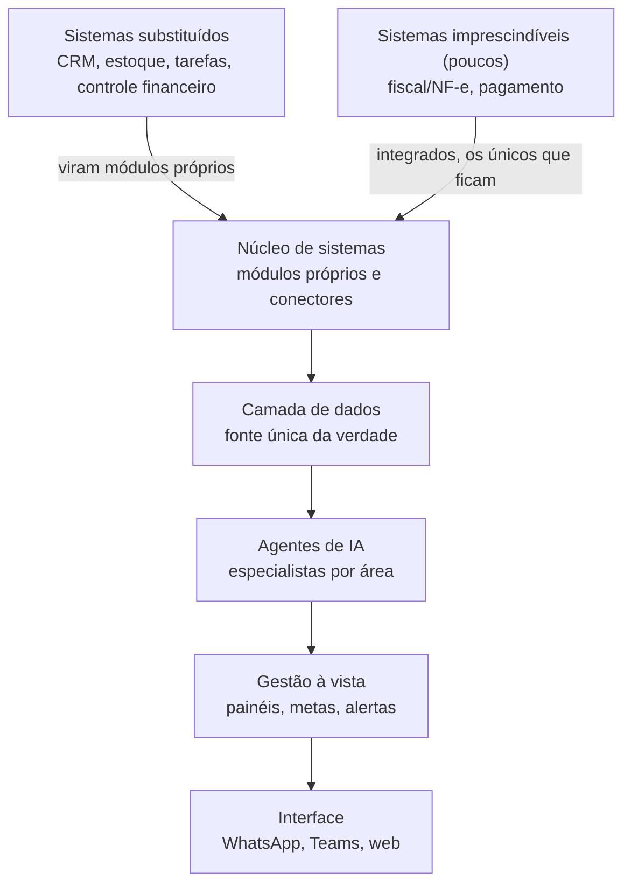
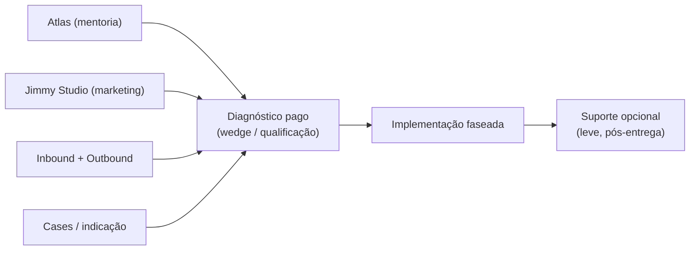
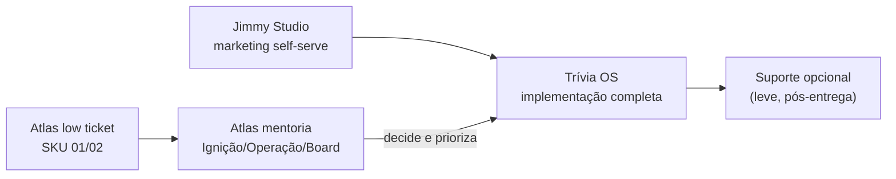

# TRÍVIA OS — PLANO DE NEGÓCIO E GTM (v1)

> *Trívia Studio · Documento Interno · v1 · Detalha [[Produto OS Empresarial]] (esboço) no molde do [[Atlas - Plano de Negocio]]*

**Proposta:** João Gabriel Novais | **Pendente de alinhamento com:** Lucas Azevedo

Plano de negócio e go-to-market do **Trívia OS** — o produto de implementação de **sistema operacional empresarial sob medida com agentes de IA** da Trívia. Usa a estrutura do plano da Atlas como molde, mas o motor comercial é diferente: aqui a entrada é um **diagnóstico operacional pago**, não low ticket de volume.

> **Notas desta v1:**
> - **Entidade decidida:** o Trívia OS nasce como **linha de produto de implementação da Trívia** — irmão da Atlas no portfólio, não marca própria nem expansão do Jimmy (decisão revisável após as primeiras provas).
> - **ICP herdado da Atlas, com entrada mais baixa:** dono de PME a partir de R$ 2,5MM de faturamento. Mesma persona, dor adjacente (fragmentação operacional, não falta de clareza de IA).
> - **Produto mais high-ticket do portfólio:** projetos a partir de R$ 119k, com diagnóstico de R$ 30k abatível.
> - **Relação com a Atlas:** a Atlas (mentoria) **decide e abre**; o Trívia OS **implementa o sistema inteiro**. A "implementação inclusa" da Atlas é a ponta; o OS é a obra completa.
> - **Nome/método ainda em aberto:** este documento usa "Trívia OS" como nome de trabalho. Proposta de método-acrônimo na Seção 04.

-----

## Resumo Executivo

### O que estamos propondo

A Trívia já entrega marketing, growth e IA como sistema integrado, e está criando a Atlas — a mentoria de implementação de IA. Este documento propõe estruturar a **outra ponta da mesma tese**: um produto de implementação de alto valor que constrói o **sistema operacional sob medida** da empresa do cliente, unificando operação e dados num lugar só e instalando **agentes de IA especialistas por área** operando a rotina junto com o time.

O inimigo é a **fragmentação**. Toda PME roda em dezenas de sistemas que não conversam: dado espalhado em planilhas e ferramentas isoladas, retrabalho manual fazendo a ponte, e o dono decidindo no escuro. ERP de prateleira não resolve — é rígido, caro e força a empresa a se adaptar a ele. O Trívia OS resolve consolidando tudo num sistema construído sob medida, e só então colocando IA que **opera**, não que apenas mostra.

O ponto-cego de mercado é o mesmo vazio que a Atlas explora, vista de outro ângulo. Hoje o dono de PME tem (a) **ERP/SaaS de prateleira**, que unifica pouco e engessa muito; (b) **agência/integrador**, que pluga ferramentas isoladas sem visão de operação; (c) **copiloto de IA jogado em cima do caos**, que alucina porque não enxerga a operação inteira. Falta o caminho que une as três coisas: **unificar o dado, operar com IA em cima dele, e fazer isso sob medida sem ser refém de fornecedor**.

> *"A IA só funciona de verdade porque está tudo unificado. Qualquer um pluga um chatbot. Ninguém pluga agentes que operam a empresa inteira sem ter feito a unificação antes."*

O modelo comercial é centrado num **projeto único de alto valor**, em dois blocos principais — **Diagnóstico** (escopo fechado, pago, abatível) e **Implementação** (projeto por fases) — mais um **Suporte pós-entrega** leve e opcional, dimensionado de propósito para não virar custo fixo na cabeça do cliente. O backbone técnico reaplicável (schema da camada de dados, biblioteca de conectores, framework de agentes) é o que torna um produto sob medida ao mesmo tempo **repetível e escalável**.

A próxima ação concreta não é escala de mídia: é **provar o produto com 3 a 5 implementações** que viram cases auditáveis e padronizam o backbone. O diagnóstico pago é o wedge que qualifica o cliente, se paga e abre a implementação — exatamente o equivalente, para o OS, do que os cases pseudo-gratuitos são para a Atlas.

-----

## Seção 01 · A Tese

### Por que existe um vazio

A PME brasileira a partir de R$ 2,5MM vive a mesma armadilha operacional. Cresceu empilhando ferramentas: um CRM aqui, planilha de financeiro ali, sistema de estoque que não fala com o de vendas, atendimento no WhatsApp solto, ads num painel que ninguém cruza com a receita. Cada ferramenta resolve um pedaço e cria uma fronteira. Nas fronteiras mora o retrabalho: gente copiando dado de um sistema pro outro, conferindo planilha, fechando caixa na unha, decidindo no escuro porque o número nunca está num lugar só.

Isso tem nome: **fragmentação**. E é o inimigo do produto.

As três respostas que o mercado oferece hoje param no meio do caminho:

- **ERP / SaaS de prateleira** unifica parte do dado, mas é rígido, caro, e força a empresa a se moldar a ele. O cliente compra um pacote gigante e usa 20%, ou adapta a operação ao software em vez do contrário.
- **Agência / integrador / freelancer** pluga ferramentas e automações isoladas, sem visão de operação. Quebra na primeira mudança de API, sem documentação, e mantém o cliente refém.
- **Copiloto de IA** jogado em cima de dado fragmentado é inútil. Alucina, erra, e não enxerga a operação inteira — porque a operação inteira não existe em lugar nenhum unificado.

Entre os três, falta o produto sério: **unificar a operação e o dado sob medida, e botar IA que opera em cima disso**.

### O que o cliente realmente quer

O mesmo dono de PME que a Atlas atende, com uma dor adjacente. Em conversas reais, as frases se repetem:

- "Eu tenho dado pra caramba, mas nunca no lugar certo na hora certa."
- "Meu time gasta metade do dia passando informação de um sistema pro outro."
- "Pago um monte de assinatura que não conversa, e ainda contrato gente pra fazer a ponte na mão."
- "Coloquei um 'GPT' pra ajudar, mas ele não sabe nada da minha operação, então não confio."

Ele não precisa de mais uma ferramenta. Precisa de **um sistema só, moldado à operação dele, com inteligência que executa** — e do time dele sabendo operar no final.

### Janela de mercado

O mesmo timing da Atlas, com uma vantagem extra: a barreira de entrada do OS é mais alta. Plugar um chatbot qualquer faz em uma tarde; **unificar a operação inteira e só então colocar agentes que operam** exige método, backbone técnico e disciplina de produto. Quem padroniza esse backbone primeiro (schema, conectores, framework de agentes) constrói um fosso que o "mentor de IA do Instagram" não atravessa. A janela para virar referência de OS empresarial com IA — antes da comoditização do discurso de "agente de IA" — é a mesma janela estreita de 12–18 meses.

-----

## Seção 02 · Posicionamento

### O que somos

Não somos **ERP**. ERP unifica dado e engessa a operação. Nós moldamos o sistema à operação, não o contrário.

Não somos **BI**. BI mostra a operação num painel e para aí. Nós operamos: agentes executam a rotina, não só relatam.

Não somos **agência / integrador**. Integrador pluga ferramentas isoladas sem visão de negócio. Nós construímos o backbone unificado que é a fonte única da verdade.

Não somos **copiloto de IA**. Copiloto em cima do caos alucina. Nós só ligamos a IA depois que o dado está unificado — é por isso que ela funciona.

Somos um **OS empresarial sob medida com IA que opera**. Categoria nova: o sistema operacional da empresa, construído sobre um backbone reaplicável, com um agente especialista em cada área executando a rotina junto com o time. O cliente compra a Trívia para **unificar, operar com IA e não virar refém de fornecedor** — com o time interno operando no final.

### Frase de posicionamento

> *"Desenvolvemos o sistema operacional da sua empresa. Tudo unificado num lugar só, e agentes de IA especialistas operando a rotina junto com o seu time."*

### Pitch de uma frase

> *"Não é um sistema que você opera. É um sistema que opera com você. A gente unifica toda a sua operação e os dados, e coloca um agente de IA especialista em cada área executando a rotina e puxando resultado."*

### Antes e depois (a imagem que vende em 3 segundos)

**Antes:** a empresa roda em sistemas soltos — ERP, planilhas, CRM, financeiro, estoque, ads — que não conversam, e gente fazendo a ponte na mão.
**Depois:** roda num OS único, onde todas as áreas (vendas, financeiro, operação, marketing, atendimento), a base de dados e a inteligência ficam no mesmo lugar — e os agentes operam a rotina.

### O diferencial defensável

Unificar dado, um ERP faz. Mostrar a operação num painel, um BI faz. Os dois param aí, e a empresa continua operando tudo na mão. **O OS não para em mostrar — ele opera.**

O que torna isso defensável e não só bonito: **a IA só funciona porque está tudo unificado.** Copiloto em cima de dado fragmentado é inútil. Os agentes só ficam poderosos quando enxergam a operação inteira no mesmo lugar. A unificação não é o produto final — é o que destrava a IA. **Essa é a barreira de entrada.**

E é concreto, não discurso vago: os agentes conciliam o financeiro e fecham o caixa, respondem o cliente no WhatsApp dentro do contexto da operação, antecipam ruptura de estoque, montam a campanha e leem o resultado, cruzam canais e cobram SLA.

### Contra quem nos posicionamos

|Inimigo|Dor que ele causa no nosso cliente|
|-------|----------------------------------|
|ERP / SaaS de prateleira|Pago caro por um pacote gigante, uso 20%, e tive que mudar como trabalho pra caber no software.|
|BI / dashboard|Vejo o número bonito, mas continuo operando tudo na mão. Mostra o problema, não resolve.|
|Agência / integrador|Plugaram ferramentas que quebram na primeira mudança de API. Sem documentação, viro refém.|
|Copiloto de IA genérico|Joguei um "GPT" na empresa, mas ele não conhece minha operação, alucina, e não confio.|
|Fragmentação / inação|"Depois eu organizo isso." Inimigo silencioso. Cada mês adiado é dado morrendo em planilha.|

> *A mensagem que une tudo: "Você não tem um problema de ferramenta. Tem um problema de fragmentação. E IA jogada em cima do caos só piora."*

-----

## Seção 03 · ICP · Ideal Customer Profile

### O dono certo

Herdado da Atlas — **mesma persona**, com entrada mais baixa de faturamento e o filtro de dor ajustado para fragmentação operacional. Filtro de entrada é parte do produto: vender OS para empresa imatura ou para dono que delega tudo sem se envolver gera atrito e dano reputacional. O diagnóstico pago é o instrumento de qualificação.

|Atributo|Critério|
|--------|--------|
|Faturamento anual|A partir de R$ 2,5MM. Sweet spot R$ 10MM a R$ 30MM.|
|Headcount|10 a 100 funcionários. Time estruturado, processos minimamente formalizados.|
|Setor|Serviços B2B, indústria leve, varejo especializado, saúde, educação, construção, agro-tech, escritórios profissionais.|
|Idade do dono|35 a 55. Fundador ou 2ª geração, com PnL na mão.|
|Maturidade digital|**Já tem vários sistemas** (sinal de fragmentação madura). Usa ChatGPT pessoalmente. Não sabe levar IA pra operação.|
|Dor central|Operação roda em sistemas que não conversam; retrabalho manual fazendo a ponte; dado morre em planilha.|
|Gatilho de compra|Dor de crescimento (cresceu e a operação não acompanha), troca de ERP frustrada, ou FOMO pós-evento de IA.|
|Anti-ICP|<R$ 2,5MM (não comporta o ticket). Startup de tech (constrói interno). Dono que quer "comprar produto" e não engajar. Empresa em crise de caixa. Operação ainda informal demais pra ter o que unificar.|

> *Nuance vs Atlas:* o que qualifica o OS não é só o porte, é a **fragmentação madura** — empresa que já acumulou ferramentas e sente o atrito. Uma empresa de R$ 2,5MM com a operação já espalhada em vários sistemas é ICP; uma de R$ 30MM ainda informal, sem o que unificar, não é. O diagnóstico pago confirma isso antes de qualquer compromisso de implementação.

-----

## Seção 04 · O Produto e o Método

### O que é, internamente

Um **método repetível** somado a um **backbone técnico reaplicável**. Para cada empresa monta-se o OS dela: substitui os sistemas que dá pra substituir, integra os imprescindíveis, unifica operação e dados, e instala agentes de IA especialistas por área. **A arquitetura é sempre a mesma; o que muda é o conteúdo de cada camada.** É isso que torna o produto sob medida e, ao mesmo tempo, repetível e escalável.

### Arquitetura em camadas

- **Camada de dados** — base e coração. Fonte única da verdade. Cria o lock-in e destrava a IA.
- **Núcleo de sistemas** — módulos próprios que substituem a maioria das ferramentas (origem da redução de custo) + conectores dos poucos imprescindíveis.
- **Agentes de IA** — especialistas que operam a rotina de cada área sobre o dado unificado.
- **Gestão à vista** — painéis, metas e alertas. O cockpit do dono.
- **Interface** — onde as pessoas interagem: WhatsApp, Teams, web.

### O método central: Substituir, Integrar ou Matar

Para cada sistema da empresa, uma de três decisões — avaliada por custo de troca, centralidade do dado, peso regulatório, qualidade de API e valor estratégico. **A postura padrão é substituir**, porque é o que reduz custo e unifica o dado.

1. **Substituir** — custo de troca baixo, ferramenta commodity, módulo próprio entrega dado unificado de graça. *Ex.: planilha de CRM, gestor de tarefa básico, controle financeiro manual.*
2. **Integrar** — sistema entranhado, regulado ou best-in-class que não vale reconstruir. *Ex.: ERP fiscal, gateway de pagamento, NF-e, marketplace.*
3. **Matar** — sistema que só existe por causa da fragmentação e não tem valor real. Elimina.

Esse mapeamento é o que separa o OS de um integrador genérico e de um ERP de prateleira — e é a primeira entrega concreta do diagnóstico pago.

### Proposta de método-marca (a decidir)

A Atlas provou o valor de **marca = método** num acrônimo. Proposta análoga para o OS, descrevendo as fases reais da implementação:

| Letra | Fase | O que acontece |
|-------|------|----------------|
| **M** | Mapeamento | Diagnóstico: levantar todos os sistemas, fluxos de dado e dores. Entregar a planta do OS-alvo. |
| **A** | Arquitetura | Decisões de substituir/integrar/matar travadas. Schema da camada de dados definido. Escopo por fases. |
| **P** | Plataforma | Construção: fundação de dados, módulos próprios, conectores dos imprescindíveis. |
| **A** | Agentes | Instalação dos agentes especialistas por área sobre o dado unificado + gestão à vista. |
| **S** | Sustentação | Time do cliente operando, capacitação, governança, métricas em produção → ponte para o suporte opcional. |

> Acrônimo de trabalho: **MAPAS** (Mapeamento · Arquitetura · Plataforma · Agentes · Sustentação). Coerente com o produto ("a gente entrega o mapa e o território da sua operação"). **Decidir com Lucas** — alternativas e o nome comercial do produto ficam na seção de decisões.

-----

## Seção 05 · Precificação

### Lógica de cobrança

O Trívia OS é **o produto mais high-ticket do portfólio**. A precificação tem um caminho único e simples, em três blocos:

- **Não cobramos por hora.** Comoditiza e transforma o sócio em freelancer caro. Vendemos resultado.
- **Não cobramos por resultado (revenue share)** neste momento — exige baseline confiável que o cliente médio não tem.
- **Diagnóstico de valor fixo (R$ 30k), abatível.** Se o cliente fecha a implementação, os R$ 30k são integralmente abatidos do valor total do projeto.
- **Implementação a partir de R$ 119k**, escopo travado por fases. **Sem mensalidade obrigatória** — o suporte pós-entrega é leve, opcional e cancelável (Bloco 3).

### Os três blocos comerciais

#### Bloco 1 · Diagnóstico operacional (o wedge) — R$ 30.000

Escopo fechado, valor fixo, **abatível na implementação**. Entrega o diagnóstico operacional completo e o **plano de implementação**: mapa de todos os sistemas e fluxos de dado, ranking de dores por impacto × esforço, decisões de substituir/integrar/matar, e a **planta do OS-alvo** com escopo, fases e investimento.

> **Os R$ 30k abatem integralmente do valor do projeto se o cliente fechar a implementação.** Na prática vira um "test drive pago": o cliente arrisca pouco, sai com um plano de implementação que vale por si só, e nós qualificamos a fundo antes de assumir um projeto de seis dígitos. Quem não fecha, pagou por um entregável real; quem fecha, não pagou nada a mais por ele.

#### Bloco 2 · Implementação (projeto por fases) — a partir de R$ 119.000

Projeto sob medida, **piso de R$ 119k**, escopo travado **por fase**. A postura padrão de substituir mantém a margem. O valor final é montado a partir das fases que a planta do diagnóstico definir; as faixas abaixo são a base de composição (a calibrar com as primeiras provas):

| Fase | O que entrega | Faixa estimada |
|------|---------------|----------------|
| Fundação de dados | Schema da fonte única da verdade + ingestão dos sistemas-fonte | R$ 25.000–45.000 |
| Módulos próprios | Cada sistema substituído vira módulo no OS | R$ 15.000–35.000 / módulo |
| Conectores | Integração dos imprescindíveis (fiscal, pagamento, marketplace) | R$ 8.000–20.000 / conector |
| Agentes de IA | 1 agente especialista por área, sobre o dado unificado | R$ 18.000–40.000 / agente |
| Gestão à vista | Painéis, metas e alertas — o cockpit do dono | R$ 12.000–25.000 |

> **O projeto começa em R$ 119k** (fundação + módulos + conectores + agentes + gestão à vista, conforme a planta). Já abatido o diagnóstico, o saldo da implementação é de R$ 89k em diante. Isso ocupa exatamente o território que a Atlas classifica como "plataforma multi-módulo — proposta separada (R$ 60k–120k+)". **O Trívia OS é esse upsell premium, produtizado — o teto do portfólio.**

#### Bloco 3 · Suporte pós-entrega (opcional e leve)

**Não é mensalidade obrigatória nem retainer de longo prazo — e isso é decisão de posicionamento, não esquecimento.** O OS é entregue para o cliente operar sozinho. Cobrar um custo fixo gordo todo mês daria exatamente a impressão que não queremos: a de que ele continua refém, ou de que comprou mais um SaaS caro. Por isso o suporte existe, mas é enxuto e por escolha do cliente.

O modelo:

- **Estabilização inclusa no projeto.** Os primeiros 30–60 dias pós go-live entram no preço da implementação — ajustes finos, correções e acompanhamento da virada de chave, sem custo extra.
- **Depois, suporte leve e opcional**, em dois formatos à escolha do cliente, ambos **sem fidelidade e canceláveis a qualquer momento**:
  - **Banco de horas avulso** — compra quando precisa, usa quando quiser. Zero compromisso recorrente.
  - **Plano leve de manutenção** — monitoramento básico + fixes prioritários + pequenas evoluções, **a partir de ~R$ 990/mês**. Valor deliberadamente baixo, para soar como "seguro", não como "custo fixo".
- **Evoluções maiores** (novo módulo, novo agente, nova integração) são sempre **proposta própria** — projeto pontual, não mensalidade.

> *Por que de propósito barato e opcional:* o produto se vende como "a sua empresa fica dona da própria operação". Um retainer pesado contradiz isso na cara. O suporte existe para segurança e continuidade, não para criar dependência financeira — e a defensabilidade do negócio vem do backbone unificado e do custo de troca da camada de dados, não de aprisionar o cliente numa fatura mensal.

### Benchmarks de mercado (âncora de preço)

| Referência | O que entrega | Preço |
|-----------|---------------|-------|
| ERP de prateleira (Totvs, SAP B1) | Licença + implantação rígida | R$ 80k–500k implantação + mensalidade |
| Consultoria de transformação digital | Slides e roadmap, sem execução | R$ 150k–500k |
| Agência de automação / integrador | Automações isoladas | R$ 15k–80k por projeto |
| **Trívia OS · Diagnóstico** | Diagnóstico + plano de implementação | **R$ 30k (abatível no projeto)** |
| **Trívia OS · Implementação** | OS sob medida + agentes, faseado | **a partir de R$ 119k** |
| **Trívia OS · Suporte (opcional)** | Estabilização + suporte enxuto, sem fidelidade | **banco de horas ou a partir de ~R$ 990/mês** |

-----

## Seção 06 · Go-To-Market

### Como vamos vender

Mesmo perfil de cliente da Atlas — dono de PME que **não compra de página fria** e compra de quem acompanha por 30–90 dias como autoridade real. Mas o motion do OS é diferente do low ticket da Atlas: ticket alto, ciclo longo, venda consultiva. O funil converge para o **diagnóstico pago** como conversão intermediária — é ele que destrava a venda grande.

> *"Marca pessoal e cases geram confiança. O diagnóstico converte. A implementação entrega — e o cliente fica dono da própria operação."*

### As quatro portas de entrada (land) para o OS (expand)

O OS é um produto de **expand**. Quatro motions o alimentam, e todas já existem no ecossistema Trívia:

1. **Atlas → OS.** O cliente de mentoria que decide implementar tudo. A Atlas decide e prioriza; o OS executa o sistema completo. É a ponte mais natural e de maior conversão.
2. **Jimmy Studio → OS.** O Jimmy é a camada de marketing self-serve — um módulo do OS completo. Cliente que entra pelo Jimmy e amadurece vira candidato a expand. *Jimmy faz o land, o OS faz o expand.*
3. **Diagnóstico direto.** Inbound (conteúdo + LP) e outbound (prospecção ativa no LinkedIn) levando direto à oferta de diagnóstico pago.
4. **Cases e indicação.** As 3–5 provas iniciais geram indicação dentro do círculo — o canal mais quente para ticket alto.

### Canais de topo de funil

#### Conteúdo orgânico (marca pessoal + Trívia)

Mesma estrutura da Atlas, com pilar dominante deslocado para **fragmentação e operação**:

| Canal | Operador | Frequência | Pilar dominante |
|-------|----------|-----------|-----------------|
| Instagram Trívia | JG + Lucas | 4 posts/semana | Cases de OS (antes/depois de operação), contra-narrativa "ERP/BI não opera", bastidor de implementação |
| LinkedIn Lucas | Lucas | 2–3/semana | Tese técnica: dado unificado, agentes em operação crítica, arquitetura de OS |
| LinkedIn JG | JG | 2–3/semana | Gestão: fim do retrabalho, decisão por dado, cases Heziom como prova viva |
| Newsletter | JG | 1×/mês | Long tail dos leads de diagnóstico e da base Atlas/Jimmy |

> A operação interna da Trívia, Heziom e JimmyAtende são o **case vivo zero**: vendemos o OS que rodamos em casa.

#### LinkedIn — prospecção ativa (motor do diagnóstico direto)

JG opera Sales Navigator + lista de ~150–200 donos/mês dentro do ICP de fragmentação madura (R$ 15–50MM, multi-sistema). Mensagem inicial não vende OS — **oferece o diagnóstico** como conversa de valor. Conversão esperada de resposta: 5–8%.

#### LP de conversão

Página única: Hero (fragmentação → OS), antes/depois, o diferencial de IA defensável, os 5 gatilhos, o método (MAPAS), cases, **oferta do diagnóstico com preço visível**, FAQ, CTA para WhatsApp.

#### WhatsApp — venda

Canal de conversão central (JimmyAtende qualifica). Fluxo: lead entra → qualificação automática (4 perguntas de fragmentação/porte) → JG assume e agenda call de 15 min em 24h → call de diagnóstico → **proposta de diagnóstico pago** em PDF de 1 página → diagnóstico entregue → **proposta de implementação faseada** ancorada na planta do OS → fechamento e kickoff.

### Os cinco gatilhos de venda (mensagem)

1. **Escala sem inchar o time** — agentes absorvem o volume operacional; mais clientes não viram mais headcount.
2. **Custo menor com o fim dos sistemas soltos** — menos assinaturas, menos ponte manual, menos erro entre sistemas.
3. **Um sistema que se molda à operação, não o contrário** — o oposto do ERP de prateleira.
4. **Inteligência de verdade a partir dos dados** — o dado vira decisão; o sistema aponta o que fazer, não só mostra.
5. **Um agente especialista em cada área** — dedicado por área, conhece a fundo, puxa o resultado dela.

### Métricas-alvo do funil

| Etapa | Meta inicial (provas) | Regime |
|-------|----------------------|--------|
| Leads qualificados/mês | 8–15 | 30–50 |
| Diagnósticos vendidos/mês | 1–2 | 4–6 |
| Diagnóstico → implementação | ≥ 50% | ≥ 60% |
| Adesão a suporte pós-entrega (opcional) | — | ≥ 40% |
| Ticket de implementação inicial | a partir de R$ 119k | a partir de R$ 119k |

-----

## Seção 07 · Modelo Financeiro

> *Projeções são hipóteses a validar com as primeiras provas — mesma postura do plano Atlas. Compartilham a mesma estrutura de custo dos sócios + dev, então OS e Atlas devem ser lidos como duas linhas de receita da mesma operação Trívia, não dois P&Ls separados.*

### Economia unitária de uma implementação

| Item | Valor estimado |
|------|----------------|
| Diagnóstico | R$ 30k (abate no projeto se fechar) |
| Implementação inicial faseada | a partir de R$ 119k (já inclui o diagnóstico) |
| Suporte pós-entrega (opcional, incidental) | leve — não é a base da receita |
| **Receita por cliente OS** | **concentrada no projeto: a partir de R$ 119k** |
| Custo de entrega (dev + APIs + infra, est.) | 35–45% da implementação |
| **Margem de contribuição por cliente** | **alta no projeto; suporte enxuto agrega margem sem virar dependência** |

### Receita combinada (OS como linha do P&L Trívia)

No regime maduro modelado pela Atlas (R$ 200k/mês combinados), a linha **"Upsell Trívia (3 projetos/mês × R$ 25k médio) = R$ 75k/mês"** é justamente o que o Trívia OS produtiza e amplia. Com tickets de implementação OS a partir de R$ 119k faseados, a receita vem principalmente do **volume de projetos**:

- **Implementações ativas** — 2–4 projetos OS em andamento, reconhecimento por marco de fase. É o motor da receita.
- **Suporte pós-entrega** — upside opcional e leve, que agrega margem sem ser a base do modelo. O negócio fecha a conta pelos projetos, **não depende de uma carteira de mensalidades** para se sustentar.

### Projeção de 6–12 meses (OS)

| Marco | Receita OS/mês | Composição |
|-------|----------------|------------|
| Mês 3 | R$ 15–40k | 1–2 diagnósticos + 1ª implementação iniciada (provas) |
| Mês 6 | R$ 40–90k | 2–3 implementações ativas + primeiros suportes pós-entrega |
| Mês 9 | R$ 80–140k | Backbone padronizado, ciclo mais curto, mais projetos em paralelo |
| Mês 12 | R$ 120–200k | 3–4 implementações simultâneas + suporte incidental |

> A receita do OS **não compete** com a da Atlas — somam no mesmo caixa. A Atlas traz volume de relacionamento e ticket de entrada; o OS traz o ticket mais alto do portfólio. Juntas, sustentam o regime de R$ 200k/mês do plano oficial mais rápido.

-----

## Seção 08 · Riscos e Diferenciais

### O que pode quebrar

**01 · Escopo infinito na implementação sob medida.** "Sob medida" é convite a escopo eterno. *Mitigação:* escopo travado por fase; postura "substituir > integrar"; a cláusula contratual de catálogo da Atlas adaptada — o que extrapola o backbone vira proposta separada. O diagnóstico já trava a planta antes de qualquer linha de código.

**02 · Backbone não padroniza e cada projeto vira do zero.** Se o schema da camada de dados, os conectores e o framework de agentes não virarem ativos reaplicáveis, a margem evapora e não escala. *Mitigação:* meta explícita das 3–5 primeiras provas = **padronizar o backbone**, não só entregar. Cada implementação documenta e devolve para a biblioteca.

**03 · Dependência operacional do Lucas (Itaú) + entrega técnica pesada.** O OS é mais intensivo em dev que a mentoria. *Mitigação:* teto de implementações simultâneas; contratação do dev sênior (compartilhado com a estrutura Atlas); documentação desde o 1º cliente.

**04 · Cliente compra esperando que a IA "faça tudo sozinha".** *Mitigação:* expectativa explícita em contrato; agentes posicionados como apoio que opera *com* o time, não substituto; engajamento mínimo do dono e do patrocinador interno.

**05 · Comoditização do discurso de "agente de IA" (12–18 meses).** *Mitigação:* o fosso não é a IA — é a **unificação + backbone proprietário + custo de troca da camada de dados**. Trancar autoridade e cases auditáveis nos primeiros 6 meses; acumular biblioteca de backbone que encurta cada novo projeto e que o concorrente não tem.

> *Nota sobre recorrência:* sem uma carteira de mensalidades, a receita do OS é menos previsível mês a mês do que um modelo de retainer — depende do fluxo de novos projetos. É um trade-off consciente: priorizamos o posicionamento de "cliente dono da própria operação" sobre a previsibilidade de uma assinatura. Mitiga-se mantendo pipeline de diagnósticos sempre cheio.

### Diferenciais defensáveis

- **Dupla complementar única** — Lucas (Tech Lead Itaú, sistemas críticos) + JG (gestão, Heziom). Técnica profunda + gestão real.
- **Track record operacional próprio** — Trívia, Heziom e JimmyAtende são o OS rodando em casa. Vendemos o que vivemos.
- **Backbone Trívia documentado** — schema, conectores e framework de agentes reaplicáveis. Dev novo entrega com qualidade desde o 1º projeto.
- **Stack moderna e demonstrável ao vivo** — Claude + Supabase + WhatsApp via Z-API + orquestração proprietária. Na call já mostramos sistemas rodando.
- **A barreira da unificação** — qualquer um pluga um chatbot; ninguém pluga agentes que operam a empresa inteira sem ter unificado antes.

-----

## Seção 09 · Plano de 90 Dias

### Por onde começar

Sem dispersão. Métrica única do trimestre: **3 a 5 implementações de OS concluídas como provas**, que (a) geram cases auditáveis e (b) padronizam o backbone reaplicável. Antes disso não se gasta com mídia paga.

### Oferta das implementações fundadoras

As primeiras 3–5 implementações recebem condição especial (desconto e/ou diagnóstico cortesia) em troca de:
- Permissão de uso público do nome, números e antes/depois.
- Depoimento e participação em case/live ao final.
- Engajamento do dono e patrocinador interno durante a implementação.
- Feedback estruturado para padronizar o backbone.

> Mesmo papel que os cases pseudo-gratuitos cumprem na Atlas: o que seria "desconto" vira "case aberto" — defensável e melhor pro posicionamento.

### Candidatos a prova (discutir com Lucas)

- **Operação interna** — Heziom, Trívia, JimmyAtende como case vivo já em curso.
- **Cliente atual de marketing/growth da Trívia** com fragmentação madura.
- **Indicação da rede** dos dois sócios.
- **Cliente Atlas** que evolui naturalmente para implementação completa.

### Cronograma

#### Mês 1 · Fundação do produto + 1ª prova
- Fechar este plano + nome/método + lista de candidatos a prova com Lucas.
- Definir o **schema padrão v1** da camada de dados e a **biblioteca inicial de conectores prioritários** (fiscal/NF-e, pagamento, WhatsApp/Z-API).
- Estruturar o **playbook do diagnóstico pago** (roteiro, entregáveis, template da planta do OS).
- Fechar a 1ª implementação fundadora; rodar o diagnóstico real.
- Bios e reposicionamento de conteúdo (pilar fragmentação) no ar.

#### Mês 2 · Execução + padronização
- Implementar a 1ª prova (fundação de dados → 1º módulo → 1º agente).
- Documentar tudo que for reaplicável → devolver para a biblioteca de backbone.
- Fechar a 2ª e 3ª prova via diagnóstico.
- Conteúdo de bastidor das provas alimentando orgânico.

#### Mês 3 · Cases + abertura comercial
- Concluir provas, captar depoimentos e números, publicar cases.
- LP do OS com oferta de diagnóstico e preço visível.
- Ligar prospecção ativa no LinkedIn (diagnóstico direto).
- Retro: calibrar preço dos 3 blocos com base nos custos reais.

### O que NÃO fazer nos 90 dias
- Não rodar mídia paga (sem cases, LP imatura, funil não testado).
- Não vender OS completo "no frio" sem diagnóstico — ticket alto e ciclo longo matam a conversão.
- Não aceitar escopo fora do backbone nas provas (vira projeto eterno e não padroniza nada).

### Critério de validação ou pivô (mês 6)

| Cenário | Critério | Ação |
|---------|----------|------|
| Confirma | 3+ implementações concluídas + backbone padronizado + pipeline de diagnósticos cheio + diagnóstico convertendo ≥ 50% | Escala: liga mídia, contrata 2º dev, abre comercial |
| Confirma parcial | 1–2 implementações + pipeline incipiente | Mantém estrutura, ajusta playbook de diagnóstico e precificação |
| Não confirma | 0–1 implementação + backbone não padronizou + diagnóstico não converte | Revisa ICP (fragmentação madura?), oferta e wedge |

-----

## Relação com o portfólio Trívia

- **Atlas** decide e abre o relacionamento (mentoria). **Trívia OS** implementa o sistema inteiro. A "implementação inclusa" da Atlas é a ponta do iceberg; o OS é a obra completa.
- **Jimmy** é a camada de marketing — um módulo do OS. Faz o *land* self-serve; o OS faz o *expand* custom.
- As três linhas somam no mesmo caixa e compartilham a estrutura de sócios + dev. Não competem — alimentam-se.

-----

## Decisões em aberto (alinhar com Lucas)

1. **Nome comercial do produto** e definição final (Trívia OS é nome de trabalho).
2. **Método-acrônimo** — aprovar MAPAS (Mapeamento · Arquitetura · Plataforma · Agentes · Sustentação) ou alternativa.
3. **Preço dos blocos** — diagnóstico R$ 30k (definido), implementação a partir de R$ 119k (definido). **Suporte pós-entrega:** validar o formato (banco de horas vs. plano leve ~R$ 990/mês) e o período de estabilização incluído (30–60 dias).
4. **Schema padrão v1** da camada de dados.
5. **Biblioteca inicial de conectores** prioritários.
6. **Lista nominal** dos candidatos a implementação fundadora (3–5).
7. **Regra de escopo** — cláusula contratual que mantém o que extrapola o backbone como proposta separada.
8. **Contratos** — diagnóstico, implementação faseada e termo de suporte pós-entrega ao advogado.
9. **Fronteira Atlas × OS** — quando um lead é Atlas (decidir) e quando é OS direto (implementar).

-----

*Documento vivo. Revisão obrigatória nas retros mensais.*

**Proposta · João Gabriel Novais · Pendente de aprovação de Lucas Azevedo**
