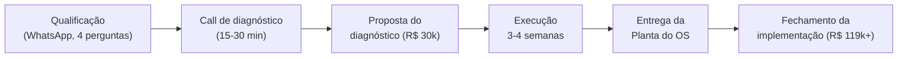

# TRÍVIA OS — PLAYBOOK DO DIAGNÓSTICO (v1)

> *Trívia Studio · Documento Interno · v1 · Operacionaliza o Bloco 1 do [[Trívia OS - Plano de Negocio e GTM]]*

O diagnóstico é o **wedge** do Trívia OS: o produto de entrada pago que qualifica o cliente, se paga, e abre a venda da implementação (a partir de R$ 119k). Este playbook detalha o stack completo — como vender, como executar nas 3–4 semanas, o que entregar (a Planta do OS) e como fechar a implementação.

> **Princípio que rege tudo:** *o diagnóstico não é uma reunião de vendas disfarçada — é um produto que vale R$ 30k por si só.* Quem não fechar a implementação tem que sair sentindo que levou um entregável que vale o que pagou. É isso que dá autoridade pra cobrar o ticket e pedir o fechamento sem desconforto.

-----

## Mapa do ciclo

O diagnóstico ocupa as duas primeiras fases do método **MAPAS**: **M**apeamento e **A**rquitetura. A implementação (Plataforma · Agentes · Sustentação) só começa depois da planta aprovada.

-----

# PARTE 1 · A VENDA DO DIAGNÓSTICO

## 1.1 · Por que vender o diagnóstico, e não o projeto no frio

Vender uma implementação de seis dígitos na primeira conversa é ticket alto, ciclo longo e risco alto pros dois lados. O diagnóstico resolve isso:

- **Pro cliente:** ele arrisca R$ 30k em vez de R$ 119k+ pra ter clareza total antes de decidir. E o valor é abatido se ele seguir — então, na prática, não custa nada a mais.
- **Pra Trívia:** qualifica a fundo (a gente vê a operação por dentro antes de assumir um projeto grande), gera caixa já na entrada, e transforma a proposta de implementação em algo **ancorado em dado real da empresa dele** — não num orçamento chutado.

> *Regra de ouro:* nunca orçar uma implementação sem ter feito o diagnóstico. Orçamento sem diagnóstico vira escopo infinito e margem destruída.

## 1.2 · Qualificação antes de oferecer o diagnóstico

Mesmo o diagnóstico de R$ 30k tem filtro. Quatro perguntas no WhatsApp (JimmyAtende abre, JG assume se passar):

1. **Qual o faturamento aproximado da empresa nos últimos 12 meses?** *(válida: R$ 2,5MM+)*
2. **Quantos sistemas/ferramentas diferentes a empresa usa hoje pra tocar a operação?** *(sinal de fragmentação: 4+ sistemas que não conversam)*
3. **Onde mais dói hoje — o que faz o time perder mais tempo passando informação de um lugar pro outro?** *(narrativa de 1+ frase; busca dor concreta)*
4. **Você (dono/sócio) consegue se envolver pessoalmente no diagnóstico nas próximas semanas?** *(válida: sim — sem o dono, não roda)*

**Desqualifica na hora:** faturamento <R$ 2,5MM, operação ainda informal (não tem o que unificar), dono que quer "comprar produto" e sumir, empresa em crise de caixa.

## 1.3 · A call de diagnóstico (15–30 min) — o que vende o diagnóstico

Não é a call que vende a implementação. É a call que vende **o diagnóstico**. Roteiro:

| Bloco | Tempo | O que fazer |
|-------|-------|-------------|
| Abertura | 3 min | Entender o momento da empresa. "Me conta como a operação roda hoje." |
| Escuta da dor | 8 min | Deixar o dono descrever a fragmentação. Anotar sistemas citados, retrabalho, onde decide no escuro. |
| Espelho | 5 min | Devolver o que ouviu nomeando o inimigo: *"O que você tem não é problema de ferramenta, é fragmentação. E IA jogada em cima disso só piora."* |
| Demo relâmpago | 5 min | Mostrar 1 sistema da Trívia/Heziom/JimmyAtende rodando ao vivo. Prova que a gente opera o que vende. |
| Oferta do diagnóstico | 5 min | Apresentar o diagnóstico de R$ 30k: o que entrega, prazo, e o abatimento. Pedir o próximo passo. |

**Frase de transição pra oferta:**
> *"Antes de eu te falar em projeto e preço, a gente não chuta. A gente faz um diagnóstico operacional completo: mapeia todos os seus sistemas, onde o dado morre, e te entrega a planta do seu OS com o plano de implementação, escopo e investimento. São R$ 30k, leva [3–4] semanas. E se você seguir com a implementação, esses R$ 30k são abatidos integralmente do valor do projeto — ou seja, você não paga nada a mais por ter clareza antes de decidir."*

## 1.4 · A proposta do diagnóstico (1 página)

Enviada por WhatsApp/e-mail em até 24h após a call. Estrutura:

1. **O que ouvi** — 2–3 linhas resumindo a dor do cliente nas palavras dele.
2. **O que o diagnóstico entrega** — diagnóstico da fragmentação + Planta do OS + plano de implementação (escopo, fases, investimento).
3. **Como funciona** — prazo (3–4 semanas), o que precisamos do time dele (acessos + entrevistas), formato da entrega.
4. **Investimento** — R$ 30.000, **100% abatível** do valor da implementação se fechada em até [60] dias.
5. **Próximo passo** — assinatura + agendamento do kickoff.

> O abatimento é o argumento mais forte da proposta. Deixe-o em destaque, não no rodapé.

## 1.5 · Objeções na venda do diagnóstico

| Objeção | Resposta-base |
|---------|---------------|
| *"R$ 30k só pra um diagnóstico?"* | "Não é só diagnóstico — é a planta completa do seu OS e o plano de implementação. É um entregável que vale por si. E se você seguir, ele é abatido: você não paga nada a mais por ele." |
| *"Por que não me passa logo um orçamento do projeto?"* | "Porque eu não te respeito chutando preço. Cada empresa tem uma fragmentação diferente. O diagnóstico é o que me deixa te dar um número honesto e travado, em vez de uma surpresa no meio do caminho." |
| *"E se depois do diagnóstico eu não quiser seguir?"* | "Aí você fica com a planta na mão — sabe exatamente o que fazer, em que ordem, e quanto custa. Pode até executar com outro fornecedor. Mas a maioria segue com a gente, porque ninguém entende a operação melhor depois de mapear tudo." |
| *"Já fiz consultoria que só me entregou slide."* | "Esse é o ponto. A gente não entrega slide de recomendação genérica. Entrega a planta técnica do seu sistema, com decisão sistema por sistema. É o oposto de consultoria de PowerPoint." |

-----

# PARTE 2 · A EXECUÇÃO DO DIAGNÓSTICO (3–4 SEMANAS)

## 2.1 · Visão geral do cronograma

| Semana | Fase MAPAS | Foco | Entregável parcial |
|--------|-----------|------|--------------------|
| S1 | Mapeamento | Kickoff + inventário de sistemas + entrevistas por área | Inventário de sistemas preenchido |
| S2 | Mapeamento | Mapa de fluxos de dado + dores + custo da fragmentação | Mapa de fluxo + cálculo de custo atual |
| S3 | Arquitetura | Decisões Substituir/Integrar/Matar + priorização + OS-alvo | Matriz de decisão + desenho do OS |
| S4 | Arquitetura | Escopo, fases, orçamento + montagem e ensaio da Planta | Planta do OS pronta pra apresentar |

> Diagnóstico Essencial (operação menor, 1–2 áreas) pode rodar em 3 semanas. Operação multi-área usa 4. O preço é o mesmo — o que muda é a profundidade, não o ticket.

## 2.2 · Kickoff (1ª reunião, ~60 min)

- Confirmar o **patrocinador interno** (quem destrava acessos e agenda as entrevistas).
- Alinhar expectativa: o diagnóstico é honesto — pode concluir que parte da operação nem precisa de OS agora.
- Coletar **acessos de leitura** aos sistemas atuais (ou prints/exports, quando não houver API).
- Agendar as **entrevistas por área** (1 por área crítica, 30–45 min cada).
- Definir o **critério de sucesso do dono** — o que, pra ele, faria o projeto valer a pena. (É o que vai amarrar o caso de uso piloto lá na frente.)

## 2.3 · Instrumento 1 · Inventário de sistemas

Levantar **todo** sistema, planilha e ferramenta que toca a operação. Uma linha por sistema:

| Sistema | Área | O que faz | Custo/mês | Tem API? | Dado crítico que guarda | Quem usa |
|---------|------|-----------|-----------|----------|------------------------|----------|
| *(ex: Planilha de vendas)* | Comercial | Controle de pipeline | R$ 0 | Não | Funil, previsão | 3 vendedores |
| *(ex: ERP fiscal)* | Financeiro | NF-e, fiscal | R$ 1.200 | Sim | Faturamento, impostos | Financeiro |
| ... | | | | | | |

Esse inventário alimenta tanto o **cálculo de custo atual** quanto a **matriz Substituir/Integrar/Matar**.

## 2.4 · Instrumento 2 · Roteiro de entrevista por área

Aplicado com o coordenador/responsável de cada área (comercial, financeiro, operação, marketing, atendimento). Perguntas-núcleo:

1. Me descreve sua rotina: o que você faz do começo ao fim do dia?
2. Quais sistemas você abre pra fazer isso? Em qual você confia, em qual não?
3. Onde você **copia dado de um lugar pro outro** na mão?
4. O que te faz perder mais tempo? O que mais dá erro?
5. Que pergunta você queria responder com um clique e hoje não consegue?
6. Se um "assistente" pudesse fazer uma coisa por você todo dia, o que seria?

> As respostas 3, 4 e 6 são ouro: viram o ranking de dores e os candidatos a **agente de IA por área**.

## 2.5 · Instrumento 3 · Mapa de fluxo de dado

Desenhar como o dado anda hoje entre os sistemas — e onde ele **trava, duplica ou morre**. Foco nas fronteiras (é nelas que mora o retrabalho). Formato simples (diagrama ou tabela origem→destino→como é feito hoje):

| Dado | Origem | Destino | Como passa hoje | Atrito |
|------|--------|---------|-----------------|--------|
| Pedido fechado | CRM/planilha | Financeiro | Digitação manual | Erro + atraso de faturamento |
| Estoque | Sistema A | Vendas | Não passa | Vende o que não tem |

## 2.6 · Instrumento 4 · Custo da fragmentação (a munição do ROI)

Quantificar o que a fragmentação custa **hoje** — é o número que justifica o investimento depois:

- **Custo de software** — soma das assinaturas que serão substituídas/mortas.
- **Custo de retrabalho** — horas/mês gastas fazendo ponte manual × custo da hora do time.
- **Custo de erro** — retrabalho, faturamento atrasado, ruptura de estoque, lead perdido (estimar com o cliente).
- **Custo de decisão no escuro** — qualitativo, mas nomeado.

> Meta: chegar a uma frase como *"sua fragmentação custa ~R$ X mil/mês hoje"* que torne os R$ 119k um investimento com payback claro.

-----

# PARTE 3 · O ENTREGÁVEL — A PLANTA DO OS

A Planta do OS é o produto do diagnóstico. Documento + apresentação (deck). Vale por si só — alguém poderia, em tese, executá-la com outro fornecedor (e é justamente por isso que é honesta e vendedora). Sete seções:

### Seção 1 · Diagnóstico da fragmentação (o espelho)
Foto do estado atual: inventário de sistemas, mapa de fluxo, ranking de dores e o **custo da fragmentação hoje**. O cliente precisa se ver no documento.

### Seção 2 · O OS-alvo (a arquitetura aplicada)
A arquitetura em camadas do Trívia OS desenhada **para a empresa dele**: camada de dados (fonte única da verdade) → núcleo de sistemas → agentes por área → gestão à vista → interface. O "antes vs depois" visual.

### Seção 3 · Decisões sistema por sistema (Substituir / Integrar / Matar)
A matriz central. Uma linha por sistema do inventário, com a decisão e o porquê:

| Sistema | Decisão | Justificativa | Vira o quê no OS |
|---------|---------|---------------|------------------|
| Planilha de CRM | **Substituir** | Commodity, custo de troca baixo | Módulo de vendas |
| ERP fiscal | **Integrar** | Regulado, best-in-class | Conector via API |
| Ferramenta X duplicada | **Matar** | Só existe pela fragmentação | Eliminado |

### Seção 4 · Roadmap por fases + escopo + investimento
A implementação quebrada em fases (fundação de dados → módulos → conectores → agentes → gestão à vista), cada uma com escopo travado e valor. Total **a partir de R$ 119k**, com o abatimento dos R$ 30k já demonstrado.

### Seção 5 · Caso de uso piloto priorizado
O primeiro agente/módulo a entregar — escolhido por **impacto × esforço** e amarrado ao critério de sucesso do dono levantado no kickoff. Dá uma vitória rápida e visível.

### Seção 6 · ROI estimado e payback
Cruza o custo da fragmentação (Seção 1) com o investimento (Seção 4): em quanto tempo o OS se paga em economia de software + horas + erros evitados.

### Seção 7 · Proposta de implementação
A oferta formal: escopo, fases, prazo, investimento (com abatimento), condições de pagamento e janela de decisão. É o documento que o cliente assina pra virar projeto.

-----

# PARTE 4 · A REUNIÃO DE APRESENTAÇÃO E O FECHAMENTO

## 4.1 · Roteiro da reunião de entrega da Planta (~60–90 min)

Presencial ou call, **com o dono presente** (não delegável). Sequência:

| Bloco | O que fazer | Objetivo |
|-------|-------------|----------|
| 1. O espelho | Apresentar o diagnóstico da fragmentação + o custo atual | Cliente reconhece a dor quantificada |
| 2. O OS-alvo | Mostrar o antes vs depois da arquitetura | Cliente visualiza a solução |
| 3. As decisões | Passar a matriz Substituir/Integrar/Matar | Cliente vê o método, não opinião |
| 4. O piloto | Mostrar a primeira vitória priorizada | Cliente sente que começa rápido |
| 5. O ROI | Cruzar custo atual × investimento × payback | Cliente vê retorno, não despesa |
| 6. A proposta | Apresentar o roadmap, o valor e o abatimento | Pedir a decisão |

## 4.2 · A ponte pro fechamento (ancoragem)

A sequência de ancoragem que torna o fechamento natural:

1. **Ancore no custo, não no preço.** "Sua fragmentação custa ~R$ X/mês hoje. O OS resolve isso a partir de R$ 119k, faseado."
2. **Mostre o abatimento explícito.** Tabela visível:

   | Item | Valor |
   |------|-------|
   | Investimento total da implementação | R$ 119.000 |
   | (–) Diagnóstico já pago | – R$ 30.000 |
   | **Saldo da implementação** | **R$ 89.000** |

3. **Quebre em fases pagáveis por marco.** O cliente não vê um boleto de R$ 119k — vê fases entregáveis.
4. **Crie a janela.** "O abatimento dos R$ 30k vale por [60] dias. Depois disso, o diagnóstico vira investimento separado."
5. **Peça a decisão.** "Faz sentido começar pela fundação de dados ainda este mês?"

## 4.3 · Objeções no fechamento da implementação

| Objeção | Resposta-base |
|---------|---------------|
| *"R$ 119k é muito."* | "Caro comparado a quê? Sua operação fragmentada já te custa ~R$ X/mês. O OS se paga em [N] meses e depois é economia pura. ERP de prateleira te cobraria isso e ainda te engessaria." |
| *"Preciso pensar / falar com o sócio."* | "Faz sentido. Leva a planta — ela foi feita pra isso. Mas lembra que o abatimento dos R$ 30k tem janela. Quer que eu participe da conversa com seu sócio pra tirar dúvida técnica?" |
| *"Dá pra fazer só uma parte primeiro?"* | "Sim, é faseado de propósito. A fundação de dados é obrigatória (é o que destrava tudo), mas depois você prioriza com a gente o que entra primeiro. Começamos pelo piloto de maior impacto." |
| *"E se não funcionar?"* | "A fundação e o piloto são escopo travado — a gente entrega. Os 30–60 dias de estabilização pós-entrega já estão inclusos. E você fica dono da operação no final, não refém da gente." |
| *"Vou esperar um momento melhor."* | "Cada mês com a operação fragmentada é ~R$ X jogado fora e decisão no escuro. O momento melhor é o que para de sangrar antes." |

-----

# PARTE 5 · OPERACIONAL

## 5.1 · Quem faz o quê

| Etapa | Responsável |
|-------|-------------|
| Qualificação + call de diagnóstico + proposta | JG (comercial) |
| Kickoff + entrevistas por área | JG conduz, Lucas no técnico |
| Inventário, fluxo de dado, matriz de decisão | Lucas + dev |
| Desenho do OS-alvo + escopo + orçamento | Lucas (técnico) + JG (valida comercial) |
| Montagem da Planta (deck + doc) | JG (narrativa) + Lucas (técnico) |
| Reunião de entrega + fechamento | JG conduz, Lucas no técnico |

## 5.2 · Checklist do ciclo do diagnóstico

- [ ] Lead qualificado nas 4 perguntas
- [ ] Call de diagnóstico realizada + dor mapeada
- [ ] Proposta do diagnóstico enviada em ≤24h
- [ ] Diagnóstico assinado e pago
- [ ] Kickoff + patrocinador interno confirmado + acessos coletados
- [ ] Inventário de sistemas completo
- [ ] Entrevistas por área concluídas
- [ ] Mapa de fluxo de dado desenhado
- [ ] Custo da fragmentação quantificado
- [ ] Matriz Substituir/Integrar/Matar fechada
- [ ] OS-alvo desenhado
- [ ] Roadmap + escopo + orçamento montados
- [ ] Caso de uso piloto priorizado
- [ ] ROI/payback calculado
- [ ] Planta do OS revisada e ensaiada
- [ ] Reunião de entrega realizada com o dono presente
- [ ] Proposta de implementação apresentada com abatimento
- [ ] Decisão registrada (fechou / janela aberta / não seguiu)

## 5.3 · Templates a produzir (próximo passo)

1. **Inventário de sistemas** (planilha) — base de coleta.
2. **Roteiro de entrevista por área** (1 página) — guia das calls.
3. **Cálculo do custo da fragmentação** (planilha com fórmulas) — munição do ROI.
4. **Deck da Planta do OS** (template reaplicável, 7 seções) — o entregável.
5. **Proposta do diagnóstico** (1 página) — venda do wedge.
6. **Proposta de implementação** (com tabela de abatimento) — fechamento.

-----

## Decisões em aberto (alinhar com Lucas)

1. Janela do abatimento — 60 dias é a sugestão; validar.
2. Prazo padrão — 3 vs 4 semanas como default público.
3. Profundidade mínima do diagnóstico (quantas áreas / quantas entrevistas) pra um diagnóstico "completo".
4. Quem monta o deck da Planta na 1ª prova (definir antes do 1º cliente).
5. Quanto da Planta é genérico/reaplicável vs sob medida (padronizar o template após a 1ª prova).

-----

*Documento vivo. Revisão após cada uma das 3–5 implementações fundadoras.*

**Proposta · João Gabriel Novais · Pendente de alinhamento com Lucas Azevedo**
