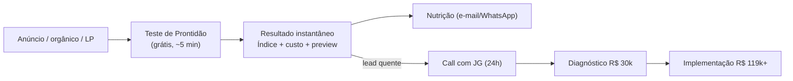

# TRÍVIA OS — TESTE DE PRONTIDÃO PRA ESCALAR (Spec v1)

> *Trívia Studio · Documento Interno · v1 · Camada de topo de funil do [[Trívia OS - Plano de Negocio e GTM]]. Alimenta a qualificação que abre o [[Trívia OS - Playbook do Diagnóstico]].*

Ferramenta **grátis**, self-service, movida a IA, que qualifica e aquece o lead entregando valor imediato. É o lead magnet do Trívia OS — o equivalente, para o OS, do que o SKU 01 (Conselheiro IA + assessment) é para a Atlas.

> **Promessa pública:** *"Sua empresa está pronta pra crescer sem virar caos? Descubra em 5 minutos."*
> O lead responde ~10 perguntas e recebe na hora um **Índice de Escalabilidade (0–100)**, o **custo invisível** que a operação atual sangra por mês, e um preview do que travaria primeiro.

-----

## 1 · Posicionamento e regra de ouro

| | Teste de Prontidão (este doc) | Diagnóstico (R$ 30k) |
|---|---|---|
| Custo | **Grátis** (lead magnet) | R$ 30k abatível |
| Quem faz | O lead, sozinho, ~5 min | Trívia (JG + Lucas + dev), 3–4 semanas |
| Profundidade | Estimativa direcional por autodeclaração | Levantamento real com acesso aos sistemas |
| Entrega | Índice + custo estimado + preview | Planta do OS completa |
| Função no funil | Capta, qualifica, aquece | Qualifica a fundo e abre a implementação |

> **Regra de ouro do naming:** o teste **nunca** se chama "diagnóstico". É um *teste/score* self-service. O diagnóstico é o produto pago de 3–4 semanas. Manter a fronteira nítida evita que o lead pense que os R$ 30k são "a mesma coisa, só mais cara".

> **Regra de ouro da mensagem:** o título é a **promessa** (escalar sem inchar). O custo invisível é a **prova** (ROI) que aparece dentro do resultado. Fragmentação é o **vilão** que o resultado nomeia — nunca o título. (Ver hierarquia da mensagem no plano, Seção 02.)

-----

## 2 · Onde encaixa no funil



O teste substitui a qualificação manual de 4 perguntas como **primeira camada em escala** — a qualificação por WhatsApp continua valendo para quem chega por indicação/outbound sem passar pelo teste.

-----

## 3 · As perguntas (~10)

Cada pergunta serve a **dois propósitos**: alimentar o Índice/custo (insumo) e/ou qualificar fit comercial (filtro). Formato sugerido: conversacional, uma por tela.

| # | Pergunta | Formato | Serve a |
|---|----------|---------|---------|
| Q1 | Qual o setor da sua empresa? | seleção | contexto + benchmark |
| Q2 | Faturamento aproximado nos últimos 12 meses? | faixas (até 2,5MM / 2,5–10 / 10–30 / 30–50 / 50MM+) | **qualificação (porte)** + base do custo |
| Q3 | Quantas pessoas no time **operacional** (não-liderança)? | número | base do cálculo de custo |
| Q4 | Quais sistemas/ferramentas vocês usam pra tocar a operação? | multi-select + campo livre (ERP, CRM, planilhas, financeiro, estoque, atendimento, ads, RH…) | **dispersão de dados** |
| Q5 | Em quantos desses vocês **digitam o mesmo dado mais de uma vez**? | nenhum / 1–2 / 3+ | **retrabalho** |
| Q6 | Quando você precisa de um número da empresa, em quantos lugares procura? | 1 / 2–3 / 4+ / "ninguém sabe" | **visibilidade** |
| Q7 | Quanto do dia do seu time some em tarefa manual e repetitiva? | pouco / ~1/4 / ~metade / maior parte | **retrabalho (intensidade)** |
| Q8 | Se você sumisse 1 semana, a operação roda sem você? | roda numa boa / trava em parte / para | **dependência (refém)** |
| Q9 | Você sente que tem dinheiro vazando que não consegue enxergar? | não / desconfio / com certeza | **dor C (custo)** + temperatura |
| Q10 | Você (dono/sócio) consegue se envolver pessoalmente num projeto desses? | sim / talvez / não | **qualificação (engajamento)** |

> Q4–Q8 são o coração do Índice. Q2 e Q10 são filtros obrigatórios. Q9 mede temperatura emocional (quem responde "com certeza" está quente).

-----

## 4 · Índice de Prontidão pra Escalar (0–100)

**Definição:** 100 = operação unificada, pronta pra escalar; 0 = caos fragmentado total. Um score **baixo é o gancho** ("você está em 34/100 — sua operação trava o seu crescimento").

> **Decisão de arquitetura:** o Índice e o custo são calculados por **código determinístico** (Supabase/edge function), não pela IA. LLM não faz aritmética confiável. A IA entra só na **narrativa, na classificação dos sistemas e nos quick wins** (Seção 7).

### Cinco dimensões ponderadas

| Dimensão | Peso | Vem de | Pior caso (0 pts) | Melhor caso (peso cheio) |
|----------|------|--------|-------------------|--------------------------|
| Unificação de dados | 30 | Q4, Q6 | 4+ sistemas, dado em 4+ lugares | 1 fonte, número num lugar só |
| Retrabalho/automação | 25 | Q5, Q7 | digita 3+ vezes, metade do dia manual | nada duplicado, pouco manual |
| Visibilidade pra decidir | 20 | Q6, Q9 | "ninguém sabe", vazamento certo | número na hora, sem vazamento |
| Dependência operacional | 15 | Q8 | para sem o dono | roda sozinha |
| Prontidão de IA | 10 | Q4, Q7 | nada digital, tudo na cabeça | base digital pronta pra agente |

**Fórmula:**
```
Índice = Σ (pontos_dimensão_i)   // máximo 100
pontos_dimensão_i = peso_i × (nota_normalizada_i)   // nota_normalizada ∈ [0,1]
```

Cada resposta mapeia para uma nota normalizada. Exemplo da dimensão *Unificação* (peso 30):
```
Q4 (nº de sistemas distintos):   1–2 → 1,0 | 3–4 → 0,6 | 5–6 → 0,3 | 7+ → 0,1
Q6 (lugares pra achar um número): 1 → 1,0 | 2–3 → 0,6 | 4+ → 0,2 | ninguém sabe → 0,0
nota_unificação = média(Q4, Q6)
pontos_unificação = 30 × nota_unificação
```
(Tabelas de mapeamento das 5 dimensões → planilha anexa a produzir.)

### Faixas de leitura (o que o lead vê)

| Faixa | Rótulo | Mensagem-gancho |
|-------|--------|-----------------|
| 0–35 | **Operação travando o crescimento** | "Hoje crescer significa contratar e gerar mais caos. Sua operação é o gargalo." |
| 36–60 | **Crescendo no susto** | "Dá pra crescer, mas cada degrau dói. Você sente o atrito aumentando." |
| 61–80 | **Quase lá** | "Boa base. Pontos específicos ainda travam a escala — dá pra resolver rápido." |
| 81–100 | **Pronta pra escalar** | "Operação madura. Talvez seja hora de IA pra dar o próximo salto, não de unificar." |

> A maioria do ICP cai em 0–60 — e é exatamente aí que o OS resolve. Quem dá 81+ provavelmente não é cliente de implementação agora (honestidade que constrói confiança).

-----

## 5 · Custo invisível (R$/mês) — a prova de ROI

Estimativa **conservadora e em faixa** do que a fragmentação custa hoje. Três parcelas:

```
1. Retrabalho      = N_op × 160h × %retrabalho × custo_hora
2. Software redund. = N_sistemas_substituíveis × ticket_médio_assinatura
3. Perda por erro   = faturamento_mensal × %perda_estimada   (faixa, conservador)

Custo invisível/mês = soma das três, apresentada como faixa (–20% a +20%)
```

**Parâmetros default (ajustáveis):**
- `%retrabalho` ← Q7: pouco → 0,10 | ~1/4 → 0,25 | ~metade → 0,45 | maior parte → 0,65
- `custo_hora` ← R$ 35–55 (custo fully-loaded de pessoal operacional; usar faixa por setor)
- `ticket_médio_assinatura` ← R$ 150–800 por sistema substituível
- `%perda_estimada` ← Q9: não → 0% | desconfio → 0,5% | com certeza → 1,5% (sobre faturamento)

**Exemplo:** empresa R$ 1,5M/mês de faturamento, 8 pessoas operacionais, "~metade do dia" manual, 5 sistemas, "desconfio" de vazamento:
```
Retrabalho   = 8 × 160 × 0,45 × R$45  ≈ R$ 25.900/mês
Software     = 3 substituíveis × R$400 ≈ R$ 1.200/mês
Erro         = R$ 1.500.000 × 0,5%     ≈ R$ 7.500/mês
Custo invisível ≈ R$ 28.000 – R$ 41.000/mês
```
> O lead vê: *"Sua operação fragmentada custa entre R$ 28k e R$ 41k por mês hoje."* Com isso, R$ 119k (faseado, com payback em ~4–6 meses) deixa de ser caro. **Essa é a ponte natural pro diagnóstico.**

> **Cuidado de honestidade:** sempre faixa, sempre "estimativa". O número real sai no diagnóstico pago. Prometer precisão aqui queima a confiança que o diagnóstico precisa.

-----

## 6 · O resultado entregue ao lead

Tela de resultado + PDF + (opcional) áudio NotebookLM:

1. **Seu Índice: NN/100** — com o rótulo da faixa e o gráfico.
2. **Seu custo invisível: R$ X–Y/mês** — a parcela que mais pesa em destaque.
3. **O que está te travando** — top 3 dimensões piores, em linguagem de dor (não de "fragmentação").
4. **Preview do seu OS** — classificação rápida dos sistemas que ele citou em *Substituir / Integrar / Matar* (gerada por IA).
5. **1–2 quick wins** — onde um agente de IA atacaria primeiro.
6. **CTA** — *"Isto é um raio-X de 5 minutos. O exame completo — a planta exata do seu OS, com escopo e investimento — é o diagnóstico que a gente faz junto. Quer conversar?"* → WhatsApp/agenda.

-----

## 7 · A IA (Claude API) — o que ela faz e o prompt

A IA **não calcula** o Índice nem o custo (isso é código). Ela recebe as respostas + os números já calculados e gera: a **narrativa personalizada**, a **classificação Substituir/Integrar/Matar** dos sistemas citados, e os **quick wins**.

### System prompt (rascunho)
```
Você é o estrategista de operações da Trívia. Recebe as respostas de um
"Teste de Prontidão pra Escalar" de um dono de PME, mais o Índice (0-100) e o
custo invisível (faixa) já calculados. Sua tarefa é gerar um resultado curto,
direto e em português brasileiro simples (linguagem de dono, não de TI).

REGRAS:
- Fale da DOR SENTIDA (não escala sem contratar, é refém da operação, dinheiro
  vazando), nunca lidere com a palavra "fragmentação". Use "fragmentação" no
  máximo uma vez, como o nome técnico do problema.
- Nunca prometa números exatos. O custo é estimativa; o número real sai no
  diagnóstico.
- Seja honesto: se o Índice for alto (81+), diga que talvez ele não precise de
  unificação agora.
- Termine sempre fazendo a ponte para uma conversa, sem pressão.

ENTRADA (JSON): { respostas, indice, faixa, custo_min, custo_max }

SAÍDA (JSON):
{
  "diagnostico_curto": "2-3 frases nomeando a dor que o Índice revela",
  "top_3_travas": ["...", "...", "..."],   // em linguagem de dor
  "preview_os": [ {"sistema": "...", "decisao": "Substituir|Integrar|Matar", "porque": "..."} ],
  "quick_wins": ["1 agente que resolveria X", "..."],
  "cta": "convite curto e específico pra conversar"
}
```

### Regras da classificação Substituir/Integrar/Matar (no prompt)
- **Substituir:** sistemas commodity / planilhas / controles manuais (CRM-planilha, tarefas, financeiro manual).
- **Integrar:** fiscal/NF-e, gateway de pagamento, marketplace, sistema regulado/best-in-class.
- **Matar:** ferramenta citada que claramente só existe pela fragmentação (duplicada, em desuso).

-----

## 8 · Lógica de qualificação (invisível ao lead)

O mesmo input gera um **score de fit comercial** e roteia o lead.

| Sinal | Regra |
|-------|-------|
| Faturamento (Q2) | < R$ 2,5MM → **descarta** (fora do ICP) |
| Engajamento do dono (Q10) | "não" → esfria (nutrição longa) |
| Fragmentação (Índice) | 0–60 → fit alto; 61–80 → fit médio; 81+ → fit baixo agora |
| Temperatura (Q9) | "com certeza" (vazamento) → quente |
| Custo invisível | alto em R$ → prioriza na fila |

**Roteamento:**
- **Quente** (ICP + Índice ≤ 60 + dono engajado + temperatura alta) → notifica JG, call em 24h.
- **Morno** (ICP, mas tíbio ou Índice médio) → sequência de nutrição + reoferta de call.
- **Frio** (fora do ICP ou Índice 81+) → só o relatório + newsletter. Sem queimar tempo de venda.

-----

## 9 · Stack técnico (tudo já é da casa)

| Camada | Ferramenta | Observação |
|--------|-----------|------------|
| Form / UI do teste | **Lovable** | mesma base do SKU 01 da Atlas — reaproveitar |
| Persistência + score | **Supabase** | edge function calcula Índice e custo (determinístico) |
| Narrativa + preview | **Claude API** | Seção 7 |
| Áudio do resultado | **NotebookLM** | opcional, eleva percepção de valor |
| Versão WhatsApp + roteamento | **JimmyAtende** | versão conversacional + notifica JG no lead quente |

> Reaproveitamento: a engenharia do assessment do SKU 01 da Atlas (Lovable + Supabase + Claude + NotebookLM) cobre ~70% disto. O que muda é o questionário, a fórmula e os prompts.

-----

## 10 · Métricas do teste

| Métrica | Meta inicial | Sinal verde |
|---------|--------------|-------------|
| Conclusão do teste (start → resultado) | ≥ 50% | ≥ 65% |
| Captura de contato (e-mail/WhatsApp) | ≥ 70% dos que concluem | ≥ 85% |
| Teste → call (entre os quentes) | ≥ 20% | ≥ 35% |
| Call → diagnóstico R$ 30k | ≥ 30% | ≥ 50% |
| Custo por lead qualificado (se com mídia) | a definir na 1ª campanha | — |

-----

## 11 · Decisões em aberto e próximos passos

**Decisões (alinhar com Lucas):**
1. Nome final — "Teste de Prontidão pra Escalar" (recomendado) vs "Calculadora do Custo Invisível" vs "Raio-X de Escala".
2. Pesos finais das 5 dimensões do Índice.
3. Parâmetros do custo invisível (custo_hora por setor, % de perda).
4. Grátis total vs pede e-mail antes de mostrar o resultado (gate de captura).
5. Versão web primeiro, WhatsApp depois — ou as duas juntas?

**Próximos passos de produção:**
1. Planilha de mapeamento resposta → nota normalizada (5 dimensões).
2. Edge function do cálculo (Índice + custo) no Supabase.
3. Prompt de produção da IA + testes com 5–10 casos reais.
4. Form no Lovable + tela de resultado + PDF.
5. Integração JimmyAtende (roteamento do lead quente pro JG).

-----

*Documento vivo. Revisão após a 1ª campanha de captação.*

**Proposta · João Gabriel Novais · Pendente de alinhamento com Lucas Azevedo**
