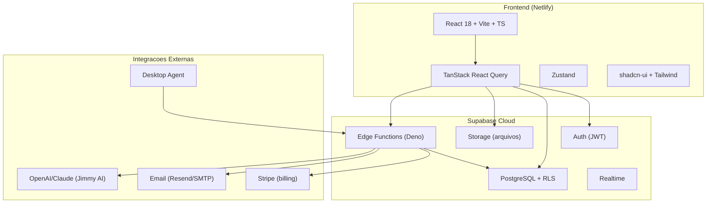

# Vista Intel Pro — Arquitetura do Sistema

## Diagrama Geral



## Estrutura de Pastas (src/)

```
src/
├── App.tsx                    → Rotas e providers
├── main.tsx                   → Entry point
├── components/
│   ├── ui/                    → Componentes base shadcn-ui (~80 arquivos)
│   ├── analytics/             → Dashboards e relatorios
│   │   ├── ceo/              → Relatorios nível CEO
│   │   ├── executive/        → Relatorios executivos
│   │   └── shared/           → Componentes compartilhados de analytics
│   ├── automations/           → Builder e lista de automacoes
│   ├── canvas/                → Editor de canvas (Fabric.js)
│   ├── dashboard/             → Views do dashboard principal
│   ├── editor/                → Componentes do editor TipTap
│   ├── help/                  → Pagina de ajuda
│   ├── history/               → Historico de alteracoes
│   ├── import/                → Wizard de importacao (ClickUp, Monday, CSV)
│   ├── jimmy/                 → Jimmy AI (insights, analise)
│   ├── landing/               → Landing page publica
│   ├── layout/                → AppSidebar, DashboardLayout, OrganizationLayout
│   ├── navigation/            → Navegacao
│   ├── notes/                 → Notas de projeto
│   ├── notifications/         → Centro de notificacoes
│   ├── organization/          → Configuracoes de organizacao
│   ├── profile/               → Perfil de usuario
│   ├── projects/              → Gerenciamento de projetos
│   │   ├── expenses/         → Despesas de projeto
│   │   └── files/            → Gerenciador de arquivos de projeto
│   ├── proposals/             → Sistema de propostas comerciais
│   ├── reports/               → Relatorios
│   ├── shared/                → Componentes compartilhados
│   ├── spaces/                → Espacos colaborativos
│   ├── superadmin/            → Painel superadmin
│   ├── support/               → Chat de suporte AI
│   ├── tasks/                 → Sistema de tarefas
│   │   ├── attachments/      → Anexos de tarefas
│   │   ├── cells/            → Celulas editaveis da spreadsheet
│   │   └── views/            → Views (Board, Lista, Kanban, Calendario, Spreadsheet)
│   ├── team/                  → Gestao de equipe e timeline
│   ├── theme/                 → Tema e aparencia
│   ├── time-tracking/         → Timer e registro de horas
│   ├── workload/              → Dashboard de workload
│   └── workspace/             → Workspace pessoal (docs, files, whiteboards, todos)
├── contexts/
│   ├── ActiveTimerContext.tsx  → Timer ativo global
│   ├── DiagnosticLogContext.tsx→ Logs de diagnostico
│   ├── NotificationContext.tsx → Notificacoes realtime
│   ├── OrganizationContext.tsx → Org ativa do usuario
│   └── ThemeContext.tsx        → Tema de cores customizado
├── hooks/                     → 110 custom hooks
├── integrations/supabase/     → Client e types gerados
├── lib/                       → Utils e helpers
├── pages/                     → 31 paginas
├── types/                     → Tipos compartilhados (canvas, health-score, whiteboard)
└── utils/                     → Utilitarios (drawing, canvas, thumbnail)
```

## Features e Componentes Principais

### Projetos
| Componente | Responsabilidade |
|-----------|-----------------|
| ProjectsTable | Tabela principal de projetos |
| ProjectsPhasesKanban | Kanban por fases |
| ProjectsSpreadsheetView | View tipo planilha |
| ProjectTimeline / ProjectTimelineGrid | Gantt de projetos |
| ProjectCalendarView | Calendario de projetos |
| CreateProjectModal / EditProjectModal | CRUD de projetos |
| CloneProjectModal | Clonagem com tarefas |
| ProjectImportWizard | Import ClickUp/Monday/CSV |
| ProjectAIInsights | Insights de AI por projeto |
| ProjectExpensesTab | Despesas do projeto |
| ProjectFilesManager | Gerenciador de arquivos |
| ProjectDeliveriesTimeline | Timeline de entregas |

### Tarefas
| Componente | Responsabilidade |
|-----------|-----------------|
| TaskBoardView | Kanban de tarefas |
| TaskListView | Lista simples |
| TaskGroupedListView | Lista agrupada |
| TaskSpreadsheetView | Spreadsheet editavel |
| TaskKanbanPhasesView | Kanban por fases |
| TaskCalendarView | Calendario de tarefas |
| TaskDetailsDrawer | Drawer de detalhes |
| CreateTaskModal / EditTaskModal | CRUD de tarefas |
| BatchActionsBar | Acoes em batch |
| UnifiedTasksView | Wrapper unificado de views |

### Espacos
| Componente | Responsabilidade |
|-----------|-----------------|
| SpaceOverview | Visao geral do espaco |
| SpaceListView | Lista de tarefas no espaco |
| SpaceAllTableView | Tabela completa |
| SpaceAllKanbanView | Kanban do espaco |
| SpaceDocumentEditor | Editor de docs (TipTap) |
| SpaceSpreadsheetEditor | Editor de planilhas |
| SpaceCanvasEditor | Editor de canvas |
| SpaceSidebar | Navegacao lateral do espaco |
| SpaceSubtasksList | Subtarefas no espaco |

### Analytics
| Componente | Responsabilidade |
|-----------|-----------------|
| OrganizationOverview | Dashboard geral |
| CriticalProjectsDashboard | Projetos criticos |
| OrganizationCostDashboard | Custos organizacionais |
| OrganizationDeadlinesDashboard | Deadlines |
| CollaboratorCostReport | Custo por colaborador |
| ExecutiveProjectReport | Relatorio executivo |
| ProjectPredictionsReport | Predicoes AI |
| TeamPerformanceReport | Performance da equipe |
| ProjectCoordinationReport | Coordenacao |
| ProposalFinancialReport | Financeiro de propostas |

## Schema do Banco (Tabelas Principais)

### Core
| Tabela | Descricao |
|--------|-----------|
| organizations | Organizacoes (multi-tenant) |
| organization_users | Usuarios por organizacao (role) |
| profiles | Perfis de usuario |
| subscriptions | Assinaturas/planos |

### Projetos
| Tabela | Descricao |
|--------|-----------|
| projects | Projetos |
| project_phases | Fases de um projeto |
| project_statuses | Status customizados |
| project_team_members | Membros do time do projeto |
| project_custom_fields | Campos customizados |
| project_deliveries | Entregas |
| project_expenses | Despesas |
| project_files | Arquivos |
| project_folders | Pastas de arquivo |
| project_documents | Documentos rich text |
| project_notes | Notas |
| project_history | Historico de alteracoes |
| project_reports | Relatorios salvos |
| project_board_column_order | Ordem das colunas no board |

### Tarefas
| Tabela | Descricao |
|--------|-----------|
| tasks | Tarefas (com parent_id para subtarefas) |
| task_comments | Comentarios |
| task_history | Historico |
| task_attachments | Anexos |

### Espacos
| Tabela | Descricao |
|--------|-----------|
| spaces | Espacos colaborativos |
| space_lists | Listas dentro do espaco |
| space_documents | Documentos |
| space_spreadsheets | Planilhas |
| space_canvases | Canvas/whiteboards |
| space_files | Arquivos |
| space_folders | Pastas |

### Tempo e Custos
| Tabela | Descricao |
|--------|-----------|
| time_entries | Registros de tempo |
| time_entry_categories | Categorias de time entry |
| user_rates | Taxas/custo hora por usuario |
| expense_categories | Categorias de despesa |
| expense_products | Produtos de despesa |
| expense_field_configs | Configuracao de campos de despesa |

### Propostas
| Tabela | Descricao |
|--------|-----------|
| proposals | Propostas comerciais |
| proposal_templates | Templates |
| proposal_interactions | Interacoes do cliente |
| proposal_legal_acceptances | Aceites legais |
| proposal_meeting_requests | Solicitacoes de reuniao |

### AI e Automacoes
| Tabela | Descricao |
|--------|-----------|
| ai_agent_settings | Config do agente AI |
| ai_predictions | Predicoes geradas |
| automations | Regras de automacao |
| automation_steps | Steps de uma automacao |
| automation_logs | Logs de execucao |
| alerts | Alertas gerados |

### Equipe e Colaboradores
| Tabela | Descricao |
|--------|-----------|
| collaborator_groups | Grupos |
| collaborator_group_members | Membros dos grupos |
| collaborator_types | Tipos de colaborador |
| user_absences | Ausencias |
| user_vacation_balance | Saldo de ferias |
| user_devices | Dispositivos |

### Workspace Pessoal
| Tabela | Descricao |
|--------|-----------|
| workspace_documents | Documentos pessoais |
| workspace_files | Arquivos pessoais |
| workspace_folders | Pastas pessoais |
| workspace_todo_lists | Listas de todo |
| workspace_todo_items | Items de todo |
| workspace_whiteboards | Whiteboards pessoais |

### Sistema
| Tabela | Descricao |
|--------|-----------|
| notifications | Notificacoes |
| notification_preferences | Preferencias |
| audit_logs | Logs de auditoria (superadmin) |
| superadmins | Superadmins do sistema |
| support_conversations | Conversas de suporte |
| support_rate_limit | Rate limit do suporte |
| import_logs | Logs de importacao |
| organization_usage | Uso da organizacao |
| organization_limit_hits | Hits de limite |
| org_agent_tokens | Tokens de agente API |
| os_user_mappings | Mapeamento de usuarios OS |
| desktop_time_events | Eventos do desktop agent |
| user_favorite_projects | Projetos favoritos |
| organization_tags | Tags da organizacao |
| organization_default_phases | Fases padrao |
| organization_default_statuses | Status padrao |
| organization_project_status_config | Config de status |
| organization_ai_summaries | Resumos AI |
| delivery_attachments | Anexos de entregas |

## Edge Functions

| Funcao | Responsabilidade |
|--------|-----------------|
| ai-daily-digest | Digest diario com AI (resumo de atividades) |
| ai-insights | Gerar insights de projeto com AI |
| check-task-deadlines | Cron: verificar deadlines de tarefas e enviar alertas |
| clawbot-api | API do chatbot de suporte |
| clickup-import | Importacao de dados do ClickUp |
| create-checkout-session | Criar sessao de checkout Stripe |
| create-organization-with-admin | Criar org com admin inicial |
| create-team-member | Criar membro na equipe |
| daily-project-alerts | Cron: alertas diarios de projetos |
| delete-user | Deletar usuario completo |
| desktop-agent-data | Receber dados do desktop agent |
| desktop-agent-events | Receber eventos do desktop agent |
| generate-proposal-pdf | Gerar PDF de proposta |
| generate-weekly-report | Gerar relatorio semanal automatico |
| purge-organization-data | Purge completo de dados de uma org |
| reset-pedreira-passwords | Reset de senhas (Pedreira) |
| reset-user-password | Reset de senha de usuario |
| run-automation-trigger | Executar trigger de automacao |
| seed-demo-construction-data | Seed de dados demo (construcao civil) |
| seed-demo-organization | Seed de organizacao demo |
| send-credentials-email | Enviar email com credenciais |
| send-proposal-email | Enviar proposta por email |
| stripe-webhook | Webhook do Stripe |
| support-chat | Chat de suporte com AI |
| update-user-email | Atualizar email do usuario |

## Integracoes Externas

| Servico | Uso |
|---------|-----|
| Stripe | Billing, planos e checkout |
| OpenAI/Claude | Jimmy AI (insights, predicoes, suporte) |
| Email (Resend/SMTP) | Envio de propostas, credenciais, alertas |
| ClickUp API | Importacao de projetos/tarefas |
| Monday.com API | Importacao de projetos/tarefas |
| Desktop Agent | Tracking automatico de tempo via app desktop |

## Seguranca

- RLS (Row Level Security) habilitado com FORCE em todas as tabelas
- Multi-tenant: policies filtram por organization_id
- JWT validado em todas as Edge Functions
- Input validado com Zod em Edge Functions
- Papeis: superadmin > admin > manager > member
- VITE_ expoe apenas URL e anon key (seguro)
- Service role key apenas em Edge Functions (servidor)
