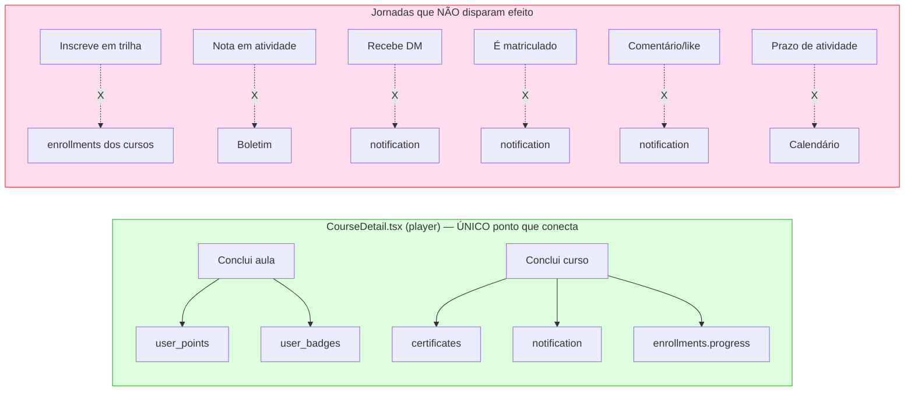

# Mapeamento de Conexões e Jornadas — TriviaEdutech

> **Por que este documento existe.** O [[Mapeamento do Sistema]] (17/06) mapeia *o que existe* (arquitetura, 49 tabelas, 19 edge functions, segurança). Este aqui mapeia *o que não se conversa*: features que funcionam isoladas, dados produzidos num lugar e nunca lidos no outro, e jornadas que começam mas não terminam. Foi gerado em 18/06 por 4 agentes de auditoria varrendo o código-fonte real em paralelo (rotas/páginas, camada de dados, jornadas end-to-end e marcadores de incompletude).

## Diagnóstico em uma frase

O código está limpo e a maioria das telas está pronta (**46 de 50 páginas funcionais**, sem TODO/FIXME/código morto espalhado). O problema **não** é "páginas pela metade" — é que **as features funcionam isoladas e não se conversam**. Quase todos os "ligamentos" entre features (pontos, badges, certificado, recálculo de progresso, notificação de conclusão) estão amarrados num **único arquivo** (`src/pages/CourseDetail.tsx`, o player do curso). **Não existe nenhum trigger no banco nem edge function** para esses efeitos de domínio. Então qualquer caminho que não passe pelo player — import de cursos, ação de admin, trilha, atividade, mensagem, API externa — **não dispara nada**. É exatamente por isso que dá a sensação de que "as coisas não se conversam".

---

## Mapa de produtor → consumidor (onde o dado quebra)

Cada linha é uma "ponte" que deveria existir entre features. ✅ = funciona. ❌ = quebra confirmada.

| Evento de domínio | Onde é PRODUZIDO | Onde DEVERIA ser consumido | Status |
|---|---|---|---|
| Aluno conclui aula | `CourseDetail.tsx:288` (player) | Pontos, badges, progresso do curso | ✅ (só pelo player) |
| Aluno conclui curso (100%) | `CourseDetail.tsx:277-282` | Certificado + notificação + pontos | ✅ (só pelo player) |
| Aluno se inscreve em **trilha** | `useLearningPaths.ts:161-174` | Matrícula nos cursos da trilha (`enrollments`) | ❌ **não matricula** |
| Progresso da trilha | `LearningPaths.tsx:117-119` | Lê progresso dos cursos | ❌ **sempre 0%** (não há matrícula) |
| Instrutor dá nota em **atividade** | `submit-activity` (`graded`/`returned`) | Boletim do aluno (`useGrades`) | ❌ **boletim só lê quizzes** |
| Atividade existe | `App.tsx:137-138` (rotas) | Menu/navegação do aluno | ❌ **sem link no menu** |
| Prazo de atividade (`due_date`) | tabela `activities` | Calendário acadêmico | ❌ **calendário ignora** |
| Aluno recebe **DM** | `useMessages.ts:142-171` | Notificação in-app | ❌ **não notifica** |
| Aluno é **matriculado** | `CourseDetail.tsx:211`, `Checkout.tsx:89` | Notificação in-app | ❌ **não notifica** |
| **Certificado** emitido | `useCertificates.ts:68` | Notificação dedicada | ❌ **sem notificação própria** |
| Comentário/like na **comunidade** | `CommunityFeed.tsx:172-210` | Notificação ao autor | ❌ **não notifica** |
| Badge "primeiro comentário" | `useGamification.ts:283-295` | Atribuição ao comentar | ❌ **código morto, nunca chamado** |
| Badge "sequência de 7 dias" | (definido) | Detecção de streak | ❌ **sem lógica, impossível** |
| FAQ | tabela `faq_items` + `useFAQ` | `/help` ✅ e `/ajuda` ❌ | ❌ `/ajuda` é **hardcoded** |
| Preços de plano | tabelas `subscriptions`/`platform_subscriptions` | Landing, Plans, Signup | ❌ **chumbado em 3 arquivos** |

---

## 1. Jornadas quebradas (priorizadas)

1. **Trilhas são cosméticas.** Inscrever-se na trilha só grava `learning_path_enrollments` — não matricula nos cursos. Como o progresso é calculado a partir dos cursos, fica **travado em 0% para sempre**. → **[[STORY-044]]**
2. **Nota de atividade some do boletim.** Instrutor corrige com nota e feedback, mas "Minhas Notas" só lê provas (quizzes). Avaliação inteira fica invisível pro aluno. → **[[STORY-045]]**
3. **Eventos básicos não notificam.** Receber DM, ser matriculado, ganhar certificado, ter atividade corrigida, receber comentário/like — nada gera notificação. Hoje só: compra aprovada, badge, curso concluído e nudge manual. → **[[STORY-046]]**
4. **Atividades sem porta de entrada.** Feature completa (backend + telas), mas sem link no menu. Aluno só chega por URL ou de dentro do curso. → **[[STORY-049]]**
5. **Calendário ignora prazos de atividades.** Agrega prazos de matrículas, certificados e provas, mas não `activities.due_date` — o prazo que o aluno mais precisa ver. → **[[STORY-047]]**
6. **Conquistas impossíveis + gamificação só no player.** "Primeiro comentário" é código morto; "sequência de 7 dias" não tem lógica. E nenhum ponto/badge é dado fora do player. → **[[STORY-048]]**

## 2. Páginas que existem mas o usuário não alcança (órfãs/duplicadas)

- `/plans` — upgrade de plano completo, **sem nenhum link** (monetização sem porta). → **[[STORY-049]]**
- `/settings` — edição de perfil completa, sem item de menu (redundante com `/profile`). → **[[STORY-049]]**
- `/members` e `/leaderboard` — completas, mas **duplicadas** pelas abas "Membros"/"Ranking" de `/community`. → **[[STORY-049]]**

## 3. Dados falsos / chumbados

- **Camada de marketing 100% hardcoded:** preços (repetidos em Landing, Plans, Signup), depoimentos, estatísticas ("10k+ alunos", "98% satisfação") e FAQ da landing.
- **Cobrança existe só no banco:** `subscriptions`, `platform_subscriptions`, `mp_oauth_connections` sem nenhuma tela → por isso os preços são chumbados.
- **Duas telas de ajuda divergentes:** `/help` (dinâmico, banco) vs `/ajuda` (hardcoded). → **[[STORY-050]]**
- **Tabela `assignments`/`assignment_submissions` órfã** — sistema de tarefas legado, paralelo ao de `activities` (o usado). Candidata a remoção.

## 4. Páginas realmente incompletas (são poucas)

- `/live` (Aulas ao Vivo) — stub assumido, atrás de feature flag (STORY-041, fora do escopo aqui).
- Nudge por email (admin) — grava no banco + notifica no app, mas o **envio de email não está conectado** ("será integrado em breve").
- "Atualizações da Plataforma" (Home/News) — changelog estático fingindo ser dinâmico.

---

## A causa raiz e a estratégia de correção

Todos os efeitos de domínio estão amarrados no front, dentro do player. **A correção estrutural é mover os efeitos para o banco (triggers `SECURITY DEFINER`)**, de modo que disparem por *qualquer* caminho (player, admin, import, API, trilha). As stories abaixo seguem essa estratégia:

- **[[STORY-046]]** cria um *motor de notificações* via triggers (a peça central — resolve 5 jornadas de uma vez).
- **[[STORY-044]]** usa trigger para matricular nos cursos ao entrar na trilha.
- **[[STORY-048]]** move pontos/badges para triggers e conserta os badges impossíveis.
- **[[STORY-045]]** e **[[STORY-047]]** são correções de leitura (boletim e calendário passam a ler atividades).
- **[[STORY-049]]** e **[[STORY-050]]** são navegação e limpeza (sem banco).

### Backlog gerado (resumo)

| Story | Título | Prioridade | Tipo |
|---|---|---|---|
| [[STORY-044]] | Trilhas que matriculam de verdade | P1 | Trigger + hook |
| [[STORY-045]] | Boletim unificado (provas + atividades) | P1 | Frontend (leitura) |
| [[STORY-046]] | Motor de notificações por eventos | P1 | Triggers + RLS |
| [[STORY-047]] | Calendário com prazos de atividades | P2 | Frontend (leitura) |
| [[STORY-048]] | Gamificação confiável (triggers + badges) | P2 | Triggers + cleanup |
| [[STORY-049]] | Navegação e páginas órfãs | P2 | Frontend (nav) |
| [[STORY-050]] | FAQ único e dinâmico | P3 | Frontend + dados |

---

*Gerado em 2026-06-18. Complementa [[Mapeamento do Sistema]]. Evidências de arquivo:linha conferidas no código real.*
