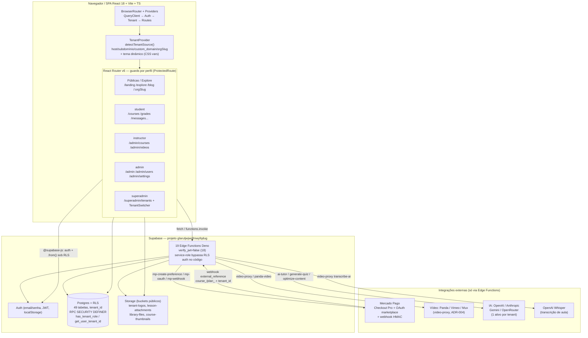
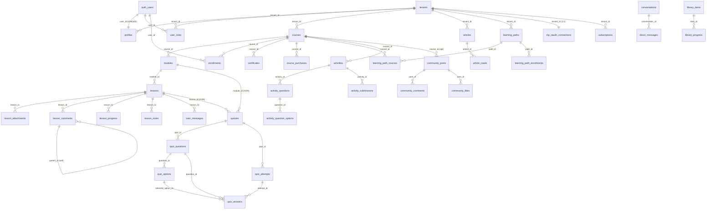

> **Como este documento foi gerado:** mapeamento automatizado por 6 agentes do framework TRIVIAIOX trabalhando em paralelo sobre o código-fonte real (não sobre a documentação). Cada seção detalhada abaixo foi produzida por um agente especialista e a camada de visão geral foi consolidada pelo @architect líder. Data: 2026-06-17.

# Mapeamento Completo do Sistema — TriviaEdutech

O TriviaEdutech é uma plataforma de ensino a distância (LMS/EAD) **multi-tenant white-label**: cada organização (tenant) opera com branding, domínio, cursos, alunos e configurações próprios, isolados logicamente por uma coluna `tenant_id` em quase todas as tabelas, reforçada por Row Level Security (RLS) no PostgreSQL. O frontend é uma SPA React 18 + Vite + TypeScript + Tailwind/shadcn (origem Lovable), e o backend é inteiramente Supabase (Auth, Postgres, Storage e 19 Edge Functions Deno). Os três papéis de negócio (`admin`, `instructor`, `student`) vivem no enum `app_role`; o **Superadmin da plataforma** é modelado como o `admin` do tenant raiz fixo `00000000-0000-0000-0000-000000000001`. Toda integração externa (Mercado Pago, Vimeo/Panda/Mux, provedores de IA, Whisper) é mediada por Edge Functions — o navegador nunca fala diretamente com terceiros nem detém credenciais server-side.

## Sumário Executivo

- **Escala do schema:** **49 tabelas** com RLS habilitado no schema `public` (47 tipadas em `types.ts` + 4 do módulo `activities` ainda não regeneradas), evoluídas por **39 migrations** entre fev e jun/2026. Tudo pendura em `tenants` via `tenant_id`; a espinha de conteúdo é `courses → modules → lessons`.
- **Backend serverless:** **19 Edge Functions** Deno (+ módulo `_shared/ai-client.ts`) cobrindo IA, vídeo, pagamentos, gestão de org/usuários, atividades e SEO. **18 das 19 têm `verify_jwt = false`** no `config.toml` — a autorização real é feita no código de cada função, não no gateway.
- **Amplitude de produto:** ~20 módulos funcionais e **20 features** em `src/features/*`. Maduros: Cursos/Aulas, Trilhas, Quiz por IA, Atividades, Comunidade, DMs, Blog/SEO, Biblioteca, Certificados, Boletim, Relatórios. Frágeis/parciais: **Tutor IA** e **Gamificação** (usam `(supabase as any)`, fora dos tipos gerados), **Pagamentos** (mock mode + split implícito sem `application_fee`), **Notificações** (`type` string livre). **Live** é apenas esqueleto (~40 linhas, sem tabela).
- **Multi-tenancy:** resolução por host/subdomínio/`custom_domain`/path (`/:orgSlug`) com override de superadmin, e tema dinâmico injetado via CSS variables — habilita white-label real. ADRs 001–004 documentam tenant por linha, ordem Auth→Tenant, roteamento por path e abstração de vídeo.
- **Maturidade de segurança:** SEC-001 a SEC-014 (CORS allow-list, Zod, RFC 7807, JWT via `getUser()`, RPC sem `is_correct`) resolvidos. Pendentes críticos: **`.env` no histórico git (P0)**, ausência de `netlify.toml`/headers (P1), token MP em texto plano (P1).
- **Pontos estruturais frágeis confirmados:** anon key + project-ref `glarutjwjwqfmwyfqdug` hardcoded em `client.ts` e em hooks (`useVideoProvider`, `useTutorMessages`, `useMpConnection`); `user_roles UNIQUE(user_id, role)` sem `tenant_id`; cobertura parcial de `FORCE RLS`; `has_role()` tenant-blind; buckets de Storage públicos.
- **Roteamento de produção quebrado:** `public/_redirects` só tem o fallback SPA (`/* /index.html 200`); **não há regra mapeando `/sitemap.xml` e `/llms.txt` para as Edge Functions**, então `robots.txt` aponta para um sitemap que devolve `index.html`.
- **Documentação desatualizada:** `architecture.md` (data 2026-02-16) lista ~16 features e não cita `activities`/`tutor`; `API_SPECIFICATION.md` tem erros materiais (auth de `optimize-content`, provider `bunny` inexistente, secret `LOVABLE_API_KEY` obsoleto); `pdf-info`, `mp-oauth` e `submit-activity` não estão documentadas.

## Diagrama de Arquitetura



**Fluxo multi-tenant:** o `TenantProvider` resolve o tenant antes de qualquer chamada de dados (host/subdomínio/`custom_domain` ou slug `/:orgSlug`), prioriza o `authTenantId` quando logado, e injeta cores no `documentElement`. No backend, o isolamento é garantido por RLS (`tenant_id = get_user_tenant_id(auth.uid())`); as Edge Functions usam service-role (que bypassa RLS) e reimplementam a checagem de tenant/papel no código.

## Fluxos Principais

**1. Matrícula + pagamento de curso (split marketplace)**
1. Aluno em `/checkout/:courseId` (`Checkout.tsx`) → POST `mp-create-preference` com `{ mode: "course_purchase", course_id }`.
2. Função valida JWT, resolve tenant (`get_user_tenant_id`), lê `courses.price_cents` (**preço sempre do banco**), bloqueia se já houver compra `completed` (409).
3. Cria preferência em `api.mercadopago.com/checkout/preferences` com o **`access_token` do vendedor** (`mp_oauth_connections` do tenant) — o split ocorre pela titularidade da conta. Grava `course_purchases` (pending), retorna `init_point`; o navegador redireciona.
4. Mercado Pago chama `mp-webhook` → verificação HMAC-SHA256 (`MERCADOPAGO_WEBHOOK_SECRET`) → busca o pagamento → roteia por `external_reference` (`course_{id}_user_{id}_tenant_{id}`).
5. Aprovado: `course_purchases` → `completed`, cria `enrollments` (idempotente) + `notifications`. (Sem credenciais ou OAuth, todo o fluxo cai em **mock mode**.)

**2. Aula com vídeo + transcrição → Tutor IA / Quiz**
1. Aluno abre `/courses/:id`; o `VideoPlayer` consome `video-proxy` (`provider=panda|vimeo|mux`, `action=get`), que valida **matrícula** via join `lessons→modules→courses→enrollments`.
2. Admin/instrutor gera a transcrição (`TranscriptionPanel`): `download-caption` (legendas Vimeo, prioridade `pt-BR>pt>en`) ou `transcribe-ai` (OpenAI Whisper, ≤25 MB) → grava `lessons.transcription_text` + `transcription_source`.
3. Tutor IA: `ai-tutor` monta system prompt com curso/módulo/aula + transcrição (≤6000 chars), resolve o provedor habilitado em `ai_provider_settings` (fallback OpenRouter via `PLATFORM_API_KEY`), persiste em `tutor_messages`.
4. Quiz por IA: `generate-quiz` puxa a transcrição (Mux/Panda/Vimeo) e gera 1–10 questões por tool calling. Aluno responde via `submit-quiz` → nota calculada **no servidor**, `is_correct` nunca exposto (RPC `get_quiz_questions_for_student`).

**3. Criação e correção de atividade**
1. Instrutor monta a atividade (`ActivityBuilder`: `text`, `file_upload` ou `quiz`) em `/admin/courses/:id/activities` → tabelas `activities`/`activity_questions`/`activity_question_options`.
2. Aluno entrega em `/cursos/:courseId/atividades/:actId` → `submit-activity` action `submit` valida matrícula, deadline e tentativas; auto-corrige se for quiz. Grava `activity_submissions`.
3. Instrutor/admin corrige via `submit-activity` actions `grade`/`return` (`final_score`, `feedback`, status `graded`/`returned`).
4. Nota flui para Boletim (`useGrades`), Relatórios (`Reports.tsx`) e Calendário (deadlines).

**4. Onboarding de organização (self-service)**
1. Visitante em `/signup` → `create-org` (**pública**): cria `tenants` (trial 14 dias), usuário admin, e conteúdo seed (curso/módulo/aula de boas-vindas). Trigger `seed_ai_provider_settings` cria os 4 providers de IA desabilitados; rollback do tenant se a criação do usuário falhar.
2. Admin completa o `OnboardingChecklist` (`useOnboarding`), aplica branding, conecta Mercado Pago via `mp-oauth` (`authorize`→`callback`) e configura IA via `manage-ai` (1 provedor ativo por tenant).
3. Admin convida usuários: `manage-users` (`invite-user`, checa limites de plano em `tenant_plan_limits`) ou `batch-enroll`/`auto-enroll` (via `x-api-key`). Convidado aceita em `/invite/:token` → `accept-invite` (token = auth), matriculando nos `course_ids`.

**5. Descoberta pública + SEO**
1. Visitante acessa `/explore`, `/blog` ou `/:orgSlug/explore` (sem guard) — lê conteúdo `published`/`is_public`.
2. Crawlers consomem `sitemap` (XML, filtra por `?domain=` → `tenants.custom_domain`) e `llms-txt` (texto, **não filtra por tenant**); `robots.txt` aponta para `https://triviaedutech.com/sitemap.xml`.
3. Admin otimiza metadados com `optimize-content` (IA: `seo_title`, `seo_description`, tags, JSON-LD); `SeoHead`/`ContentJsonLd` injetam meta tags e structured data no client.

## Registro de Riscos & Dívida Técnica Consolidado

| Item | Área | Severidade | Status | Ação recomendada |
|------|------|-----------|--------|------------------|
| STORY-004 — `.env` no histórico git (commit `d1f2d4d`; removido do tracking em `73a432d` mas recuperável) | Segredos / DevOps | **P0 / Crítica** | Pendente | Rotacionar TODAS as chaves que já estiveram no `.env`; reescrever histórico (BFG / `git filter-repo`); force-push |
| STORY-005 — ausência de `netlify.toml` com headers de segurança (CSP/HSTS/X-Frame-Options/etc.) — confirmado ausente | Deploy / Frontend | **P1 / Alta** | Pendente | Criar `netlify.toml` com bloco `[[headers]]` de hardening HTTP |
| `/sitemap.xml` e `/llms.txt` sem redirect/proxy no Netlify (`_redirects` só tem SPA fallback) → caem em `index.html` | SEO / Deploy | **P1 / Alta** | Aberto | Adicionar regras de proxy em `netlify.toml`/`_redirects` para as Edge Functions `sitemap`/`llms-txt` |
| SEC-015 — `mp_oauth_connections.access_token` em texto plano | Pagamentos / Dados | **P1 / Alta** | Pendente | Criptografar token/refresh em repouso (Supabase Vault) |
| `mp-webhook` ignora HMAC se `MERCADOPAGO_WEBHOOK_SECRET` ausente ("modo dev"); compare não constant-time | Pagamentos / Segurança | **P1 / Alta** | Aberto (caminho feliz feito) | Falhar fechado (401) sem secret em prod; usar comparação constant-time |
| `user_roles UNIQUE(user_id, role)` sem `tenant_id` — impede mesmo usuário com papel em múltiplos tenants | Banco / Multi-tenancy | **P1 / Alta** | Aberto | Trocar para `UNIQUE(user_id, role, tenant_id)` |
| Cobertura parcial de `FORCE ROW LEVEL SECURITY` (~13 FORCE vs ~22 ENABLE) | Banco / Segurança | **P1 / Alta** | Aberto | Auditar tabelas sem `FORCE` e aplicar |
| `has_role()` tenant-blind — isolamento depende de cada policy filtrar `tenant_id`; convivem policies base (com `has_role`) e novas (`has_tenant_role`) | Banco / Segurança | **P1 / Alta** | Aberto | Auditar policies; preferir `has_tenant_role`; eliminar duplicidade |
| `tenants` com policy `USING (true)` — leitura pública de metadados de todos os tenants | Banco / Segurança | P2 / Média | Aberto | Restringir colunas expostas ou criar view pública por slug |
| Tabelas `activities*`, `tutor_messages` e gamificação fora de `types.ts` → código usa `(supabase as any)` | Tipos / Produto | P2 / Média | Aberto | Regenerar `types.ts` (schema = source of truth) |
| `optimize-content` faz parse frágil de JSON; modelos `*-flash`/`*-mini` podem devolver JSON inválido | IA | P2 / Média | Aberto | Validar/retry com Zod; modo JSON estrito quando suportado |
| Refresh do `refresh_token` do Mercado Pago não implementado → cai em mock ao expirar | Pagamentos | P2 / Média | Aberto | Implementar renovação por `expires_at` |
| SEC-008 — `manage-users delete-tenant` em cascade manual sem transação | Org / Dados | P2 / Média | Pendente | Transação ou soft-delete + cleanup assíncrono |
| SEC-010 — buckets de Storage públicos (`library-files` pode ter conteúdo pago) | Storage | P2 / Média | Pendente | RLS de Storage por tenant/matrícula; buckets privados + URLs assinadas |
| Anon key + URL Supabase hardcoded em `client.ts`, `useVideoProvider`, `useTutorMessages`, `useMpConnection`, `Checkout` | Config / Segurança | P2 / Baixa | Parcial (by design p/ anon) | Centralizar em `import.meta.env`; remover duplicações nos hooks |
| `submit-quiz` / `ai-tutor` não validam matrícula explicitamente | Edge / Segurança | P2 / Baixa | Aberto | Adicionar checagem de matrícula como em `video-proxy`/`submit-activity` |
| Sem blacklist de slugs reservados (`/:orgSlug` x rotas estáticas) | Multi-tenancy | P2 / Baixa | Aberto | Validar slug contra lista (`admin`, `auth`, `superadmin`, `explore`, `blog`) na criação |
| Documentação desatualizada: `architecture.md` (16 vs 20 features), `API_SPECIFICATION.md` (auth/`bunny`/`LOVABLE_API_KEY`); `pdf-info`/`mp-oauth`/`submit-activity` não documentadas | Documentação | P2 / Baixa | Aberto | Atualizar docs; alinhar com código real |
| Safety timeout de 4s no `AuthProvider` destrava `loading` sem profile/roles | Frontend / Auth | P3 / Baixa | Aberto | Manter como fallback; monitorar UX/erros |
| `Live` é stub (~40 linhas, sem tabela); `panda-video` legado coexiste com `video-proxy` | Produto / Vídeo | P3 / Baixa | Aberto | Definir roadmap de aulas ao vivo; deprecar `panda-video` |

## Próximos Passos Recomendados

1. **(P0) Rotacionar credenciais e limpar o histórico git** — STORY-004: trocar todas as chaves que já estiveram no `.env` e reescrever o histórico antes de qualquer outra coisa; é o único risco crítico em aberto.
2. **(P1) Criar `netlify.toml`** com headers de segurança (CSP, HSTS, X-Frame-Options, X-Content-Type-Options, Referrer-Policy, Permissions-Policy) **e** os redirects/proxies de `/sitemap.xml` e `/llms.txt` para as Edge Functions — resolve dois P1 de uma vez.
3. **(P1) Endurecer o webhook do Mercado Pago** — falhar fechado sem `MERCADOPAGO_WEBHOOK_SECRET` em produção e usar comparação HMAC constant-time; criptografar `mp_oauth_connections.access_token` (Vault) e implementar refresh de token.
4. **(P1) Auditoria de RLS por @data-engineer** — aplicar `FORCE RLS` nas tabelas faltantes, substituir `has_role` tenant-blind por `has_tenant_role` nas policies multi-tenant, eliminar policies base duplicadas e corrigir a constraint `UNIQUE(user_id, role)` → `(user_id, role, tenant_id)`.
5. **(P2) Regenerar `src/integrations/supabase/types.ts`** para incluir `activities*`, `tutor_messages` e gamificação, removendo os `(supabase as any)` em Tutor IA e Gamificação.
6. **(P2) Centralizar configuração Supabase** em `import.meta.env`, eliminando a anon key/URL hardcoded em `client.ts` e nos hooks (`useVideoProvider`, `useTutorMessages`, `useMpConnection`, `Checkout`).
7. **(P2) Privatizar Storage** — buckets privados com RLS por tenant/matrícula e URLs assinadas para conteúdo pago (anexos, biblioteca).
8. **(P2/P3) Atualizar a documentação técnica** (`architecture.md`, `API_SPECIFICATION.md`, `EDGE_FUNCTIONS.md`) para refletir 20 features, as 19 Edge Functions reais (incluindo `pdf-info`/`mp-oauth`/`submit-activity`), e o modelo de IA/pagamentos vigente; definir roadmap de Live e deprecar `panda-video`.

---

# Detalhamento por Domínio

## Arquitetura Frontend & Estrutura

Mapeamento da camada frontend do TriviaEdutech (LMS SaaS multi-tenant), feito a partir dos arquivos reais em `/Users/joaogabrielnovais/Documents/Obsidian/Github/triviaedutech`.

> Nota de divergência inicial: o briefing menciona "21 pastas em `src/features/*`", mas `ls src/features` retorna **20** pastas reais. A lista completa está na seção 3.3.

---

### 1. Stack e Build

| Camada | Tecnologia (versão real do `package.json`) |
|--------|--------------------------------------------|
| Framework | React 18.3.1 + React DOM 18.3.1 |
| Linguagem | TypeScript 5.8.3 |
| Build/Dev | Vite 5.4.19 + `@vitejs/plugin-react-swc` 3.11 |
| UI | Tailwind CSS 3.4.17 + shadcn/ui (Radix) + CVA 0.7.1 |
| Roteamento | `react-router-dom` 6.30.1 |
| Data-fetching | `@tanstack/react-query` 5.83 |
| Backend SDK | `@supabase/supabase-js` 2.95.3 |
| Formulários | `react-hook-form` 7.61 + `@hookform/resolvers` + `zod` 3.25 |
| i18n | `i18next` 26 + `react-i18next` + browser-languagedetector + http-backend |
| Vídeo | `@mux/mux-player-react` 3.10 |
| Notificações UI | `sonner` 1.7 + Radix Toast |
| PDF | `jspdf` 4.1 (certificados e boletins) |
| Markdown | `react-markdown` 10 + `remark-gfm` |
| Gráficos | `recharts` 2.15 |
| Temas | `next-themes` 0.3 |
| Testes | Vitest 3.2 + Testing Library + jsdom |
| Gestor de pacotes | Bun (`bun.lockb`) e npm (`package-lock.json`) coexistem |

**Scripts (`package.json`):** `dev` (vite), `build` / `build:dev`, `lint` (eslint), `preview`, `typecheck` (`tsc --noEmit`), `test` / `test:watch` (vitest). Os demais scripts (`sync:ide:*`, `validate:*`) são da infraestrutura TRIVIAIOX em `.triviaiox-core/`.

**`vite.config.ts`** (mínimo): servidor em host `::` porta `8080`, HMR overlay desligado, plugin React-SWC, `dedupe: ["react","react-dom"]` e alias `@` → `./src`. Não há plugin de PWA, lazy-chunking manual nem `lovable-tagger` ativo.

**`tsconfig.json`** (raiz): apenas referências a `tsconfig.app.json` e `tsconfig.node.json`; `paths` `@/*` → `./src/*`. Modo frouxo: `strictNullChecks: false`, `noImplicitAny: false`, `noUnusedLocals/Parameters: false`, `allowJs: true`. Herança típica de projeto Lovable — TypeScript pouco rigoroso.

**`tailwind.config.ts`:** `darkMode: ["class"]`, prefixo vazio. Fontes: Plus Jakarta Sans / Inter (sans) e JetBrains Mono. Cores 100% via CSS variables HSL (`--primary`, `--accent`, `--sidebar-*`, paleta `coral-300..700`, semânticas `success/warning/info`) — isso é o que permite o tema dinâmico por tenant (seção 4). Animações: `accordion`, `fade-in`, `slide-up`, `slide-in-left`. Plugin `tailwindcss-animate` (e `@tailwindcss/typography` está nas devDeps mas **não** está registrado em `plugins`).

**`components.json`:** shadcn estilo `default`, `rsc: false`, base `slate`, CSS variables on, CSS em `src/index.css`. Aliases: `@/components`, `@/lib/utils`, `@/components/ui`, `@/lib`, `@/hooks`.

---

### 2. Roteamento (`src/App.tsx` lido na íntegra)

A árvore de providers e rotas vive inteiramente em `App.tsx` (sem `react-router` data API / `createBrowserRouter`; usa o componente `<BrowserRouter><Routes>`). O `QueryClient` é instanciado no módulo com defaults: `staleTime` 2 min, `gcTime` 5 min, `refetchOnWindowFocus: false`.

**Aninhamento de providers (de fora para dentro):**
`QueryClientProvider` → `TooltipProvider` → (`Toaster` + `Sonner` irmãos) → `BrowserRouter` → `AuthProvider` → `TenantProvider` → `Routes`.

**Guards:** todo controle de acesso é feito por um único componente, `ProtectedRoute` (`src/features/auth/components/ProtectedRoute.tsx`), usado como rota-pai com `<Outlet>`. Props: `requiredRole?: app_role` e `superAdminOnly?: boolean`. Lógica: mostra spinner enquanto `loading`; sem `user` → `Navigate /landing`; `superAdminOnly` sem superadmin → `/`; `requiredRole` ausente **mas admin sempre passa** (`!hasRole(requiredRole) && !hasRole("admin")` → `/`). Ou seja, **admin herda acesso de instructor**.

**Layout wrappers:** `AppLayout` (área autenticada, com Header+Sidebar), `ExploreLayout` (vitrine pública da plataforma), `OrgExploreLayout` (vitrine pública por org). Todos usam `<Outlet>`.

#### Rotas públicas (sem guard)
| Rota | Página |
|------|--------|
| `/landing` | `Landing` |
| `/signup` | `Signup` |
| `/auth` | `Auth` |
| `/invite/:token` | `InviteAccept` |
| `/payment-status` | `PaymentStatus` |
| `/ajuda` | `help/HelpCenter` |

#### Públicas dentro de `ExploreLayout`
`/explore` (`ExploreHome`), `/explore/courses/:slug` (`PublicCourse`), `/explore/paths/:slug` (`PublicPath`), `/explore/ebooks/:slug` (`PublicEbook`), `/explore/audiobooks/:slug` (`PublicAudiobook`), `/blog` (`ArticlesList`), `/blog/:slug` (`ArticleDetail`).

#### Autenticadas — `ProtectedRoute` (sem role) + `AppLayout`
`/` (`Index`), `/courses`, `/courses/:id` (`CourseDetail`), `/profile`, `/news`, `/settings`, `/plans`, `/community`, `/certificates`, `/learning-paths`, `/members/:userId` (`MemberProfile`), `/audiobooks`, `/ebooks`, `/live`, `/members`, `/messages`, `/leaderboard`, `/grades`, `/purchases`, `/calendar`, `/checkout/:courseId` (`Checkout`), `/help`, `/cursos/:courseId/atividades` (`MyActivities`), `/cursos/:courseId/atividades/:actId` (`ActivityDetailPage`).

#### Admin — `ProtectedRoute requiredRole="admin"` + `AppLayout`
`/admin` (`Dashboard`), `/admin/users`, `/admin/learning-paths`, `/admin/library` (`LibraryManager`), `/admin/articles`, `/admin/settings`, `/admin/users/:userId/report` (`StudentReport`), `/admin/reports`.

#### Admin+Instrutor — `ProtectedRoute requiredRole="instructor"` + `AppLayout`
`/admin/videos`, `/admin/courses`, `/admin/courses/:id` (`CourseEditor`), `/admin/courses/:id/activities` (`AdminActivities`), `/admin/courses/:id/activities/:actId/submissions` (`AdminActivitySubmissions`).

#### Superadmin — `ProtectedRoute superAdminOnly` + `AppLayout`
`/superadmin/tenants` (`SuperadminTenants`).

#### Org públicas (path-based, sem guard)
`/:orgSlug` (`OrgLanding`), `/:orgSlug/auth` (`OrgAuth`), e bloco aninhado `/:orgSlug/explore` (`OrgExploreLayout`) com `index` (`ExploreHome`) + `courses/:slug`, `paths/:slug`, `ebooks/:slug`, `audiobooks/:slug`.

#### Catch-all
`*` → `NotFound`. As rotas estáticas precedem `/:orgSlug` (precedência de match do React Router v6 — ADR-003).

> Páginas existentes **não roteadas** em `App.tsx`: `src/pages/admin/VideoSettings.tsx` (a configuração de vídeo é exposta via `VideoSettingsPanel` em `features/admin`, não como rota própria).

---

### 3. Organização do Código

#### 3.1 `src/pages/*`
38 páginas. Raiz (área aluno + landings): `Index, Auth, Landing, Signup, OrgLanding, OrgAuth, Courses, CourseDetail, Profile, News, Settings, Plans, Community, Certificates, LearningPaths, MemberProfile, Members, Messages, Leaderboard, Grades, Purchases, Calendar, Audiobooks, Ebooks, Live, InviteAccept, Checkout, PaymentStatus, Help, NotFound`.
Subpastas:
- `admin/` — `Dashboard, Users, Courses, CourseEditor, Videos, VideoSettings (não roteado), LearningPaths, LibraryManager, Articles, Activities, ActivitySubmissions, Reports, StudentReport, Settings`.
- `superadmin/` — `Tenants`.
- `blog/` — `ArticlesList, ArticleDetail`.
- `explore/` — `ExploreHome, PublicCourse, PublicPath, PublicEbook, PublicAudiobook`.
- `activities/` — `MyActivities, ActivityDetailPage`.
- `help/` — `HelpCenter`.

#### 3.2 `src/components`
- `ui/` — **49 arquivos** shadcn/ui (Radix wrappers + `sonner`, `chart`, `sidebar`, `use-toast.ts`).
- `layout/` — `AppLayout`, `Header`, `Sidebar`. O `AppLayout` auto-recolhe a sidebar ao entrar na rota do player (`/courses/:id`, regex) e gerencia overlay mobile via `useIsMobile`. A `Sidebar` renderiza seções por papel: `adminNav` se `isAdmin`, `instructorNav` se `!isAdmin && isInstructor`, `superadminNav` se `isSuperAdmin` (consumindo `useAuth`).
- `common/` — `ProgressCircle`, `SearchInput`, `StatCard`.
- `explore/` — `ExploreLayout`, `OrgExploreLayout`.
- Soltos na raiz de `components/`: `LanguageSwitcher.tsx`, `NavLink.tsx`.

#### 3.3 `src/features/*` (20 pastas — padrão Bulletproof React, cada uma com `components/` e/ou `hooks/`)
| Feature | O que faz (componentes/hooks reais) |
|---------|--------------------------------------|
| `activities` | Atividades avaliativas. Comps: ActivityBuilder, ActivityCard, ActivityDetail, FileUploadActivity, MyActivitiesDashboard, QuestionEditor, QuizActivity, SubmissionReview, SubmissionsList, TextActivity. Hooks: useActivities, useSubmissions |
| `admin` | Gestão da plataforma. Comps: BatchEnrollDialog, LessonAttachments, OnboardingChecklist, PandaVideoPicker, SeoOptimizer, TenantSwitcher, ThumbnailUploader, TranscriptionPanel, VideoPicker, VideoSettingsPanel. Hooks: useBatchEnrollment, useOnboarding, usePlanLimits, useStudentReport |
| `auth` | Autenticação. Comps (incl. `ProtectedRoute`) |
| `calendar` | Eventos acadêmicos. Hook: useCalendarEvents |
| `community` | Feed/comunidade |
| `courses` | Cursos. Hooks: useCertificates, useLearningPaths |
| `gamification` | Pontos/badges. Hook: useGamification |
| `grades` | Boletim. Hook: useGrades |
| `help` | FAQ. Hook: useFAQ |
| `lesson` | Aula (discussão, notas) |
| `library` | E-books/audiobooks. Hook: useLibrary |
| `messages` | DMs. Hook: useMessages |
| `notifications` | Sino de notificações |
| `payments` | Mercado Pago. Hook: useMpConnection |
| `purchases` | Histórico de compras. Hook: usePurchases |
| `quiz` | Quizzes (player/editor/IA) |
| `seo` | SeoHead/JSON-LD. Hook: useArticles |
| `settings` | Branding/integrações |
| `tutor` | Tutor IA. Comp: TutorDrawer. Hook: useTutorMessages |
| `video` | Player multi-provedor. Hooks: useVideoProvider, usePandaVideos, useVideoAnalytics |

#### 3.4 `src/contexts`, `hooks`, `lib`, `config`, `integrations`
- `contexts/` — `AuthContext.tsx`, `TenantContext.tsx`.
- `hooks/` (compartilhados) — `use-mobile.tsx`, `use-toast.ts`, `useFeatureFlag.ts` (deriva flags de `usePlanLimits`: `gamification`, `sso`, `ai_tutor`, `custom_domain`, `white_label`, `api_access`, `certificates`, `advanced_analytics`).
- `lib/` — `utils.ts` (cn), `generateCertificatePDF.ts`, `generateGradeReportPDF.ts`.
- `config/` — `env.ts` (tipa `VITE_SUPABASE_URL`, `VITE_SUPABASE_PUBLISHABLE_KEY`, `VITE_SUPABASE_PROJECT_ID`).
- `integrations/supabase/` — `client.ts` (cliente único; **URL e anon key estão hardcoded no arquivo**, divergindo de `config/env.ts` que prega uso de env vars — débito a registrar) e `types.ts` (tipos gerados do banco).

---

### 4. Padrões

**Data-fetching:** TanStack Query é o padrão dominante — `useQuery` aparece em ~56 arquivos (features+pages) e `useMutation` em ~23. Convenção consistente nos hooks de feature: `queryKey` com escopo (`["certificates", user?.id]`), `queryFn` que chama `supabase.from(...).select(...)`, `enabled: !!user`, e invalidação via `useQueryClient` nas mutations. `OrgExploreLayout` também usa `useQuery` diretamente para resolver o tenant pela slug.

**Gerenciamento de estado:** sem Redux/Zustand/Jotai (grep não encontra). Estado de servidor = React Query; estado global de sessão/tenant = Context API; estado local = `useState`/`useRef`. Formulários via react-hook-form + zod.

**Providers (ordem e responsabilidade):**
- `AuthProvider` — sessão Supabase, `profile`, `roles`, `tenantId`, flag `hasSuperAdminRole` (admin no tenant `00000000-0000-0000-0000-000000000001`). Separa deliberadamente o sync síncrono de `onAuthStateChange` do fetch de profile/roles num `useEffect` por `user.id`; tem timeout de segurança de 4s contra loading infinito; `signOut` com fallback local.
- `TenantProvider` — resolve tenant por `detectTenantSource()`: localhost/`edutech.triviastudio.com.br` → slug `default`; subdomínio `*.triviaedutech.com` → primeiro label; senão `custom_domain`. Prioriza `authTenantId` quando o usuário está logado. Suporta `overrideTenantId` (TenantSwitcher do superadmin) e aplica **tema dinâmico** injetando `--primary/--ring/--accent/--coral-*` no `documentElement` a partir de `tenant.settings.primary_color`. Timeout de 5s.

**Tema:** `next-themes` listado, mas o boot real do tema é manual em `main.tsx` (lê `localStorage.theme`; default é dark). `i18n.ts` é importado em `main.tsx` antes do `App`.

**Convenções:** alias `@/`, features isoladas (componentes + hooks por domínio), import unidirecional shared ← features ← pages, UI 100% por CSS variables (habilita white-label).

---

### 5. Conferência vs. `architecture.md` e ADRs

#### O que CONFERE
- **Stack e diagrama de providers** (`architecture.md`): a cadeia `QueryClient → Auth → Tenant → Router` bate exatamente com `App.tsx`. A ordem "AuthProvider envolve TenantProvider" e a justificativa de `authTenantId` conferem com o código e com o **ADR-002**.
- **ADR-001 (multi-tenancy por `tenant_id`):** consistente com o uso de `tenant_id` nos hooks e na injeção via `TenantContext`.
- **ADR-003 (path-based `/:orgSlug`):** as rotas `/:orgSlug`, `/:orgSlug/auth`, `/:orgSlug/explore` existem e estão posicionadas após as estáticas, como descrito.
- **ADR-004 (abstração de vídeo):** a feature `video` com `useVideoProvider`, `usePandaVideos`, `useVideoAnalytics` e os comps `VideoPlayer`/`PandaVideoPlayer` refletem o proxy unificado.
- Pastas `contexts`, `hooks`, `config`, `lib`, `components/{ui,layout,common,explore}` batem com a árvore documentada.

#### O que está DESATUALIZADO / divergente
1. **Estrutura `src/app/`:** `architecture.md` desenha `src/app/App.tsx, main.tsx`, mas no código `App.tsx` e `main.tsx` estão na **raiz de `src/`** — não existe pasta `app/`.
2. **Lista de features incompleta no doc:** `architecture.md` enumera ~16 features mas o repo tem **20**. Faltam no doc: `activities`, `calendar`, `grades`, `help`, `purchases`, `tutor`. (O briefing fala em "21" — também não bate; o número real é 20.)
3. **Comps de admin desatualizados:** o doc não cita `TranscriptionPanel`; e lista `useStudentReport`/`StudentReport` de forma parcial. A pasta `admin/hooks` real inclui `useStudentReport` (presente) — ok — mas `TranscriptionPanel` é novo.
4. **Tabela de "Rotas Públicas" do `architecture.md`** cita `/org/register` para `Signup`; a rota real é `/signup` (e há `/:orgSlug` para landing de org). Também não documenta `/invite/:token`, `/payment-status`, `/ajuda`, nem o bloco autenticado de atividades (`/cursos/:courseId/atividades[...]`).
5. **`Index` não "redireciona para /landing":** o `architecture.md`/ADR-003 dizem que `/` redireciona a `/landing`; na prática `/` é rota protegida que renderiza `Index` (dashboard) e usa `useNavigate` internamente — o redirect a `/landing` ocorre no `ProtectedRoute` apenas para usuário **não autenticado**.
6. **Credenciais Supabase hardcoded:** `architecture.md`/`config/env.ts` pressupõem env vars, mas `src/integrations/supabase/client.ts` traz URL e anon key embutidas (arquivo "auto-gerado" do Lovable). Divergência de prática a checar em `SECURITY_DEBT.md`.
7. **Plugin Tailwind Typography:** está em devDependencies mas não está registrado em `tailwind.config.ts` (`plugins` só tem `tailwindcss-animate`), apesar de o doc sugerir uso de markdown/artigos.
8. **Data da última atualização** do `architecture.md`: 2026-02-16 — anterior a features como `activities`/`tutor`, o que explica as lacunas acima.

**Arquivos-chave referenciados:** `/Users/joaogabrielnovais/Documents/Obsidian/Github/triviaedutech/src/App.tsx`, `src/main.tsx`, `src/contexts/AuthContext.tsx`, `src/contexts/TenantContext.tsx`, `src/features/auth/components/ProtectedRoute.tsx`, `src/components/layout/AppLayout.tsx`, `src/components/explore/{ExploreLayout,OrgExploreLayout}.tsx`, `src/integrations/supabase/client.ts`, `src/config/env.ts`, `src/hooks/useFeatureFlag.ts`, `vite.config.ts`, `tailwind.config.ts`, `components.json`, `architecture.md`, `specs/technical/adr/00{1,2,3,4}-*.md`.

---

## Banco de Dados

> Fonte de verdade: `src/integrations/supabase/types.ts` (PostgrestVersion 14.1, 47 tabelas tipadas) + `supabase/migrations/` (39 arquivos, fev–jun/2026). As 4 tabelas do módulo de atividades (`activities`, `activity_questions`, `activity_question_options`, `activity_submissions`) existem nas migrations mas **ainda não foram regeneradas** em `types.ts` — o código que as usa não tem tipagem gerada. Total real de tabelas com RLS habilitado: **49**.

### Visão geral

- Banco Postgres no Supabase, schema `public`.
- Arquitetura **multi-tenant por linha**: quase toda tabela de negócio tem `tenant_id UUID NOT NULL` com FK para `tenants(id)`.
- Tenant superadmin fixo: `00000000-0000-0000-0000-000000000001` (slug `default`).
- Enum único: `app_role` = `admin | instructor | student` (superadmin é o tenant default, não um valor de enum).
- RLS habilitado em **todas** as 49 tabelas; tabelas criadas a partir de fev/2026 (sprints posteriores) usam também `FORCE ROW LEVEL SECURITY`.

---

### 1. Inventário de tabelas por domínio

#### Tenancy / Auth / Billing de plataforma

| Tabela | Propósito | Colunas-chave | FKs |
|---|---|---|---|
| `tenants` | Organização (escola). Raiz do multi-tenant. | `id`, `name`, `slug` (UNIQUE), `custom_domain`, `plan`, `business_model`, `settings` (jsonb), `onboarding_completed`, `onboarding_steps`, `trial_ends_at`, `stripe_customer_id`, `stripe_subscription_id` | — |
| `profiles` | Perfil do usuário (1:1 com `auth.users`). | `user_id` (UNIQUE→auth.users), `tenant_id`, `full_name`, `avatar_url`, `bio` | `tenant_id`→tenants; `user_id`→auth.users |
| `user_roles` | Papel do usuário por tenant (tabela separada por segurança). | `user_id`, `role` (app_role), `tenant_id`, UNIQUE(user_id, role) | `tenant_id`→tenants; `user_id`→auth.users |
| `invitations` | Convites de usuários por e-mail/token. | `email`, `token`, `role`, `course_ids` (uuid[]), `invited_by`, `expires_at`, `accepted_at` | `tenant_id`→tenants |
| `tenant_plan_limits` | Limites por plano (sem tenant_id; tabela de referência global por `plan`). | `plan`, `max_courses`, `max_students`, `max_instructors`, `max_storage_gb`, `max_video_minutes`, `max_video_quality`, `allowed_providers` (text[]), `features` (jsonb) | — (sem FK; sem RLS de tenant) |
| `subscriptions` | Assinatura da plataforma via **Stripe**. | `plan`, `status`, `stripe_customer_id`, `stripe_subscription_id`, `current_period_start/end`, `cancel_at`, `canceled_at` | `tenant_id`→tenants |
| `platform_subscriptions` | Assinatura da plataforma via **Mercado Pago**. | `plan`, `status`, `amount_cents`, `currency`, `mp_payment_id`, `mp_preference_id`, `period_start/end` | `tenant_id`→tenants |
| `mp_oauth_connections` | Conexão OAuth Mercado Pago do tenant (1:1). | `access_token`, `refresh_token`, `public_key`, `mp_user_id`, `scope`, `expires_at` | `tenant_id`→tenants (**isOneToOne**) |

#### Cursos / Módulos / Aulas

| Tabela | Propósito | Colunas-chave | FKs |
|---|---|---|---|
| `courses` | Curso. | `title`, `slug`, `published`, `is_public`, `price_cents`, `currency`, `level`, `category`, `duration_hours`, `instructor_id`, `thumbnail_url`, SEO (`seo_title`, `seo_description`, `structured_data`), Stripe (`stripe_product_id`, `stripe_price_id`) | `tenant_id`→tenants; `instructor_id`→auth.users |
| `modules` | Módulo dentro do curso. | `course_id`, `title`, `sort_order` | `course_id`→courses |
| `lessons` | Aula dentro do módulo. | `module_id`, `title`, `content_type`, `video_url`, `video_provider`, `audio_url`, `content_body`, `duration_minutes`, `sort_order`, `support_material_url`, `transcription_text`, `transcription_source` | `module_id`→modules |
| `lesson_attachments` | Anexos da aula. | `lesson_id`, `file_url`, `file_name`, `display_name`, `file_size` | `lesson_id`→lessons |
| `learning_paths` | Trilha de aprendizagem (agrupa cursos). | `title`, `slug`, `published`, `is_public`, SEO | `tenant_id`→tenants |
| `learning_path_courses` | Junção trilha↔curso. | `path_id`, `course_id`, `is_required`, `sort_order` | `path_id`→learning_paths; `course_id`→courses |

#### Matrículas / Progresso / Certificados

| Tabela | Propósito | Colunas-chave | FKs |
|---|---|---|---|
| `enrollments` | Matrícula do aluno no curso. | `user_id`, `course_id`, `progress_percentage`, `is_mandatory`, `deadline`, `enrolled_at`, `completed_at`, UNIQUE(user_id, course_id) | `tenant_id`→tenants; `course_id`→courses; `user_id`→auth.users |
| `learning_path_enrollments` | Matrícula em trilha. | `user_id`, `path_id`, `completed_at` | `tenant_id`→tenants; `path_id`→learning_paths |
| `lesson_progress` | Progresso por aula. | `user_id`, `lesson_id`, `completed`, `completed_at`, `watch_time_seconds`, UNIQUE(user_id, lesson_id) | `tenant_id`→tenants; `lesson_id`→lessons |
| `lesson_notes` | Anotações do aluno na aula. | `user_id`, `lesson_id`, `content` | `tenant_id`→tenants; `lesson_id`→lessons |
| `certificates` | Certificado emitido. | `user_id`, `course_id`, `certificate_code`, `template_data` (jsonb), `issued_at` | `tenant_id`→tenants; `course_id`→courses |
| `nudge_log` | Log de lembretes/cutucadas enviadas a alunos. | `user_id`, `sent_by`, `channel` | `tenant_id`→tenants |

#### Quiz

| Tabela | Propósito | Colunas-chave | FKs |
|---|---|---|---|
| `quizzes` | Quiz, vinculado a aula **OU** módulo (XOR via trigger `validate_quiz_scope`). | `lesson_id` (nullable), `module_id` (nullable), `title`, `passing_score`, `max_attempts` | `lesson_id`→lessons; `module_id`→modules |
| `quiz_questions` | Pergunta. | `quiz_id`, `question_text`, `points`, `sort_order` | `quiz_id`→quizzes |
| `quiz_options` | Alternativa (inclui `is_correct` — protegida por RPC). | `question_id`, `option_text`, `is_correct`, `sort_order` | `question_id`→quiz_questions |
| `quiz_attempts` | Tentativa do aluno. | `quiz_id`, `user_id`, `score`, `max_score`, `passed`, `started_at`, `completed_at` | `tenant_id`→tenants; `quiz_id`→quizzes |
| `quiz_answers` | Resposta de uma tentativa. | `attempt_id`, `question_id`, `selected_option_id`, `is_correct` | `attempt_id`→quiz_attempts; `question_id`→quiz_questions; `selected_option_id`→quiz_options |

#### Atividades / Avaliações (novo módulo jun/2026 — fora do types.ts)

| Tabela | Propósito | Colunas-chave | FKs |
|---|---|---|---|
| `activities` | Atividade do professor: `quiz`, `file_upload` ou `text`. | `course_id`, `module_id` (nullable), `type` (CHECK), `due_date`, `max_attempts`, `max_score`, `passing_score`, `weight`, `published`, `allow_late`, `attachment_url` | `tenant_id`→tenants; `course_id`→courses; `module_id`→modules |
| `activity_questions` | Pergunta de atividade tipo quiz. | `activity_id`, `question_text`, `points`, `sort_order` | `activity_id`→activities |
| `activity_question_options` | Alternativa da pergunta. | `question_id`, `option_text`, `is_correct`, `sort_order` | `question_id`→activity_questions |
| `activity_submissions` | Entrega do aluno. | `activity_id`, `user_id`, `attempt_number`, `status` (CHECK draft/submitted/graded/returned), `text_response`, `file_url`, `answers` (jsonb), `auto_score`, `final_score`, `feedback`, `graded_by`, UNIQUE(activity_id,user_id,attempt_number) | `tenant_id`→tenants; `activity_id`→activities; `user_id`/`graded_by`→auth.users |

> Existe também o par legado `assignments` / `assignment_submissions` (ver abaixo). O módulo `activities` é a versão nova e mais rica; `assignments` continua no schema.

| Tabela | Propósito | Colunas-chave | FKs |
|---|---|---|---|
| `assignments` | Tarefa simples ligada a uma aula. | `lesson_id`, `title`, `description`, `due_date`, `max_score` | `tenant_id`→tenants; `lesson_id`→lessons |
| `assignment_submissions` | Entrega da tarefa. | `assignment_id`, `user_id`, `content`, `file_url`, `score`, `status`, `feedback`, `graded_by`, `graded_at` | `tenant_id`→tenants; `assignment_id`→assignments |

#### Pagamentos (compra de curso)

| Tabela | Propósito | Colunas-chave | FKs |
|---|---|---|---|
| `course_purchases` | Compra avulsa de curso. Suporta **Stripe e Mercado Pago**. | `course_id`, `user_id`, `amount_cents`, `currency`, `status`, `stripe_checkout_session_id`, `stripe_payment_intent_id`, `mp_payment_id`, `mp_preference_id`, `mp_merchant_order_id`, `completed_at` | `tenant_id`→tenants; `course_id`→courses |

#### Comunidade / Mensagens

| Tabela | Propósito | Colunas-chave | FKs |
|---|---|---|---|
| `community_posts` | Post do fórum (opcionalmente ligado a curso). | `user_id`, `course_id` (nullable), `title`, `body`, `post_type`, `pinned`, `view_count` | `tenant_id`→tenants; `course_id`→courses |
| `community_comments` | Comentário em post. | `post_id`, `user_id`, `body` | `post_id`→community_posts |
| `community_likes` | Curtida em post. | `post_id`, `user_id` | `post_id`→community_posts |
| `lesson_comments` | Comentários na aula (threaded via `parent_id`). | `lesson_id`, `user_id`, `body`, `parent_id` (self-FK) | `tenant_id`→tenants; `lesson_id`→lessons; `parent_id`→lesson_comments |
| `lesson_comment_likes` | Curtida em comentário de aula. | `comment_id`, `user_id` | `comment_id`→lesson_comments |
| `conversations` | Conversa DM 1:1 entre 2 participantes. | `participant_1`, `participant_2`, `last_message`, `last_message_at` | `tenant_id`→tenants |
| `direct_messages` | Mensagem da conversa. | `conversation_id`, `sender_id`, `body`, `read_at` | `conversation_id`→conversations |

#### Blog (SEO)

| Tabela | Propósito | Colunas-chave | FKs |
|---|---|---|---|
| `articles` | Artigo/post do blog. | `title`, `slug`, `body`, `summary`, `author_id`, `author_name`, `published`, `published_at`, `category`, `tags` (text[]), `cover_image_url`, `reading_time_min`, `view_count`, SEO (`seo_title`, `seo_description`, `structured_data`) | `tenant_id`→tenants |
| `article_reads` | Registro de leitura por usuário. | `article_id`, `user_id`, `read_at` | `article_id`→articles |

#### Gamificação

| Tabela | Propósito | Colunas-chave | FKs |
|---|---|---|---|
| `user_points` | Pontos por ação. | `user_id`, `points`, `action_type`, `reference_id` | `tenant_id`→tenants |
| `user_badges` | Conquistas/medalhas. | `user_id`, `badge_key`, `unlocked_at` | `tenant_id`→tenants |

#### Biblioteca

| Tabela | Propósito | Colunas-chave | FKs |
|---|---|---|---|
| `library_items` | Item de mídia (ebook/vídeo/áudio), opcionalmente ligado a curso. | `type`, `file_url`, `title`, `slug`, `published`, `is_public`, `cover_url`, `page_count`, `duration_seconds`, `file_size`, `created_by`, SEO | `tenant_id`→tenants; `course_id`→courses |
| `library_progress` | Progresso de leitura/reprodução. | `item_id`, `user_id`, `current_page`, `current_seconds`, `completed`, `completed_at` | `tenant_id`→tenants; `item_id`→library_items |

#### Notificações / FAQ

| Tabela | Propósito | Colunas-chave | FKs |
|---|---|---|---|
| `notifications` | Notificação in-app. | `user_id`, `title`, `body`, `type`, `link`, `read` | `tenant_id`→tenants |
| `faq_items` | FAQ do tenant. | `question`, `answer`, `category`, `published`, `sort_order` | `tenant_id`→tenants |

#### IA / Vídeo

| Tabela | Propósito | Colunas-chave | FKs |
|---|---|---|---|
| `ai_provider_settings` | Credenciais de provedor de IA por tenant (seed automático de 4 providers). | `provider` (CHECK openai/anthropic/gemini/openrouter), `enabled`, `api_key`, `model_chat`, `model_generate`, `extra_config`, UNIQUE(tenant_id, provider) | `tenant_id`→tenants |
| `video_platform_settings` | Credenciais de plataforma de vídeo por tenant. | `platform`, `enabled`, `api_key`, `api_secret`, `extra_config`, UNIQUE(tenant_id, platform) | `tenant_id`→tenants |
| `video_thumbnails` | Cache de thumbnails por vídeo/provider. | `video_id`, `provider`, `thumbnail_url` | `tenant_id`→tenants |
| `tutor_messages` | Histórico do tutor de IA por aula. | `lesson_id`, `user_id`, `role`, `content` | `tenant_id`→tenants; `lesson_id`→lessons |

---

### 2. Diagrama ER (entidades centrais)



**Regra central:** quase tudo pendura em `tenants` via `tenant_id`. A espinha de conteúdo é `courses → modules → lessons`. Note que `modules` e `lessons` **não** carregam `tenant_id` próprio — herdam o tenant via `course_id` (RLS usa joins/funções `is_course_*`). O mesmo vale para tabelas de junção (`quiz_*`, `community_comments/likes`, `lesson_attachments`, `learning_path_courses`, `article_reads`), que derivam o tenant da entidade-pai.

---

### 3. Funções Postgres (RPC)

Todas `SECURITY DEFINER` com `SET search_path = public`. Definições em `20260207221329_*.sql` (base), `20260208154034_*.sql` (tenant), `20260210003532_*.sql` (DM), `20260215152125_*.sql` (quiz).

| Função | Args | Retorno | O que faz |
|---|---|---|---|
| `has_role(_user_id, _role)` | uuid, app_role | boolean | Existe linha em `user_roles` com aquele papel (ignora tenant — usado p/ checagens globais/superadmin). |
| `has_tenant_role(_tenant_id, _user_id, _role)` | uuid, uuid, app_role | boolean | Papel do usuário **dentro de um tenant específico**. Base das policies novas. |
| `get_user_tenant_id(_user_id)` | uuid | uuid | Lê `tenant_id` do `profiles` do usuário. Núcleo do isolamento por tenant em quase toda policy. |
| `is_tenant_member(_tenant_id, _user_id)` | uuid, uuid | boolean | Usuário pertence ao tenant. |
| `is_enrolled(_course_id, _user_id)` | uuid, uuid | boolean | Existe matrícula em `enrollments`. |
| `is_course_instructor(_course_id, _user_id)` | uuid, uuid | boolean | `courses.instructor_id = _user_id`. |
| `is_course_published(_course_id)` | uuid | boolean | `courses.published = true`. |
| `get_course_id_from_lesson(_lesson_id)` | uuid | uuid | Resolve curso a partir da aula (join lessons→modules→courses). Usado em RLS de aulas. |
| `get_profile_id()` | — | uuid | `profiles.id` do `auth.uid()` atual. |
| `get_or_create_conversation(_other_user_id, _tenant_id)` | uuid, uuid | uuid | Busca conversa 1:1 (par em qualquer ordem) no tenant; se não existe, cria e retorna o `id`. |
| `get_quiz_questions_for_student(_quiz_id)` | uuid | jsonb | Retorna perguntas + opções **sem o campo `is_correct`** — evita expor o gabarito ao aluno via `quiz_options`. |

Triggers de suporte (não-RPC):
- `handle_new_user()` — `AFTER INSERT ON auth.users`: cria `profiles` + `user_roles` (role `student`), resolvendo `tenant_id` do metadata ou default.
- `update_updated_at_column()` — `BEFORE UPDATE` em tabelas com `updated_at`.
- `validate_quiz_scope()` — garante que `quizzes` tenha `lesson_id` XOR `module_id`.
- `seed_ai_provider_settings()` — `AFTER INSERT ON tenants`: cria os 4 providers de IA desabilitados.

---

### 4. Row Level Security (RLS)

**RLS habilitado em todas as 49 tabelas.** Tabelas dos sprints posteriores (`activities*`, `ai_provider_settings`, `article_reads`, e as criadas em `20260215152553`, `20260215152949`, `20260216115107`, `20260216165648`) usam adicionalmente `FORCE ROW LEVEL SECURITY` (impede que o dono da tabela burle o RLS). As tabelas da migration base (fev/07) usam apenas `ENABLE`, sem `FORCE`.

**Padrões de policy observados:**

1. **Isolamento por tenant** — o filtro recorrente é `tenant_id = get_user_tenant_id(auth.uid())`, combinado com checagem de papel.
2. **Próprio usuário** — dados pessoais (`profiles`, `lesson_progress`, `enrollments`, `lesson_notes`, `activity_submissions`, `notifications`) usam `auth.uid() = user_id`.
3. **Papel por tenant** — gestão de conteúdo usa `has_tenant_role(tenant_id, auth.uid(), 'admin'|'instructor')`.
4. **Publicado + matriculado** — leitura de conteúdo por aluno depende de `published = true` e/ou `EXISTS` em `enrollments` (padrão em `activities`, `lessons`, `modules`).
5. **Superadmin override** — policies novas adicionam `get_user_tenant_id(auth.uid()) = '00000000-0000-0000-0000-000000000001'` para acesso total.
6. **Conteúdo derivado** — tabelas sem `tenant_id` (`modules`, `lessons`, `quiz_*`, junções) protegem-se via funções `is_course_*` / `get_course_id_from_lesson` ou subconsultas `EXISTS` à entidade-pai.

**Pontos de atenção / dívida técnica de RLS:**

- **`tenants`** tem uma policy `"Anyone can view tenant by slug" USING (true)` — leitura pública total da tabela de tenants (necessário para resolução de subdomínio antes do login, mas expõe metadados de todos os tenants).
- **`tenant_plan_limits`** não tem `tenant_id` e está marcada `Relationships: []` — é tabela de referência por `plan`; checar se a policy permite leitura adequada.
- A policy de `activities` ("Instrutores e admins gerenciam...") tem **precedência de operadores AND/OR sem parênteses agrupando o par tenant+role**; a expressão `A AND B OR A AND C` funciona por sorte da precedência, mas é frágil — vale revisão.
- As policies da migration **base** (profiles, courses, modules, lessons, enrollments, lesson_progress) usam `has_role` (global, sem tenant) em alguns ramos enquanto as policies multi-tenant adicionam o filtro `tenant_id`; convivem políticas antigas e novas — auditar duplicidade.

---

### 5. Storage Buckets

Definidos em migrations (`storage.buckets` + policies em `storage.objects`). Todos **públicos** (`public = true`):

| Bucket | Migration | public | Policies |
|---|---|---|---|
| `tenant-logos` | `20260209222756_*.sql` | true | SELECT público; INSERT/UPDATE/DELETE para `authenticated` |
| `lesson-attachments` | `20260209222444_*.sql` | true | SELECT público; INSERT/DELETE para `authenticated` |
| `library-files` | `20260210005442_*.sql` | true | SELECT/INSERT/UPDATE/DELETE restritos a `auth.role() = 'authenticated'` no bucket |
| `course-thumbnails` | `20260210021554_*.sql` | true (`ON CONFLICT DO NOTHING`) | SELECT público; INSERT/UPDATE/DELETE para `authenticated` |

> Observação: buckets públicos significam que qualquer URL do objeto é acessível sem autenticação (anexos de aula, materiais da biblioteca e logos ficam expostos por URL direta) — relevante para conteúdo pago/privado.

---

### 6. Histórico de migrations (39 arquivos)

| Período | Migrations | Feature |
|---|---|---|
| **07/fev/2026** | `20260207221329`, `20260207224021` | **Base**: enum `app_role`; tabelas `profiles`, `user_roles`, `courses`, `modules`, `lessons`, `enrollments`, `lesson_progress`; funções `has_role`, `is_*`, `get_profile_id`, `get_course_id_from_lesson`; triggers `handle_new_user`, `update_updated_at_column`; RLS + policies base. |
| **08/fev/2026** | `20260208150749`, `20260208154034` | `video_platform_settings`; **Migração multi-tenant**: tabela `tenants`, tenant default, `tenant_id` em profiles/roles/courses/enrollments/lesson_progress/video_settings; funções `get_user_tenant_id`, `is_tenant_member`, `has_tenant_role`; recriação de todas as policies com filtro de tenant. |
| **09/fev/2026** | `20260209202017`→`20260209230139` (12 arquivos) | Quiz (`quizzes`, `quiz_questions`, `quiz_options`, `quiz_attempts`, `quiz_answers`); `lesson_attachments`; buckets `lesson-attachments` e `tenant-logos`; `assignments`/`assignment_submissions`; `certificates`; comunidade (`community_posts/comments/likes`); demais ajustes de RLS. |
| **10/fev/2026** | `20260210003532`→`20260210215002` (6) | Mensagens diretas (`conversations`, `direct_messages` + `get_or_create_conversation`); `library_items`/`library_progress` + bucket `library-files`; bucket `course-thumbnails`; `notifications`. |
| **11/fev/2026** | `20260211021439`, `20260211022952`, `20260211023722` | `user_points`, `user_badges` (gamificação); `nudge_log`. |
| **15/fev/2026** | `20260215152125`→`20260215165551` (5) | `get_quiz_questions_for_student` + provas por módulo (`quizzes.module_id`, trigger `validate_quiz_scope`); `learning_paths`/`learning_path_courses`/`learning_path_enrollments`; `lesson_comments`/`lesson_comment_likes`; `lesson_notes`; FORCE RLS. |
| **16/fev/2026** | `20260216115107`→`20260216175208` (4) | `faq_items`; `invitations`; `subscriptions` (Stripe); ajustes (`is_public`, slugs, SEO, Stripe IDs em courses). |
| **17/abr/2026** | `20260417195000_blog_author_tags_reads.sql` | **Blog**: `articles` (autor, tags, SEO) e `article_reads`. |
| **13/jun/2026** | `20260613163210_ai_provider_settings.sql` | **IA**: `ai_provider_settings` por tenant (4 providers), seed + trigger `seed_ai_provider_settings`. |
| **13/jun/2026** | `20260613200000_activities.sql` | **Atividades/Avaliações**: `activities`, `activity_questions`, `activity_question_options`, `activity_submissions` (FORCE RLS). Ainda **não regeneradas** em `types.ts`. |
| **13/jun/2026** | `20260613220000_lesson_transcription.sql` | Transcrição: colunas `transcription_text` e `transcription_source` em `lessons`. |

> Tabelas presentes em `types.ts` cuja criação não foi inspecionada linha a linha aqui mas estão confirmadas via tipos e/ou lista de RLS: `course_purchases`, `platform_subscriptions`, `mp_oauth_connections`, `tenant_plan_limits`, `video_thumbnails`, `tutor_messages` — correspondem a sprints de pagamentos (Mercado Pago/Stripe), limites de plano e vídeo/tutor IA dentro do intervalo fev–jun/2026.

**Arquivos-chave para referência:**
- Schema tipado: `/Users/joaogabrielnovais/Documents/Obsidian/Github/triviaedutech/src/integrations/supabase/types.ts`
- Base + funções core: `supabase/migrations/20260207221329_416134f5-571d-493a-9929-227db59fe95e.sql`
- Multi-tenant + funções de tenant: `supabase/migrations/20260208154034_94cfbf32-149e-4c02-acbb-a8d9dcc51113.sql`
- Quiz RPC: `supabase/migrations/20260215152125_14c34256-4159-4326-bfbc-b84ffbcb0c8c.sql`
- DM RPC: `supabase/migrations/20260210003532_f7175c44-5e63-408c-940f-c6ff142389ab.sql`
- Atividades (não em types.ts): `supabase/migrations/20260613200000_activities.sql`
- IA: `supabase/migrations/20260613163210_ai_provider_settings.sql`

---

## Edge Functions / Backend

Mapeamento completo das **19 Edge Functions** Deno em `supabase/functions/` (+ módulo compartilhado `_shared/ai-client.ts`), verificado contra o código-fonte real. Projeto Supabase: `glarutjwjwqfmwyfqdug`.

### Observação crítica sobre autenticação (`config.toml`)

**`supabase/config.toml` define `verify_jwt = false` para 18 das 19 funções.** Isso significa que o gateway do Supabase **não** rejeita requisições sem JWT — cada função implementa sua própria checagem de auth no código (via `auth.getUser()`, `x-api-key`, ou nenhuma). A única função **sem** entrada em `config.toml` é **`pdf-info`**, que portanto herda o padrão `verify_jwt = true` (o gateway exige um JWT válido antes mesmo de executar a função — além disso o código também valida).

Distinção importante usada nas tabelas abaixo:
- **Gateway verify_jwt** = flag em `config.toml`.
- **Auth no código** = o que a função realmente exige internamente.

---

### Padrões comuns a quase todas as funções

- **CORS por allow-list**: a maioria usa `getCorsHeaders(req)` com a lista fixa `https://edutech.triviastudio.com.br`, `https://triviaedutech.com`, `http://localhost:8080`, `http://localhost:5173`. Exceções com `Access-Control-Allow-Origin: *`: `llms-txt`, `sitemap`, `mp-create-preference`, `mp-oauth` (funções públicas/webhook).
- **Dois clients Supabase**: um `anon`/`user` client com o header `Authorization` do caller (só para `auth.getUser()`), e um `admin`/service-role client (`SUPABASE_SERVICE_ROLE_KEY`) para as operações reais — que **bypassa RLS**. A segurança real depende das checagens de papel/tenant feitas no código, não de RLS.
- **Validação Zod** de input na maioria; respostas de erro em formato `application/problem+json` (`{ type, title, status, detail, requestId }`).
- **Resolução de papel**: lê `user_roles` (filtrando por `tenant_id`); superadmin = papel `admin` no tenant `00000000-0000-0000-0000-000000000001`.

---

## Área: IA

### `manage-ai`
- **Propósito**: gerência dos provedores de IA por tenant (OpenAI, Anthropic, Gemini, OpenRouter). Apenas um provider ativo por tenant.
- **Gateway verify_jwt**: false | **Auth no código**: JWT obrigatório + admin do tenant (ou superadmin). Sem header → 401; sem permissão → 403.
- **Ações** (campo `action`): `get-providers` (mascara `api_key`, retorna apenas `has_key`), `upsert-provider` (ao habilitar, desabilita os demais via update), `test-connection` (chama `callAI` com "Responda apenas: OK").
- **Serviços externos**: OpenAI, OpenRouter, Gemini (endpoint OpenAI-compatible), Anthropic (`/v1/messages`) — via `callAI`.
- **Tabelas**: lê `profiles`, `user_roles`; lê/escreve `ai_provider_settings`.

### `ai-tutor`
- **Propósito**: chat de tutor de IA contextualizado na aula. Monta system prompt com curso → módulo → aula (inclui `transcription_text`). Persiste mensagens.
- **Gateway verify_jwt**: false | **Auth no código**: JWT obrigatório (qualquer usuário autenticado). Sem checagem explícita de matrícula.
- **Entradas**: `lessonId` (UUID), `message` (≤4000), `history` (≤20). **Saída**: `{ reply }`.
- **Serviços externos**: provider de IA do tenant via `getAIConfig`/`callAI`, tarefa `chat`.
- **Tabelas**: lê `profiles`, `lessons`, `modules`, `courses`, `ai_provider_settings`; escreve `tutor_messages` (só se houver tenant).

### `generate-quiz`
- **Propósito**: gera questões de múltipla escolha a partir de transcrições de vídeo, via tool calling.
- **Gateway verify_jwt**: false | **Auth no código**: JWT + papel `admin` ou `instructor`; exige tenant no `profiles`.
- **Entradas**: `assetIds[]` (min 1), `numQuestions` (1–10, default 5), `provider` (`mux | panda | vimeo`, default `mux`). **Saída**: `{ questions: [{ question_text, options[] }] }`.
- **Serviços externos**: **Mux** (`api.mux.com` assets + `stream.mux.com/.../text/*.txt`), **Panda Video** (`api-v2.pandavideo.com.br/subtitles`, prioridade `pt-BR > pt > en`), provider de IA (`callAI`, tarefa `generate`). Vimeo lê transcrição do DB.
- **Tabelas**: lê `user_roles`, `profiles`, `video_platform_settings` (credenciais Mux/Panda por tenant), `lessons` (transcrição Vimeo), `ai_provider_settings`.
- **Divergência vs. docs**: o doc lista provider só `mux | panda`; o código **também aceita `vimeo`** (lê `transcription_text` da tabela `lessons`).

### `optimize-content`
- **Propósito**: otimização SEO/LLM (seo_title, seo_description, tags, summary, JSON-LD, suggestions).
- **Gateway verify_jwt**: false | **Auth no código**: **JWT obrigatório** + usuário com tenant (403 se sem tenant). O código tem comentário `// JWT auth (P0 — anteriormente sem autenticação)`.
- **Serviços externos**: provider de IA via `getAIConfig`/`callAI` (tarefa `generate`, temp 0.3).
- **Tabelas**: lê `profiles`, `ai_provider_settings`.
- **Divergência vs. docs**: `API_SPECIFICATION.md` ainda diz **"Auth: Pública"** — está **incorreto**. A função exige Bearer token. O `EDGE_FUNCTIONS.md` está correto (JWT obrigatório).

### `_shared/ai-client.ts` (módulo, não é função HTTP)
- `getAIConfig(supabase, tenantId, task)`: resolve provider habilitado em `ai_provider_settings`; **fallback de plataforma = OpenRouter via `PLATFORM_API_KEY`** (não documentado em EDGE_FUNCTIONS.md/secrets).
- `callAI`: interface unificada — formato OpenAI-compatible (openai/openrouter/gemini) ou Anthropic (`/v1/messages`, converte tools para `input_schema`).
- **Divergência vs. docs**: `API_SPECIFICATION.md` lista secret `LOVABLE_API_KEY` para generate-quiz/optimize-content — **não existe mais no código**; o secret real é `PLATFORM_API_KEY` (OpenRouter).

---

## Área: Vídeo

### `video-proxy`
- **Propósito**: proxy unificado para **Panda, Vimeo e Mux** — abstrai credenciais e normaliza metadados; inclui transcrição (download de legendas e Whisper).
- **Gateway verify_jwt**: false | **Auth no código**: JWT obrigatório; admin/instructor para tudo exceto `get`. Para `get` por **aluno**, valida matrícula via join `lessons→modules→courses→enrollments`. Suporta override de tenant por superadmin (`?tenant_id=` quando o caller é admin do tenant default).
- **Entradas (query)**: `provider` (`panda|vimeo|mux`), `action`, `videoId`, `lessonId`, `page`, `limit`, `search`, `tenant_id`, `language`, `timeframe`, `metric`, `group_by`.
- **Ações**: `list`, `get`, `delete`, `update`, `upload-external`, `create-upload` (TUS), `test-connection`; Vimeo: `get-captions`, `download-caption`, `transcribe-ai`; Mux: `mux-views`, `mux-metrics`, `mux-overview` (Mux Data API).
- **Serviços externos**: Panda (`api-v2.pandavideo.com.br`), Vimeo (`api.vimeo.com`), Mux (`api.mux.com` + `api.mux.com/data/v1`), **OpenAI Whisper** (`api.openai.com/v1/audio/transcriptions`, em `transcribe-ai`, limite 25 MB).
- **Tabelas**: lê `user_roles`, `profiles`, `video_platform_settings` (credenciais por provider/tenant), `lessons` (checagem de matrícula); escreve `lessons.transcription_text`/`transcription_source` (download-caption e transcribe-ai).
- **Divergências vs. docs**: `API_SPECIFICATION.md` lista provider `bunny` (não existe; são `panda/vimeo/mux`) e action `analytics` (na verdade `mux-views/mux-metrics/mux-overview`). O `EDGE_FUNCTIONS.md` não menciona as ações Vimeo `get-captions`/`download-caption`/`transcribe-ai`.

### `panda-video`
- **Propósito**: proxy **legado** específico do Panda Video (anterior ao video-proxy). Usa um único `PANDA_VIDEO_API_KEY` global (não por tenant).
- **Gateway verify_jwt**: false | **Auth no código**: JWT + admin/instructor.
- **Ações (query `action`)**: `list`, `get`, `folders`, `create-folder`, `update`, `delete`, `upload-external`.
- **Serviços externos**: Panda Video (`api-v2.pandavideo.com.br`), via secret `PANDA_VIDEO_API_KEY`.
- **Tabelas**: lê `user_roles`. Não lê `video_platform_settings` (chave vem do env).

### `pdf-info`
- **Propósito**: conta páginas de um PDF remoto (baixa primeiros 64 KB e procura `/Count` ou `/Type /Page`). Usado para metadados de ebooks.
- **Gateway verify_jwt**: **true** (única função sem entrada em `config.toml`) | **Auth no código**: também exige Bearer token + `auth.getUser()`.
- **Entradas**: `{ url }`. **Saída**: `{ pages }` (sempre 200, mesmo em erro retorna `pages: null`).
- **Serviços externos**: fetch HTTP arbitrário (Range request) na URL fornecida.
- **Tabelas**: nenhuma.
- **Não documentada** em EDGE_FUNCTIONS.md nem API_SPECIFICATION.md.

---

## Área: Pagamentos (Mercado Pago)

### `mp-create-preference`
- **Propósito**: cria preferência de pagamento MP. Dois modos: `course_purchase` (preço lido do DB) e `plan_subscription`. Suporta mock mode.
- **Gateway verify_jwt**: false | **Auth no código**: JWT obrigatório; resolve tenant via RPC `get_user_tenant_id`.
- **Entradas**: discriminated union por `mode` — `course_purchase` requer `course_id`; `plan_subscription` requer `plan`. **Saída**: `{ preference_id, init_point, sandbox_init_point, mock }`.
- **Serviços externos**: Mercado Pago (`api.mercadopago.com/checkout/preferences`).
- **Lógica de token (divergência importante)**: para **compra de curso**, usa o **access token do vendedor** (`mp_oauth_connections.access_token` do tenant dono do curso) — modelo marketplace/split. Mock mode ativa quando não há `MP_ACCESS_TOKEN` **ou** quando o tenant não tem conexão OAuth. Para **assinatura de plano**, usa `MP_ACCESS_TOKEN` da plataforma. O `EDGE_FUNCTIONS.md` descreve só "opera em mock mode quando `MP_ACCESS_TOKEN` não está configurado" — não menciona o token OAuth por vendedor.
- **Preços de plano (hardcoded, em centavos)**: starter 49700, professional 99700, enterprise 199700.
- **Tabelas**: lê `courses`, `course_purchases`, `mp_oauth_connections`; escreve `course_purchases` (status pending) e `platform_subscriptions` (status pending).
- **Secrets**: `MP_ACCESS_TOKEN`, `SITE_URL` (back_urls).

### `mp-webhook`
- **Propósito**: recebe notificações de pagamento do MP; cria matrícula + notificação (curso) ou ativa plano (assinatura).
- **Gateway verify_jwt**: false | **Auth no código**: **pública** (webhook). Verificação HMAC-SHA256 da assinatura `x-signature` (`ts`/`v1`) usando `MERCADOPAGO_WEBHOOK_SECRET`. Se o secret não estiver configurado, **a verificação é ignorada** (modo dev, com warning).
- **Entradas**: query (`type`/`topic`, `data.id`) e/ou body JSON. Processa apenas `type=payment`. **Saída**: sempre `{ received: true }` (200) salvo erro de fetch (502) ou exception (500).
- **Serviços externos**: Mercado Pago (`api.mercadopago.com/v1/payments/{id}`) com `MP_ACCESS_TOKEN`.
- **Roteamento por `external_reference`**: `course_{courseId}_user_{userId}_tenant_{tenantId}` ou `plan_{plan}_tenant_{tenantId}`.
- **Tabelas**: escreve `course_purchases` (status completed/failed), `enrollments`, `notifications`, `platform_subscriptions` (active/failed, period_start/end), `tenants.plan`. Lê `courses` (título p/ notificação), `enrollments` (dedup).

### `mp-oauth`
- **Propósito**: fluxo OAuth do Mercado Pago para conectar a conta MP do vendedor (tenant) — marketplace.
- **Gateway verify_jwt**: false | **Auth no código**: JWT obrigatório + papel admin (via RPC `has_role`). Resolve tenant via RPC `get_user_tenant_id`. Mock mode se faltar `MP_APP_ID`/`MP_CLIENT_SECRET`.
- **Ações (query `action`)**: `authorize` (gera authorization_url), `callback` (troca code por token), `disconnect`, `status`.
- **Serviços externos**: Mercado Pago OAuth (`auth.mercadopago.com/authorization`, `api.mercadopago.com/oauth/token`).
- **Tabelas**: lê/escreve `mp_oauth_connections` (access_token, refresh_token, mp_user_id, public_key, expires_at, scope).
- **Não documentada** em EDGE_FUNCTIONS.md nem API_SPECIFICATION.md.
- **Secrets**: `MP_APP_ID`, `MP_CLIENT_SECRET`.

---

## Área: Organização / Usuários

### `create-org`
- **Propósito**: cadastro público de nova organização — cria tenant (trial 14 dias), usuário admin e conteúdo seed (curso/módulo/aula de boas-vindas).
- **Gateway verify_jwt**: false | **Auth no código**: **pública** (nenhuma checagem de auth). Faz rollback do tenant se a criação do usuário falhar.
- **Entradas**: `company_name`, `email`, `password` (min 6), `full_name?`, `plan?`, `business_model?` (default b2b; define `catalog_visibility` private/public). **Saída**: `{ tenant_id, user_id, slug, message }`.
- **Tabelas**: escreve `tenants`, `user_roles` (promove a admin), `courses`, `modules`, `lessons`; lê `tenants` (slug único).

### `manage-users`
- **Propósito**: gerência multi-action de usuários, tenants, roles e API keys.
- **Gateway verify_jwt**: false | **Auth no código**: JWT obrigatório; permissão por action (admin do tenant ou superadmin).
- **Ações**: `create-tenant` (SA), `update-tenant` (SA), `delete-tenant` (SA, bloqueia tenant default), `create-superadmin` (SA), `list-superadmins` (SA), `generate-api-key` (SA), `revoke-api-key` (SA), `invite-user` (admin, checa limites de plano), `update-role` (admin), `delete-user` (admin, bloqueia auto-deleção), `list-tenant-users` (admin), `list-tenant-courses` (admin).
- **Divergência vs. docs**: o `EDGE_FUNCTIONS.md` lista 11 actions e **omite `list-superadmins`** (existe no código). Doc também descreve `generate-api-key`/`revoke-api-key` como admin/superadmin para invite/role — no código a maioria das gestões privilegiadas é **superadmin-only**, com invite/role/delete/list permitindo admin do tenant.
- **Detalhe**: a API key (`generate-api-key`) é gravada em `tenants.settings.api_key` (`tk_...`) — é a chave usada pelo `auto-enroll`.
- **Tabelas**: lê/escreve `tenants`, `user_roles`, `profiles`, `tenant_plan_limits` (limites), `courses`; usa `auth.admin` (createUser, listUsers, deleteUser). `delete-tenant` também limpa `enrollments`, `video_platform_settings`.

### `accept-invite`
- **Propósito**: aceitar convite por token, criar usuário e matricular em cursos pré-definidos.
- **Gateway verify_jwt**: false | **Auth no código**: **pública** (token de convite faz as vezes de auth).
- **Entradas**: `token`, `full_name`, `password` (min 6). Valida `accepted_at` (409) e `expires_at` (410). **Saída**: `{ success, user_id, email }`.
- **Tabelas**: lê/escreve `invitations` (busca por token, marca accepted_at), `user_roles` (ajusta role se ≠ student), `enrollments` (matrícula em `course_ids`); usa `auth.admin.createUser`.

### `auto-enroll`
- **Propósito**: matrícula automática via integração externa (Hotmart/Eduzz/webhooks). Cria usuário se não existir.
- **Gateway verify_jwt**: false | **Auth no código**: **API Key via header `x-api-key`** (não usa JWT). Resolve tenant via `tenants.settings->>api_key`.
- **Entradas**: `email`, `course_id`, `name?`, `password?`. **Saída**: `{ user_id, email, created, enrolled, already_enrolled?, password? }`.
- **Validações**: curso deve pertencer ao tenant (404); usuário existente de outro tenant → 403.
- **Tabelas**: lê `tenants`, `courses`, `profiles`, `enrollments`; escreve `enrollments`; usa `auth.admin.listUsers`/`createUser`.

### `batch-enroll`
- **Propósito**: matrícula em lote por lista de emails (usuários inexistentes vão para `not_found`). Suporta `isMandatory`/`deadline`.
- **Gateway verify_jwt**: false | **Auth no código**: JWT + papel `admin` (checa `user_roles` sem filtrar por tenant — qualquer admin).
- **Entradas**: `emails[]`, `courseId`, `tenantId`, `isMandatory?`, `deadline?`. **Saída**: `{ enrolled, skipped, not_found[] }`.
- **Tabelas**: lê `user_roles`, `enrollments`; escreve/atualiza `enrollments`; usa `auth.admin.listUsers`.

---

## Área: Atividades / Quizzes

### `submit-quiz`
- **Propósito**: submissão segura de quiz (de aula). Calcula nota no servidor; nunca expõe `is_correct`.
- **Gateway verify_jwt**: false | **Auth no código**: JWT obrigatório (qualquer autenticado). **Não valida matrícula explicitamente.**
- **Entradas**: `quizId`, `answers[]` (min 1, `{question_id, selected_option_id}`). **Saída 201**: `{ id, score, max_score, percentage, passed }`.
- **Lógica**: checa `max_attempts` (409), busca opções corretas server-side, calcula `passed` por `passing_score` (default 70), resolve tenant via RPC `get_user_tenant_id`.
- **CORS**: diferente das outras — allow-list só com os 2 domínios de produção + qualquer `localhost`.
- **Tabelas**: lê `quizzes`, `quiz_attempts` (contagem), `quiz_questions` + `quiz_options`; escreve `quiz_attempts`, `quiz_answers`.

### `submit-activity`
- **Propósito**: submissão e correção de **atividades** (text, file_upload, quiz). Multi-action: aluno entrega; instrutor/admin corrige e devolve.
- **Gateway verify_jwt**: false | **Auth no código**: JWT obrigatório. `submit` valida matrícula; `grade`/`return` exigem instructor/admin do tenant (ou superadmin).
- **Ações**: `submit` (valida matrícula, deadline, tentativas; auto-corrige quiz), `grade` (nota + feedback), `return` (devolve para revisão), `get-my-activities` (lista atividades dos cursos matriculados + última submissão).
- **Tabelas**: lê `profiles`, `user_roles`, `activities`, `enrollments`, `activity_questions`, `activity_question_options`, `courses`; lê/escreve `activity_submissions`.
- **Não documentada** em EDGE_FUNCTIONS.md nem API_SPECIFICATION.md.

---

## Área: Conteúdo / SEO

### `sitemap`
- **Propósito**: gera sitemap XML com URLs públicas (artigos, cursos, trilhas, ebooks/audiobooks). Filtra por `custom_domain` do tenant.
- **Gateway verify_jwt**: false | **Auth no código**: **pública** (`Allow-Origin: *`).
- **Entradas (query)**: `base_url`, `domain`. **Saída**: `application/xml`.
- **Tabelas**: lê `articles`, `courses`, `learning_paths`, `library_items` (filtros published/is_public), `tenants` (resolução de domínio).

### `llms-txt`
- **Propósito**: gera `llms.txt` (índice de conteúdo público em texto para crawlers de IA).
- **Gateway verify_jwt**: false | **Auth no código**: **pública** (`Allow-Origin: *`).
- **Entradas (query)**: `base_url`. **Saída**: `text/plain`.
- **Tabelas**: lê `articles`, `courses`, `learning_paths`, `library_items`.
- **Nota**: ao contrário do `sitemap`, **não** filtra por domínio/tenant — lista todo o conteúdo público da plataforma.

---

## Tabela-resumo

| Função | Área | Gateway `verify_jwt` | Auth efetiva no código | Método | Serviços externos | Tabelas (principais) |
|--------|------|----------------------|------------------------|--------|-------------------|----------------------|
| `manage-ai` | IA | false | JWT + admin/superadmin | POST | OpenAI, Anthropic, Gemini, OpenRouter | `ai_provider_settings`, `profiles`, `user_roles` |
| `ai-tutor` | IA | false | JWT (autenticado) | POST | provider IA do tenant | `lessons`, `modules`, `courses`, `tutor_messages`, `ai_provider_settings` |
| `generate-quiz` | IA | false | JWT + admin/instructor | POST | Mux, Panda, IA | `video_platform_settings`, `lessons`, `ai_provider_settings`, `user_roles` |
| `optimize-content` | IA | false | **JWT + tenant** | POST | provider IA | `profiles`, `ai_provider_settings` |
| `video-proxy` | Vídeo | false | JWT; admin/instructor (aluno só `get` c/ matrícula) | GET/POST | Panda, Vimeo, Mux, OpenAI Whisper | `video_platform_settings`, `lessons`, `user_roles`, `profiles` |
| `panda-video` | Vídeo | false | JWT + admin/instructor | GET/POST/PUT/DELETE | Panda Video (key global) | `user_roles` |
| `pdf-info` | Vídeo/conteúdo | **true (default)** | JWT | POST | fetch HTTP (PDF) | — |
| `mp-create-preference` | Pagamentos | false | JWT | POST | Mercado Pago | `courses`, `course_purchases`, `mp_oauth_connections`, `platform_subscriptions` |
| `mp-webhook` | Pagamentos | false | Pública + HMAC opcional | POST/GET | Mercado Pago | `course_purchases`, `enrollments`, `notifications`, `platform_subscriptions`, `tenants` |
| `mp-oauth` | Pagamentos | false | JWT + admin | GET/POST | Mercado Pago OAuth | `mp_oauth_connections` |
| `create-org` | Org/Usuários | false | **Pública** | POST | — | `tenants`, `user_roles`, `courses`, `modules`, `lessons` |
| `manage-users` | Org/Usuários | false | JWT + admin/superadmin | POST | Supabase Auth Admin | `tenants`, `user_roles`, `profiles`, `tenant_plan_limits`, `courses` |
| `accept-invite` | Org/Usuários | false | **Pública (token)** | POST | Supabase Auth Admin | `invitations`, `user_roles`, `enrollments` |
| `auto-enroll` | Org/Usuários | false | **`x-api-key`** | POST | Supabase Auth Admin | `tenants`, `courses`, `profiles`, `enrollments` |
| `batch-enroll` | Org/Usuários | false | JWT + admin | POST | Supabase Auth Admin | `user_roles`, `enrollments` |
| `submit-quiz` | Atividades | false | JWT (autenticado) | POST | — | `quizzes`, `quiz_attempts`, `quiz_questions`, `quiz_options`, `quiz_answers` |
| `submit-activity` | Atividades | false | JWT (aluno/instrutor por action) | POST | — | `activities`, `activity_submissions`, `activity_questions`, `activity_question_options`, `enrollments` |
| `sitemap` | Conteúdo/SEO | false | **Pública** | GET | — | `articles`, `courses`, `learning_paths`, `library_items`, `tenants` |
| `llms-txt` | Conteúdo/SEO | false | **Pública** | GET | — | `articles`, `courses`, `learning_paths`, `library_items` |

---

## Divergências encontradas vs. documentação existente

| # | Doc | O que o doc diz | Realidade no código |
|---|-----|-----------------|---------------------|
| 1 | `API_SPECIFICATION.md` §7 | `optimize-content` Auth = **Pública** | Exige **Bearer token + tenant** (comentário "P0 — anteriormente sem autenticação"). EDGE_FUNCTIONS.md está correto. |
| 2 | `API_SPECIFICATION.md` §8 | video-proxy providers incluem `bunny`; action `analytics` | Providers reais: `panda/vimeo/mux`. Analytics são `mux-views/mux-metrics/mux-overview`. Faltam ações Vimeo `get-captions/download-caption/transcribe-ai`. |
| 3 | `API_SPECIFICATION.md` Secrets | `LOVABLE_API_KEY` em generate-quiz/optimize-content | Não existe mais. Fallback de IA usa `PLATFORM_API_KEY` (OpenRouter) em `_shared/ai-client.ts`. |
| 4 | `API_SPECIFICATION.md` Secrets | "SERVICE_ROLE_KEY em todas exceto optimize-content" | `optimize-content` **usa** service role key (cria adminClient). Afirmação incorreta. |
| 5 | Ambos | — | **`pdf-info`, `mp-oauth`, `submit-activity` não estão documentadas** em nenhum dos dois arquivos. |
| 6 | `EDGE_FUNCTIONS.md` (manage-users) | 11 actions | Existem **12**: falta `list-superadmins`. Permissões reais são mais restritas (várias gestões são superadmin-only). |
| 7 | `EDGE_FUNCTIONS.md` (mp-create-preference) | Mock quando falta `MP_ACCESS_TOKEN` | Compra de curso usa **token OAuth do vendedor** (`mp_oauth_connections`); mock também quando o tenant não tem conexão OAuth. Token de plataforma só para planos. |
| 8 | `EDGE_FUNCTIONS.md` (generate-quiz) | provider `mux \| panda` | Código também aceita **`vimeo`** (transcrição lida da tabela `lessons`). |
| 9 | `config.toml` | 18 funções com `verify_jwt=false` | **`pdf-info` ausente** do config → herda `verify_jwt=true`. Atenção: funções "públicas" (create-org, accept-invite, sitemap, llms-txt, mp-webhook) têm `verify_jwt=false` e portanto dependem 100% das checagens internas (token de convite, HMAC, ou nada). |

**Secrets reais usados pelo código** (consolidado): `SUPABASE_URL`, `SUPABASE_ANON_KEY`, `SUPABASE_SERVICE_ROLE_KEY` (auto), `PLATFORM_API_KEY` (fallback IA OpenRouter), `PANDA_VIDEO_API_KEY` (panda-video + fallback video-proxy), `MP_ACCESS_TOKEN`, `MERCADOPAGO_WEBHOOK_SECRET`, `SITE_URL`, `MP_APP_ID`, `MP_CLIENT_SECRET` (mp-oauth).

Arquivos de referência: `/Users/joaogabrielnovais/Documents/Obsidian/Github/triviaedutech/supabase/functions/` (19 funções) · `supabase/functions/_shared/ai-client.ts` · `supabase/config.toml` · `docs/EDGE_FUNCTIONS.md` · `specs/technical/API_SPECIFICATION.md`.

---

## Segurança, Auth & Multi-Tenancy

> Mapeamento feito a partir dos arquivos reais do repositório `triviaedutech`. Caminhos e nomes citados são verbatim. Ponto de partida: ADRs em `specs/technical/adr/`, contextos em `src/contexts/`, migrations em `supabase/migrations/`, Edge Functions em `supabase/functions/`, `SECURITY_DEBT.md`.

### 1. Modelo de Autenticação

**Provider:** Supabase Auth (e-mail/senha), instanciado em `src/integrations/supabase/client.ts` com `persistSession: true`, `autoRefreshToken: true` e storage em `localStorage`.

**`AuthProvider`** (`src/contexts/AuthContext.tsx`) é o wrapper de auth e, conforme **ADR-002**, envolve o `TenantProvider` (ordem confirmada no provider nesting do `CLAUDE.md`: `QueryClientProvider > AuthProvider > TenantProvider > RouterProvider`). O `TenantProvider` consome `authTenantId` do `AuthContext` — inverter a ordem quebra a resolução de tenant.

Fluxo de login/sessão:
- `signIn` → `supabase.auth.signInWithPassword`; `signUp` → `supabase.auth.signUp` com `emailRedirectTo: window.location.origin` e `data.full_name`.
- `onAuthStateChange` faz **apenas** sync síncrono de `user`/`session` (linhas 77-118). Um `useEffect` separado (reage a `state.user?.id`) chama `fetchProfileAndRoles` — separação deliberada para garantir que o JWT já esteja no client antes de buscar profile/roles.
- `signOut` é resiliente: tenta `scope: 'global'` e cai para `scope: 'local'` em falha (linhas 165-173).
- Há um **safety timeout de 4s** que destrava `loading` se o Supabase ficar inalcançável (linhas 48-53) — risco: um usuário pode ser renderizado com `loading=false` e `roles=[]` se a busca falhar, mas `ProtectedRoute` ainda barra por ausência de `user`.

**`profiles` vs `user_roles`** (separação clássica e correta):
- `profiles` carrega `tenant_id` (1 perfil por usuário, `get_user_tenant_id` lê daqui).
- `user_roles` carrega os papéis (`role` + `tenant_id`). A separação evita escalonamento de privilégio via update do próprio perfil — papéis não ficam em coluna editável pelo usuário.

`fetchProfileAndRoles` (linhas 55-72) busca os dois em paralelo: `profiles` por `user_id` e `user_roles` selecionando `role, tenant_id`.

### 2. Multi-Tenancy

**Estratégia (ADR-001):** isolamento por coluna `tenant_id UUID NOT NULL REFERENCES tenants(id)` + RLS no PostgreSQL. Tenant superadmin fixo: `00000000-0000-0000-0000-000000000001` (constante `DEFAULT_TENANT_ID` no `AuthContext`, repetida no SQL).

**Resolução de tenant** (`src/contexts/TenantContext.tsx`, `detectTenantSource`):

| Ordem | Fonte | Resultado |
|-------|-------|-----------|
| 1 | `localhost` / `127.0.0.1` | slug `default` |
| 2 | `*.edutech.triviastudio.com.br` | slug `default` (org via path) |
| 3 | `*.triviaedutech.com` (subdomínio) | slug = primeira parte |
| 4 | qualquer outro hostname | `custom_domain` na tabela `tenants` |
| 5 | usuário logado com `authTenantId` | sobrescreve slug/domínio (linha 117-125) |

**Roteamento por path (ADR-003):** padrão `/:orgSlug`, `/:orgSlug/auth`, `/:orgSlug/explore`. React Router prioriza rotas estáticas (`/admin`, `/auth`, `/superadmin`) sobre `:orgSlug` — o ADR registra como negativa o risco de colisão de slug com rota estática (não há blacklist de slugs reservados no código lido).

**Override de tenant:** `overrideTenantId` / `setOverrideTenant` permite a um superadmin "entrar" em outro tenant (usado por `TenantSwitcher`). O override afeta apenas o tenant exibido no frontend; o isolamento real depende de RLS no backend.

**Tabelas de tenancy:**
- `tenants`: `id, name, slug, logo_url, plan, settings (jsonb), custom_domain, business_model (default 'b2b'), onboarding_completed, onboarding_steps`.
- `tenant_plan_limits` (migration `20260209202017_...`): chaveada por `plan` (UNIQUE), com `max_courses, max_students, max_storage_gb, max_bandwidth_gb, max_video_minutes, max_videos_per_course, max_video_quality, max_instructors, allowed_providers text[], features jsonb`. Os limites são por **plano**, não por tenant individual; o tenant referencia o plano via `tenants.plan`.

### 3. Papéis e Permissões

**Enum `app_role`** (migration `20260207221329_...`, linha 5): `('admin', 'instructor', 'student')`. **Não existe valor de enum `superadmin`** — superadmin é modelado como `admin` no tenant default.

**Tabela `user_roles`:** criada com `UNIQUE(user_id, role)` e **sem** `tenant_id`. A coluna `tenant_id` foi adicionada depois (migration `20260208154034_...`, linhas 26-50): backfill para o tenant default, `NOT NULL`, índice `idx_user_roles_tenant`. **A constraint `UNIQUE(user_id, role)` não foi alterada para incluir `tenant_id`** — ou seja, um usuário só pode ter cada papel uma única vez globalmente, o que impede legitimamente um mesmo usuário ser `admin` em dois tenants distintos. É uma inconsistência de modelagem multi-tenant (ver Registro de Riscos).

**Funções helper (SECURITY DEFINER, `search_path = public`):**
- `has_role(_user_id, _role)` — `EXISTS` em `user_roles` por `user_id + role`. **Tenant-blind**: não filtra `tenant_id`. As policies RLS de admin usam `public.has_role(auth.uid(), 'admin')` (ex.: linhas 293-346 da migration inicial), portanto não restringem por tenant na própria função; a separação por tenant depende de a policy também comparar `tenant_id`.
- `has_tenant_role(_tenant_id, _user_id, _role)` — versão correta, filtra `user_id + tenant_id + role`.
- `get_user_tenant_id(_user_id)` — lê `profiles.tenant_id`.
- `is_tenant_member(_tenant_id, _user_id)` — `EXISTS` em `profiles`.

**Helpers de frontend** (`AuthContext`): `hasRole`, `isAdmin = hasRole('admin')`, `isInstructor`, `isStudent`. **`isSuperAdmin`** usa a flag separada `hasSuperAdminRole`, computada em `fetchProfileAndRoles` (linhas 67-69) como:

```ts
rolesData.some(r => r.role === "admin" && r.tenant_id === DEFAULT_TENANT_ID)
```

Este é o **fix recente baseado em `user_roles.tenant_id`**: superadmin é "admin no tenant default", determinado pelo `tenant_id` do papel — não pelo `profiles.tenant_id`. Isso permite que o flag funcione mesmo se o perfil estiver apontando para outro tenant (comentário na linha 66). Antes do fix, derivar superadmin do tenant do perfil quebraria ao usar override/switch.

**`ProtectedRoute`** (`src/features/auth/components/ProtectedRoute.tsx`): barra por `!user` → `/landing`; `superAdminOnly && !isSuperAdmin` → `/`; `requiredRole && !hasRole(requiredRole) && !hasRole('admin')` → `/`. Ou seja, `admin` sempre satisfaz qualquer `requiredRole` (admin cobre instructor). É **guarda de UI apenas** — a autorização real é RLS/Edge Function.

### 4. RLS como Controle de Acesso (resumo — detalhe com @data-engineer)

- ADR-001 define RLS `ENABLE` + `FORCE` em toda tabela de tenant. **Cobertura observada nas migrations**: ~22 `ENABLE ROW LEVEL SECURITY` vs ~13 `FORCE ROW LEVEL SECURITY` — há tabelas com RLS habilitado mas **sem `FORCE`**, contrariando a regra inviolável nº 4 do `CLAUDE.md` ("RLS + FORCE em toda tabela"). Sem `FORCE`, o owner da tabela (e conexões service-role/migrations) ignora RLS — aceitável para service-role, mas a auditoria de quais tabelas faltam `FORCE` cabe ao @data-engineer.
- Policies de admin dependem de `has_role(auth.uid(),'admin')` (tenant-blind) — o isolamento entre tenants exige que cada policy também filtre `tenant_id`; auditar caso a caso é responsabilidade do @data-engineer.
- Bypass legítimo cross-tenant: Edge Functions com `SUPABASE_SERVICE_ROLE_KEY` (ex.: `mp-webhook`, `manage-users`, `auto-enroll`).
- SEC-012 já corrigiu RLS de quizzes para suportar `module_id` (antes só `lesson_id`).

### 5. Postura de Segurança das Edge Functions

- **CORS restritivo (SEC-002):** cada função tem whitelist `ALLOWED_ORIGINS` e ecoa o origin só se permitido (`manage-users/index.ts` linhas 6-17); caso contrário usa `ALLOWED_ORIGINS[0]`.
- **Zod (SEC-001/004/005)** e **erros RFC 7807** (`application/problem+json`, SEC-003) — confirmados nos resolvidos.
- **JWT via `getUser()`** em `optimize-content` (linhas 52-63: cria client anon com o `Authorization` do request e chama `auth.getUser()`) — isso é o **STORY-006 (FEITO)** de autenticar `optimize-content`. SEC-009/SEC-013 trocaram `getClaims()` por `getUser()` em `panda-video` e `submit-quiz`.
- **HMAC do `mp-webhook` (STORY-006, FEITO):** `supabase/functions/mp-webhook/index.ts` linhas 33-77 verifica `x-signature`/`x-request-id`, monta o manifest `id:{dataId};request-id:{xRequestId};ts:{ts};`, calcula HMAC-SHA256 com `MERCADOPAGO_WEBHOOK_SECRET` e compara com `v1`. **Ressalvas:** (a) se `MERCADOPAGO_WEBHOOK_SECRET` não estiver setado, a verificação é **totalmente ignorada** (`else` na linha 76, "modo dev") — risco em produção se o secret não for provisionado; (b) a comparação `v1 !== expectedV1` é string-compare comum, **não** constant-time (`timingSafeEqual`), abrindo timing side-channel teórico.

### 6. Segredos

- **`.env` removido do tracking hoje** (commit `73a432d "chore: instalar TRIVIAIOX v5.0.3 ... e remover .env do versionamento"`), e `.env` está no `.gitignore` (linha 27). **PORÉM continua no histórico git** — o commit anterior `d1f2d4d "Changes"` contém `.env`. Remover do tracking **não** apaga do histórico → **STORY-004 (P0 PENDENTE)**: rotacionar credenciais e limpar histórico (`git filter-repo`/BFG) continua necessário.
- **Conteúdo atual do `.env`:** apenas valores frontend-safe (`VITE_SUPABASE_URL`, `VITE_SUPABASE_PUBLISHABLE_KEY`/anon, `VITE_SUPABASE_PROJECT_ID`) e placeholders vazios para chaves de agente AIOX. `SUPABASE_SERVICE_ROLE_KEY=` está **vazio** no `.env` atual — bom. Risco real é o que esteve no histórico (potencialmente service-role e tokens de provider).
- **Chaves frontend (`VITE_`):** a anon key e a URL estão **hardcoded** em `src/integrations/supabase/client.ts` (não só no `.env`). Isso é esperado para anon key (protegida por RLS), mas significa que o projeto-ref `glarutjwjwqfmwyfqdug` é público no bundle — confirma que RLS é a única linha de defesa do client.
- **Server-side:** `SUPABASE_SERVICE_ROLE_KEY` e credenciais de provider de vídeo (Panda/Vimeo/Mux, via `video_platform_settings`, ADR-004) e tokens MP ficam em Edge Functions/DB — nunca no client. `.env.example` reforça que service-role vai só via `supabase secrets set`.
- **SEC-015 (P1 PENDENTE):** `mp_oauth_connections.access_token` em texto plano no DB (ideal: Supabase Vault).
- **STORY-005 (PENDENTE):** **não existe `netlify.toml`** no repositório (confirmado) → headers de segurança HTTP (CSP, HSTS, X-Frame-Options, X-Content-Type-Options, Referrer-Policy, Permissions-Policy) **não estão configurados** no deploy frontend.

---

### Registro de Riscos

| Item | Severidade | Status | Ação |
|------|-----------|--------|------|
| STORY-004 — credenciais no histórico git (`.env` no commit `d1f2d4d`; removido do tracking em `73a432d` mas ainda recuperável) | **P0 / Crítica** | Pendente | Rotacionar TODAS as chaves que já estiveram no `.env`; reescrever histórico (BFG/`git filter-repo`); force-push via @devops |
| STORY-005 — ausência de `netlify.toml` com headers de segurança (CSP/HSTS/X-Frame-Options/etc.) | **P1 / Alta** | Pendente | Criar `netlify.toml` com bloco `[[headers]]` de hardening HTTP |
| SEC-015 — `mp_oauth_connections.access_token` em texto plano | **P1 / Alta** | Pendente | Criptografar token/refresh em repouso via Supabase Vault |
| `user_roles UNIQUE(user_id, role)` não inclui `tenant_id` — impede mesmo usuário com papel em múltiplos tenants; inconsistência de modelo multi-tenant | **P1 / Alta** | Aberto (não catalogado) | Trocar constraint para `UNIQUE(user_id, role, tenant_id)`; @data-engineer |
| Cobertura `FORCE ROW LEVEL SECURITY` parcial (~13 FORCE vs ~22 ENABLE) — regra "RLS + FORCE em toda tabela" não cumprida integralmente | **P1 / Alta** | Aberto (não catalogado) | Auditar tabelas sem `FORCE` e aplicar; @data-engineer |
| `mp-webhook` ignora verificação de assinatura quando `MERCADOPAGO_WEBHOOK_SECRET` ausente ("modo dev"); comparação HMAC não constant-time | **P1 / Alta** | Aberto (STORY-006 implementou o caminho feliz) | Falhar fechado (rejeitar 401) se secret ausente em prod; usar comparação constant-time |
| `has_role()` é tenant-blind; isolamento entre tenants depende de cada policy filtrar `tenant_id` | **P1 / Alta** | Aberto | Auditar policies que usam `has_role` sem cláusula `tenant_id`; preferir `has_tenant_role`; @data-engineer |
| SEC-008 — `manage-users` delete-tenant em cascade manual sem transação (dados órfãos) | P2 / Média | Pendente | Transação ou soft-delete + cleanup assíncrono |
| SEC-010 — buckets de storage públicos (`library-files` pode ter conteúdo pago) | P2 / Média | Pendente | RLS de storage por tenant/enrollment |
| SEC-011 — `quiz_options.is_correct` visível via SELECT direto no SDK | P2 / Baixa | Aceito | Mitigado por `submit-quiz` server-side + RPC sem `is_correct`; futuro: view `quiz_options_safe` |
| Safety timeout de 4s no `AuthProvider` destrava `loading` mesmo sem profile/roles carregados | P2 / Baixa | Aberto | OK como fallback (ProtectedRoute ainda exige `user`); monitorar UX/erros |
| Anon key + project-ref hardcoded em `client.ts` (bundle público) | P2 / Baixa / Informativo | Aceito (by design) | Aceitável — segurança depende inteiramente de RLS correto |
| Sem blacklist de slugs reservados (`/:orgSlug` x rotas estáticas) | P2 / Baixa | Aberto | Validar slug contra lista (`admin`, `auth`, `superadmin`, `explore`, `blog`...) na criação do tenant |

**Itens de segurança já resolvidos** (`SECURITY_DEBT.md`): SEC-001 a SEC-007, SEC-009, SEC-012, SEC-013, SEC-014 e a porção implementada da STORY-006 (auth em `optimize-content` + HMAC em `mp-webhook`).

**Arquivos-chave:** `src/contexts/AuthContext.tsx`, `src/contexts/TenantContext.tsx`, `src/features/auth/components/ProtectedRoute.tsx`, `src/integrations/supabase/client.ts`, `supabase/migrations/20260207221329_416134f5-571d-493a-9929-227db59fe95e.sql` (enum `app_role`, `has_role`, `user_roles`), `supabase/migrations/20260208154034_94cfbf32-149e-4c02-acbb-a8d9dcc51113.sql` (`user_roles.tenant_id`, `get_user_tenant_id`, `is_tenant_member`, `has_tenant_role`), `supabase/migrations/20260209202017_0b43126c-6f17-40a6-971d-d0dda09f65c7.sql` (`tenant_plan_limits`), `supabase/functions/mp-webhook/index.ts`, `supabase/functions/optimize-content/index.ts`, `SECURITY_DEBT.md`, `specs/technical/adr/001-004`.

---

## Integrações Externas

Este mapa documenta todas as integrações com serviços externos do TriviaEdutech. Todas as chamadas a APIs de terceiros passam por **Edge Functions Deno** no Supabase (nunca direto do frontend), e as credenciais ficam ou em segredos do Supabase ou na tabela multi-tenant `video_platform_settings` / `ai_provider_settings`. Origem CORS é restrita à allowlist `https://edutech.triviastudio.com.br`, `https://triviaedutech.com`, `http://localhost:8080`, `http://localhost:5173` na maioria das funções.

Projeto Supabase referenciado no código: `glarutjwjwqfmwyfqdug.supabase.co`.

---

### 1. Vídeo

#### Visão geral (ADR-004 — proxy unificado)

ADR em `specs/technical/adr/004-video-provider-abstraction.md`. A decisão é abstrair três provedores (Panda Video, Vimeo, Mux) atrás de uma única Edge Function `video-proxy`, devolvendo um objeto `NormalizedVideo` independente de provedor. O frontend nunca fala com os provedores diretamente nem conhece suas credenciais.

Note que existem **duas** funções de vídeo coexistindo:
- `video-proxy` — a abstração multi-provedor moderna (a "fonte da verdade" do ADR-004).
- `panda-video` — função legada, somente Panda, que usa o **segredo de plataforma** `PANDA_VIDEO_API_KEY` em vez da config por tenant. É um proxy mais antigo (ainda referenciado pelo hook `usePandaVideos.ts` / `PandaVideoPlayer.tsx`).

#### Arquivos envolvidos

| Camada | Arquivo |
|--------|---------|
| Proxy unificado | `supabase/functions/video-proxy/index.ts` |
| Proxy Panda legado | `supabase/functions/panda-video/index.ts` |
| Metadados de PDF (ebooks) | `supabase/functions/pdf-info/index.ts` |
| Hook agnóstico | `src/features/video/hooks/useVideoProvider.ts` |
| Hook Panda legado | `src/features/video/hooks/usePandaVideos.ts` |
| Analytics (Mux Data) | `src/features/video/hooks/useVideoAnalytics.ts` |
| Player multi-provedor | `src/features/video/components/VideoPlayer.tsx` |
| Player Panda legado | `src/features/video/components/PandaVideoPlayer.tsx` |
| Transcrição (UI) | `src/features/admin/components/TranscriptionPanel.tsx` |
| Tabelas | `video_platform_settings`, `video_thumbnails` (types em `src/integrations/supabase/types.ts`) |

#### Como funciona o proxy

`useVideoProvider.ts` chama `video-proxy` via `fetch` direto (a URL e a anon key estão **hardcoded** nas linhas 4-5 do hook — ponto de atenção). Interface:

```
GET  /video-proxy?provider=panda&action=list&page=1&limit=24
GET  /video-proxy?provider=mux&action=get&videoId=xxx
POST /video-proxy?provider=vimeo&action=upload-external
```

Fluxo dentro da função (`video-proxy/index.ts`):
1. Valida `Authorization: Bearer` e resolve o usuário via `supabaseUser.auth.getUser()`.
2. Lê `user_roles` (admin/instructor) e o `tenant_id` do perfil. Permite override de tenant só se o usuário for admin do tenant superadmin (`00000000-0000-0000-0000-000000000001`) e passar `?tenant_id=`.
3. Valida `provider` e `action` com Zod (`ParamsSchema`, enum `panda|vimeo|mux`).
4. Autorização por ação: somente `get` é liberado a alunos; demais ações exigem admin/instructor. Para aluno em `get`, valida **matrícula** via join `lessons → modules → courses → enrollments` (linhas 562-576) — proteção contra acesso não matriculado.
5. Busca a config do provedor em `video_platform_settings` filtrando por `platform` + `tenant_id`. Recusa se não configurado ou (exceto `test-connection`) se `enabled = false`.
6. Roteia para o adapter do provedor.

Adapters (bases de API):
- **Panda Video** — `https://api-v2.pandavideo.com.br`, auth via header `Authorization: <api_key>`. `embed_url` vem de `video_player`. Upload direto retorna URL TUS `https://uploader-us01.pandavideo.com.br/upload/{id}`.
- **Vimeo** — `https://api.vimeo.com`, auth `Bearer <token>` (Personal Access Token), header `Accept: application/vnd.vimeo.*+json;version=3.4`. Status mapeado de `transcode.status`.
- **Mux** — `https://api.mux.com` + Mux Data `https://api.mux.com/data/v1`, auth Basic `btoa(tokenId:tokenSecret)`. Player via `@mux/mux-player-react` no `VideoPlayer.tsx` (usa `playback_id`). Ações extras de analytics: `mux-views`, `mux-metrics`, `mux-overview`.

#### "Inteligência de vídeo" — transcrição de aula

A transcrição alimenta o tutor de IA e a geração de quiz, gravando em `lessons.transcription_text` + `lessons.transcription_source`. Há três caminhos, todos no `video-proxy` (apenas Vimeo na UI hoje — `TranscriptionPanel` retorna `null` se o provedor não for Vimeo):

| Ação | Origem | Detalhe |
|------|--------|---------|
| `get-captions` | Vimeo `texttracks` | Lista legendas disponíveis |
| `download-caption` | Vimeo | Baixa VTT/SRT, converte para texto plano (`captionToPlainText`), salva com `source = vimeo_captions`. Prioridade de idioma `pt-BR > pt > en` |
| `transcribe-ai` | OpenAI Whisper | Baixa o menor arquivo do vídeo no Vimeo (limite 25 MB do Whisper), envia a `https://api.openai.com/v1/audio/transcriptions` (`whisper-1`, `language=pt`). **Exige OpenAI configurado em `ai_provider_settings`** para o tenant; salva com `source = ai_whisper` |

Para **quiz** (`generate-quiz`), a transcrição é puxada na hora a partir do provedor: Mux text track (`stream.mux.com/.../text/...txt`), Panda `/subtitles/{videoId}`, ou Vimeo (legendas já baixadas).

`pdf-info`: função auxiliar que baixa os primeiros 64 KB de um PDF (Range request) e estima o número de páginas via regex `/Count` ou `/Type /Page` — usado em ebooks. Exige JWT, valida `url` com Zod.

#### Segredos/env (Vídeo)

| Variável | Onde | Uso |
|----------|------|-----|
| `video_platform_settings.api_key` / `.api_secret` | DB por tenant | Credenciais Panda/Vimeo/Mux (Mux usa key+secret) |
| `PANDA_VIDEO_API_KEY` | Segredo Supabase | Função legada `panda-video` e fallback no `video-proxy` |
| `OPENAI_API_KEY` (via `ai_provider_settings`) | DB por tenant | Whisper para `transcribe-ai` |
| `SUPABASE_SERVICE_ROLE_KEY`, `SUPABASE_URL`, `SUPABASE_ANON_KEY` | Segredos Supabase | Operações admin/auth |

#### Pontos de atenção (Vídeo)
- URL do proxy e **anon key hardcoded** em `useVideoProvider.ts` (linhas 4-5) — duplicação frágil vs. `import.meta.env`.
- Função `panda-video` legada e `video-proxy` fazem a mesma coisa para Panda mas com modelos de credencial diferentes (segredo de plataforma vs. config por tenant) — risco de divergência.
- ADR-004 lista apenas `panda|vimeo|mux`, mas `VideoProvider` no hook inclui `mux` e o tipo do ADR só `panda|vimeo|mux` (consistente); o player ainda tem ramo de placeholder para provedor não suportado.
- Transcrição via IA depende de o vídeo ter download habilitado no Vimeo e respeitar o limite de 25 MB — falhas silenciosas para vídeos grandes.

---

### 2. Pagamentos (Mercado Pago)

#### Arquivos envolvidos

| Camada | Arquivo |
|--------|---------|
| Criar preferência (compra/assinatura) | `supabase/functions/mp-create-preference/index.ts` |
| OAuth marketplace (conectar vendedor) | `supabase/functions/mp-oauth/index.ts` |
| Webhook de notificação | `supabase/functions/mp-webhook/index.ts` |
| Checkout (UI) | `src/pages/Checkout.tsx` |
| Planos (UI) | `src/pages/Plans.tsx` |
| Conexão MP (UI admin) | `src/features/payments/components/MpConnectionCard.tsx`, `src/features/payments/hooks/useMpConnection.ts` |
| Tabelas | `course_purchases`, `platform_subscriptions`, `mp_oauth_connections` |

> Observação: a tabela `course_purchases` ainda tem colunas `stripe_checkout_session_id` / `stripe_payment_intent_id` (resíduo de uma integração Stripe anterior); o fluxo ativo é 100% Mercado Pago.

#### Fluxo de compra de curso

1. `Checkout.tsx` faz `fetch` POST para `mp-create-preference` com `{ mode: "course_purchase", course_id }`.
2. A função valida JWT + Zod (`InputSchema` é uma `discriminatedUnion` por `mode`), resolve tenant via RPC `get_user_tenant_id`.
3. **Preço sempre lido do banco** (`courses.price_cents`) — nunca confia no client (regra de segurança do projeto). Bloqueia se já houver compra `completed` (HTTP 409).
4. Busca o token do vendedor em `mp_oauth_connections` (split marketplace): cria a preferência em `https://api.mercadopago.com/checkout/preferences` usando o **`access_token` do vendedor do tenant** (`Bearer sellerToken`) — é assim que o split de pagamento ocorre, o dinheiro vai para a conta MP do tenant conectada via OAuth.
5. `external_reference` codifica `course_{courseId}_user_{userId}_tenant_{tenantId}`; `notification_url` aponta para `mp-webhook`. Cria `course_purchases` com status `pending` e `mp_preference_id`.
6. Retorna `init_point`; `Checkout.tsx` redireciona o navegador (`window.location.href = data.init_point`).
7. **Modo mock**: se não houver `MP_ACCESS_TOKEN` ou conexão de vendedor, retorna URL de checkout simulada e cria compra pendente fake — permite testar sem credenciais.

#### Fluxo de assinatura de plataforma (planos)

`mode: "plan_subscription"` com `plan ∈ {starter, professional, enterprise}`. Preços fixos no código (`PLAN_PRICES`: 49700 / 99700 / 199700 centavos). Aqui **a plataforma recebe direto** (usa `MP_ACCESS_TOKEN`, não o token do vendedor). `external_reference = plan_{plan}_tenant_{tenantId}`. Grava em `platform_subscriptions`.

#### OAuth do vendedor (`mp-oauth`)

Actions: `authorize`, `callback`, `disconnect`, `status`. Só **admins** (RPC `has_role`). `authorize` monta a URL `https://auth.mercadopago.com/authorization?client_id=MP_APP_ID&...&state={tenantId}`; `callback` troca `code` por token em `https://api.mercadopago.com/oauth/token` e faz upsert em `mp_oauth_connections` (`access_token`, `refresh_token`, `mp_user_id`, `public_key`, `expires_at`, `scope`), conflito por `tenant_id`. Também tem modo mock se faltar `MP_APP_ID`/`MP_CLIENT_SECRET`.

#### Webhook + validação HMAC (`mp-webhook`)

1. Se `MERCADOPAGO_WEBHOOK_SECRET` existe, valida assinatura: lê headers `x-signature` (parts `ts=`, `v1=`) e `x-request-id`, monta o manifest `id:{data.id};request-id:{x-request-id};ts:{ts};`, calcula HMAC-SHA256 com `crypto.subtle` e compara hex com `v1`. Falha → 401. Sem secret → modo dev (verificação ignorada, com `console.warn`).
2. Aceita apenas `type === "payment"`; busca o pagamento em `https://api.mercadopago.com/v1/payments/{id}` com `Bearer MP_ACCESS_TOKEN`.
3. Roteia por prefixo do `external_reference`:
   - `course_...` → `handleCoursePurchase`: atualiza `course_purchases` (status `completed`/`failed`/`pending`, `mp_payment_id`, `mp_merchant_order_id`); se aprovado, cria `enrollments` (idempotente) + `notifications`.
   - `plan_...` → `handlePlanSubscription`: atualiza `platform_subscriptions` (status `active`, `period_start`/`period_end` +1 mês) e atualiza `tenants.plan`.

#### Lógica de split

O split é implícito pela arquitetura marketplace OAuth: **compra de curso** usa o `access_token` do vendedor (tenant) obtido por OAuth, então o valor entra na conta MP do tenant; **assinatura de plano** usa o token da plataforma. Não há cálculo explícito de percentual de comissão / `marketplace_fee` no código atual — é um split por titularidade de conta, não por taxa.

#### Segredos/env (Pagamentos)

| Variável | Uso |
|----------|-----|
| `MP_ACCESS_TOKEN` | Token da plataforma (planos + buscar pagamento no webhook) |
| `MP_APP_ID`, `MP_CLIENT_SECRET` | OAuth marketplace do vendedor |
| `MERCADOPAGO_WEBHOOK_SECRET` | Validação HMAC do webhook |
| `mp_oauth_connections.access_token` | Token do vendedor por tenant (split) |
| `SITE_URL` | Back URLs do checkout |

> Nenhuma dessas variáveis está no `.env.example` do repo — devem ser configuradas via `supabase secrets set`.

#### Pontos de atenção (Pagamentos)
- Sem `MERCADOPAGO_WEBHOOK_SECRET` a verificação HMAC é **silenciosamente pulada** — em produção isso é um buraco de segurança (webhook forjável).
- `useMpConnection.ts` faz uma chamada `supabase.functions.invoke("mp-oauth")` redundante antes do `fetch` real (linhas 22-26) — chamada sem efeito útil.
- `useMpConnection.ts` e `Checkout.tsx` têm a URL do projeto Supabase **hardcoded** como fallback.
- Preços de plano fixos no código da Edge Function (`PLAN_PRICES`) — alteração exige redeploy.
- `mp-create-preference` usa CORS `*` (mais permissivo que as demais funções).
- Refresh do `refresh_token` do MP não está implementado — quando o `access_token` do vendedor expirar (`expires_at`), a compra cai em modo mock silenciosamente.

---

### 3. IA (provedores configuráveis por org)

#### Arquivos envolvidos

| Camada | Arquivo |
|--------|---------|
| Cliente AI unificado | `supabase/functions/_shared/ai-client.ts` |
| Gestão de provedores (admin) | `supabase/functions/manage-ai/index.ts` |
| Tutor de IA | `supabase/functions/ai-tutor/index.ts` |
| Geração de quiz | `supabase/functions/generate-quiz/index.ts` |
| Otimização de conteúdo/SEO | `supabase/functions/optimize-content/index.ts` |
| UI de settings | `src/features/settings/components/AISettingsPanel.tsx`, `src/features/settings/hooks/useAISettings.ts` |
| UI tutor / quiz / SEO | `src/features/tutor/hooks/useTutorMessages.ts`, `src/features/quiz/components/AIQuizGeneratorDialog.tsx`, `src/features/admin/components/SeoOptimizer.tsx` |
| Tabela | `ai_provider_settings` |

#### Provedores e modelos suportados

Definidos em `_shared/ai-client.ts`. **Provedores: `openai`, `anthropic`, `gemini`, `openrouter`** (tipo `AIProvider`). Endpoints:

| Provedor | Endpoint | Auth |
|----------|----------|------|
| OpenAI | `https://api.openai.com/v1/chat/completions` | `Bearer` |
| OpenRouter | `https://openrouter.ai/api/v1/chat/completions` | `Bearer` |
| Gemini | `https://generativelanguage.googleapis.com/v1beta/openai/chat/completions` (modo compat OpenAI) | `Bearer` |
| Anthropic | `https://api.anthropic.com/v1/messages` | header `x-api-key` + `anthropic-version: 2023-06-01` |

Modelos default por tarefa (`chat` vs `generate`):
- openai: `gpt-4o-mini` / `gpt-4o-mini`
- anthropic: `claude-3-haiku-20240307` / `claude-3-5-haiku-20241022`
- gemini: `gemini-1.5-flash` / `gemini-1.5-flash`
- openrouter: `openai/gpt-4o-mini` / `google/gemini-flash-1.5`

`callAI` normaliza dois formatos: OpenAI-compatível (openai/openrouter/gemini, com tool calling padrão) e Anthropic (converte `system`, mapeia tools para `input_schema`, `tool_choice: {type:"any"}`).

> Observação: **DeepSeek** aparece como `DEEPSEEK_API_KEY` no `.env`/`.env.example`, mas **não é um provedor da aplicação** — é parte do framework de agentes AIOX (comentário "for claude-free command"). O bloco de chaves de IA no `.env` (`DEEPSEEK_API_KEY`, `OPENROUTER_API_KEY`, `ANTHROPIC_API_KEY`, `OPENAI_API_KEY`, `EXA_API_KEY`) pertence ao **AIOX Agent Framework**, não ao runtime do LMS. O LMS lê chaves de `ai_provider_settings` (DB), não do `.env`.

#### Como a org escolhe provider/modelo

- Admin configura em `AISettingsPanel.tsx` → chama `manage-ai` (`useAISettings.ts`).
- `manage-ai` actions: `get-providers` (nunca devolve a `api_key`, só flag `has_key`), `upsert-provider` (**ao habilitar um provedor, desabilita todos os outros do tenant** — só um ativo por vez), `test-connection` (faz um `callAI` real de teste). Autorização: admin do tenant ou superadmin.
- Resolução em runtime (`getAIConfig` em `ai-client.ts`): busca em `ai_provider_settings` o registro `enabled=true` do tenant; usa `model_chat`/`model_generate` ou o default do provedor. **Fallback de plataforma**: se nada configurado, usa OpenRouter via `PLATFORM_API_KEY` (`openai/gpt-4o-mini` para chat, `google/gemini-flash-1.5` para generate).

#### Onde a IA é usada

| Função | Tarefa | Detalhe |
|--------|--------|---------|
| `ai-tutor` | `chat` | Monta system prompt com contexto curso/módulo/aula + `transcription_text` (até 6000 chars); persiste em `tutor_messages`. Histórico até 20 msgs |
| `generate-quiz` | `generate` | Usa **tool calling** (`generate_quiz_questions`) sobre transcrições do vídeo; 1-10 questões, 4 alternativas, pt-BR |
| `optimize-content` | `generate` | SEO/LLM: gera `seo_title`, `seo_description`, `tags`, `summary`, JSON-LD schema.org, sugestões. Espera JSON puro |
| `video-proxy` (`transcribe-ai`) | — | Usa diretamente a chave OpenAI de `ai_provider_settings` para Whisper (não passa pelo `callAI`) |

#### Segredos/env (IA)

| Variável | Uso |
|----------|-----|
| `ai_provider_settings.api_key` | Chave do provedor por tenant (DB) |
| `PLATFORM_API_KEY` | Fallback OpenRouter quando o tenant não configurou IA |
| `OPENAI_API_KEY` (via DB) | Whisper na transcrição |

#### Pontos de atenção (IA)
- `transcribe-ai` exige especificamente OpenAI habilitado em `ai_provider_settings` mesmo que o tenant use outro provedor para chat/quiz — acoplamento ao OpenAI para Whisper.
- `optimize-content` faz parse de JSON da resposta com fallback frágil (regex remove fences); modelos `*-flash`/`*-mini` podem devolver JSON inválido.
- Apenas **um** provedor ativo por tenant (regra do upsert) — não há roteamento por tarefa entre provedores.
- O fallback `PLATFORM_API_KEY`/OpenRouter não está documentado no `.env.example`.

---

### 4. SEO

#### Arquivos envolvidos

| Camada | Arquivo |
|--------|---------|
| Sitemap dinâmico | `supabase/functions/sitemap/index.ts` |
| Índice para LLMs | `supabase/functions/llms-txt/index.ts` |
| Otimização por IA | `supabase/functions/optimize-content/index.ts` (ver seção IA) |
| Head/meta tags (UI) | `src/features/seo/components/SeoHead.tsx` |
| JSON-LD (UI) | `src/features/seo/components/ContentJsonLd.tsx` |
| Blog/artigos | `src/features/seo/hooks/useArticles.ts`, `useArticleReads.ts` |
| Estático | `public/robots.txt`, `public/_redirects` |

#### Como funciona

- **`sitemap`** (função pública, CORS `*`, sem auth): usa service role para ler conteúdo público publicado (`articles`, `courses`, `is_public+published`, `learning_paths`, `library_items`) e gera XML `urlset`. Aceita `?domain=` para filtrar por tenant (resolve via `tenants.custom_domain`) e `?base_url=`. Prioriza `/explore` e `/blog`, mapeia ebooks/audiobooks por `library_items.type`.
- **`llms-txt`** (pública): mesma lógica de leitura, mas gera um arquivo de texto estilo `llms.txt` — índice legível por LLMs com Title/URL/Summary/Category/Tags por artigo, curso, trilha, ebook e audiobook.
- **`robots.txt`** (`public/robots.txt`): allowlist de bots (Googlebot, Bingbot, Twitterbot, facebookexternalhit), libera `/blog/`, `/explore/`, `/llms.txt`, e aponta `Sitemap: https://triviaedutech.com/sitemap.xml`.
- **Blog SEO**: `SeoHead.tsx` injeta meta tags; `ContentJsonLd.tsx` emite structured data schema.org; `SeoOptimizer.tsx` (admin) chama `optimize-content` para gerar metadados otimizados por IA por conteúdo.

#### Pontos de atenção (SEO)
- `public/_redirects` é apenas o SPA fallback (`/* /index.html 200`); **não há regra mapeando `/sitemap.xml` e `/llms.txt` para as Edge Functions** no Netlify. O `robots.txt` aponta para `https://triviaedutech.com/sitemap.xml`, mas a função vive em `.../functions/v1/sitemap`. Sem um redirect/proxy do Netlify, `/sitemap.xml` cai no SPA fallback e devolve `index.html` em vez do XML — provável bug de roteamento de produção.
- `sitemap`/`llms-txt` usam service role e são totalmente públicas (correto para o caso, mas expõem todo conteúdo público de todos os tenants quando chamadas sem `?domain=`).

---

### Resumo de segredos por integração

| Integração | Segredos (Supabase) | Config por tenant (DB) |
|------------|---------------------|------------------------|
| Vídeo | `PANDA_VIDEO_API_KEY`, `SUPABASE_*` | `video_platform_settings` (key/secret Panda/Vimeo/Mux) |
| Transcrição IA | — | `ai_provider_settings` (OpenAI/Whisper) |
| Pagamentos | `MP_ACCESS_TOKEN`, `MP_APP_ID`, `MP_CLIENT_SECRET`, `MERCADOPAGO_WEBHOOK_SECRET`, `SITE_URL` | `mp_oauth_connections` (token do vendedor) |
| IA | `PLATFORM_API_KEY` (fallback OpenRouter) | `ai_provider_settings` (provider/key/modelos) |
| SEO | `SUPABASE_*` (service role) | — (lê conteúdo público) |

Caminhos absolutos relevantes: todas as Edge Functions em `/Users/joaogabrielnovais/Documents/Obsidian/Github/triviaedutech/supabase/functions/`, cliente AI compartilhado em `.../supabase/functions/_shared/ai-client.ts`, ADR em `.../specs/technical/adr/004-video-provider-abstraction.md`.

---

## Capacidades de Produto & Jornadas

Plataforma LMS multi-tenant (white-label) TriviaEdutech. Cada organização (tenant) tem branding, cursos, alunos e configurações isoladas via `tenant_id` + RLS. Frontend React+Vite+TS+Tailwind; backend Supabase (Auth, DB, Storage, Edge Functions Deno). Roles via enum `app_role` (`admin`, `instructor`, `student`); o **Superadmin** é o `admin` do tenant raiz `00000000-0000-0000-0000-000000000001`. Fontes: `PROJECT_REQUIREMENTS.md`, `src/App.tsx`, `src/features/*`, `src/pages/*`, `supabase/functions/*`.

### 1. Personas / Perfis

Os papéis são resolvidos em `src/contexts/AuthContext.tsx` (`isAdmin`, `isInstructor`, `isStudent`, `isSuperAdmin`) e protegidos por `ProtectedRoute` (`requiredRole` / `superAdminOnly`) em `src/App.tsx`.

| Persona | Papel técnico | Onde vive (rotas) | O que pode fazer |
|---|---|---|---|
| **Aluno** | `student` | `/`, `/courses`, `/courses/:id`, `/community`, `/messages`, `/grades`, `/calendar`, `/certificates`, `/learning-paths`, `/ebooks`, `/audiobooks`, `/leaderboard`, `/purchases`, `/checkout/:courseId`, `/cursos/:courseId/atividades` | Consome cursos matriculados, faz quizzes/atividades, lê biblioteca, posta na comunidade, troca DMs, vê notas e boletim, ganha pontos/badges, recebe certificados, compra cursos, conversa com o Tutor IA, faz anotações de aula |
| **Instrutor** | `instructor` | `/admin/videos`, `/admin/courses`, `/admin/courses/:id` (CourseEditor), `/admin/courses/:id/activities`, `.../submissions` | Cria e gere cursos, módulos e aulas; gere vídeos; cria quizzes e atividades; corrige submissões (`score`, `feedback`). Subconjunto de criação de conteúdo do admin |
| **Admin de Organização** | `admin` | Todas as do instrutor + `/admin` (Dashboard), `/admin/users`, `/admin/learning-paths`, `/admin/library`, `/admin/articles`, `/admin/settings`, `/admin/reports`, `/admin/users/:userId/report` | Gestão completa do tenant: usuários (convite/role/delete), trilhas, biblioteca, blog, relatórios, boletim por aluno, branding, integrações (incl. conexão OAuth Mercado Pago), onboarding, limites de plano |
| **Superadmin (plataforma)** | `admin` no tenant raiz | `/superadmin/tenants` + TenantSwitcher | Acessa/alterna entre todos os tenants, gere organizações (`manage-users`, `create-org`), administra a plataforma como tenant `…0001` |

Fluxos de entrada: cadastro self-service de org (`/signup`, `create-org`), convite por email com token+expiração 7 dias (`/invite/:token`, `accept-invite`) e auth por org (`/:orgSlug/auth`).

### 2. Módulos de Produto — entrega + maturidade

Maturidade inferida do código: **Completo** (UI + hook + tabela + edge function/RLS coerentes), **Parcial** (funciona mas com lacunas, mocks ou cobertura estreita), **Esqueleto** (página/stub mínimo).

| Módulo | Entrega (1 linha) | Estado | Evidência |
|---|---|---|---|
| **Cursos & Aulas** | CRUD de cursos/módulos/aulas (video, text, audio) com publicação, slug e progresso | **Completo** | `pages/admin/CourseEditor.tsx`, `courses/hooks`, `lesson/`, multi-provider de vídeo |
| **Trilhas de Aprendizado** | Agrupamento sequencial de cursos com matrícula e obrigatoriedade | **Completo** | `courses/hooks/useLearningPaths.ts`, `pages/LearningPaths.tsx`, `pages/admin/LearningPaths.tsx`, `explore/PublicPath.tsx` |
| **Quiz por IA** | Geração de quiz a partir da transcrição Mux via AI Gateway + submissão server-side segura | **Completo** | `generate-quiz`, `submit-quiz`, `quiz/hooks/useQuizzes.ts`, RPC `get_quiz_questions_for_student` |
| **Atividades & Avaliações (manual)** | Atividades por aula (texto, upload de arquivo, quiz) com submissão e correção manual | **Completo** | `features/activities` (10 componentes: ActivityBuilder, QuizActivity, FileUploadActivity, SubmissionReview), `submit-activity` (actions submit/grade) |
| **Tutor IA** | Chat de tutoria contextual por aula, com histórico persistido | **Parcial** | `tutor/` tem só 1 componente (TutorDrawer) + hook; `ai-tutor` funciona, mas usa `(supabase as any)` em `tutor_messages` (tabela fora dos tipos gerados) |
| **Comunidade** | Posts (discussion/question/announcement), likes, comentários, posts fixados | **Completo** | `features/community` (4 componentes), tabelas `community_posts/comments/likes`, `pages/Community.tsx` |
| **Mensagens Diretas (DM)** | Conversas 1:1 intra-tenant com leitura (`read_at`) | **Completo** | `messages/hooks/useMessages.ts` (`get_or_create_conversation`, `direct_messages`), `pages/Messages.tsx` |
| **Blog / SEO** | CRUD de artigos rich text + meta tags dinâmicas, JSON-LD, sitemap, llms.txt, otimização por IA | **Completo** | `features/seo` (useArticles, useArticleReads), `pages/blog/*`, edge `sitemap`, `llms-txt`, `optimize-content` |
| **Gamificação** | Pontos por ação, 7 badges definidos no client, leaderboard por tenant | **Parcial** | `gamification/hooks/useGamification.ts` (BADGE_DEFINITIONS hardcoded no front, `(supabase as any)`), `pages/Leaderboard.tsx` |
| **Biblioteca** | E-books e audiobooks com upload, progresso de leitura/escuta e vitrine pública | **Completo** | `library/hooks/useLibrary.ts`, `pages/Ebooks.tsx`, `Audiobooks.tsx`, `explore/PublicEbook|Audiobook.tsx`, `pdf-info` |
| **Certificados** | Emissão automática ao concluir curso, código de verificação e PDF (jsPDF) | **Completo** | `courses/hooks/useCertificates.ts`, `pages/Certificates.tsx`, tabela `certificates` (template_data) |
| **Pagamentos (Mercado Pago + split)** | Compra de curso e assinatura de plano via Checkout Pro, modelo marketplace com seller token | **Parcial** | `mp-create-preference` usa `seller access_token` e tem `isMockMode`; `mp-oauth`, `mp-webhook`; `payments/hooks/useMpConnection.ts`. Taxa marketplace (`mp_marketplace_fee_percent`) documentada mas o split por `application_fee` não aparece explícito no preference — split via conta do seller |
| **Calendário** | Agregação de deadlines de matrícula, certificados e quizzes em visão mensal | **Completo** | `calendar/hooks/useCalendarEvents.ts` (3 fontes: enrollments.deadline, certificates, quiz_attempts) |
| **Notificações** | Notificações in-app por tipo (nudge, enrollment, achievement) com marcar como lida | **Parcial** | `notifications/hooks/useNotifications.ts` (`type: string` genérico, sem enum forte), `nudge_log` |
| **Relatórios** | Dashboard de KPIs (matrículas, conclusão), gráficos (recharts) e export CSV | **Completo** | `pages/admin/Reports.tsx` agrega enrollments, certificates, quiz_attempts, lesson_progress, activity_submissions; `pages/admin/Dashboard.tsx`, `StudentReport.tsx` |
| **Boletim / Grades** | Notas por curso (quiz_attempts) com export PDF e relatório admin por aluno | **Completo** | `grades/hooks/useGrades.ts`, `pages/Grades.tsx`, `pages/admin/StudentReport.tsx` |
| **FAQ / Ajuda** | CRUD de FAQ por tenant com busca textual | **Completo** | `help/hooks/useFAQ.ts`, `pages/help/HelpCenter.tsx`, `pages/Help.tsx`, tabela `faq_items` |
| **Live / Aulas ao vivo** | Página de aulas ao vivo | **Esqueleto** | `pages/Live.tsx` com apenas ~40 linhas; sem hook/tabela dedicados |
| **Admin / Onboarding / Planos** | Onboarding checklist, limites por plano, branding, gestão de usuários multi-action | **Completo** | `admin/hooks` (useOnboarding, usePlanLimits, useBatchEnrollment, useStudentReport), `manage-users`, `batch-enroll`, `auto-enroll` |
| **Gestão de IA (admin)** | Configuração de provedor/modelo de IA por tenant (OpenAI/Anthropic/Gemini/OpenRouter) | **Completo** | `settings/hooks/useAISettings.ts`, edge `manage-ai`, `_shared/ai-client.ts` |

### 3. Mapa Jornada → Feature → Tabelas (alto nível)

| Jornada (persona) | Feature(s) / página(s) | Tabelas principais |
|---|---|---|
| Aluno se matricula e estuda | Courses, Lesson, Video → `pages/Courses`, `CourseDetail` | `courses`, `modules`, `lessons`, `enrollments`, `lesson_progress`, `lesson_notes` |
| Aluno faz quiz gerado por IA | Quiz → `submit-quiz`, `generate-quiz` | `quizzes`, `quiz_questions`, `quiz_options`, `quiz_attempts`, `quiz_answers` |
| Aluno entrega atividade e é corrigido | Activities → `MyActivities`, `ActivityDetailPage` | `assignments`/`activities`, `assignment_submissions`/`activity_submissions` |
| Aluno tira dúvida com Tutor IA | Tutor → TutorDrawer + `ai-tutor` | `tutor_messages`, `lessons` (contexto) |
| Aluno interage na comunidade e DMs | Community, Messages → `Community`, `Messages` | `community_posts`, `community_comments`, `community_likes`, `conversations`, `direct_messages` |
| Aluno acompanha desempenho | Grades, Calendar, Gamification → `Grades`, `Calendar`, `Leaderboard` | `quiz_attempts`, `enrollments`, `certificates`, `user_points`, `user_badges` |
| Aluno compra curso | Purchases, Payments → `Checkout`, `PaymentStatus` | `course_purchases`, `mp_oauth_connections` |
| Aluno conclui e recebe certificado | Certificates → `Certificates` | `certificates`, `enrollments` |
| Instrutor cria conteúdo | Courses, Video, Quiz, Activities → `CourseEditor`, `AdminVideos` | `courses`, `modules`, `lessons`, `lesson_attachments`, `video_platform_settings`, `video_thumbnails`, `quizzes`, `assignments` |
| Admin gere org e mede resultados | Admin, Reports, Settings → `Dashboard`, `Reports`, `AdminSettings` | `tenants`, `profiles`, `user_roles`, `invitations`, `tenant_plan_limits`, `onboarding_steps`, `mp_oauth_connections`, `platform_subscriptions` |
| Admin publica blog e otimiza SEO | SEO/Blog → `AdminArticles`, `blog/*`, `sitemap`, `llms-txt` | `articles`, `library_items` (structured_data/SEO) |
| Visitante descobre conteúdo público | Explore → `/explore/*`, `/:orgSlug/explore`, `Landing`, `OrgLanding` | `courses`, `learning_paths`, `library_items`, `articles` (is_public) |
| Superadmin administra a plataforma | Superadmin → `/superadmin/tenants`, TenantSwitcher, `create-org`, `manage-users` | `tenants`, `user_roles`, `subscriptions`/`platform_subscriptions` |

### Observações de maturidade (para backlog)

- **Tutor IA** e **Gamificação** usam `(supabase as any)` (`useTutorMessages.ts`, `useGamification.ts`) — `tutor_messages` e badges não estão nos tipos gerados (`integrations/supabase/types.ts`), violando a regra de schema como source of truth. Candidatos a regenerar tipos.
- **Pagamentos**: `mp-create-preference` tem `isMockMode` e o split de marketplace ocorre via `seller access_token`; a taxa por `application_fee` não está explícita no preference — vale confirmar se o fee de 10% é cobrado de fato.
- **Notificações**: `type` é `string` livre, sem enum — risco de inconsistência entre nudge/enrollment/achievement.
- **Live**: `pages/Live.tsx` é stub (~40 linhas), sem feature/tabela — não há produto de aula ao vivo real ainda.
- Há `useTutorMessages.ts:58` com a **anon key hardcoded** e URL fixa do projeto no client — débito de segurança/config a tratar.

Arquivos-chave: `/Users/joaogabrielnovais/Documents/Obsidian/Github/triviaedutech/src/App.tsx`, `/Users/joaogabrielnovais/Documents/Obsidian/Github/triviaedutech/src/contexts/AuthContext.tsx`, `/Users/joaogabrielnovais/Documents/Obsidian/Github/triviaedutech/PROJECT_REQUIREMENTS.md`, `/Users/joaogabrielnovais/Documents/Obsidian/Github/triviaedutech/src/features/*`, `/Users/joaogabrielnovais/Documents/Obsidian/Github/triviaedutech/supabase/functions/*`.
