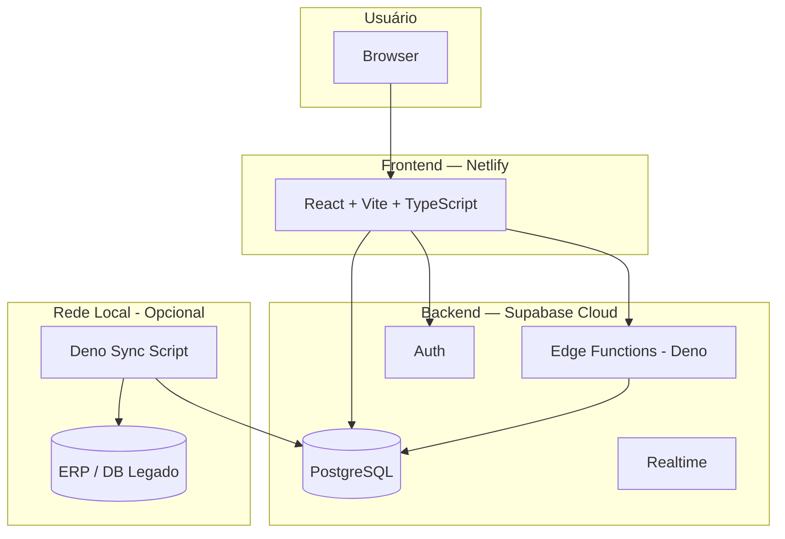

# Stack Padrão

Este é o conjunto de tecnologias usado em todos os projetos. As escolhas são deliberadas — cada componente resolve um problema específico e integra bem com os outros.

---

## Visão Geral



---

## Tabela de Decisões

| Componente | Tecnologia | Motivo |
|-----------|-----------|--------|
| Frontend | **React + Vite + TypeScript** | Padrão do mercado; Vite é rápido; TS evita bugs em runtime |
| Estilo | **Tailwind CSS + shadcn/ui** | Consistência visual sem CSS custom; componentes acessíveis prontos |
| Estado / Cache | **TanStack Query** | Cache automático, loading/error states, sem `useEffect` para fetching |
| Backend (API) | **Supabase Edge Functions (Deno)** | Serverless; zero infra para gerenciar; perto do banco |
| Banco de dados | **Supabase PostgreSQL** | Gerenciado; RLS nativo; Realtime; integrado com Auth |
| Auth | **Supabase Auth** | JWT nativo; papéis via `user_metadata`; integrado com RLS |
| Deploy frontend | **Netlify** | CI/CD automático do GitHub; preview por PR; free tier generoso |
| Scripts locais | **Deno** | Para integração com sistemas legados na rede local (sem expor IP privado) |
| Alertas | **Microsoft Teams Webhook** | Sem custo extra; Adaptive Cards ricas |

---

## Por que Vite e não Next.js?

**Use Vite quando:**
- O app é uma SPA (dashboard, backoffice, sistema interno)
- Não precisa de SEO em todas as páginas
- Quer build mais simples e deploy em qualquer CDN

**Use Next.js quando:**
- Precisa de SSR para SEO (e-commerce público, blog, landing pages)
- Precisa de rotas de API no mesmo repo
- O projeto tem muitas páginas públicas indexáveis

**HeziomOS e projetos de gestão interna → Vite.**

---

## Por que Supabase e não Firebase?

| | Supabase | Firebase |
|--|---------|---------|
| Banco | PostgreSQL (relacional, SQL padrão) | Firestore (NoSQL) |
| RLS | Nativo, baseado em SQL | Regras customizadas (menos flexíveis) |
| Edge Functions | Deno (TypeScript padrão) | Cloud Functions (Node.js) |
| Self-host | Possível | Não |
| Custo | Previsível por compute | Pode escalar rápido com leituras |

PostgreSQL com RLS é mais seguro para dados financeiros e relacionamentos complexos.

---

## Variáveis de Ambiente

| Variável | Onde usar | Segura no cliente? |
|----------|----------|-------------------|
| `VITE_SUPABASE_URL` | Frontend | Sim (URL pública) |
| `VITE_SUPABASE_ANON_KEY` | Frontend | Sim (limitada por RLS) |
| `SUPABASE_SERVICE_ROLE_KEY` | Edge Functions apenas | **Nunca no cliente** |
| `TEAMS_WEBHOOK_URL` | Edge Functions apenas | **Nunca no cliente** |
| Qualquer secret | Edge Functions apenas | **Nunca no cliente** |

---

## Scripts de Integração Local (Deno)

Quando há um sistema legado em rede privada (ex: ERP em `192.168.x.x`):

- Edge Functions **não conseguem** acessar IPs privados (rodam na nuvem)
- A solução é um **script Deno local** rodando na rede da empresa
- Esse script lê o sistema legado e grava no Supabase via SDK
- O HeziomOS usa isso para sincronizar com o Literarius (SQL Server)

```
[Rede local da empresa]
Deno script → lê ERP (IP privado) → grava no Supabase (HTTPS público)

[Nuvem]
Edge Functions → leem apenas o Supabase (sem acesso ao IP privado)
```
