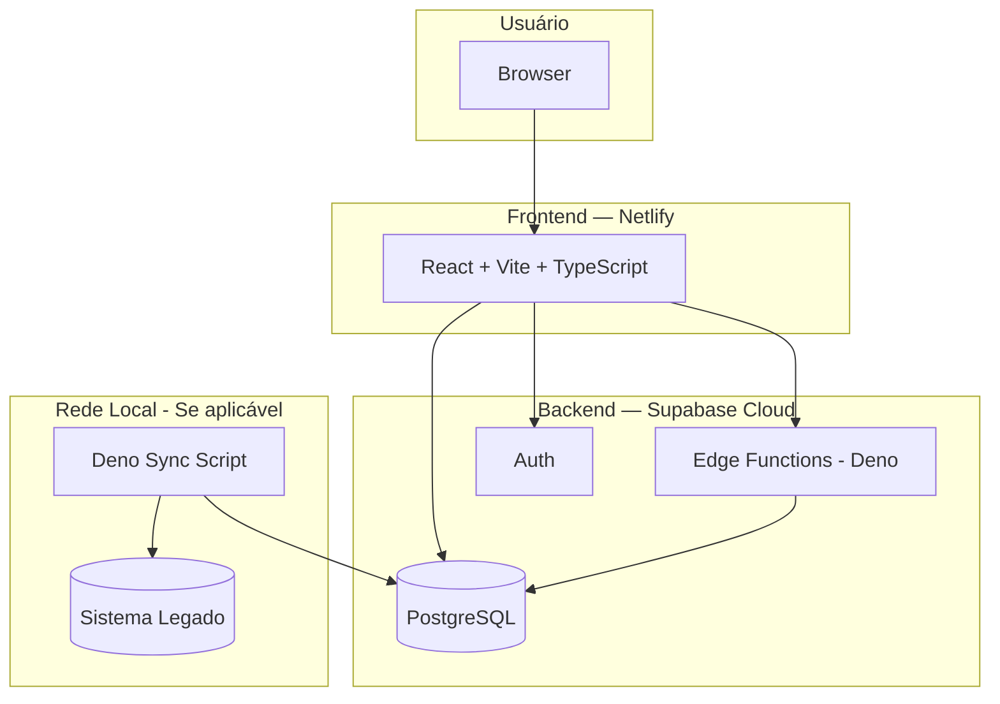

# Arquitetura — [Nome do Projeto]

> Visão arquitetural e decisões técnicas. Atualizar a cada decisão relevante. Commitar junto com o código.

---

## Visão Geral

**[Nome do Projeto]** é construído sobre [descrição: sistema existente / do zero / SaaS].



*Adaptar o diagrama conforme o projeto — remover blocos que não se aplicam.*

---

## Stack

| Componente | Tecnologia | Versão |
|-----------|-----------|--------|
| Frontend | React + Vite + TypeScript + Tailwind | Vite 5+ |
| UI Components | shadcn/ui | — |
| State / Cache | TanStack Query | v5 |
| Backend | Supabase Edge Functions (Deno) | — |
| Banco de dados | Supabase PostgreSQL | — |
| Auth | Supabase Auth | — |
| Deploy | Netlify | — |
| Scripts locais | Deno | v1.40+ |

---

## Estrutura de Repositórios

| Repositório | Conteúdo |
|-------------|----------|
| `[vault-obsidian]/` | Documentação, specs, stories, projeto |
| `[projeto]-app/` | Código: React, Supabase, Deno scripts |

---

## Estrutura de Código

```
src/
├── app/           → rotas, App.tsx, provider.tsx, router.tsx
├── features/      → módulos de funcionalidade (Bulletproof React)
│   └── [feature]/
│       ├── api/        → hooks TanStack Query
│       ├── components/ → componentes (< 300 linhas)
│       ├── hooks/      → estado local
│       ├── types/      → tipos TypeScript
│       └── utils/      → utilitários
├── components/    → ui/ (shadcn) + layout/
├── hooks/         → hooks compartilhados
├── lib/           → supabase.ts, query-client.ts, utils.ts
├── types/         → tipos compartilhados
└── config/env.ts  → env vars tipadas
```

---

## Decisões Arquiteturais (ADRs)

### ADR-001 — [Título da Decisão]

**Data:** [YYYY-MM-DD]
**Status:** Aceito

**Contexto:** [Por que essa decisão precisou ser tomada]

**Decisão:** [O que foi decidido]

**Consequências:** [O que muda, o que melhora, o que piora]

---

*Adicionar novos ADRs acima conforme decisões são tomadas.*

---

## Papéis e Acesso

| Papel | JWT claim | Acesso |
|-------|-----------|--------|
| `[papel1]` | `user_role: '[papel1]'` | [descrição] |
| `[papel2]` | `user_role: '[papel2]'` | [descrição] |

---

## Segurança

- RLS habilitado com `FORCE ROW LEVEL SECURITY` em todas as tabelas
- `service_role key` usada apenas em Edge Functions
- Variáveis sensíveis apenas em Edge Functions (Supabase secrets)
- CORS: `*` em desenvolvimento, domínio Netlify em produção
- JWT validado via `auth.getUser()` — nunca confiar no body

---

## Próximos Passos

- [ ] [Próxima decisão técnica importante]
- [ ] [Próxima decisão técnica importante]
